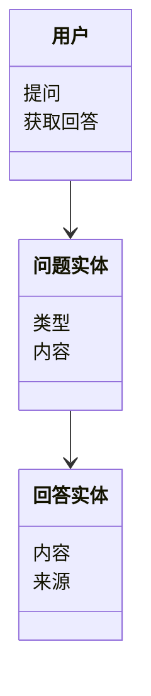
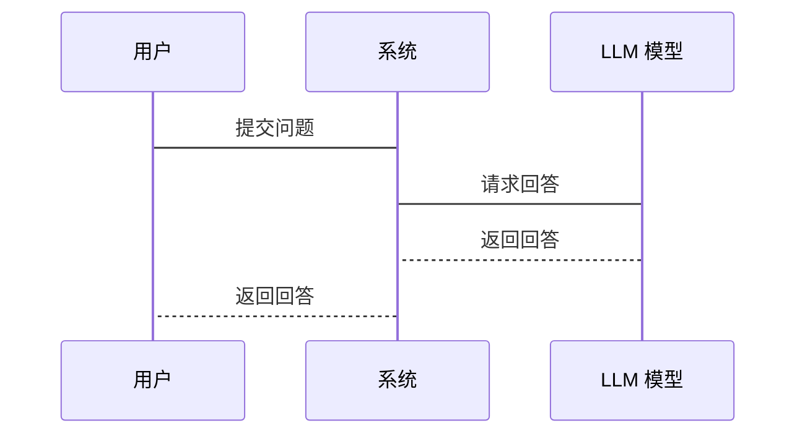

                 


# 问答系统：构建基于LLM的智能问答Agent

> 关键词：问答系统、LLM、智能问答、大语言模型、问答系统架构、问答系统算法、问答系统实战

> 摘要：本文详细探讨了如何构建基于大语言模型（LLM）的智能问答系统。从问答系统的基本概念到基于LLM的问答系统的核心算法，再到实际项目中的系统架构设计与实现，逐步解析了问答系统构建的全过程。文章不仅介绍了问答系统的背景与挑战，还通过详细的代码实现与实际案例分析，展示了如何将理论应用于实践。

---

# 第一部分: 问答系统背景与核心概念

## 第1章: 问答系统概述

### 1.1 问答系统的基本概念

#### 1.1.1 问答系统的定义与分类
问答系统（Question Answering System, QAS）是一种能够理解和回答用户提问的智能系统。根据应用场景的不同，问答系统可以分为以下几类：
- **基于规则的问答系统**：通过预定义的规则和模板来匹配问题并生成答案。
- **基于检索的问答系统**：从大规模文档库中检索相关文本片段并返回答案。
- **基于生成的问答系统**：利用自然语言处理技术生成回答，而不是直接从已有数据中检索答案。

#### 1.1.2 问答系统的应用场景
问答系统广泛应用于多个领域，包括：
- **客服系统**：通过自动化回答常见问题，提升客户满意度。
- **教育辅助**：帮助学生解答学习中的疑问。
- **医疗咨询**：提供初步的医疗建议和症状描述。

#### 1.1.3 问答系统的技术原理
问答系统的常见技术包括：
- **问题理解**：将自然语言问题转换为结构化的查询。
- **知识表示**：将知识以某种结构化的形式存储，以便快速检索。
- **答案生成**：根据查询结果生成自然语言回答。

### 1.2 基于LLM的问答系统特点

#### 1.2.1 大语言模型（LLM）的基本概念
大语言模型（Large Language Model, LLM）是指经过大量文本数据训练的深度学习模型，如GPT系列模型。LLM具有以下特点：
- **大规模训练数据**：通常使用互联网上的海量文本数据进行训练。
- **深度神经网络结构**：采用Transformer架构，能够处理长距离依赖关系。
- **生成能力强**：能够生成连贯且自然的文本。

#### 1.2.2 基于LLM的问答系统的优势
基于LLM的问答系统相较于传统问答系统，具有以下优势：
- **上下文理解能力强**：能够理解上下文关系，生成更准确的答案。
- **自适应能力高**：可以根据上下文动态调整回答内容。
- **支持多种语言**：能够处理多种语言的问答需求。

#### 1.2.3 LLM在问答系统中的作用机制
LLM通过以下步骤实现问答功能：
1. **输入问题**：用户提出问题，系统接收并解析问题。
2. **生成回答**：LLM根据输入的问题生成回答。
3. **输出结果**：将生成的回答返回给用户。

### 1.3 问答系统的背景与挑战

#### 1.3.1 问答系统的背景介绍
问答系统的发展经历了以下几个阶段：
- **基于规则的问答系统**：早期的问答系统依赖于预定义的规则和模板。
- **基于检索的问答系统**：通过搜索引擎技术实现问答功能。
- **基于生成的问答系统**：利用深度学习技术生成回答。

#### 1.3.2 问答系统的核心问题
问答系统的核心问题包括：
- **问题理解**：如何准确理解用户的问题意图。
- **知识表示**：如何有效地表示和存储知识。
- **答案生成**：如何生成准确且自然的语言回答。

#### 1.3.3 问答系统的挑战
问答系统面临以下挑战：
- **数据质量**：如何获取高质量的知识库数据。
- **模型训练**：如何优化LLM的训练过程，提高回答准确性。
- **实时性**：如何在实时场景下快速生成回答。

## 第2章: 问答系统的背景与挑战

### 2.1 问答系统的背景介绍

#### 2.1.1 问答系统的起源
问答系统的起源可以追溯到20世纪60年代，早期的问答系统依赖于规则和模板。

#### 2.1.2 问答系统的演变
随着自然语言处理技术的发展，问答系统经历了从基于规则到基于生成的演变过程。

#### 2.1.3 当前问答系统的技术趋势
当前，基于LLM的问答系统成为研究热点，深度学习技术的应用使得问答系统更加智能化。

### 2.2 问答系统的核心问题

#### 2.2.1 问题理解与解析
问题理解是问答系统的关键步骤，需要将自然语言问题转换为结构化的查询。

#### 2.2.2 知识表示与检索
知识表示是问答系统的重要组成部分，常见的知识表示方法包括知识图谱和向量表示。

#### 2.2.3 回答生成与优化
回答生成是问答系统的最终目标，需要生成准确且自然的语言回答。

### 2.3 问答系统的挑战

#### 2.3.1 数据质量与多样性
问答系统需要大量的高质量数据来训练模型，数据的多样性和准确性直接影响系统的性能。

#### 2.3.2 模型训练与优化
模型训练需要大量的计算资源，优化LLM的训练过程是提高系统性能的关键。

#### 2.3.3 实时性与响应速度
在实时场景下，问答系统需要快速生成回答，这对系统的响应速度提出了更高的要求。

## 第3章: 大语言模型（LLM）与问答系统的关系

### 3.1 LLM的基本原理

#### 3.1.1 深度学习与自然语言处理
深度学习在自然语言处理中的应用推动了问答系统的发展。

#### 3.1.2 Transformer模型的核心机制
Transformer模型通过自注意力机制和前馈网络实现高效的序列处理。

#### 3.1.3 LLM的训练目标与损失函数
LLM的训练目标是通过最小化损失函数来优化模型参数，常见的损失函数包括交叉熵损失。

### 3.2 LLM在问答系统中的应用

#### 3.2.1 基于LLM的问答系统架构
基于LLM的问答系统通常包括问题理解、知识表示、回答生成三个主要模块。

#### 3.2.2 LLM在问答中的优势
LLM在问答系统中的优势包括强大的上下文理解和生成能力。

#### 3.2.3 LLM的局限性与改进方向
LLM的局限性包括对特定领域知识的依赖和生成内容的可控性问题。

### 3.3 LLM与问答系统的结合

#### 3.3.1 LLM作为问答系统的核心模块
LLM可以作为问答系统的核心模块，负责问题理解和回答生成。

#### 3.3.2 基于LLM的对话系统设计
基于LLM的对话系统可以实现更自然的交互方式。

#### 3.3.3 LLM在问答系统中的优化策略
通过微调和参数优化，可以提高LLM在问答系统中的性能。

---

# 第二部分: 基于LLM的问答系统核心算法

## 第4章: 大语言模型的训练与优化

### 4.1 LLM的训练流程

#### 4.1.1 数据预处理与清洗
数据预处理包括分词、去停用词等步骤，确保数据质量。

#### 4.1.2 模型初始化与参数设置
模型初始化需要设置合适的初始参数，通常采用随机初始化。

#### 4.1.3 梯度下降与优化算法
常用的优化算法包括随机梯度下降（SGD）和Adam优化器。

### 4.2 LLM的损失函数

#### 4.2.1 交叉熵损失函数
交叉熵损失函数是常用的损失函数，公式为：
$$
\text{loss} = -\frac{1}{n}\sum_{i=1}^{n} \sum_{j=1}^{m} y_{ij} \log p(y_{ij})
$$

#### 4.2.2 语言模型的损失计算
语言模型的损失计算基于生成概率的对数，公式为：
$$
\text{loss} = -\log p(y|x)
$$

#### 4.2.3 损失函数的优化目标
损失函数的优化目标是最小化模型预测与真实值之间的差距。

### 4.3 LLM的优化策略

#### 4.3.1 参数调整与超参数优化
参数调整包括学习率、批量大小等超参数的优化。

#### 4.3.2 模型压缩与轻量化
模型压缩技术包括剪枝和量化，旨在减少模型体积，提高推理速度。

#### 4.3.3 预训练与微调的结合
预训练模型在大规模数据上进行预训练，然后通过微调适应特定任务。

## 第5章: 基于LLM的问答系统算法实现

### 5.1 问答系统的输入输出

#### 5.1.1 问题输入与解析
问题输入需要进行分词和实体识别，解析问题的关键信息。

#### 5.1.2 知识库的构建与检索
知识库构建包括数据清洗、知识抽取和知识表示，检索过程基于关键词匹配或向量相似度。

#### 5.1.3 回答生成与输出
回答生成可以采用基于规则的生成或基于LLM的生成，输出结果需要进行格式化处理。

### 5.2 LLM在问答系统中的算法流程

#### 5.2.1 前向传播过程
前向传播包括输入处理、自注意力计算和前馈网络处理。

#### 5.2.2 损失函数计算
损失函数计算基于生成概率的对数，公式为：
$$
\text{loss} = -\log p(y|x)
$$

#### 5.2.3 模型训练与评估
模型训练采用最小化损失函数的目标，评估指标包括准确率和F1值。

### 5.3 算法优化与调优

#### 5.3.1 模型调优策略
模型调优包括学习率调整、批量大小优化和模型结构改进。

#### 5.3.2 算法性能评估
算法性能评估基于回答准确率、生成长度和相关性指标。

---

# 第三部分: 基于LLM的问答系统实战

## 第6章: 问答系统的系统分析与架构设计

### 6.1 问答系统的场景介绍

#### 6.1.1 问题场景描述
问答系统的应用场景包括客服、教育和医疗咨询等。

#### 6.1.2 项目介绍
本项目旨在构建一个基于LLM的智能问答系统，实现用户与系统的智能交互。

### 6.2 系统功能设计

#### 6.2.1 领域模型设计
领域模型包括用户角色、问题实体和回答实体，使用mermaid类图表示。



#### 6.2.2 系统架构设计
系统架构包括前端界面、后端服务和LLM模型，使用mermaid架构图表示。

```mermaid
aws
    label 客户端
    label 服务器
    label LLM 模型
    客户端 --> 服务器: 提交问题
    服务器 --> LLM 模型: 请求回答
    服务器 <-- 客户端: 返回回答
```

#### 6.2.3 系统接口设计
系统接口包括问题提交接口、回答获取接口和系统反馈接口。

#### 6.2.4 系统交互流程
系统交互流程包括用户提问、系统解析问题、调用LLM生成回答和返回结果，使用mermaid序列图表示。



### 6.3 项目实战

#### 6.3.1 环境安装
项目环境包括Python 3.8及以上版本，安装包包括PyTorch和Hugging Face库。

```bash
pip install torch transformers
```

#### 6.3.2 系统核心实现

##### 问题解析模块
```python
def parse_question(question):
    # 这里实现问题解析逻辑
    return parsed_info
```

##### 知识库检索模块
```python
def retrieveKnowledge(parsed_info):
    # 这里实现知识库检索逻辑
    return relevant_knowledge
```

##### 回答生成模块
```python
def generate_answer(relevant_knowledge):
    # 这里实现回答生成逻辑
    return generated_answer
```

##### 系统主程序
```python
def main():
    question = input("请输入您的问题：")
    parsed_info = parse_question(question)
    relevant_knowledge = retrieveKnowledge(parsed_info)
    generated_answer = generate_answer(relevant_knowledge)
    print("回答：", generated_answer)

if __name__ == "__main__":
    main()
```

#### 6.3.3 代码应用解读与分析
代码实现包括问题解析、知识库检索和回答生成三个模块，分别实现对输入问题的处理、知识库的检索和回答的生成。

#### 6.3.4 实际案例分析
通过实际案例分析，展示问答系统的运行流程和输出结果。

#### 6.3.5 项目小结
本项目通过模块化设计，实现了基于LLM的智能问答系统，验证了系统的可行性和有效性。

---

# 第四部分: 基于LLM的问答系统最佳实践

## 第7章: 问答系统的最佳实践

### 7.1 小结

#### 7.1.1 核心概念回顾
回顾问答系统的核心概念，包括问题理解、知识表示和回答生成。

#### 7.1.2 技术总结
总结基于LLM的问答系统的关键技术，包括模型训练、算法优化和系统架构设计。

### 7.2 注意事项

#### 7.2.1 数据质量的重要性
数据质量直接影响问答系统的性能，需要注重数据的多样性和准确性。

#### 7.2.2 模型优化的策略
模型优化需要结合训练数据和任务需求，选择合适的优化策略。

#### 7.2.3 系统安全与隐私保护
系统设计需要考虑用户数据的安全与隐私保护，避免数据泄露风险。

### 7.3 拓展阅读

#### 7.3.1 深度阅读推荐
推荐相关领域的书籍和论文，包括《深度学习》和《自然语言处理实战》。

#### 7.3.2 技术博客与开源项目
推荐相关的技术博客和开源项目，如Hugging Face的Transformers库和PyTorch框架。

---

# 结语

通过本文的详细讲解，读者可以系统地了解基于LLM的问答系统构建的全过程，从理论到实践，从算法到系统设计，全面掌握问答系统的构建方法。希望本文能够为相关领域的研究和实践提供有价值的参考。

