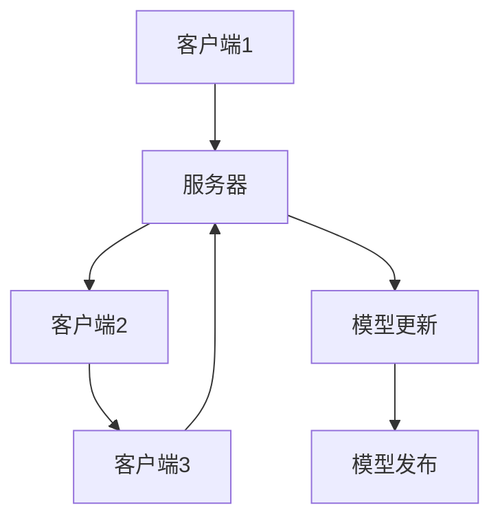
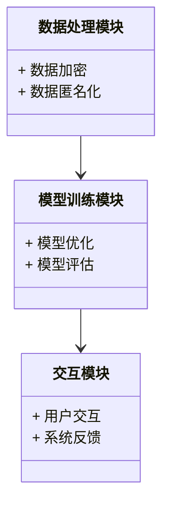
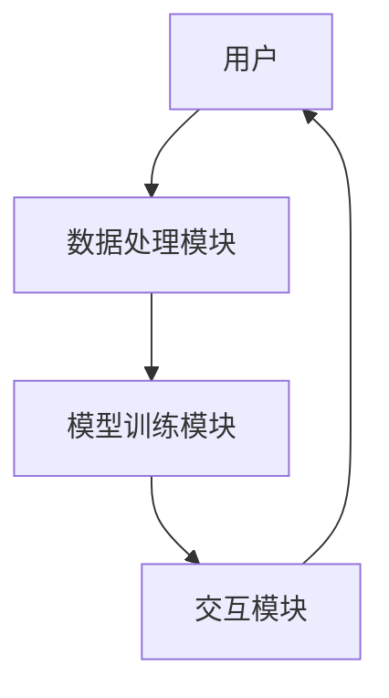
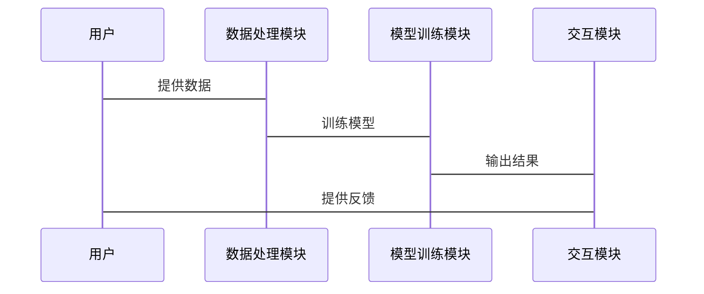

                 


# 隐私保护型AI Agent：安全与功能的平衡

## 关键词：
隐私保护、AI Agent、数据安全、加密技术、联邦学习、隐私计算

## 摘要：
随着人工智能技术的快速发展，AI Agent在各个领域的应用越来越广泛。然而，AI Agent的核心功能依赖于对数据的处理和分析，这不可避免地涉及到隐私保护的问题。本文将详细探讨隐私保护型AI Agent的核心概念、算法原理、系统架构设计、项目实战以及最佳实践。通过理论与实践相结合的方式，深入分析如何在保证隐私的前提下，实现AI Agent的功能最大化。

---

# 第一部分: 隐私保护型AI Agent的背景与核心概念

## 第1章: 隐私保护与AI Agent概述

### 1.1 隐私保护的基本概念
隐私保护是信息时代的核心议题之一。随着数据的广泛收集和使用，如何保护个人隐私成为社会各界关注的焦点。隐私保护的核心原则包括数据最小化、目的限制和同意原则。

- **数据最小化**：仅收集实现目标所需的最小数据集。
- **目的限制**：数据仅用于特定目的，不得随意更改用途。
- **同意原则**：用户明确授权数据的收集和使用。

隐私保护的法律框架包括《通用数据保护条例》（GDPR）和《加州消费者隐私法》（CCPA）等，这些法规为隐私保护提供了法律保障。

### 1.2 AI Agent的基本概念
AI Agent是一种能够感知环境、自主决策并执行任务的智能实体。与传统AI相比，AI Agent具有更强的自主性和交互性，广泛应用于智能助手、自动驾驶和智能客服等领域。

- **感知与决策**：AI Agent通过传感器或数据输入感知环境，并基于目标函数进行决策。
- **交互与通信**：AI Agent能够与用户或其他系统进行实时交互，通过自然语言处理和通信协议完成任务。
- **学习与自适应**：AI Agent通过机器学习算法不断优化自身的行为模式。

### 1.3 隐私保护与AI Agent的结合
隐私保护与AI Agent的结合是必然趋势。AI Agent的功能依赖于数据处理，但数据的敏感性要求我们必须在处理过程中保护隐私。隐私保护型AI Agent的核心在于在数据处理的各个环节中嵌入隐私保护机制，确保数据的安全性和用户的隐私权。

- **数据输入**：在数据采集阶段，通过加密或匿名化技术保护用户隐私。
- **数据处理**：在数据处理阶段，采用隐私计算技术（如联邦学习）保护数据不被泄露。
- **数据输出**：在结果输出阶段，通过差分隐私技术确保结果的隐私性。

---

## 第2章: 隐私保护型AI Agent的核心概念与联系

### 2.1 隐私保护的核心原理
隐私保护的核心原理包括数据加密、数据匿名化和隐私计算。

- **数据加密**：通过加密算法对敏感数据进行加密，确保数据在传输和存储过程中的安全性。
- **数据匿名化**：通过去标识化技术将数据中的敏感信息去除，避免身份泄露。
- **隐私计算**：在数据不被泄露的前提下，对数据进行计算和分析的技术，包括加密计算和可信执行环境。

### 2.2 AI Agent的核心原理
AI Agent的核心原理包括感知与决策、交互与通信以及学习与自适应。

- **感知与决策**：AI Agent通过感知环境信息，利用机器学习模型进行决策。
- **交互与通信**：AI Agent通过自然语言处理技术与用户交互，并通过通信协议与外部系统交互。
- **学习与自适应**：AI Agent通过强化学习和监督学习技术不断优化自身的行为模式。

### 2.3 隐私保护与AI Agent的核心联系
隐私保护与AI Agent的核心联系体现在数据输入、数据处理和数据输出三个环节。

- **数据输入**：隐私保护技术确保AI Agent收集的数据不会泄露用户隐私。
- **数据处理**：隐私计算技术确保AI Agent在处理数据时不会泄露数据内容。
- **数据输出**：差分隐私技术确保AI Agent输出的结果不会泄露个体隐私。

### 2.4 核心概念对比与ER实体关系图
以下是对隐私保护和AI Agent的核心属性对比：

| 属性 | 隐私保护 | AI Agent |
|------|----------|-----------|
| 数据来源 | 用户数据 | 多源数据 |
| 数据类型 | 敏感数据 | 结构化数据 |
| 数据处理 | 加密计算 | 自主决策 |
| 数据输出 | 隐私保护 | 个性化结果 |

以下是隐私保护型AI Agent的ER实体关系图：

```mermaid
er
    entity 用户 {
        key: 用户ID
        属性: 用户信息
    }
    entity 数据 {
        key: 数据ID
        属性: 数据内容
    }
    entity AI Agent {
        key: AgentID
        属性: Agent状态
    }
    relationship 用户 --> 数据: 提供数据
    relationship 用户 --> AI Agent: 使用AI Agent
    relationship 数据 --> AI Agent: 处理数据
```

---

## 第3章: 隐私保护型AI Agent的算法原理

### 3.1 数据加密算法
数据加密是隐私保护的核心技术之一。常见的数据加密算法包括AES和RSA。

- **AES加密算法**：一种对称加密算法，广泛应用于数据加密。
- **RSA加密算法**：一种非对称加密算法，常用于数据签名和身份验证。

以下是AES加密算法的Python实现示例：

```python
from cryptography.fernet import Fernet

# 生成密钥
key = Fernet.generate_key()
cipher = Fernet(key)

# 加密数据
plaintext = "Sensitive data"
encrypted_data = cipher.encrypt(plaintext.encode())

# 解密数据
decrypted_data = cipher.decrypt(encrypted_data).decode()
print(decrypted_data)
```

### 3.2 差分隐私技术
差分隐私是一种通过添加噪声来保护数据隐私的技术。以下是差分隐私的基本数学模型：

$$ \text{保护概率} = P(\text{输出} \in Y \mid \text{真实数据} = x) - P(\text{输出} \in Y \mid \text{真实数据} = x') $$

以下是差分隐私的Python实现示例：

```python
import numpy as np

# 添加噪声
noise = np.random.laplace(0, 1)
result = true_result + noise
```

### 3.3 联邦学习算法
联邦学习是一种分布式机器学习技术，能够在不交换原始数据的情况下完成模型训练。以下是联邦学习的基本流程：



以下是联邦学习的Python实现示例：

```python
# 客户端数据预处理
def preprocess(data):
    return data

# 服务器模型训练
def train_model(model, preprocessed_data):
    model.fit(preprocessed_data)
    return model

# 联邦学习流程
data = preprocess(client_data)
model = train_model(initial_model, data)
```

---

## 第4章: 隐私保护型AI Agent的系统架构设计

### 4.1 问题场景介绍
隐私保护型AI Agent的典型应用场景包括医疗数据处理、金融交易监控和智能客服等领域。

### 4.2 系统功能设计
以下是隐私保护型AI Agent的系统功能设计：



### 4.3 系统架构设计
以下是隐私保护型AI Agent的系统架构设计：



### 4.4 系统接口设计
以下是隐私保护型AI Agent的系统接口设计：



---

## 第5章: 隐私保护型AI Agent的项目实战

### 5.1 环境安装
以下是隐私保护型AI Agent的项目实战环境安装示例：

```bash
pip install cryptography
pip install numpy
pip install scikit-learn
```

### 5.2 系统核心实现
以下是隐私保护型AI Agent的核心实现代码：

```python
from cryptography.fernet import Fernet
import numpy as np
from sklearn.model_selection import train_test_split

# 数据加密
key = Fernet.generate_key()
cipher = Fernet(key)
encrypted_data = cipher.encrypt(data.encode())

# 数据处理
X_train, X_test, y_train, y_test = train_test_split(features, labels)

# 模型训练
model.fit(X_train, y_train)
```

### 5.3 案例分析与代码解读
以下是隐私保护型AI Agent的案例分析与代码解读：

```python
# 数据预处理
def preprocess(data):
    return data

# 模型训练
def train_model(model, preprocessed_data):
    model.fit(preprocessed_data)
    return model

# 模型评估
def evaluate_model(model, test_data):
    accuracy = model.score(test_data)
    return accuracy
```

---

## 第6章: 隐私保护型AI Agent的最佳实践

### 6.1 最佳实践
以下是隐私保护型AI Agent的最佳实践建议：

- **数据安全**：在数据处理的各个环节中嵌入隐私保护机制。
- **模型性能**：在保证隐私的前提下，优化模型的性能。
- **法律法规**：遵守相关法律法规，确保数据处理的合法性。

### 6.2 小结
隐私保护型AI Agent的安全与功能的平衡是一个复杂而重要的问题。通过理论与实践相结合的方式，我们可以更好地理解和实现隐私保护型AI Agent的设计与优化。

### 6.3 注意事项
- 隐私保护型AI Agent的设计需要综合考虑数据安全、模型性能和用户体验。
- 在实际应用中，需要根据具体需求选择合适的隐私保护技术和AI Agent实现方案。

### 6.4 拓展阅读
- 《数据隐私与保护》
- 《AI Agent的设计与实现》
- 《联邦学习与隐私计算》

---

通过本文的详细讲解，我们希望能够为读者提供关于隐私保护型AI Agent的全面理解，并为实际应用提供有价值的参考和指导。

