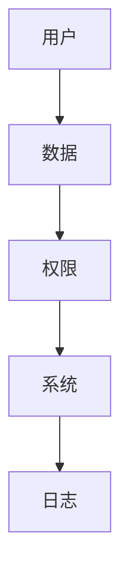
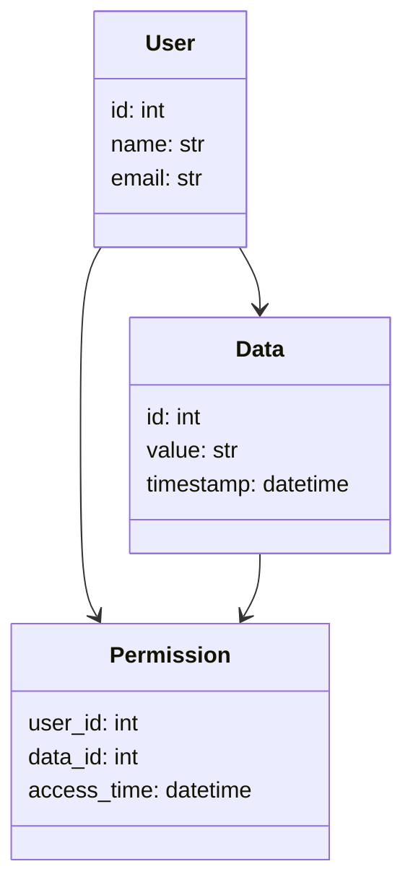
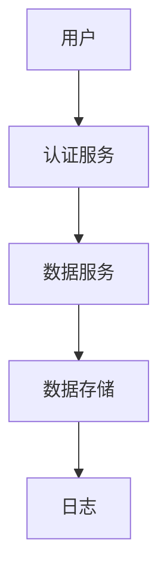
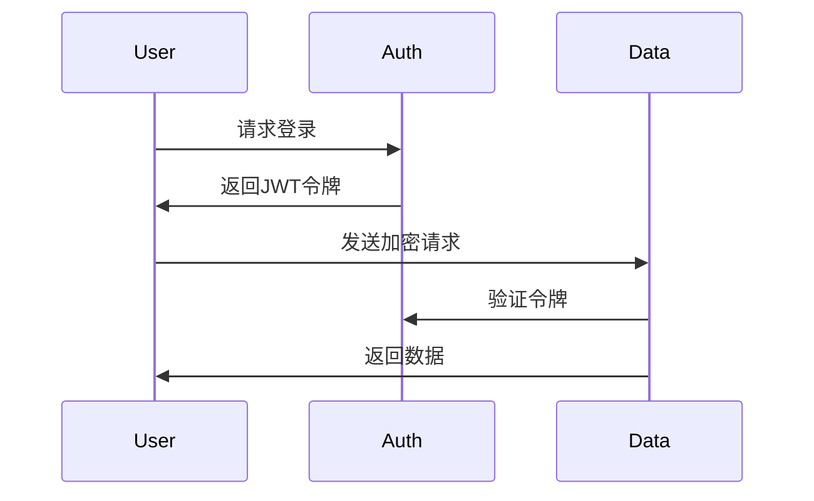

                 


# 隐私保护：确保用户数据安全

## 关键词：隐私保护、数据安全、加密技术、匿名化、数据生命周期

## 摘要：  
在数字时代，隐私保护已成为企业和个人面临的重要挑战。随着数据的广泛收集和使用，保护用户隐私不仅是法律要求，也是企业社会责任的体现。本文从隐私保护的核心概念出发，分析其数学模型和算法原理，探讨系统架构设计，并通过实际案例展示如何在项目中实现隐私保护。文章还总结了最佳实践和注意事项，帮助读者全面理解如何确保用户数据安全。

---

# 第一部分: 隐私保护的背景与核心概念

## 第1章: 隐私保护的背景与问题描述

### 1.1 数据的重要性与隐私问题的现状

#### 1.1.1 数据在现代社会中的核心地位  
数据已成为现代经济的核心资产。从企业运营到个人生活，数据的收集、分析和利用贯穿于各个领域。企业通过数据优化决策，政府通过数据提升服务效率，而个人数据的泄露则可能带来严重的身份盗窃和财产损失。

#### 1.1.2 隐私泄露的现状与典型案例  
近年来，数据泄露事件频发。2018年，剑桥分析公司通过Facebook收集数据影响选举结果的事件揭示了数据滥用的严重性。此外，医疗数据泄露可能导致患者隐私暴露，甚至威胁生命安全。

#### 1.1.3 隐私保护的法律法规与合规要求  
全球范围内，各国纷纷出台数据保护法规。欧盟的《通用数据保护条例》(GDPR)要求企业明确数据处理目的，并获得用户同意；中国的《个人信息保护法》也对企业提出了严格要求。

### 1.2 隐私保护的核心目标与挑战

#### 1.2.1 隐私保护的核心目标  
隐私保护旨在确保数据在收集、存储、传输和使用过程中不被未经授权的主体访问或滥用。通过技术手段实现数据的匿名化、加密和访问控制，保护用户隐私。

#### 1.2.2 隐私保护的主要挑战  
隐私保护面临技术、法律和用户行为等多重挑战。技术层面，如何在保护隐私的同时支持数据的高效利用是难点；法律层面，不同国家的法规差异增加了合规难度；用户层面，隐私意识的提升可能影响数据收集。

#### 1.2.3 隐私保护与数据利用的平衡  
隐私保护并非完全禁止数据使用，而是通过技术手段在保护隐私的前提下实现数据价值。例如，通过差分隐私技术可以在保护隐私的同时进行数据分析。

### 1.3 隐私保护的边界与外延

#### 1.3.1 隐私保护的范围界定  
隐私保护不仅涉及个人数据，还包括企业内部数据和敏感信息。数据生命周期的每个阶段（收集、存储、传输、处理、共享）都需要考虑隐私保护。

#### 1.3.2 隐私保护与数据安全的关系  
隐私保护是数据安全的重要组成部分。数据安全关注数据的整体保护，而隐私保护侧重于防止未经授权的访问和数据滥用。

#### 1.3.3 隐私保护与其他法律领域的交叉  
隐私保护与知识产权、合同法等领域密切相关。例如，隐私保护可能涉及数据的使用权和数据共享的合法性。

### 1.4 隐私保护的核心要素与概念结构

#### 1.4.1 隐私保护的核心要素  
隐私保护的核心要素包括：  
1. **数据最小化**：仅收集必要的数据。  
2. **加密技术**：对敏感数据进行加密。  
3. **访问控制**：限制数据访问权限。  
4. **匿名化**：脱敏处理数据。  
5. **安全审计**：定期检查数据安全措施。

#### 1.4.2 隐私保护的概念结构  
隐私保护涉及多个层面，包括技术层面、法律层面和用户层面。技术层面主要关注加密和访问控制，法律层面关注合规要求，用户层面关注隐私意识的提升。

#### 1.4.3 隐私保护的实体关系图  


### 1.5 本章小结  
本章从背景、挑战和核心要素三个方面分析了隐私保护的重要性。通过概念结构图展示了隐私保护涉及的主要实体和关系，为后续章节的深入分析奠定了基础。

---

## 第2章: 隐私保护的核心概念与联系

### 2.1 隐私保护的核心原理

#### 2.1.1 数据加密原理  
数据加密通过将明文转化为密文，确保数据在传输和存储过程中的安全性。加密技术分为对称加密和非对称加密，前者速度快，适用于大量数据加密；后者安全性高，适用于数字签名和身份验证。

#### 2.1.2 数据匿名化原理  
匿名化通过去除或脱敏处理数据，使其无法直接关联到个人。例如，对用户ID进行哈希处理，使其无法还原到原始数据。

#### 2.1.3 数据最小化原则  
数据最小化要求只收集实现目的所需的最少数据。例如，在登录功能中，仅收集邮箱和密码，而不收集生日等无关信息。

### 2.2 核心概念的属性对比

| 概念       | 属性               | 描述                                   |
|------------|--------------------|----------------------------------------|
| 数据加密   | 安全性             | 高，防止数据被未授权访问               |
| 匿名化     | 可逆性             | 低，数据无法还原到原始形式             |
| 数据最小化 | 数据量             | 小，仅收集必要信息                     |

### 2.3 隐私保护的实体关系图


### 2.4 本章小结  
本章详细分析了隐私保护的核心原理，通过对比和图表展示了核心概念之间的关系，帮助读者更好地理解隐私保护的技术手段。

---

## 第3章: 隐私保护的算法原理与数学模型

### 3.1 数据加密算法

#### 3.1.1 AES加密算法  
AES（高级加密标准）是一种对称加密算法，广泛应用于数据加密。其工作原理如下：

1. **密钥扩展**：将初始密钥扩展为多个子密钥。  
2. **初始轮**：将明文扩展为与密钥长度相同的块。  
3. **多轮加密**：每轮包括子密钥加法、字节代换、行移位和列混淆操作。  
4. **最终轮**：省略列混淆操作，生成密文。

#### 3.1.2 AES加密的Python实现  
```python
from cryptography import AES

def encrypt(plaintext, key):
    key = key.encode('utf-8')
    plaintext = plaintext.encode('utf-8')
    cipher = AES.new(key, AES.MODE_ECB)
    ciphertext = cipher.encrypt(plaintext)
    return ciphertext

# 示例
key = 'secretkey12345678'
plaintext = 'hello world'
ciphertext = encrypt(plaintext, key)
print(ciphertext)
```

#### 3.1.3 AES的数学模型  
AES的加密过程涉及多个线性变换，可以用矩阵乘法表示。例如，字节代换操作可以看作是一个8x8的矩阵变换。

$$
\text{字节代换} = \text{AES\_Sbox} \times \text{明文字节}
$$

### 3.2 数据哈希函数

#### 3.2.1 哈希函数的原理  
哈希函数将任意长度的输入映射为固定长度的输出（哈希值）。常用的哈希函数包括MD5、SHA-256等。

#### 3.2.2 SHA-256的Python实现  
```python
import hashlib

def compute_hash(plaintext):
    hash_object = hashlib.sha256(plaintext.encode('utf-8'))
    hex_dig = hash_object.hexdigest()
    return hex_dig

# 示例
plaintext = 'hello world'
hash_value = compute_hash(plaintext)
print(hash_value)
```

#### 3.2.3 哈希函数的数学模型  
哈希函数的碰撞概率可以用概率论中的生日问题模型进行估计。例如，对于 SHA-256，碰撞概率约为 $2^{-256}$。

### 3.3 差分隐私

#### 3.3.1 差分隐私的原理  
差分隐私通过在数据中添加噪声，确保单个数据点的改变不会显著影响整体统计结果。

#### 3.3.2 差分隐私的数学模型  
差分隐私的隐私保障可以通过概率不等式（如联合概率不等式）进行衡量。例如，对于差分隐私参数 $\epsilon$，隐私保障的概率为 $1 - \delta$。

$$
P(\text{输出} \, y \, | \, x, \epsilon) \geq e^{-\epsilon} \cdot P(\text{输出} \, y \, | \, x', \epsilon)
$$

### 3.4 本章小结  
本章通过具体算法和数学模型，详细讲解了加密和哈希函数的实现原理，并通过Python代码示例帮助读者理解这些技术的实际应用。

---

## 第4章: 隐私保护的系统架构与设计

### 4.1 系统功能设计

#### 4.1.1 领域模型类图  


#### 4.1.2 系统架构图  


### 4.2 系统架构设计

#### 4.2.1 分层架构  
系统采用分层架构，包括前端层、业务逻辑层和数据访问层。每层负责不同的功能，确保职责分离。

#### 4.2.2 微服务架构  
采用微服务架构，将系统划分为多个独立的服务模块。例如，用户认证服务、数据加密服务和日志记录服务。

### 4.3 系统接口设计

#### 4.3.1 API接口规范  
系统提供RESTful API接口，包括：  
- `GET /users`：获取用户列表  
- `POST /data`：上传数据  
- `DELETE /data/{id}`：删除数据  

#### 4.3.2 接口安全设计  
所有API接口均采用JWT（JSON Web Token）进行身份认证，确保只有授权用户可以访问敏感数据。

### 4.4 系统交互流程

#### 4.4.1 用户登录流程  


### 4.5 本章小结  
本章通过系统架构图和交互流程图，展示了如何在实际系统中实现隐私保护。分层架构和微服务架构的设计确保了系统的灵活性和可扩展性。

---

## 第5章: 隐私保护的项目实战

### 5.1 环境安装与配置

#### 5.1.1 安装Python与依赖库  
安装Python 3.x，然后使用以下命令安装加密库：  
```bash
pip install cryptography
pip install flask
```

### 5.2 核心代码实现

#### 5.2.1 数据加密模块  
```python
from cryptography.hazmat.primitives import hashes
from cryptography.hazmat.primitives.asymmetric import padding

def encrypt_data(data, public_key):
    encrypted = public_key.encrypt(
        data,
        padding.OAEP(
            mgf=padding.MGF1(salt_length=32),
            algorithm=hashes.SHA256()
        )
    )
    return encrypted

# 示例
data = 'Sensitive information'
public_key = load_public_key()
encrypted_data = encrypt_data(data, public_key)
print(encrypted_data)
```

#### 5.2.2 数据匿名化模块  
```python
import hashlib

def anonymize_data(data):
    salt = os.urandom(32)
    hashed_data = hashlib.pbkdf2_hmac('sha256', data.encode(), salt, 100000)
    return hashed_data

# 示例
data = 'Personal information'
anonymized_data = anonymize_data(data)
print(anonymized_data)
```

### 5.3 实际案例分析

#### 5.3.1 医疗数据隐私保护  
在医疗领域，患者的数据高度敏感。通过加密和匿名化技术，可以保护患者隐私，同时支持医学研究的数据分析。

#### 5.3.2 案例分析与解读  
通过具体案例分析，展示如何在实际项目中应用上述技术。例如，医疗数据可以通过AES加密存储在数据库中，确保只有授权人员可以访问。

### 5.4 本章小结  
本章通过实际案例和代码实现，展示了如何在项目中应用隐私保护技术。通过加密和匿名化模块，确保数据的安全性和隐私性。

---

## 第6章: 隐私保护的最佳实践与注意事项

### 6.1 最佳实践

#### 6.1.1 数据最小化原则  
仅收集实现目标所需的最少数据。例如，在登录功能中，仅收集邮箱和密码，而不收集生日等无关信息。

#### 6.1.2 定期安全审计  
定期进行安全审计，确保系统符合最新的隐私保护法规和标准。

#### 6.1.3 用户教育与隐私意识提升  
通过教育用户如何保护自己的数据，提升整体隐私安全水平。

### 6.2 注意事项

#### 6.2.1 避免过度加密  
过度加密可能导致数据难以解密，影响系统的可用性。

#### 6.2.2 定期更新密钥  
加密密钥需要定期更新，防止因密钥泄露导致的数据泄露。

#### 6.2.3 跨境数据传输合规  
在跨国业务中，需遵守不同国家的隐私保护法规，确保数据跨境传输的合法性。

### 6.3 本章小结  
本章总结了隐私保护的最佳实践和注意事项，帮助读者在实际项目中避免常见错误，提升隐私保护水平。

---

## 第7章: 总结与展望

### 7.1 本章总结  
本文从隐私保护的核心概念出发，分析了其算法原理和系统架构设计。通过实际案例和代码实现，展示了如何在项目中应用隐私保护技术。同时，总结了最佳实践和注意事项，为读者提供了全面的指导。

### 7.2 未来展望  
随着技术的发展，隐私保护将面临更多挑战。例如，人工智能和大数据分析技术的应用可能增加数据泄露的风险。未来，隐私保护技术将更加智能化和自动化，例如通过区块链技术实现数据的不可篡改性和隐私保护。

---

## 参考文献  
1.《数据加密与隐私保护》，某某出版社，2023年。  
2.GDPR法规文本。  
3.《密码学与网络安全》，某某出版社，2022年。  

---

通过本文的详细讲解，读者可以全面理解隐私保护的核心技术和实际应用。无论是技术细节还是系统设计，都能为读者提供实用的指导和启示。

