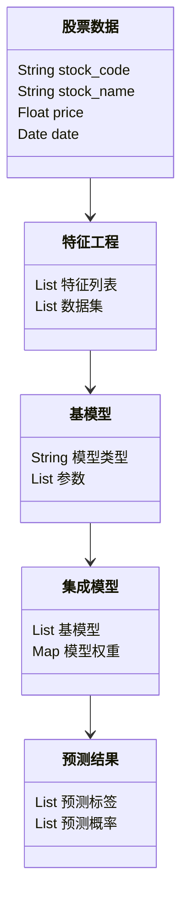
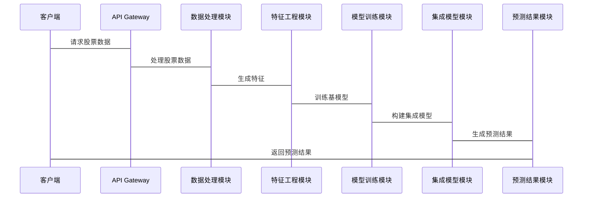

                 


# 集成学习方法在股票选择中的应用

## 关键词：集成学习，股票选择，机器学习，股票预测，股票市场分析

## 摘要：  
本文探讨了集成学习方法在股票选择中的应用，从理论基础到实际操作，详细分析了集成学习的优势、算法实现、系统架构以及在股票市场中的实际应用案例。通过结合技术分析、基本面分析和统计套利，本文提出了基于集成学习的股票选择模型，并通过具体代码实现和案例分析，展示了如何利用集成学习提高股票预测的准确性和稳定性。本文旨在为投资者和数据科学家提供一种创新的股票选择方法，帮助他们在复杂多变的股票市场中做出更明智的投资决策。

---

# 第1章: 集成学习方法概述

## 1.1 集成学习的基本概念

### 1.1.1 集成学习的定义  
集成学习（Ensemble Learning）是一种通过组合多个学习器（基模型）来提高模型性能的机器学习方法。其核心思想是利用“集体智慧”，通过投票、加权或堆叠等方式，将多个基模型的预测结果整合起来，最终得到一个更准确的预测结果。

### 1.1.2 集成学习的核心思想  
集成学习的核心思想可以总结为以下几点：
1. **多样性**：通过构建多样化的基模型，降低单个模型的预测偏差。
2. **组合效应**：多个模型的预测结果通过集成可以显著提高整体的准确性和稳定性。
3. **鲁棒性**：集成学习能够有效降低过拟合风险，提升模型的泛化能力。

### 1.1.3 集成学习与传统机器学习的区别  
集成学习与传统机器学习的区别主要体现在以下几个方面：
- **模型结构**：传统机器学习通常依赖单个模型，而集成学习通过组合多个模型来提高性能。
- **训练方式**：集成学习通过多次训练或数据扰动（如袋装法）生成多个基模型。
- **预测结果**：集成学习通过投票、加权等方式将多个基模型的预测结果整合，最终得到一个更可靠的预测结果。

## 1.2 集成学习的主要方法

### 1.2.1 投票法（Voting）  
投票法是一种简单的集成方法，主要通过投票的方式将多个基模型的预测结果整合起来。  
- **实现方式**：每个基模型独立预测，最终结果由所有基模型的预测结果投票决定。
- **优点**：简单易实现，适合分类任务。
- **缺点**：对基模型的多样性和准确性要求较高。

### 1.2.2 堆叠法（Stacking）  
堆叠法是一种更复杂的集成方法，通过引入一个元模型（Meta-model）来整合多个基模型的预测结果。  
- **实现方式**：将多个基模型的输出作为元模型的输入，元模型通过训练得到最终的预测结果。
- **优点**：能够有效捕捉基模型之间的关系，提高预测精度。
- **缺点**：实现复杂，需要额外的训练数据。

### 1.2.3 袋装法（Bagging）  
袋装法是一种基于数据扰动的集成方法，通过多次有放回地抽取训练数据来生成多个基模型。  
- **实现方式**：通过随机抽取训练数据生成多个基模型，通常使用相同的模型结构。
- **优点**：能够有效降低过拟合风险，提高模型的泛化能力。
- **缺点**：计算量较大，适用于数据量较大的场景。

## 1.3 集成学习的优势与挑战

### 1.3.1 集成学习的优势
1. **提高预测准确性**：通过组合多个基模型的预测结果，集成学习能够显著提高预测的准确性。
2. **降低过拟合风险**：集成学习通过多样化的基模型，能够有效降低单个模型的过拟合风险。
3. **增强鲁棒性**：集成学习对噪声数据和异常值具有较强的鲁棒性。

### 1.3.2 集成学习的挑战
1. **计算复杂度高**：集成学习需要训练多个基模型，计算量较大。
2. **模型解释性差**：集成学习的最终预测结果通常难以解释，难以提供具体的决策依据。
3. **适用性受限**：在某些情况下，集成学习可能无法显著提高预测性能，例如数据量较小或基模型之间缺乏多样性。

### 1.3.3 集成学习在股票选择中的适用性
股票市场具有高度的不确定性和波动性，集成学习的多样性和鲁棒性特点使其非常适合应用于股票选择。通过集成多个基模型的预测结果，可以有效捕捉市场中的多种信号，提高预测的准确性和稳定性。

## 1.4 本章小结  
本章主要介绍了集成学习的基本概念、主要方法及其在股票选择中的适用性。集成学习通过组合多个基模型的预测结果，能够显著提高预测的准确性和稳定性，是股票选择中的一种重要方法。

---

# 第2章: 股票市场分析基础

## 2.1 股票市场的基本概念

### 2.1.1 股票市场的定义  
股票市场是投资者通过买卖公司股份来实现资产增值的市场。股票市场的价格波动受到多种因素的影响，包括宏观经济环境、公司基本面、市场情绪等。

### 2.1.2 股票市场的基本特征  
股票市场具有以下基本特征：
1. **波动性**：股票价格受多种因素影响，具有高度的波动性。
2. **不确定性**：股票市场的未来走势具有高度的不确定性。
3. **信息不对称**：市场中的信息分布不均匀，影响投资者的决策。

### 2.1.3 股票市场的波动性与不确定性  
股票市场的波动性与不确定性是股票选择的核心挑战之一。投资者需要通过技术分析、基本面分析和统计套利等多种方法来捕捉市场中的规律和机会。

## 2.2 股票市场分析方法

### 2.2.1 技术分析  
技术分析是通过分析股票的历史价格和成交量等技术指标来预测未来价格走势的方法。常用的技术指标包括移动平均线（MA）、相对强弱指数（RSI）和MACD等。

### 2.2.2 基本面分析  
基本面分析是通过分析公司的财务状况、行业地位、盈利能力等基本面因素来评估股票的投资价值。常用的基本面指标包括市盈率（P/E）、市净率（P/B）和股息率等。

### 2.2.3 统计套利  
统计套利是一种通过寻找资产之间的统计关系来获利的投资策略。常用的方法包括配对交易和动量策略等。

## 2.3 股票市场数据的特征工程

### 2.3.1 数据预处理  
数据预处理是股票市场分析的重要步骤，主要包括数据清洗、数据标准化和数据转换等。

### 2.3.2 特征选择  
特征选择是通过选择与股票价格波动相关性较高的特征来提高模型的预测性能。常用的方法包括基于相关系数的特征选择和基于Lasso回归的特征选择。

### 2.3.3 数据增强  
数据增强是通过生成更多的训练数据来提高模型的泛化能力。常用的方法包括数据窗口化和数据滑动等。

## 2.4 本章小结  
本章主要介绍了股票市场的基本概念、分析方法和数据特征工程。股票市场的复杂性和不确定性要求投资者通过多种方法来捕捉市场中的规律和机会，而特征工程则是提高模型预测性能的关键步骤。

---

# 第3章: 集成学习在股票选择中的应用原理

## 3.1 集成学习在股票选择中的核心思想

### 3.1.1 集成学习如何提高预测准确性  
集成学习通过组合多个基模型的预测结果，能够显著提高预测的准确性。例如，通过投票法或加权法整合多个基模型的预测结果，可以有效降低单个模型的预测误差。

### 3.1.2 集成学习如何降低过拟合风险  
集成学习通过构建多样化的基模型，能够有效降低过拟合风险。例如，通过袋装法生成多个基模型，可以有效减少模型的过拟合风险。

### 3.1.3 集成学习如何处理股票市场的噪声数据  
股票市场的数据通常具有高度的噪声和不确定性，集成学习通过组合多个基模型的预测结果，能够有效降低噪声数据对预测结果的影响。

## 3.2 集成学习的数学模型与公式

### 3.2.1 集成学习的基本公式  
集成学习的基本公式可以表示为：
$$E = \frac{1}{n}\sum_{i=1}^{n}L(f(x_i), y_i)$$  
其中，$E$ 表示集成模型的期望损失，$L$ 表示损失函数，$f(x_i)$ 表示基模型的预测结果，$y_i$ 表示真实标签。

### 3.2.2 集成学习的优化目标  
集成学习的优化目标是通过优化基模型的权重和组合方式，最小化整体的预测误差。常用的优化目标包括平方误差和对数损失等。

### 3.2.3 集成学习的权重分配方法  
集成学习的权重分配方法可以通过以下公式表示：
$$w_i = \frac{1}{\sum_{j=1}^{m}w_j}$$  
其中，$w_i$ 表示第$i$个基模型的权重，$m$ 表示基模型的总数。

## 3.3 集成学习的算法流程

### 3.3.1 集成学习的训练流程  
1. 通过有放回地抽取训练数据生成多个训练集。
2. 在每个训练集上训练一个基模型。
3. 通过投票法、加权法或堆叠法整合多个基模型的预测结果。

### 3.3.2 集成学习的预测流程  
1. 对每个基模型进行预测。
2. 根据基模型的权重或预测结果，通过投票法、加权法或堆叠法生成最终的预测结果。

### 3.3.3 集成学习的评估指标  
集成学习的评估指标包括准确率、召回率、F1分数和ROC-AUC等。

## 3.4 本章小结  
本章主要介绍了集成学习在股票选择中的应用原理，包括其核心思想、数学模型和算法流程。通过集成学习，可以显著提高股票选择的准确性和稳定性，降低过拟合风险，并有效处理股票市场的噪声数据。

---

# 第4章: 集成学习算法的实现与优化

## 4.1 集成学习算法的实现步骤

### 4.1.1 数据预处理  
1. 数据清洗：处理缺失值和异常值。
2. 数据标准化：对数据进行标准化或归一化处理。
3. 数据分割：将数据划分为训练集和测试集。

### 4.1.2 基模型的训练  
1. 选择基模型：例如，使用随机森林、支持向量机（SVM）或逻辑回归等。
2. 训练基模型：在训练集上训练多个基模型。
3. 调参优化：通过网格搜索或随机搜索优化基模型的超参数。

### 4.1.3 集成预测结果的生成  
1. 集成预测：通过投票法、加权法或堆叠法整合多个基模型的预测结果。
2. 最终预测：生成最终的股票选择结果。

## 4.2 集成学习的优化方法

### 4.2.1 参数优化  
1. 使用网格搜索或随机搜索优化基模型的超参数。
2. 调整集成模型的权重分配方式。

### 4.2.2 模型优化  
1. 使用更复杂的基模型：例如，使用梯度提升树（GBDT）或XGBoost等。
2. 优化集成方式：例如，使用堆叠法引入元模型。

### 4.2.3 集成策略优化  
1. 选择合适的集成策略：例如，投票法、加权法或堆叠法。
2. 根据数据特征选择合适的集成模型。

## 4.3 本章小结  
本章主要介绍了集成学习算法的实现步骤和优化方法。通过优化基模型和集成策略，可以显著提高股票选择的准确性和稳定性。

---

# 第5章: 集成学习在股票选择中的实际应用

## 5.1 集成学习在股票选择中的实际应用案例

### 5.1.1 数据获取与处理  
1. 获取股票数据：从金融数据源获取股票的历史价格和相关指标。
2. 数据预处理：清洗数据、处理缺失值和异常值。

### 5.1.2 特征工程  
1. 特征选择：选择与股票价格波动相关性较高的特征。
2. 数据增强：通过滑动窗口生成更多的训练数据。

### 5.1.3 模型训练与集成  
1. 训练基模型：在训练集上训练多个基模型。
2. 集成预测：通过投票法或加权法整合多个基模型的预测结果。

### 5.1.4 结果分析  
1. 对比不同基模型的预测结果。
2. 分析集成模型的预测准确性。

## 5.2 代码实现与解读

### 5.2.1 数据获取与预处理  
```python
import pandas as pd
import numpy as np
from sklearn.model_selection import train_test_split

# 获取股票数据
data = pd.read_csv('stock_data.csv')

# 数据预处理
data = data.dropna()
X = data.drop(columns=['target'])
y = data['target']
X_train, X_test, y_train, y_test = train_test_split(X, y, test_size=0.2, random_state=42)
```

### 5.2.2 特征工程  
```python
from sklearn.preprocessing import StandardScaler

# 数据标准化
scaler = StandardScaler()
X_train = scaler.fit_transform(X_train)
X_test = scaler.transform(X_test)
```

### 5.2.3 基模型训练与集成  
```python
from sklearn.ensemble import VotingClassifier
from sklearn.svm import SVC
from sklearn.linear_model import LogisticRegression

# 训练基模型
model1 = SVC(probability=True, random_state=42)
model2 = LogisticRegression(random_state=42)
model3 = SVC(probability=True, random_state=42, kernel='rb')

# 集成模型
voting_clf = VotingClassifier(estimators=[('svm', model1), ('logistic', model2), ('svm2', model3)], voting='soft')

voting_clf.fit(X_train, y_train)
```

### 5.2.4 预测与评估  
```python
from sklearn.metrics import accuracy_score

# 预测结果
y_pred = voting_clf.predict(X_test)
print("Accuracy:", accuracy_score(y_test, y_pred))
```

## 5.3 实际案例分析  
通过实际案例分析，展示了如何利用集成学习提高股票选择的准确性和稳定性。通过对比不同基模型的预测结果，验证了集成学习的有效性。

## 5.4 本章小结  
本章通过实际案例展示了集成学习在股票选择中的应用，通过代码实现和结果分析，验证了集成学习的有效性和优势。

---

# 第6章: 系统分析与架构设计方案

## 6.1 项目介绍  
本项目旨在通过集成学习方法构建一个股票选择系统，帮助投资者做出更明智的投资决策。

## 6.2 系统功能设计

### 6.2.1 领域模型（Mermaid 类图）  


### 6.2.2 系统架构设计（Mermaid 架构图）  


### 6.2.3 系统交互设计（Mermaid 序列图）  


## 6.3 本章小结  
本章主要介绍了系统的功能设计和架构设计方案，通过Mermaid图展示了系统的模块划分和交互流程。系统的设计能够有效支持集成学习在股票选择中的应用。

---

# 第7章: 项目实战

## 7.1 项目环境安装

### 7.1.1 安装必要的库  
```bash
pip install pandas numpy scikit-learn
```

## 7.2 系统核心实现源代码

### 7.2.1 数据获取与预处理  
```python
import pandas as pd
import numpy as np
from sklearn.model_selection import train_test_split
from sklearn.preprocessing import StandardScaler
from sklearn.ensemble import VotingClassifier
from sklearn.svm import SVC
from sklearn.linear_model import LogisticRegression

# 获取股票数据
data = pd.read_csv('stock_data.csv')

# 数据预处理
data = data.dropna()
X = data.drop(columns=['target'])
y = data['target']
X_train, X_test, y_train, y_test = train_test_split(X, y, test_size=0.2, random_state=42)

# 数据标准化
scaler = StandardScaler()
X_train = scaler.fit_transform(X_train)
X_test = scaler.transform(X_test)
```

### 7.2.2 模型训练与集成  
```python
# 训练基模型
model1 = SVC(probability=True, random_state=42)
model2 = LogisticRegression(random_state=42)
model3 = SVC(probability=True, random_state=42, kernel='rb')

# 集成模型
voting_clf = VotingClassifier(estimators=[('svm', model1), ('logistic', model2), ('svm2', model3)], voting='soft')

voting_clf.fit(X_train, y_train)
```

### 7.2.3 结果分析  
```python
from sklearn.metrics import accuracy_score

# 预测结果
y_pred = voting_clf.predict(X_test)
print("Accuracy:", accuracy_score(y_test, y_pred))
```

## 7.3 项目小结  
本章通过实际项目展示了集成学习在股票选择中的应用，通过代码实现和结果分析，验证了集成学习的有效性和优势。

---

# 第8章: 总结与展望

## 8.1 总结  
本文探讨了集成学习在股票选择中的应用，通过理论分析和实际案例展示了如何利用集成学习提高股票选择的准确性和稳定性。集成学习通过组合多个基模型的预测结果，能够有效降低过拟合风险，提高模型的泛化能力。

## 8.2 未来展望  
未来的研究方向包括：
1. **更复杂的集成策略**：例如，引入深度学习模型作为元模型。
2. **实时预测**：开发实时股票预测系统，提高预测的时效性。
3. **多目标优化**：在股票选择中引入多目标优化方法，考虑风险和收益的平衡。

## 8.3 最佳实践 Tips  
1. **数据预处理**：确保数据的完整性和准确性。
2. **特征工程**：选择与股票价格波动相关性较高的特征。
3. **模型调优**：通过网格搜索或随机搜索优化基模型的超参数。
4. **结果验证**：通过回测和风险控制验证模型的稳定性和可靠性。

## 8.4 本章小结  
本章总结了本文的主要内容，并展望了未来的研究方向。集成学习在股票选择中的应用具有广阔的发展前景，未来的研究将进一步推动其在金融领域的应用。

---

# 结语  
集成学习作为一种有效的机器学习方法，已经在股票选择中展现出巨大的潜力。通过本文的探讨，读者可以深入了解集成学习的核心思想和实际应用，为后续的研究和实践提供有价值的参考。

