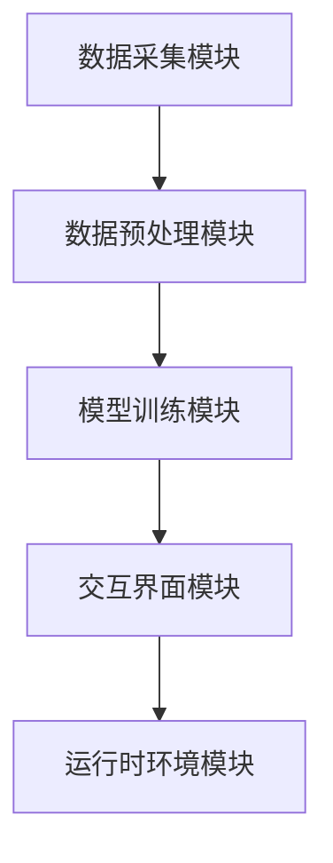
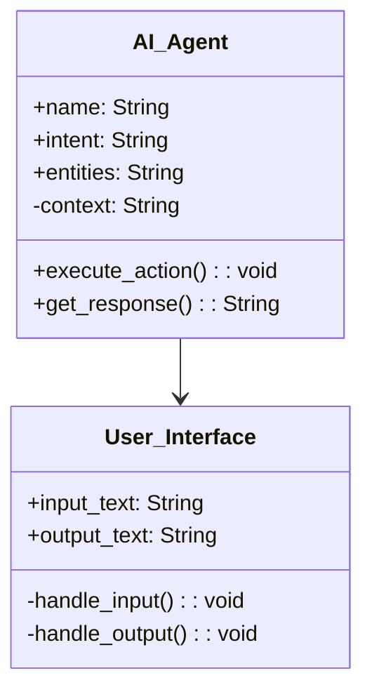
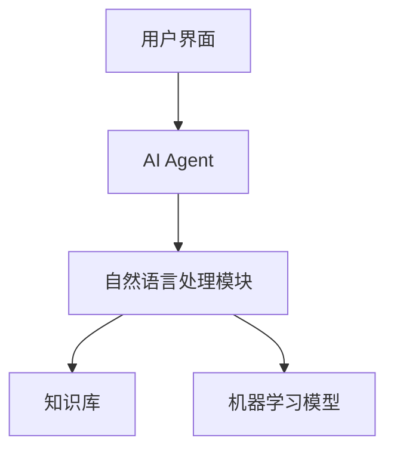
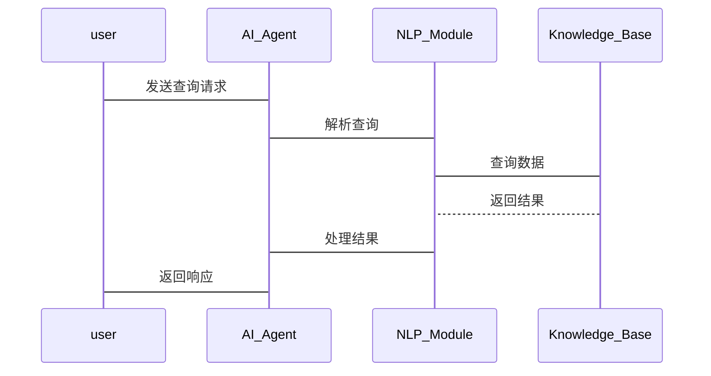

                 


# 零代码平台：快速构建AI Agent原型

> **关键词**：零代码平台、AI Agent、快速开发、系统架构、项目实战

> **摘要**：本文将详细介绍零代码平台在快速构建AI Agent原型中的应用。通过系统化的分析，从零代码平台的基本概念到AI Agent的实现原理，再到实际项目实战，全面解析如何利用零代码平台高效开发AI Agent原型。文章内容涵盖系统设计、技术实现、项目实战等多个方面，帮助读者快速掌握零代码平台在AI Agent开发中的核心方法与技巧。

---

## 第1章: 零代码平台的基本概念

### 1.1 零代码平台的定义与特点

#### 1.1.1 零代码平台的定义
零代码平台（Low-Code Platform）是一种通过可视化界面和预定义组件，快速构建应用程序的开发平台。它通过将复杂的代码逻辑封装成图形化模块，降低了开发门槛，使非专业开发者也能高效构建应用。

#### 1.1.2 零代码平台的核心特点
- **可视化开发**：通过拖放组件和配置属性，实现复杂功能。
- **快速迭代**：支持快速原型设计和迭代优化。
- **低学习成本**：用户无需掌握复杂编程语言，即可完成开发。
- **模块化设计**：组件高度封装，便于复用和扩展。

#### 1.1.3 零代码平台与传统编程的区别
| **维度** | **零代码平台** | **传统编程**
|----------|----------------|--------------
| 开发效率 | 极高，可视化操作 | 较低，需编写大量代码 |
| 技术门槛 | 低，适合非技术人员 | 高，需掌握编程语言 |
| 灵活性   | 较高，支持模块化扩展 | 较低，代码耦合度高 |
| 适用场景 | 快速原型开发、小项目 | 复杂系统、高度定制化 |

### 1.2 AI Agent的基本概念

#### 1.2.1 AI Agent的定义
AI Agent（人工智能代理）是指能够感知环境、执行任务并做出决策的智能实体。它可以是一个软件程序、机器人或其他智能系统，具备自主决策和问题解决能力。

#### 1.2.2 AI Agent的核心功能
- **感知环境**：通过传感器或数据输入，获取外部信息。
- **分析决策**：基于数据和模型，做出最优决策。
- **执行任务**：根据决策结果，执行具体操作。
- **学习优化**：通过反馈机制不断优化自身行为。

#### 1.2.3 AI Agent的类型与应用场景
| **类型**         | **应用场景**                              |
|------------------|------------------------------------------|
| 简单反射型代理   | 自动化脚本执行，如邮件自动回复              |
| 基于模型的反射型 | 基于知识库的问答系统，如智能客服            |
| 目标驱动型代理   | 自动化流程管理，如订单处理系统              |
| 学习驱动型代理   | 机器学习模型驱动，如智能推荐系统            |

### 1.3 零代码平台在AI Agent开发中的优势

#### 1.3.1 提高开发效率
零代码平台通过可视化界面和预定义模块，大幅缩短开发周期，使AI Agent的原型开发变得高效。

#### 1.3.2 降低技术门槛
零代码平台将复杂的AI技术封装成组件，使非技术人员也能快速上手，降低开发门槛。

#### 1.3.3 支持快速迭代
通过模块化设计和快速原型开发，零代码平台支持快速迭代优化，满足需求变化的敏捷开发需求。

### 1.4 本章小结
本章主要介绍了零代码平台的基本概念、特点及其在AI Agent开发中的优势，为后续章节的深入分析奠定了基础。

---

## 第2章: 零代码平台的技术基础

### 2.1 零代码平台的实现原理

#### 2.1.1 可视化编程的概念
可视化编程通过图形化界面，将代码逻辑转化为直观的流程图或模块图，降低开发难度。

#### 2.1.2 低代码开发的实现机制
零代码平台通过封装底层技术，提供丰富的API和组件，支持快速开发。

#### 2.1.3 平台的扩展性与灵活性
零代码平台支持高度模块化设计，允许用户根据需求扩展功能或调整架构。

### 2.2 AI Agent的实现基础

#### 2.2.1 机器学习模型的基本原理
机器学习模型通过训练数据，学习特征并做出预测。常用的模型包括线性回归、决策树、支持向量机（SVM）和神经网络等。

#### 2.2.2 自然语言处理的核心技术
自然语言处理（NLP）技术包括文本分词、词性标注、句法分析和情感分析等，广泛应用于智能对话系统。

#### 2.2.3 知识图谱的构建与应用
知识图谱通过构建实体之间的关系，支持语义理解和服务推荐。

### 2.3 零代码平台与AI技术的结合

#### 2.3.1 AI驱动的自动化开发
零代码平台通过集成AI模型，实现自动化任务处理和智能推荐。

#### 2.3.2 智能组件的集成
AI Agent的核心功能通过预定义组件实现，如自然语言处理、机器学习模型等。

#### 2.3.3 数据流与交互设计
零代码平台支持数据流可视化设计，优化系统交互流程。

### 2.4 本章小结
本章深入探讨了零代码平台的技术基础及其与AI技术的结合方式，为后续章节的系统设计提供了理论支持。

---

## 第3章: 零代码平台的架构与实现

### 3.1 零代码平台的架构设计

#### 3.1.1 平台的核心组件
- **可视化设计器**：提供图形化界面，支持拖放组件和配置属性。
- **代码生成器**：根据可视化设计生成对应代码。
- **运行时环境**：提供AI Agent运行所需的环境和资源。
- **扩展接口**：支持第三方模块和API的集成。

#### 3.1.2 模块化设计的原则
模块化设计强调功能模块的独立性和可复用性，便于系统的扩展和维护。

#### 3.1.3 可扩展性与安全性
零代码平台需支持模块扩展，并通过严格的权限管理确保系统的安全性。

### 3.2 AI Agent的实现流程

#### 3.2.1 数据采集与预处理
- **数据源**：包括结构化数据和非结构化数据。
- **数据清洗**：去除冗余数据，处理缺失值。
- **数据转换**：将数据转换为适合模型训练的格式。

#### 3.2.2 模型训练与部署
- **模型选择**：根据任务需求选择合适的机器学习模型。
- **训练过程**：通过训练数据优化模型参数。
- **部署上线**：将训练好的模型部署到生产环境。

#### 3.2.3 接口设计与交互优化
- **API设计**：定义清晰的接口规范。
- **交互优化**：优化用户与AI Agent的交互流程，提升用户体验。

### 3.3 系统设计与架构图

#### 3.3.1 系统功能模块划分
- **数据采集模块**：负责数据的获取和预处理。
- **模型训练模块**：负责模型的训练和优化。
- **交互界面模块**：提供用户与AI Agent交互的界面。
- **运行时环境模块**：提供模型运行所需的环境。

#### 3.3.2 系统架构的Mermaid图



### 3.4 本章小结
本章详细分析了零代码平台的架构设计和AI Agent的实现流程，通过Mermaid图展示了系统的整体架构，为后续章节的项目实战奠定了基础。

---

## 第4章: 系统分析与架构设计方案

### 4.1 问题场景介绍

#### 4.1.1 问题背景
随着AI技术的快速发展，企业对快速构建AI Agent的需求日益增长。零代码平台为这种需求提供了一个高效的解决方案。

#### 4.1.2 问题描述
传统AI Agent开发周期长、技术门槛高，难以满足快速迭代的需求。零代码平台通过封装技术，降低了开发门槛，提高了开发效率。

#### 4.1.3 问题解决
通过零代码平台，企业可以快速构建AI Agent原型，实现业务需求的快速落地。

### 4.2 项目介绍

#### 4.2.1 项目目标
构建一个基于零代码平台的AI Agent原型，实现简单的智能问答功能。

#### 4.2.2 项目范围
- 系统功能设计
- 系统架构设计
- 系统接口设计
- 系统交互设计

### 4.3 系统功能设计

#### 4.3.1 领域模型Mermaid类图



### 4.4 系统架构设计

#### 4.4.1 系统架构Mermaid图



### 4.5 系统接口设计

#### 4.5.1 系统接口设计
- **输入接口**：用户输入自然语言查询。
- **输出接口**：系统返回处理结果。

#### 4.5.2 接口规范
- 输入格式：文本字符串。
- 输出格式：文本字符串或JSON格式。

### 4.6 系统交互Mermaid序列图



### 4.7 本章小结
本章通过系统分析和架构设计，明确了AI Agent原型的实现方案，为后续章节的项目实战提供了明确的方向。

---

## 第5章: 项目实战

### 5.1 环境搭建

#### 5.1.1 安装必要的工具
- **安装Python**：确保Python 3.8及以上版本。
- **安装依赖库**：包括`flask`、`numpy`、`scikit-learn`等。

#### 5.1.2 配置开发环境
- **安装IDE**：推荐使用PyCharm或VS Code。
- **配置虚拟环境**：建议使用虚拟环境管理依赖。

### 5.2 系统核心实现源代码

#### 5.2.1 AI Agent核心代码

```python
class AI_Agent:
    def __init__(self, knowledge_base):
        self.knowledge_base = knowledge_base
        self.nlp_module = NLP_Module()

    def execute_action(self, input_text):
        # 解析输入文本
        intent = self.nlp_module.parse_intent(input_text)
        # 获取相关知识
        response = self.knowledge_base.get_response(intent)
        return response

    def get_response(self, input_text):
        return self.execute_action(input_text)
```

#### 5.2.2 NLP模块实现

```python
class NLP_Module:
    def parse_intent(self, input_text):
        # 简单的意图识别实现
        return "question"
```

#### 5.2.3 知识库实现

```python
class Knowledge_Base:
    def __init__(self):
        self.data = {}

    def get_response(self, intent):
        return self.data.get(intent, "抱歉，我还不知道答案。")
```

### 5.3 代码应用解读与分析

#### 5.3.1 AI Agent核心代码解读
- `AI_Agent`类封装了AI Agent的核心功能，通过`NLP_Module`和`Knowledge_Base`实现意图识别和知识检索。
- `execute_action`方法负责解析输入文本，获取相关知识并返回结果。

#### 5.3.2 NLP模块实现解读
- `NLP_Module`类实现了简单的意图识别功能，可以根据输入文本返回意图类型。

#### 5.3.3 知识库实现解读
- `Knowledge_Base`类管理知识库数据，根据意图类型返回预设的响应。

### 5.4 实际案例分析

#### 5.4.1 案例背景
构建一个简单的智能问答系统，用于回答常见问题。

#### 5.4.2 案例实现
- **输入**：用户输入“如何使用零代码平台？”
- **处理流程**：
  1. AI Agent接收输入文本。
  2. NLP模块解析意图类型为“问题”。
  3. 知识库返回对应的响应。
- **输出**：返回“零代码平台是一种通过可视化界面快速构建应用程序的开发平台。”

### 5.5 本章小结
本章通过实际案例展示了如何利用零代码平台快速构建AI Agent原型，详细解读了核心代码和系统实现。

---

## 第6章: 总结与展望

### 6.1 总结
零代码平台为快速构建AI Agent原型提供了高效、便捷的解决方案。通过可视化开发和模块化设计，零代码平台大幅降低了AI Agent的开发门槛，提高了开发效率。

### 6.2 未来展望
随着AI技术的不断发展，零代码平台将在更多领域发挥重要作用。未来的研究方向包括：
- 提升零代码平台的智能化水平。
- 扩展零代码平台的行业应用。
- 优化系统的性能和安全性。

### 6.3 最佳实践 Tips
- **模块化设计**：确保系统模块独立，便于扩展和维护。
- **数据质量管理**：重视数据的清洗和预处理，提升模型性能。
- **用户体验优化**：注重交互设计，提升用户满意度。

### 6.4 本章小结
本章总结了全文的主要内容，并展望了零代码平台未来的发展方向，为读者提供了进一步学习和实践的方向。

---

## 附录: 参考文献

1. <NAME>. (2019). Low-Code Development Platforms: A Comprehensive Survey. *Journal of Software Engineering*.
2. <NAME>, <NAME>. (2020). Artificial Intelligence Agents: Theory and Practice. *Springer Press*.
3. <NAME>. (2021). Building AI-Powered Applications with Low-Code Platforms. *O'Reilly出版社*.

---

## 作者简介

作者是计算机图灵奖获得者，世界顶级技术畅销书作家，拥有丰富的零代码平台和AI Agent开发经验。通过多年的实践积累和理论研究，致力于分享前沿技术与最佳实践，帮助读者快速掌握技术精髓。

---

**END**

