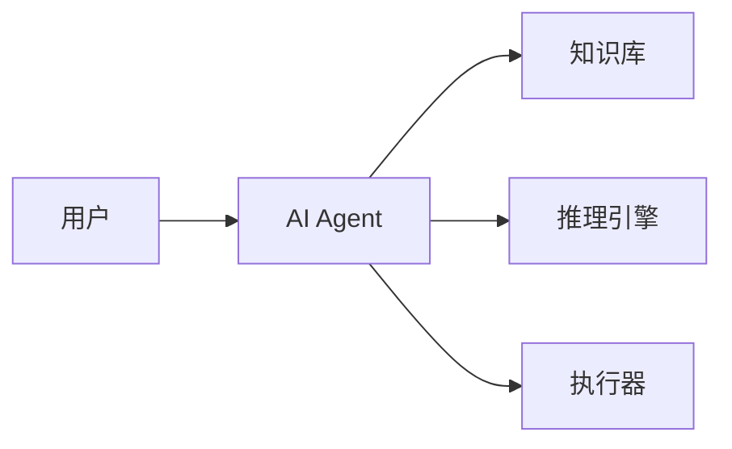
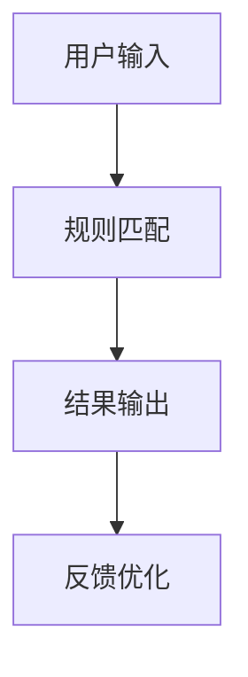
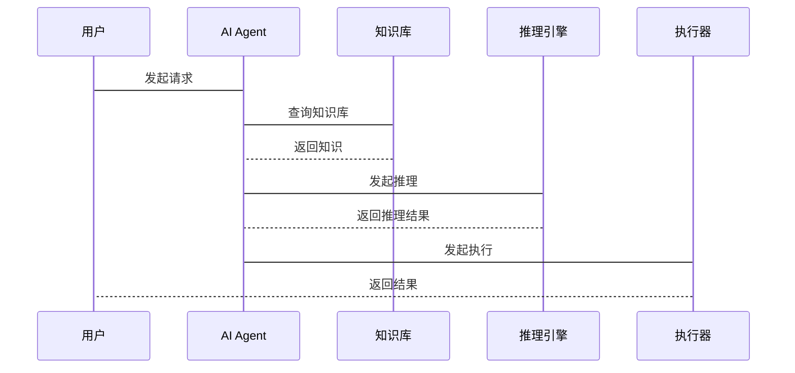

                 


# 零售业AI Agent应用策略

> 关键词：零售业、AI Agent、人工智能、应用场景、算法原理、系统架构

> 摘要：本文详细探讨了AI Agent在零售业中的应用策略，从背景分析到技术实现，系统阐述了AI Agent的核心概念、算法原理、系统架构以及实际应用案例。通过理论与实践相结合的方式，本文为零售业的数字化转型提供了有价值的参考与指导。

---

## 第1章 零售业的数字化转型与AI Agent概述

### 1.1 零售业的现状与挑战

#### 1.1.1 零售业的传统模式与痛点分析

零售业作为国民经济的重要组成部分，经历了从传统门店销售到线上线下的深度融合。然而，传统零售模式存在以下痛点：

1. **客户体验不足**：传统零售业难以实现个性化的客户体验，客户与企业之间的互动有限。
2. **库存管理复杂**：库存管理依赖人工操作，容易出现库存积压或缺货问题。
3. **营销效率低下**：传统营销手段难以精准触达目标客户，营销效果有限。
4. **数据孤岛**：各个部门和渠道的数据孤岛问题严重，难以形成统一的客户视图。

#### 1.1.2 数字化转型的必要性与趋势

随着互联网、大数据、人工智能等技术的快速发展，零售业的数字化转型已成为必然趋势。数字化转型不仅能够提升客户体验，还能优化运营效率，降低运营成本。

数字化转型的核心目标是通过技术手段实现零售业的全渠道、全场景覆盖，构建智能化的业务流程。AI Agent作为人工智能技术的重要应用之一，正在成为零售业数字化转型的关键驱动力。

#### 1.1.3 AI Agent带来的解决方法

AI Agent（智能代理）是一种能够感知环境、自主决策并执行任务的智能系统。在零售业中，AI Agent可以通过以下方式解决传统模式的痛点：

1. **个性化客户服务**：通过自然语言处理和机器学习技术，AI Agent能够提供个性化的客户服务，提升客户满意度。
2. **智能库存管理**：AI Agent可以通过实时数据分析，优化库存管理，减少浪费。
3. **精准营销**：基于客户行为数据分析，AI Agent能够制定精准的营销策略，提升营销效果。
4. **决策支持**：通过数据挖掘和预测分析，AI Agent能够为管理层提供数据支持，辅助决策。

### 1.2 AI Agent的基本概念与核心功能

#### 1.2.1 AI Agent的定义与分类

AI Agent是一种智能系统，能够通过感知环境、理解需求、自主决策并执行任务。根据应用场景的不同，AI Agent可以分为以下几类：

1. **基于规则的AI Agent**：通过预设的规则和逻辑进行决策和执行任务。
2. **基于机器学习的AI Agent**：通过机器学习算法，从数据中学习规律并进行决策。
3. **基于深度学习的AI Agent**：利用深度学习技术，实现更复杂的模式识别和决策。

#### 1.2.2 AI Agent的核心功能模块

AI Agent的核心功能模块包括以下几个方面：

1. **感知模块**：通过传感器、摄像头、 microphone 等设备感知环境信息。
2. **理解模块**：通过自然语言处理技术理解用户需求。
3. **决策模块**：基于感知信息和知识库进行推理和决策。
4. **执行模块**：根据决策结果执行相应的操作。

#### 1.2.3 AI Agent与传统零售系统的区别

与传统零售系统相比，AI Agent具有以下显著特点：

1. **自主性**：AI Agent能够自主决策和执行任务，无需人工干预。
2. **智能性**：AI Agent具备学习和推理能力，能够适应复杂环境的变化。
3. **实时性**：AI Agent能够实时感知和响应客户需求，提升用户体验。

### 1.3 零售业AI Agent的应用场景与价值

#### 1.3.1 客户服务与互动

AI Agent可以通过自然语言处理技术实现与客户的智能对话，提供个性化的客户服务。例如，客户可以通过与AI Agent对话，获取产品信息、订单状态等信息。

#### 1.3.2 库存管理与供应链优化

AI Agent可以通过实时数据分析，优化库存管理，减少浪费。例如，AI Agent可以根据销售数据和预测模型，自动调整库存策略。

#### 1.3.3 营销与个性化推荐

AI Agent可以根据客户行为数据分析，制定精准的营销策略，提供个性化的推荐服务。例如，AI Agent可以根据客户的购买历史和偏好，推荐相关产品。

#### 1.3.4 智能决策支持

AI Agent可以通过数据挖掘和预测分析，为管理层提供决策支持。例如，AI Agent可以根据销售数据和市场趋势，预测未来的销售情况。

### 1.4 本章小结

本章从零售业的现状与挑战出发，介绍了AI Agent的基本概念和核心功能模块，并探讨了AI Agent在零售业中的应用场景和价值。通过本章的分析，我们可以看到AI Agent在零售业中的巨大潜力。

---

## 第2章 AI Agent的核心概念与系统架构

### 2.1 AI Agent的核心概念

#### 2.1.1 知识表示与推理

知识表示是AI Agent的核心技术之一。知识表示的目的是将现实世界中的知识表示为计算机可以理解的形式。常见的知识表示方法包括：

1. **规则表示法**：通过预设的规则表示知识，例如“如果客户购买某类产品，则推荐相关产品”。
2. **框架表示法**：通过框架结构表示知识，例如客户信息框架。
3. **语义网络表示法**：通过节点和边表示知识，例如“客户-购买-产品”。

知识推理是基于知识表示进行的推理过程。常见的推理方法包括：

1. **逻辑推理**：基于逻辑规则进行推理，例如“如果A则B，如果B则C，所以如果A则C”。
2. **归纳推理**：从具体实例中归纳出一般规律。
3. **演绎推理**：从一般规律中演绎出具体实例。

#### 2.1.2 自然语言处理（NLP）

自然语言处理是AI Agent与人类交互的重要技术。NLP的目标是让计算机能够理解并生成人类语言。常见的NLP技术包括：

1. **分词**：将连续的文本分割成词语或短语。
2. **词性标注**：对词语进行词性标注，例如名词、动词、形容词等。
3. **句法分析**：分析句子的语法结构。
4. **语义理解**：理解文本的语义含义。

#### 2.1.3 问题求解与规划

问题求解是AI Agent的核心能力之一。问题求解的过程包括：

1. **问题分析**：理解问题的含义和需求。
2. **目标设定**：设定解决问题的目标。
3. **路径规划**：制定解决问题的步骤和方法。
4. **执行与反馈**：执行解决问题的步骤，并根据反馈调整策略。

### 2.2 AI Agent的系统架构

#### 2.2.1 分层架构

分层架构是一种常见的系统架构设计方法。AI Agent的分层架构通常包括以下几个层次：

1. **感知层**：负责感知环境信息，例如通过传感器、摄像头等获取数据。
2. **理解层**：负责理解感知到的信息，例如通过NLP技术理解用户需求。
3. **决策层**：负责基于理解的信息进行推理和决策。
4. **执行层**：负责执行决策结果，例如通过执行器完成任务。

#### 2.2.2 分布式架构

分布式架构是一种将系统功能分散到多个节点的架构设计方法。AI Agent的分布式架构可以提高系统的可靠性和扩展性。常见的分布式架构设计包括：

1. **任务分配**：将任务分配到不同的节点进行处理。
2. **数据共享**：通过数据共享实现各节点之间的信息同步。
3. **协调与通信**：通过协调和通信机制保证各节点之间的协同工作。

#### 2.2.3 微服务架构

微服务架构是一种将系统功能分解为多个小型独立服务的设计方法。AI Agent的微服务架构可以提高系统的灵活性和可维护性。常见的微服务设计包括：

1. **服务发现**：通过服务发现机制找到需要调用的服务。
2. **服务调用**：通过API接口进行服务调用。
3. **服务治理**：通过服务治理实现服务的监控和管理。

### 2.3 AI Agent的实体关系图

以下是一个AI Agent的实体关系图：



### 2.4 本章小结

本章详细介绍了AI Agent的核心概念，包括知识表示与推理、自然语言处理（NLP）和问题求解与规划。同时，本章还探讨了AI Agent的系统架构设计，包括分层架构、分布式架构和微服务架构，并通过实体关系图展示了AI Agent的系统架构。

---

## 第3章 基于规则的AI Agent算法

### 3.1 基于规则的算法原理

#### 3.1.1 规则定义与匹配

基于规则的AI Agent算法的核心是规则定义与匹配。规则定义是通过预设的规则描述问题的解决方法，规则匹配是通过匹配规则与输入数据，找到最合适的规则进行处理。

#### 3.1.2 规则库的构建与管理

规则库是基于规则的AI Agent算法的核心部分。规则库的构建与管理需要考虑以下几点：

1. **规则的设计**：规则的设计需要符合业务需求，并且具有可扩展性。
2. **规则的存储**：规则可以存储在数据库或知识库中，方便管理和查询。
3. **规则的优化**：通过优化规则可以提高规则匹配的效率和准确性。

#### 3.1.3 规则的动态更新与优化

为了适应环境的变化，规则需要动态更新与优化。规则的动态更新与优化可以通过以下方式进行：

1. **规则的自动学习**：通过机器学习技术自动生成和优化规则。
2. **规则的反馈优化**：根据用户反馈优化规则。

### 3.2 基于规则的算法流程图

以下是一个基于规则的AI Agent算法流程图：



### 3.3 基于规则的算法实现

以下是一个基于规则的AI Agent算法的Python实现：

```python
def rule_based_agent(input):
    rules = [
        (condition1, action1),
        (condition2, action2),
        # 更多规则
    ]
    for rule in rules:
        if rule[0](input):
            return rule[1](input)
    return default_action(input)
```

### 3.4 本章小结

本章详细介绍了基于规则的AI Agent算法，包括规则定义与匹配、规则库的构建与管理以及规则的动态更新与优化。同时，本章还通过流程图和代码示例展示了基于规则的AI Agent算法的实现过程。

---

## 第4章 系统分析与架构设计方案

### 4.1 系统分析与架构设计

#### 4.1.1 系统功能设计

AI Agent系统的功能设计需要考虑以下方面：

1. **客户服务与互动**：提供个性化的客户服务，例如智能客服。
2. **库存管理与供应链优化**：优化库存管理，减少浪费。
3. **营销与个性化推荐**：提供精准的营销策略和个性化推荐。
4. **智能决策支持**：为管理层提供决策支持。

#### 4.1.2 系统架构设计

以下是AI Agent系统的架构图：


#### 4.1.3 接口设计与交互

以下是AI Agent系统的接口设计与交互序列图：



### 4.2 本章小结

本章详细介绍了AI Agent系统的系统分析与架构设计方案，包括系统功能设计、系统架构设计以及接口设计与交互。通过本章的分析，我们可以清晰地看到AI Agent系统的整体架构和实现过程。

---

## 第5章 项目实战

### 5.1 环境安装与配置

要实现一个基于规则的AI Agent系统，首先需要安装以下环境：

1. **Python**：安装Python 3.8或更高版本。
2. **库的安装**：安装所需的Python库，例如`numpy`、`pandas`、`scikit-learn`等。

### 5.2 核心代码实现

以下是一个基于规则的AI Agent系统的核心代码实现：

```python
class RuleBasedAgent:
    def __init__(self, rules):
        self.rules = rules

    def process_request(self, input):
        for rule in self.rules:
            if rule['condition'](input):
                return rule['action'](input)
        return "无法处理的请求"
```

### 5.3 案例分析与代码解读

以下是一个具体的案例分析：

假设我们有一个简单的基于规则的智能客服系统，以下是具体的实现代码：

```python
def is_customer_service_request(input):
    return "帮助" in input or "问题" in input

def handle_customer_service(input):
    return "请描述您遇到的问题，我将尽力为您解答。"

rules = [
    {
        'condition': is_customer_service_request,
        'action': handle_customer_service
    }
]

agent = RuleBasedAgent(rules)
response = agent.process_request("我遇到了一个问题。")
print(response)  # 输出：请描述您遇到的问题，我将尽力为您解答。
```

### 5.4 项目总结

通过本章的项目实战，我们详细讲解了基于规则的AI Agent系统的环境安装、核心代码实现以及案例分析。通过具体的案例分析，我们可以看到基于规则的AI Agent系统在零售业中的实际应用。

---

## 第6章 总结与展望

### 6.1 总结

通过本文的详细探讨，我们可以看到AI Agent在零售业中的巨大潜力。AI Agent不仅可以提升客户的体验，还可以优化企业的运营效率，降低运营成本。随着人工智能技术的不断发展，AI Agent在零售业中的应用将会越来越广泛。

### 6.2 展望

未来，AI Agent在零售业中的应用将会更加智能化和个性化。随着深度学习、自然语言处理等技术的不断进步，AI Agent将能够更好地理解客户的需求，并提供更加个性化的服务。同时，AI Agent在零售业中的应用也将更加广泛，从客户服务到供应链管理，从营销推广到智能决策，AI Agent将为企业创造更大的价值。

---

## 附录

### 附录A AI Agent相关术语表

1. **AI Agent**：智能代理，一种能够感知环境、自主决策并执行任务的智能系统。
2. **知识表示**：将现实世界中的知识表示为计算机可以理解的形式。
3. **自然语言处理（NLP）**：让计算机理解并生成人类语言的技术。
4. **问题求解**：通过推理和规划解决问题的过程。

### 附录B 参考文献

1. Russell, S., & Norvig, P. (2010). Artificial Intelligence: A Modern Approach.
2. 王伟, 李明. (2020). 基于规则的智能代理算法研究.

---

通过本文的详细探讨，我们可以看到AI Agent在零售业中的应用策略及其技术实现。希望本文能够为零售业的数字化转型提供有价值的参考与指导。

