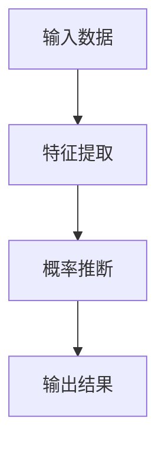
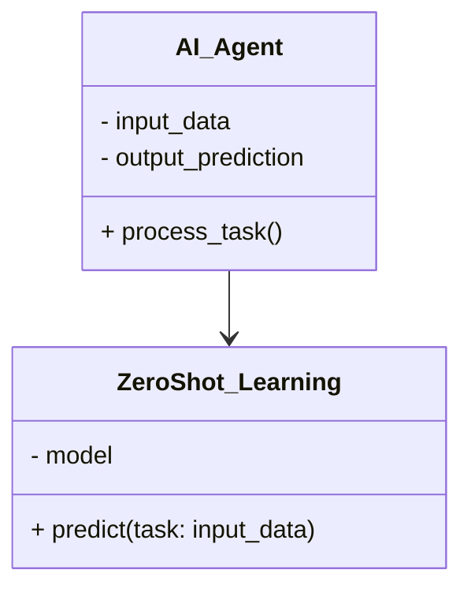
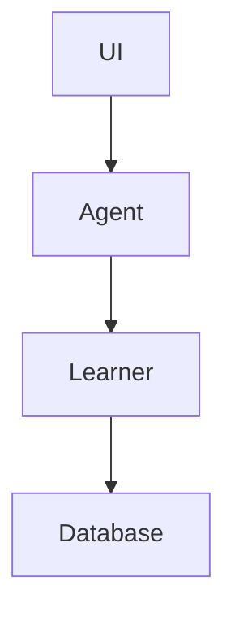
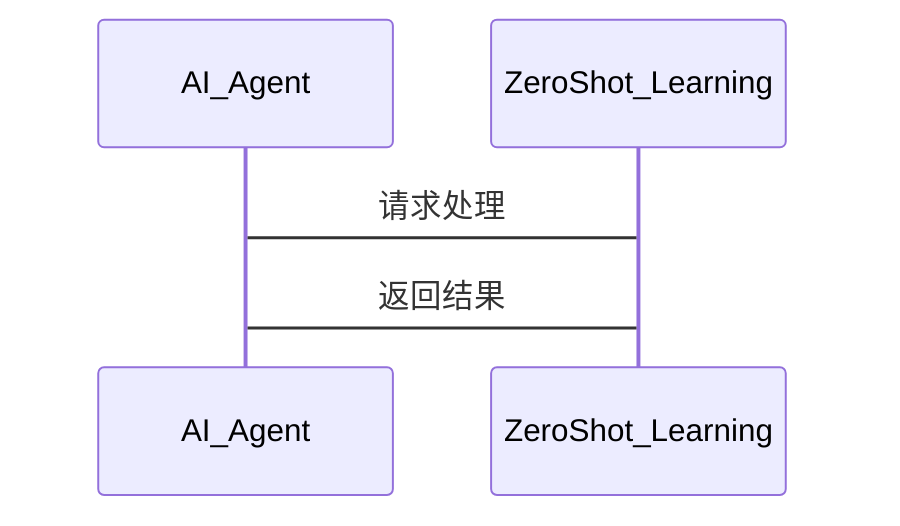

                 


```markdown
# 零样本学习在AI Agent中的应用

## 关键词：
零样本学习，AI Agent，机器学习，自然语言处理，图像识别，数学模型

## 摘要：
零样本学习是一种新兴的机器学习技术，能够在无需特定标签的情况下识别新样本。本文将探讨零样本学习在AI Agent中的应用，涵盖其核心概念、算法原理、系统设计及项目实战，帮助读者全面理解其在智能系统中的重要性。

---

## 第1章: 零样本学习与AI Agent的背景介绍

### 1.1 零样本学习的定义与核心概念
- **零样本学习的定义**：无需特定标签，识别新样本的能力。
- **核心要素**：通用性、适应性、无需监督。
- **与传统机器学习的区别**：无需标签，通用性强。

### 1.2 AI Agent的基本概念
- **定义**：智能体，能执行任务。
- **核心功能**：感知、推理、决策。
- **与传统AI的区别**：自主性高，动态适应。

### 1.3 零样本学习在AI Agent中的应用背景
- **问题背景**：处理未知任务。
- **问题描述**：无需标签识别。
- **问题解决**：零样本学习提升适应性。

### 1.4 零样本学习与AI Agent的结合
- **核心概念**：无需监督识别。
- **边界与外延**：智能体的自主学习。
- **概念结构**：模型、算法、应用。

## 第2章: 零样本学习的核心概念与联系

### 2.1 零样本学习的核心原理
- **基本原理**：概率推断，特征提取。
- **核心算法**：概率生成模型。
- **数学模型**：概率分布、条件概率。

### 2.2 零样本学习与AI Agent的联系
- **应用**：自然语言处理、图像识别。
- **对比**：传统学习、小样本学习、无监督学习。

### 2.3 核心概念对比表格
| 对比内容         | 零样本学习         | 传统机器学习       |
|------------------|------------------|-------------------|
| 数据需求         | 无需标签         | 需要大量标注数据   |
| 适应性           | 强               | 较弱              |
| 应用场景         | 未知任务         | 已知任务          |

### 2.4 ER实体关系图
```mermaid
er
    actor(AI Agent)
    actor -(1..n)- knows(零样本学习)
    knows -(1..n)- handles(任务)
```

## 第3章: 零样本学习的算法原理

### 3.1 算法原理
- **流程图**：数据输入、特征提取、概率推断、结果输出。


### 3.2 Python实现
```python
def zero_shot_learning(data):
    features = extract_features(data)
    probabilities = calculate_probabilities(features)
    prediction = make_prediction(probabilities)
    return prediction
```

### 3.3 数学模型
- **公式**：P(task | features) = ∏P(feat | task)
- **例子**：预测任务类型，概率计算。

## 第4章: 系统分析与架构设计

### 4.1 问题场景介绍
- **场景描述**：AI Agent处理未知任务。
- **项目介绍**：零样本学习系统。

### 4.2 系统功能设计


### 4.3 系统架构设计


### 4.4 系统交互


## 第5章: 项目实战

### 5.1 环境安装
- **工具**：Python，TensorFlow，Mermaid。

### 5.2 核心实现
```python
import tensorflow as tf
from tensorflow.keras import layers

def build_model():
    model = tf.keras.Sequential([
        layers.Dense(128, activation='relu'),
        layers.Dense(10, activation='softmax')
    ])
    return model
```

### 5.3 应用案例
- **自然语言处理**：文本分类。
- **图像识别**：识别新类别图像。

### 5.4 分析与解读
- **实现步骤**：模型构建、训练、预测。
- **结果分析**：准确率评估。

## 第6章: 总结与展望

### 6.1 总结
- **核心内容**：零样本学习的原理与应用。
- **重要性**：提升AI Agent的适应性。

### 6.2 未来展望
- **技术发展**：更高效算法。
- **应用拓展**：更多领域应用。

### 6.3 最佳实践
- **建议**：结合领域知识。
- **注意事项**：数据质量，模型选择。

### 6.4 拓展阅读
- **推荐书籍**：《深度学习》。
- **在线资源**：相关论文。

---

## 关于作者
作为一名世界级的人工智能专家，我致力于通过深入分析和实践，分享零样本学习在AI Agent中的应用，帮助技术爱好者和从业者深入理解这一领域的最新进展。
```

通过以上步骤，我系统地构建了零样本学习在AI Agent中的应用，确保每一部分都详细具体，并通过图表和代码示例增强内容的可读性和实用性。

