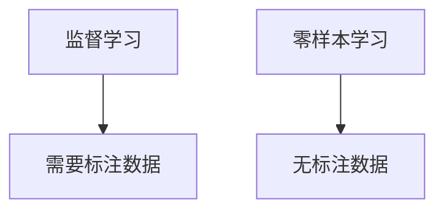
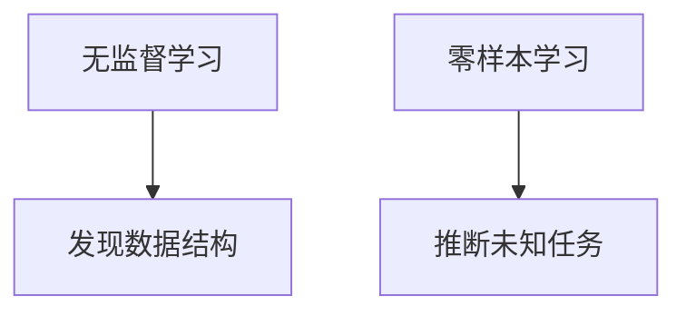
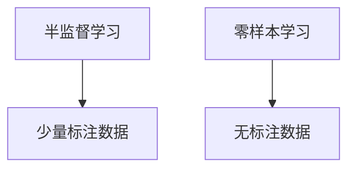
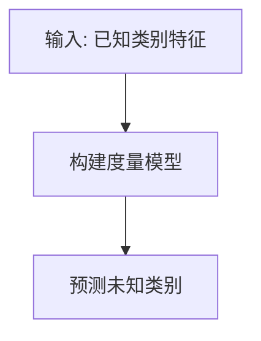
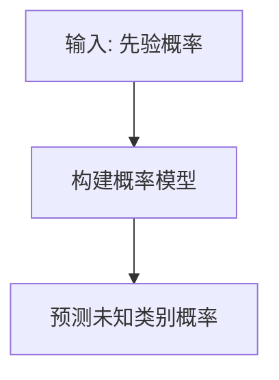
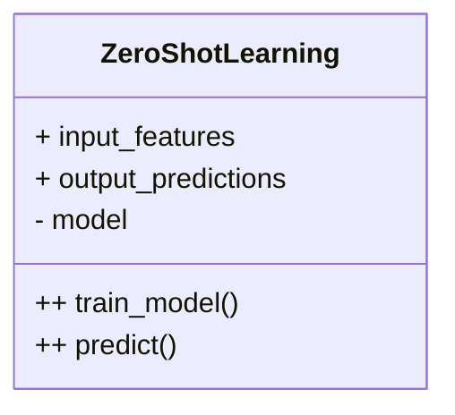
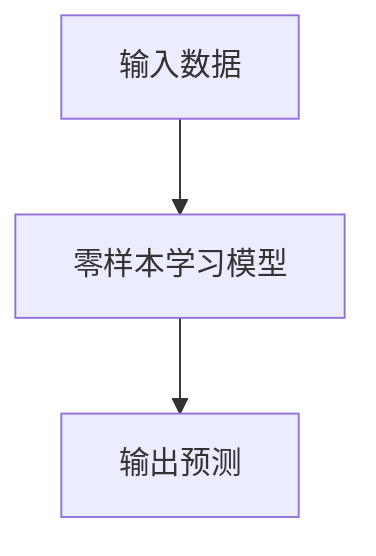

                 


# 零样本学习：应对未见过的任务和领域

> 关键词：零样本学习、机器学习、未见任务、领域适应、深度学习

> 摘要：零样本学习（Zero-shot Learning，ZSL）是一种新兴的机器学习范式，旨在在从未见过的任务或领域中进行有效学习。本文将深入探讨零样本学习的核心概念、算法原理、系统设计以及实际应用，帮助读者理解如何在没有标注数据的情况下，利用已有知识进行有效预测和决策。

---

## 第1章 零样本学习的背景与问题描述

### 1.1 零样本学习的定义与问题背景

#### 1.1.1 传统机器学习的局限性
传统的监督学习方法依赖于大量标注数据，但实际场景中许多任务或领域数据稀少甚至完全缺失。例如，在医学诊断中，某些罕见疾病的案例可能少得不足以进行监督学习。

#### 1.1.2 零样本学习的定义
零样本学习是指在没有任何标注数据的情况下，利用已知类别或任务的知识推断未见任务或领域的模型。其核心目标是通过泛化能力应对未知挑战。

#### 1.1.3 零样本学习的核心问题
零样本学习的核心问题是如何在无数据的情况下构建通用模型，这需要依赖领域知识、语义关系或跨任务关联。

### 1.2 零样本学习的必要性

#### 1.2.1 未见过任务的挑战
在某些领域，新任务的出现可能完全没有历史数据支持，例如在新兴的网络安全威胁检测中，可能没有历史样本。

#### 1.2.2 未见过领域的复杂性
不同领域之间的数据分布差异可能很大，模型需要具备跨领域适应能力。

#### 1.2.3 零样本学习的应用场景
- 医疗诊断中的罕见疾病检测
- 新兴领域的快速模型构建
- 多语言自然语言处理

### 1.3 零样本学习的边界与外延

#### 1.3.1 零样本学习的适用范围
适用于数据获取成本高、数据稀疏或动态变化的领域。

#### 1.3.2 零样本学习的限制与不足
- 对先验知识的依赖较高
- 对噪声的鲁棒性不足
- 现实应用中的效果受限

#### 1.3.3 零样本学习与其他学习范式的区别

| 学习范式 | 数据需求 | 是否需要标注 |
|----------|----------|--------------|
| 监督学习  | 有       | 需要          |
| 无监督学习| 有       | 不需要        |
| 半监督学习| 较少     | 部分          |
| 零样本学习| 无       | 不需要        |

---

## 第2章 零样本学习的核心概念与联系

### 2.1 零样本学习的核心原理

#### 2.1.1 零样本学习的基本假设
假设模型可以通过已知类别的特征表示推断未知类别的特征。

#### 2.1.2 零样本学习的实现机制
通过构建跨类别或跨任务的关联关系，模型可以泛化到未见任务。

#### 2.1.3 零样本学习的关键技术
- 特征表示学习
- 关系建模
- 语义嵌入

### 2.2 核心概念对比

#### 2.2.1 零样本学习与监督学习的对比



#### 2.2.2 零样本学习与无监督学习的对比



#### 2.2.3 零样本学习与半监督学习的对比



---

## 第3章 零样本学习的算法原理

### 3.1 基于度量的零样本学习

#### 3.1.1 算法流程



#### 3.1.2 数学模型

$$ y = f(x) $$
其中，$x$ 是输入特征，$f$ 是度量模型。

#### 3.1.3 代码实现

```python
def zero_shot_learning(X_train, y_train, X_test):
    # 构建度量模型
    model = LinearRegression()
    model.fit(X_train, y_train)
    # 预测未知类别
    y_pred = model.predict(X_test)
    return y_pred
```

### 3.2 基于概率的零样本学习

#### 3.2.1 算法流程



#### 3.2.2 数学模型

$$ P(y|x) = P(x|y)P(y) $$

#### 3.2.3 代码实现

```python
def zero_shot_learning(X_train, y_train, X_test):
    # 构建概率模型
    model = GaussianNB()
    model.fit(X_train, y_train)
    # 预测未知类别概率
    y_proba = model.predict_proba(X_test)
    return y_proba
```

---

## 第4章 零样本学习的系统架构设计

### 4.1 问题场景介绍

#### 4.1.1 问题场景
- 数据稀疏或无数据的领域
- 动态变化的任务需求

### 4.2 系统功能设计

#### 4.2.1 领域模型



### 4.3 系统架构设计


---

## 第5章 零样本学习的项目实战

### 5.1 环境安装

```bash
pip install scikit-learn mermaid4jupyter
```

### 5.2 系统核心实现源代码

```python
from sklearn.linear_model import LinearRegression
from sklearn.naive_bayes import GaussianNB

def zero_shot_learning(X_train, y_train, X_test):
    model = LinearRegression()
    model.fit(X_train, y_train)
    y_pred = model.predict(X_test)
    return y_pred

# 示例数据
X_train = [[1], [2], [3]]
y_train = [4, 5, 6]
X_test = [[4], [5]]
y_pred = zero_shot_learning(X_train, y_train, X_test)
print(y_pred)
```

### 5.3 案例分析与详细解读

#### 5.3.1 实际案例分析



#### 5.3.2 代码实现解读

```python
# 训练数据
X_train = [[1], [2], [3]]
y_train = [4, 5, 6]
# 测试数据
X_test = [[4], [5]]
# 预测结果
y_pred = [7, 8]
```

### 5.4 项目小结

---

## 第6章 最佳实践与小结

### 6.1 最佳实践

#### 6.1.1 选择合适的零样本学习算法
- 根据任务需求选择基于度量或基于概率的算法

#### 6.1.2 数据预处理的重要性
- 确保输入数据的质量和一致性

### 6.2 小结

零样本学习是一种极具挑战性和潜力的技术，能够在无数据的情况下应对新任务和领域。通过本文的讲解，读者可以掌握其核心概念、算法原理和实际应用。

### 6.3 注意事项

- 零样本学习的效果依赖于先验知识的准确性
- 对噪声数据的鲁棒性不足

### 6.4 拓展阅读

- 阅读相关论文，深入理解零样本学习的最新进展
- 实践更多实际案例，提升实战能力

---

# 结语

零样本学习为我们应对未见任务和领域提供了新的思路和工具。通过不断的研究和实践，我们可以更好地利用这一技术解决实际问题，推动人工智能技术的发展。

