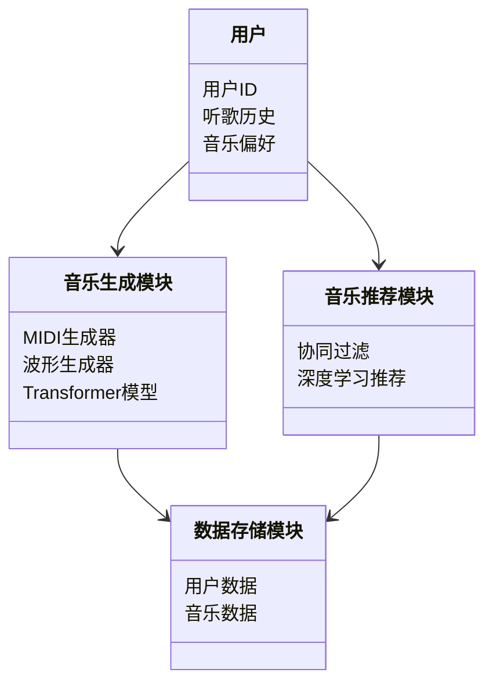
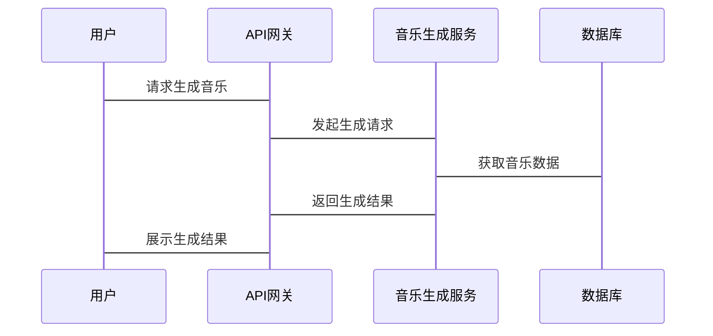

                 


# 音乐AI Agent：作曲助手与音乐推荐

> 关键词：音乐AI Agent，作曲助手，音乐推荐，生成对抗网络，Transformer模型，音乐生成算法

> 摘要：音乐AI Agent是一种结合人工智能技术的音乐助手，能够辅助音乐创作和音乐推荐。本文将从音乐AI Agent的背景与概念出发，深入探讨其核心技术与算法原理，分析其在音乐生成中的应用，并结合实际案例展示其在作曲助手与音乐推荐中的具体实现。

---

# 第1章 音乐AI Agent概述

## 1.1 音乐AI Agent的定义与背景

### 1.1.1 人工智能在音乐领域的应用现状

人工智能技术近年来在音乐领域的应用越来越广泛。从音乐生成到音乐推荐，AI技术正在改变音乐创作和消费的方式。音乐生成模型如生成对抗网络（GAN）、变奏网络（VAE）和Transformer模型等，已经在音乐领域取得了显著成果。音乐推荐系统则通过深度学习技术，为用户提供个性化音乐推荐服务。

### 1.1.2 音乐AI Agent的核心概念

音乐AI Agent是一种结合人工智能技术的音乐助手，能够理解用户的音乐需求，并通过生成音乐或推荐音乐来满足用户需求。音乐AI Agent的核心功能包括音乐生成和音乐推荐，能够帮助用户快速创作音乐，或者发现新的音乐作品。

### 1.1.3 音乐AI Agent的背景与意义

随着人工智能技术的快速发展，音乐AI Agent的出现填补了传统音乐创作和推荐中的空白。音乐创作需要较高的专业技能和灵感，而音乐推荐则需要大量的数据和算法支持。音乐AI Agent通过结合生成模型和推荐算法，为用户提供高效、个性化的音乐服务。

---

## 1.2 音乐AI Agent的功能与特点

### 1.2.1 作为作曲助手的功能

音乐AI Agent可以作为作曲助手，帮助用户生成音乐灵感、创作旋律、编排和声等。用户只需输入简单的音乐片段或风格偏好，AI即可生成符合要求的音乐作品。

### 1.2.2 作为音乐推荐系统的功能

音乐AI Agent还可以作为音乐推荐系统，基于用户的听歌历史、偏好和情感状态，推荐符合用户口味的音乐作品。推荐系统可以通过协同过滤、深度学习等技术实现。

### 1.2.3 音乐AI Agent的优势与局限性

音乐AI Agent的优势在于高效性和个性化，能够快速生成音乐并提供精准的推荐。然而，AI生成的音乐可能缺乏人类音乐家的情感表达和独特性，这是其局限性之一。

---

## 1.3 音乐AI Agent的用户与应用场景

### 1.3.1 用户群体分析

音乐AI Agent的主要用户群体包括音乐创作人、音乐爱好者、音乐教育者等。音乐创作人可以利用AI生成音乐灵感，音乐爱好者可以通过AI推荐发现新音乐，音乐教育者可以利用AI辅助教学。

### 1.3.2 音乐创作中的应用场景

在音乐创作中，音乐AI Agent可以用于生成旋律、编排和声、配器等。它可以帮助创作人快速尝试不同的音乐风格和结构，提高创作效率。

### 1.3.3 音乐推荐中的应用场景

在音乐推荐中，音乐AI Agent可以根据用户的听歌历史、情感状态和社交数据，推荐个性化音乐。例如，基于用户的听歌偏好生成推荐列表，或者根据用户的当前情绪推荐适合的音乐。

---

## 1.4 音乐AI Agent的发展现状与趋势

### 1.4.1 国内外发展现状

目前，国内外已经有许多音乐AI Agent的应用案例。例如，国外的OpenAI的Jukedeck、Amper Music，国内的网易云音乐智能推荐系统等。这些系统展示了音乐AI Agent在音乐生成和推荐中的潜力。

### 1.4.2 音乐AI Agent的技术发展趋势

未来，音乐AI Agent将更加智能化和个性化。随着大模型技术的发展，音乐生成模型将更加高效，推荐算法也将更加精准。此外，多模态音乐生成（结合图像、文本等）也将成为未来的重要研究方向。

### 1.4.3 未来潜在的应用领域

音乐AI Agent的应用领域将不仅仅限于音乐生成和推荐，还可以扩展到音乐教育、音乐治疗、音乐游戏等领域。例如，AI可以通过分析用户的情绪状态，推荐适合的音乐治疗方案。

---

## 1.5 本章小结

本章介绍了音乐AI Agent的背景、定义、功能与特点，以及其在音乐创作和推荐中的应用场景和发展趋势。音乐AI Agent作为一种新兴的技术工具，正在逐步改变音乐创作和消费的方式。

---

# 第2章 音乐生成模型概述

## 2.1 音乐生成模型的基本概念

### 2.1.1 音乐生成的定义

音乐生成是指通过计算机技术生成音乐的过程。音乐生成模型可以基于规则、概率模型或深度学习技术生成音乐。

### 2.1.2 音乐生成模型的分类

音乐生成模型可以分为基于规则的生成模型、基于概率的生成模型和基于深度学习的生成模型。其中，基于深度学习的生成模型是当前研究的热点。

### 2.1.3 音乐生成模型的核心要素

音乐生成模型的核心要素包括音乐表示、生成模型、评估指标等。音乐表示可以是 MIDI 格式、波形等，生成模型可以是GAN、VAE、Transformer等。

---

## 2.2 音乐生成模型的算法原理

### 2.2.1 基于生成对抗网络（GAN）的音乐生成

生成对抗网络（GAN）是一种深度学习模型，由生成器和判别器组成。生成器的目标是生成逼真的音乐，判别器的目标是区分生成音乐和真实音乐。通过交替训练生成器和判别器，GAN可以生成高质量的音乐。

### 2.2.2 基于变奏网络（VAE）的音乐生成

变奏网络（VAE）是一种基于概率建模的生成模型。VAE通过学习数据的分布，生成多样化的音乐。与GAN相比，VAE的生成过程更加稳定，但生成质量可能稍逊。

### 2.2.3 基于Transformer模型的音乐生成

Transformer模型是一种基于注意力机制的深度学习模型。在音乐生成中，Transformer可以通过序列建模生成音乐。与RNN模型相比，Transformer的并行计算能力更强，生成速度更快。

---

## 2.3 音乐生成模型的优缺点分析

### 2.3.1 各种模型的优缺点对比

| 模型 | 优点 | 缺点 |
|------|------|------|
| GAN  | 生成质量高，多样化 | 训练不稳定，容易模式坍缩 |
| VAE  | 生成稳定，多样化 | 生成质量可能较低 |
| Transformer | 并行计算能力强，生成速度快 | 注意力机制复杂，训练资源需求大 |

### 2.3.2 音乐生成模型的性能评估指标

音乐生成模型的性能可以从生成质量、多样性、流畅性等方面进行评估。常用的评估指标包括困惑度（Perplexity）、Inception Score、FID等。

### 2.3.3 模型的可解释性与创造性

音乐生成模型的可解释性较差，特别是基于深度学习的模型。然而，其创造性是其最大的优势，可以通过参数调整生成多样化的音乐。

---

## 2.4 本章小结

本章介绍了音乐生成模型的基本概念、分类和各种模型的算法原理。通过对GAN、VAE和Transformer模型的优缺点分析，读者可以更好地理解音乐生成模型的选择和应用。

---

# 第3章 基于Transformer的音乐生成算法

## 3.1 Transformer模型的基本原理

### 3.1.1 Transformer的结构与工作机制

Transformer模型由编码器和解码器组成，编码器负责将输入序列编码为一个向量，解码器负责将编码向量解码为输出序列。注意力机制是其核心，可以计算输入序列中每个位置的重要性。

### 3.1.2 注意力机制的核心概念

注意力机制通过计算输入序列中每个位置的权重，生成加权和。权重反映了每个位置对当前输出的重要性。注意力机制可以分为自注意力和交叉注意力。

### 3.1.3 多头注意力机制的实现原理

多头注意力机制通过将查询分成多个子查询，并分别计算注意力权重，最终将多个子查询的结果进行拼接，生成最终的输出。

---

## 3.2 音乐生成中的Transformer模型

### 3.2.1 音乐生成的序列建模

音乐生成可以看作是一个序列生成问题。Transformer模型通过序列建模生成音乐，可以处理长序列问题。

### 3.2.2 基于Transformer的音乐生成流程

基于Transformer的音乐生成流程包括输入序列、编码器编码、解码器解码、生成输出序列。生成的音乐可以是 MIDI 数据或波形数据。

### 3.2.3 Transformer在音乐生成中的优势

Transformer模型的并行计算能力和长序列建模能力使其在音乐生成中具有优势。此外，多头注意力机制可以捕捉音乐中的复杂关系。

---

## 3.3 音乐生成的数学模型与公式

### 3.3.1 Transformer的数学模型

$$
\text{注意力机制} = \frac{QK^T}{\sqrt{d_k}}
$$

其中，$Q$ 是查询矩阵，$K$ 是键矩阵，$d_k$ 是键的维度。

### 3.3.2 注意力机制的公式推导

$$
\text{权重} = \frac{e^{qk}}{\sum_{i} e^{qk_i}}
$$

其中，$q$ 和 $k$ 分别是查询和键。

### 3.3.3 音乐生成的流程公式

音乐生成的流程可以用以下公式表示：

$$
X = \text{编码器}(\text{输入序列})
$$

$$
Y = \text{解码器}(X, \text{输出序列})
$$

---

## 3.4 本章小结

本章详细介绍了基于Transformer的音乐生成算法，包括其基本原理、实现流程和数学模型。通过公式推导和流程图的展示，读者可以更好地理解Transformer模型在音乐生成中的应用。

---

# 第4章 音乐AI Agent的系统分析与架构设计

## 4.1 问题场景介绍

音乐AI Agent需要同时具备音乐生成和音乐推荐的功能，需要设计一个高效的系统架构来支持这两种功能。

### 4.1.1 系统功能需求

系统需要实现音乐生成和音乐推荐两大功能。音乐生成功能包括输入音乐片段、生成音乐、输出音乐结果；音乐推荐功能包括用户偏好分析、推荐列表生成、推荐结果展示。

### 4.1.2 项目介绍

本项目旨在开发一个基于Transformer的音乐生成系统，并结合推荐算法实现音乐推荐功能。系统采用模块化设计，各模块之间通过接口进行通信。

---

## 4.2 系统功能设计

### 4.2.1 领域模型（Mermaid 类图）



### 4.2.2 系统架构设计（Mermaid 架构图）


### 4.2.3 系统交互设计（Mermaid 序列图）



---

## 4.3 系统实现细节

### 4.3.1 系统接口设计

音乐生成模块和音乐推荐模块需要通过API接口进行通信。接口设计需要考虑数据格式、请求方式和返回格式。

### 4.3.2 系统实现的代码结构

音乐AI Agent系统的代码结构如下：

```plaintext
music_ai_agent/
    music_generator/
        models/
            transformer.py
            ggan.py
            vae.py
        utils/
            midi_utils.py
            waveform_utils.py
    music_recommender/
        recommenders/
            collaborative_filtering.py
            deep_recommendation.py
        data/
            user_data.csv
            music_data.csv
    main.py
```

---

## 4.4 本章小结

本章详细分析了音乐AI Agent的系统架构设计，包括领域模型、系统架构和系统交互设计。通过Mermaid图的展示，读者可以清晰地理解系统的各个模块及其关系。

---

# 第5章 项目实战：基于Transformer的音乐生成系统

## 5.1 环境安装

开发基于Transformer的音乐生成系统需要安装以下环境：

- Python 3.8+
- PyTorch 1.9+
- MIDI处理库（如mido）
- 音乐生成库（如pytorch-transformer）

安装命令如下：

```bash
pip install torch==1.9
pip install mido
pip install git+https://github.com/ZhenyueMeng/pytorch-transformer.git
```

---

## 5.2 系统核心实现源代码

### 5.2.1 Transformer模型的实现

```python
import torch
import torch.nn as nn
import torch.nn.functional as F

class Transformer(nn.Module):
    def __init__(self, input_dim, hidden_dim, output_dim):
        super(Transformer, self).__init__()
        self.encoder = nn.Linear(input_dim, hidden_dim)
        self.decoder = nn.Linear(hidden_dim, output_dim)
        self.dropout = nn.Dropout(0.1)
        self.self_attn = MultiHeadAttention(hidden_dim, num_heads=8)

    def forward(self, x):
        x = self.encoder(x)
        x = self.self_attn(x, x, x)
        x = self.decoder(x)
        return x

class MultiHeadAttention(nn.Module):
    def __init__(self, hidden_dim, num_heads):
        super(MultiHeadAttention, self).__init__()
        self.num_heads = num_heads
        self.head_dim = hidden_dim // num_heads
        self.WQ = nn.Linear(hidden_dim, hidden_dim)
        self.WK = nn.Linear(hidden_dim, hidden_dim)
        self.WV = nn.Linear(hidden_dim, hidden_dim)

    def forward(self, x, mask=None):
        batch_size, seq_len, _ = x.size()
        x = x.view(batch_size, seq_len, self.num_heads, self.head_dim)
        Q = self.WQ(x).permute(0, 2, 1, 3)
        K = self.WK(x).permute(0, 2, 1, 3)
        V = self.WV(x).permute(0, 2, 1, 3)
        attention = (Q @ K.transpose(-2, -1)) / (self.head_dim ** 0.5)
        if mask is not None:
            attention = attention.masked_fill(mask == 0, -float('inf'))
            attention = F.softmax(attention, dim=-1)
        output = (attention @ V).permute(0, 2, 1, 3)
        output = output.contiguous().view(batch_size, seq_len, self.num_heads * self.head_dim)
        return output
```

### 5.2.2 音乐生成的代码实现

```python
import torch
import torch.nn as nn
import torch.optim as optim
import mido

class MusicGenerator:
    def __init__(self, model):
        self.model = model

    def generate_music(self, input_sequence, max_length=100):
        with torch.no_grad():
            output = self.model(input_sequence)
            return output

# 示例用法
transformer = Transformer(input_dim=88, hidden_dim=512, output_dim=88)
optimizer = optim.Adam(transformer.parameters(), lr=0.001)
criterion = nn.CrossEntropyLoss()

# 训练过程
for epoch in range(10):
    for batch in data_loader:
        optimizer.zero_grad()
        input_seq, target_seq = batch
        output = transformer(input_seq)
        loss = criterion(output, target_seq)
        loss.backward()
        optimizer.step()
```

---

## 5.3 代码应用解读与分析

### 5.3.1 代码功能分析

上述代码实现了基于Transformer的音乐生成模型。模型包括编码器和解码器，编码器负责将输入序列编码，解码器负责将编码向量解码为输出序列。多头注意力机制用于捕捉音乐中的复杂关系。

### 5.3.2 代码实现细节

代码中定义了Transformer模型和多头注意力机制，使用了PyTorch框架。音乐生成过程包括输入序列、编码、注意力计算和解码。

---

## 5.4 实际案例分析

### 5.4.1 音乐生成案例

假设输入一个简单的 MIDI 序列，模型可以生成一段旋律。生成的音乐可以通过 MIDI 文件播放。

### 5.4.2 音乐推荐案例

基于用户的听歌历史，音乐推荐系统可以推荐相似风格的音乐。例如，如果用户喜欢古典音乐，系统可以推荐贝多芬的交响乐。

---

## 5.5 本章小结

本章通过实际案例展示了基于Transformer的音乐生成系统的实现过程。通过代码分析和案例解读，读者可以更好地理解音乐AI Agent的实现细节。

---

# 第6章 总结与展望

## 6.1 本章总结

音乐AI Agent是一种结合人工智能技术的音乐助手，能够辅助音乐创作和音乐推荐。通过基于Transformer的音乐生成算法和推荐算法，音乐AI Agent可以高效地生成音乐并推荐个性化音乐。

## 6.2 未来展望

未来，音乐AI Agent将更加智能化和个性化。随着大模型技术的发展，音乐生成模型将更加高效，推荐算法也将更加精准。此外，多模态音乐生成和实时协作创作也将成为重要的研究方向。

---

# 附录

## 附录A: 最佳实践 tips

1. 在音乐生成中，建议使用高质量的音乐数据进行训练。
2. 音乐推荐系统需要考虑用户的听歌历史和情感状态。
3. 音乐生成模型的超参数需要根据具体任务进行调整。

## 附录B: 参考文献

1. Vaswani, A., et al. "Attention Is All You Need." arXiv Preprint arXiv:1706.03798, 2017.
2. Goodfellow, I., et al. "Generative adversarial nets." Advances in neural information processing systems, 1994.

---

通过以上目录结构，您可以逐步展开每个章节的内容，深入探讨音乐AI Agent的实现细节和应用。

