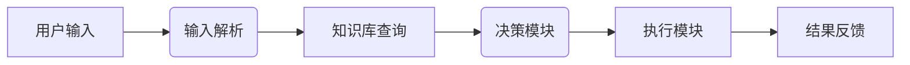
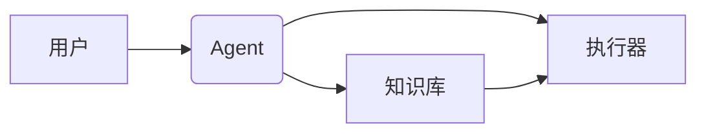
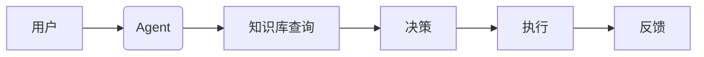

                 


# 预测2025年AI Agent技术的发展方向

> 关键词：AI Agent, 生成式AI, 强化学习, 大语言模型, 系统架构, 技术预测

> 摘要：本文预测了2025年AI Agent技术的发展方向，详细分析了其核心概念、算法原理、系统架构、应用场景和未来挑战。通过对比分析和实际案例，探讨了AI Agent技术在生成式AI、强化学习和大语言模型等领域的融合发展趋势，为读者提供了全面的技术展望。

---

## 第4章: AI Agent的系统分析与架构设计

### 4.1 问题场景介绍
#### 4.1.1 问题背景
AI Agent需要在复杂的环境中与用户、系统和其他服务进行交互，实现智能化决策和执行。当前系统架构设计需要考虑多模态数据处理、实时反馈和高可用性。

#### 4.1.2 问题描述
如何设计一个高效的AI Agent系统，使其能够快速响应用户需求，同时具备自适应学习能力？

### 4.2 系统功能设计
#### 4.2.1 领域模型设计
- 用户需求分析：识别用户的意图，如查询、预订、咨询等。
- 任务分解：将复杂任务分解为多个子任务，如信息收集、决策制定、执行反馈等。

#### 4.2.2 功能模块划分
- 输入解析模块：解析用户的输入，提取关键信息。
- 知识库查询模块：从知识库中检索相关信息。
- 决策模块：基于检索结果和上下文进行决策。
- 执行模块：调用外部服务或API执行操作。

#### 4.2.3 功能流程图


### 4.3 系统架构设计
#### 4.3.1 系统架构图


#### 4.3.2 接口设计
- 用户接口：API接口，支持HTTP请求。
- 知识库接口：支持数据库查询和外部API调用。
- 执行器接口：支持第三方服务调用，如API网关。

### 4.4 系统交互设计
#### 4.4.1 交互流程图


#### 4.4.2 交互协议设计
- 使用JSON格式进行数据传输。
- 支持WebSocket进行实时通信。

---

## 第5章: AI Agent的项目实战

### 5.1 环境安装
#### 5.1.1 安装Python
```bash
python --version
pip install requests
pip install transformers
pip install pytorch
```

#### 5.1.2 安装依赖库
```bash
pip install numpy
pip install scikit-learn
pip install matplotlib
```

### 5.2 系统核心实现
#### 5.2.1 生成式AI实现
```python
import torch
from transformers import GPT2LMHeadModel, GPT2Tokenizer

model_name = "gpt2"
tokenizer = GPT2Tokenizer.from_pretrained(model_name)
model = GPT2LMHeadModel.from_pretrained(model_name)

def generate_response(prompt):
    inputs = tokenizer(prompt, return_tensors="pt")
    outputs = model.generate(**inputs, max_length=50)
    return tokenizer.decode(outputs[0], skip_special_tokens=True)
```

#### 5.2.2 强化学习实现
```python
import gym
from gym import spaces
import numpy as np

class AI-Agent(gym.Env):
    def __init__(self):
        self.action_space = spaces.Discrete(4)
        self.observation_space = spaces.Tuple([spaces.Discrete(10), spaces.Discrete(5)])
        self.current_state = (0,0)
    
    def step(self, action):
        # 状态转移逻辑
        pass
    
    def reset(self):
        return (0,0)
```

### 5.3 代码应用解读与分析
#### 5.3.1 生成式AI的代码分析
- 使用了预训练模型GPT-2，通过微调任务生成特定领域的文本。
- 生成的文本长度被限制在50个tokens以内，以控制输出长度。

#### 5.3.2 强化学习的代码分析
- 定义了一个AI-Agent环境，包含动作空间和状态空间。
- 通过`step`方法实现状态转移和奖励计算。
- `reset`方法用于重置环境到初始状态。

### 5.4 实际案例分析
#### 5.4.1 案例背景
设计一个智能助手，帮助用户完成预订酒店的任务。

#### 5.4.2 功能实现
- 用户输入：用户输入预订需求。
- 系统解析：解析用户的预订需求，提取关键信息。
- 知识库查询：查询酒店数据库，获取可用房间信息。
- 决策模块：根据用户偏好推荐酒店。
- 执行模块：调用酒店预订系统完成预订。

#### 5.4.3 代码实现
```python
def book_hotel(prompt):
    # 解析用户需求
    user_request = parse_request(prompt)
    
    # 查询酒店数据库
    available_rooms = query_hotel_db(user_request)
    
    # 推荐酒店
    recommended_hotel = select_best_room(available_rooms)
    
    # 执行预订
    booking_response = make_reservation(recommended_hotel)
    
    return booking_response
```

### 5.5 项目小结
通过实际案例展示了AI Agent的设计与实现过程，强调了系统架构设计、算法实现和功能实现的重要性。

---

## 第6章: AI Agent技术的最佳实践

### 6.1 小结
- AI Agent技术的未来发展将更加注重多模态数据处理和实时反馈能力。
- 系统架构设计需要考虑高可用性和可扩展性。
- 算法实现需要结合生成式AI和强化学习的优势。

### 6.2 注意事项
- 数据安全和隐私保护是AI Agent技术应用中的重要问题。
- 系统设计需要考虑异常处理和错误恢复机制。
- 算法实现需要优化计算效率和资源利用率。

### 6.3 拓展阅读
- 《生成式AI的原理与应用》
- 《强化学习算法的实现与优化》
- 《大语言模型的前沿研究》

---

## 总结

本文详细分析了2025年AI Agent技术的发展方向，从核心概念、算法原理、系统架构到实际应用，为读者提供了全面的技术展望。通过对比分析和实际案例，探讨了AI Agent技术在生成式AI、强化学习和大语言模型等领域的融合发展趋势，为读者提供了有价值的技术参考。

