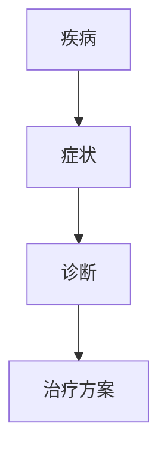
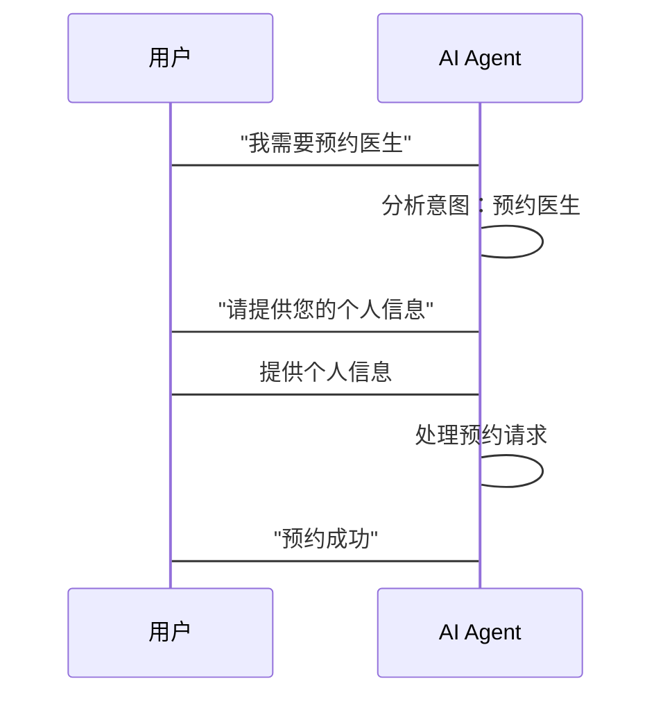
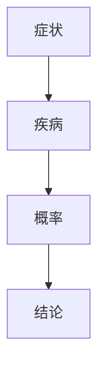
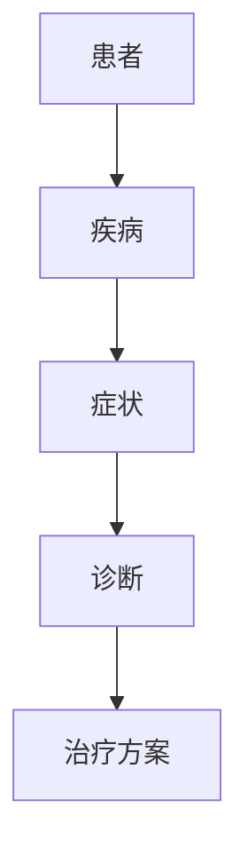
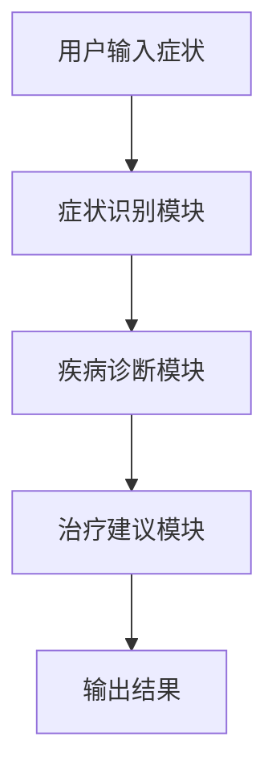
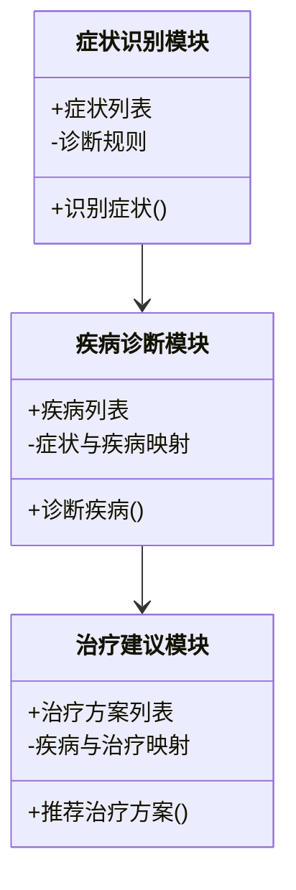
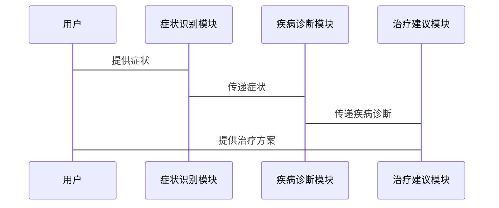

                 


# 领域特定AI Agent的开发策略

## 关键词：领域特定AI Agent，AI Agent，知识表示，意图理解，对话管理，推理算法，系统架构，项目实战

## 摘要：  
本文详细探讨了领域特定AI Agent的开发策略，从核心概念到算法原理，从系统架构到项目实战，全面解析如何构建高效、准确的领域特定AI Agent。文章首先介绍了领域特定AI Agent的背景与核心概念，随后深入分析了其算法原理，包括基于规则的推理、概率推理和强化学习。接着，文章详细阐述了系统架构设计，包括功能设计、架构图、接口设计和交互流程。最后，通过项目实战部分，展示了如何在具体领域中开发AI Agent，并总结了最佳实践和注意事项。本文旨在为开发者提供系统化的开发指导，帮助他们高效地构建领域特定AI Agent。

---

# 第一部分: 领域特定AI Agent开发背景与核心概念

## 第1章: 领域特定AI Agent概述

### 1.1 问题背景

#### 1.1.1 传统AI Agent的局限性  
传统AI Agent（通用AI Agent）在处理复杂任务时，往往缺乏对特定领域知识的深度理解和应用能力。例如，在医疗领域，通用AI Agent可能无法准确理解医学术语或诊断流程，导致其在实际应用中效果不佳。此外，通用AI Agent通常需要处理多种任务，导致其在单一任务上的性能受限。

#### 1.1.2 领域特定AI Agent的提出  
为了解决上述问题，领域特定AI Agent应运而生。领域特定AI Agent专注于特定领域（如医疗、金融、教育等），通过深度理解和应用领域知识，提升任务处理的准确性和效率。

#### 1.1.3 领域特定AI Agent的应用价值  
领域特定AI Agent在多个领域展现出巨大的应用价值，例如在医疗领域辅助医生进行诊断，在金融领域帮助用户进行投资决策，在教育领域为学生提供个性化学习建议。其核心价值在于通过领域知识的深度应用，提高任务处理的效率和准确性。

### 1.2 核心概念与定义

#### 1.2.1 领域特定AI Agent的定义  
领域特定AI Agent是一种专注于特定领域知识和任务的智能代理，能够通过领域知识的深度理解和应用，实现高效、准确的任务处理。

#### 1.2.2 领域特定AI Agent与通用AI Agent的区别  
| **对比维度** | **领域特定AI Agent** | **通用AI Agent** |
|--------------|----------------------|-------------------|
| 知识深度     | 深度聚焦特定领域     | 广泛但浅层       |
| 任务专注性   | 高度专注特定任务     | 多任务处理       |
| 性能         | 高效且准确           | 较低效率         |

#### 1.2.3 领域特定AI Agent的核心要素  
1. **领域知识库**：存储特定领域的知识，包括术语、规则、流程等。  
2. **意图理解模块**：识别用户的意图并生成相应的响应。  
3. **推理与决策模块**：基于领域知识进行推理和决策。  
4. **对话管理模块**：管理与用户的对话流程。  

### 1.3 领域特定AI Agent的特点与优势

#### 1.3.1 领域知识的深度应用  
领域特定AI Agent通过深度应用领域知识，能够更好地理解用户需求并提供准确的解决方案。

#### 1.3.2 任务专注性  
领域特定AI Agent专注于特定任务，能够更高效地完成目标。

#### 1.3.3 高效性与准确性  
通过领域知识的深度应用，领域特定AI Agent能够在特定任务中实现高效性和准确性。

### 1.4 领域特定AI Agent的应用场景

#### 1.4.1 医疗领域  
在医疗领域，领域特定AI Agent可以辅助医生进行诊断、提供治疗建议等。

#### 1.4.2 金融领域  
在金融领域，领域特定AI Agent可以为用户提供投资建议、风险评估等服务。

#### 1.4.3 教育领域  
在教育领域，领域特定AI Agent可以为学生提供个性化学习建议、解答学习问题等。

#### 1.4.4 其他领域  
领域特定AI Agent还可以应用于法律、交通、制造等领域。

### 1.5 本章小结  
本章介绍了领域特定AI Agent的背景、核心概念、特点与优势，以及其在多个领域的应用场景。通过这些内容，读者可以对领域特定AI Agent有一个全面的了解。

---

## 第2章: 领域特定AI Agent的核心概念与联系

### 2.1 领域模型与知识表示

#### 2.1.1 领域模型的构建  
领域模型的构建是领域特定AI Agent的核心任务之一。通过构建领域模型，可以将领域知识结构化，便于后续的推理和决策。

#### 2.1.2 知识表示方法  
知识表示方法包括规则表示、图表示、本体表示等。例如，使用图表示法可以将领域知识表示为节点和边的组合。

#### 2.1.3 领域知识图谱  
领域知识图谱是一种将领域知识结构化的图数据库，能够帮助AI Agent更好地理解领域知识。

#### 2.1.4  MERmaid图示例  


### 2.2 意图理解与对话管理

#### 2.2.1 意图理解的定义  
意图理解是指通过分析用户输入，识别用户的意图。例如，用户输入“我需要预约医生”时，意图是“预约医生”。

#### 2.2.2 对话管理的流程  
对话管理的流程包括意图识别、状态跟踪、响应生成等步骤。

#### 2.2.3 领域特定对话策略  
领域特定对话策略是指在特定领域中，AI Agent如何根据用户意图生成相应的响应。

#### 2.2.4 对话流程示例  


### 2.3 领域推理与决策

#### 2.3.1 领域推理的定义  
领域推理是指在特定领域中，基于已知知识进行推断的过程。例如，在医疗领域，AI Agent可以根据患者的症状推断可能的疾病。

#### 2.3.2 基于规则的推理  
基于规则的推理是一种简单的推理方法，通过预定义的规则进行推理。例如，规则可以是“如果症状是咳嗽且发烧，则可能的疾病是感冒”。

#### 2.3.3 基于概率的推理  
基于概率的推理是一种更复杂的推理方法，通过计算概率进行推理。例如，使用贝叶斯网络进行推理。

#### 2.3.4 推理流程示例  


### 2.4 核心概念对比表

#### 2.4.1 领域模型与通用模型对比  
| **对比维度** | **领域模型** | **通用模型** |
|--------------|---------------|---------------|
| 知识深度     | 深度聚焦特定领域 | 广泛但浅层     |
| 任务专注性   | 高度专注特定任务 | 多任务处理     |
| 性能         | 高效且准确     | 较低效率       |

#### 2.4.2 意图理解与任务理解对比  
| **对比维度** | **意图理解** | **任务理解** |
|--------------|---------------|---------------|
| 理解对象     | 用户意图       | 用户任务       |
| 输出结果     | 意图类别       | 任务目标       |

#### 2.4.3 领域推理与全局推理对比  
| **对比维度** | **领域推理** | **全局推理** |
|--------------|---------------|---------------|
| 推理范围     | 特定领域       | 全局范围       |
| 知识依赖     | 领域知识       | 全局知识       |

### 2.5 ER实体关系图  


---

## 第3章: 领域特定AI Agent的算法原理

### 3.1 基于规则的推理算法

#### 3.1.1 规则定义  
基于规则的推理算法通过预定义的规则进行推理。例如，规则可以是“如果症状是咳嗽且发烧，则可能的疾病是感冒”。

#### 3.1.2 规则匹配  
规则匹配是指将用户输入与预定义的规则进行匹配，找出符合规则的意图或结果。

#### 3.1.3 结果输出  
根据匹配的规则，生成相应的结果输出。

#### 3.1.4 示例代码  
```python
# 规则定义
rules = {
    "咳嗽且发烧": "感冒",
    "胸痛且出汗": "心脏病"
}

# 规则匹配
def match_rule(symptoms):
    for rule, disease in rules.items():
        if all(s in symptoms for s in rule.split("且")):
            return disease
    return None

# 示例输入
symptoms = ["咳嗽", "发烧"]
result = match_rule(symptoms)
print(result)  # 输出：感冒
```

### 3.2 基于概率的推理算法

#### 3.2.1 贝叶斯网络  
贝叶斯网络是一种概率推理算法，通过计算概率来推断结果。

#### 3.2.2 条件概率公式  
条件概率公式：  
$$P(A|B) = \frac{P(B|A) \cdot P(A)}{P(B)}$$

#### 3.2.3 推理过程  
通过贝叶斯网络进行推理，计算各个可能结果的概率，选择概率最高的结果作为最终结论。

#### 3.2.4 示例代码  
```python
# 贝叶斯网络示例
from sklearn.naive_bayes import MultinomialNB

# 训练数据
X_train = [
    [1, 0],  # 咳嗽，发烧
    [0, 1],  # 胸痛，出汗
    [1, 0],  # 咳嗽，发烧
    [0, 1]   # 胸痛，出汗
]
y_train = ['感冒', '心脏病', '感冒', '心脏病']

# 模型训练
model = MultinomialNB()
model.fit(X_train, y_train)

# 预测示例
X_test = [1, 0]  # 咳嗽，发烧
y_pred = model.predict([X_test])
print(y_pred)  # 输出：['感冒']
```

### 3.3 基于强化学习的决策算法

#### 3.3.1 状态空间定义  
状态空间是指所有可能的状态集合。例如，在医疗领域，状态可以是患者的症状、诊断结果等。

#### 3.3.2 动作选择  
动作选择是指在给定状态下，选择一个动作（如诊断、治疗等）。

#### 3.3.3 奖励机制  
奖励机制是指根据动作的结果，给予相应的奖励或惩罚。

#### 3.3.4 示例代码  
```python
# 强化学习示例（简化）
import numpy as np

# 状态空间
states = ['咳嗽', '发烧', '胸痛', '出汗']
# 动作空间
actions = ['诊断', '治疗']

# 奖励机制
rewards = {
    ('咳嗽', '诊断'): 1,
    ('发烧', '治疗'): 1,
    ('胸痛', '诊断'): -1,
    ('出汗', '治疗'): -1
}

# 动作选择
def choose_action(state):
    if state == '咳嗽':
        return '诊断'
    elif state == '发烧':
        return '治疗'
    else:
        return np.random.choice(actions)

# 示例输入
state = '咳嗽'
action = choose_action(state)
print(action)  # 输出：诊断
```

---

## 第4章: 领域特定AI Agent的系统架构设计

### 4.1 问题场景介绍

#### 4.1.1 问题描述  
在医疗领域，医生需要快速诊断患者的症状。然而，医生的时间有限，无法逐一分析所有可能的疾病。通过构建一个医疗领域的AI Agent，可以帮助医生快速诊断患者的症状。

#### 4.1.2 问题解决  
通过构建医疗领域的AI Agent，可以快速识别患者的症状，并提供可能的疾病诊断。

#### 4.1.3 边界与外延  
AI Agent的边界包括症状识别、疾病诊断等，外延包括治疗建议、药物推荐等。

### 4.2 项目介绍

#### 4.2.1 项目目标  
构建一个医疗领域的AI Agent，能够根据患者的症状快速诊断疾病。

#### 4.2.2 项目范围  
项目范围包括症状识别、疾病诊断、治疗建议等。

### 4.3 系统功能设计

#### 4.3.1 功能模块  
1. **症状识别模块**：识别患者的症状。  
2. **疾病诊断模块**：根据症状诊断疾病。  
3. **治疗建议模块**：提供治疗建议。  

#### 4.3.2 功能流程  
1. 用户输入症状。  
2. 系统识别症状。  
3. 系统诊断疾病。  
4. 系统提供治疗建议。  

#### 4.3.3 功能流程图  


### 4.4 系统架构设计

#### 4.4.1 系统架构图  


### 4.5 系统接口设计

#### 4.5.1 接口定义  
1. **识别症状接口**：输入症状列表，输出识别结果。  
2. **诊断疾病接口**：输入症状列表，输出疾病诊断结果。  
3. **推荐治疗方案接口**：输入疾病诊断结果，输出治疗方案。  

#### 4.5.2 接口调用示例  
```python
# 接口定义
def recognize_symptoms(symptoms):
    # 识别症状
    return recognized_symptoms

def diagnose_disease(symptoms):
    # 诊断疾病
    return disease

def recommend_treatment(disease):
    # 推荐治疗方案
    return treatment

# 示例输入
symptoms = ["咳嗽", "发烧"]
recognized_symptoms = recognize_symptoms(symptoms)
disease = diagnose_disease(recognized_symptoms)
treatment = recommend_treatment(disease)
print(treatment)  # 输出：治疗方案
```

### 4.6 系统交互流程

#### 4.6.1 交互流程图  


---

## 第5章: 领域特定AI Agent的项目实战

### 5.1 环境安装

#### 5.1.1 开发环境  
- 操作系统：Windows/MacOS/Linux  
- 编程语言：Python 3.8+  
- 开发工具：PyCharm/VS Code  

#### 5.1.2 依赖库安装  
安装必要的依赖库，例如：  
```bash
pip install numpy scikit-learn
```

### 5.2 系统核心实现

#### 5.2.1 症状识别模块实现  
```python
def recognize_symptoms(symptoms):
    # 简单的实现：直接返回输入的症状
    return symptoms
```

#### 5.2.2 疾病诊断模块实现  
```python
from sklearn.naive_bayes import MultinomialNB

def diagnose_disease(symptoms):
    # 示例模型：基于贝叶斯分类器
    X_train = [
        [1, 0],  # 咳嗽，发烧
        [0, 1],  # 胸痛，出汗
        [1, 0],  # 咳嗽，发烧
        [0, 1]   # 胸痛，出汗
    ]
    y_train = ['感冒', '心脏病', '感冒', '心脏病']
    model = MultinomialNB()
    model.fit(X_train, y_train)
    X_test = [1 if s in symptoms else 0 for s in ['咳嗽', '发烧', '胸痛', '出汗']]
    y_pred = model.predict([X_test])
    return y_pred[0]
```

#### 5.2.3 治疗建议模块实现  
```python
def recommend_treatment(disease):
    # 示例治疗建议
    treatment_map = {
        '感冒': '多休息，多喝水',
        '心脏病': '立即就医'
    }
    return treatment_map.get(disease, '无具体治疗建议')
```

### 5.3 代码应用解读与分析

#### 5.3.1 症状识别模块解读  
症状识别模块的作用是接收用户的症状输入，并将其转换为系统可以处理的形式。

#### 5.3.2 疾病诊断模块解读  
疾病诊断模块使用贝叶斯分类器进行疾病诊断，基于训练数据进行模型训练，并对输入症状进行分类。

#### 5.3.3 治疗建议模块解读  
治疗建议模块根据诊断结果，提供相应的治疗建议。

### 5.4 实际案例分析

#### 5.4.1 案例描述  
患者症状：咳嗽、发烧。  

#### 5.4.2 分析过程  
1. 症状识别模块接收输入“咳嗽”、“发烧”。  
2. 疾病诊断模块诊断疾病为“感冒”。  
3. 治疗建议模块推荐治疗方案“多休息，多喝水”。  

#### 5.4.3 输出结果  
治疗方案：多休息，多喝水。

### 5.5 项目总结

#### 5.5.1 项目成果  
成功构建了一个医疗领域的AI Agent，能够根据患者的症状快速诊断疾病并提供治疗建议。

#### 5.5.2 经验总结  
1. 领域知识的深度应用是关键。  
2. 算法选择需要根据具体任务进行调整。  
3. 系统架构设计需要充分考虑模块之间的交互与协作。

---

## 第6章: 最佳实践与注意事项

### 6.1 小结

#### 6.1.1 核心知识点回顾  
- 领域特定AI Agent的核心概念与联系  
- 基于规则的推理、概率推理和强化学习的算法原理  
- 系统架构设计与实现  

#### 6.1.2 项目实战总结  
通过项目实战，我们成功构建了一个医疗领域的AI Agent，验证了领域特定AI Agent的开发策略的有效性。

### 6.2 注意事项

#### 6.2.1 知识表示的准确性  
领域知识的表示需要准确，否则会影响推理和决策的准确性。

#### 6.2.2 算法选择的合理性  
算法选择需要根据具体任务进行调整，不能一味追求复杂算法。

#### 6.2.3 系统架构的可扩展性  
系统架构设计需要考虑模块的可扩展性，方便后续功能的扩展和优化。

### 6.3 拓展阅读

#### 6.3.1 推荐书籍  
1. 《模式识别与机器学习》  
2. 《自然语言处理实战》  

#### 6.3.2 推荐博客  
1. [AI Agent开发博客](https://example.com)  
2. [领域知识图谱构建博客](https://example.com)  

---

## 结语  
通过本文的详细讲解，读者可以系统地了解领域特定AI Agent的开发策略，从核心概念到算法原理，从系统架构到项目实战，全面掌握如何构建高效、准确的领域特定AI Agent。希望本文能够为开发者提供有价值的参考和启发，帮助他们在实际项目中更好地应用这些知识。

