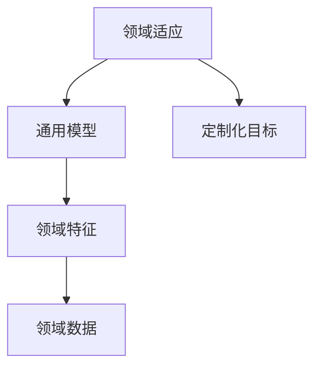
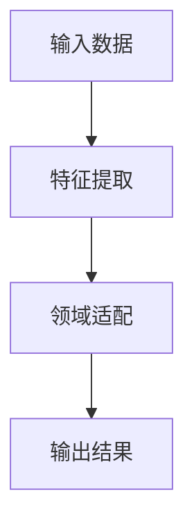
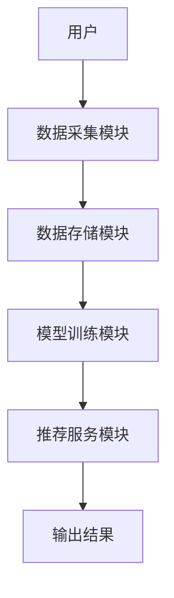
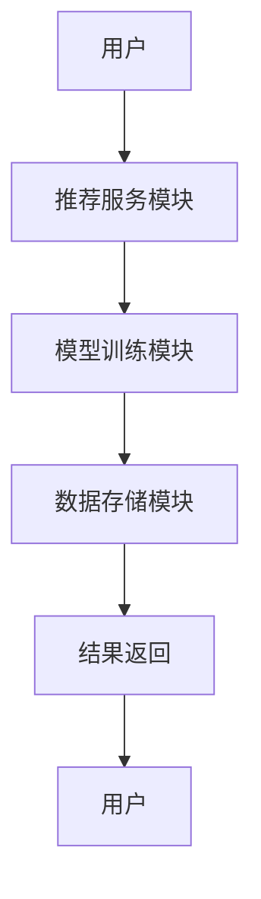

                 


# 领域适应：将通用AI Agent定制到特定场景

> 关键词：领域适应，AI Agent，定制化，机器学习，深度学习，迁移学习，数据驱动

> 摘要：在当前快速发展的技术环境中，将通用AI Agent适应到特定场景已成为提升系统性能和用户体验的关键。本文系统地探讨了领域适应的背景、核心概念、算法原理、系统架构设计以及项目实战，通过实际案例分析，提供了详细的方法论和最佳实践，帮助读者理解如何将通用AI Agent定制到特定场景。

---

## 第一章: 领域适应的背景与重要性

### 1.1 问题背景
随着AI技术的快速发展，通用AI Agent在多个领域展现出巨大潜力。然而，通用模型在特定场景下的表现往往不如定制化模型，因为它们缺乏对特定领域数据和需求的深入理解。

#### 1.1.1 通用AI Agent的局限性
- 数据依赖性：通用模型依赖于广泛的数据集，但在特定领域可能缺乏足够的代表性数据。
- 任务多样性：通用模型设计时考虑的多任务可能导致在单一任务上的性能不足。
- 领域知识缺失：通用模型可能不具备特定领域的专业常识和经验。

#### 1.1.2 领域适应的必要性
- 提高性能：通过适应特定领域，AI Agent可以在该领域实现更高的准确性和效率。
- 降低成本：定制化适应可以在模型训练阶段解决领域特定问题，减少后期维护成本。
- 适应需求：满足特定场景的个性化需求，提供更贴切的服务。

#### 1.1.3 领域适应的核心目标
- 优化模型在特定领域的表现。
- 利用领域数据提升模型效果。
- 通过领域知识增强模型的推理能力。

### 1.2 问题描述
领域适应的目标是将通用AI Agent的能力扩展到特定场景，使其能够更好地理解和解决该领域的问题。

#### 1.2.1 领域适应的定义
领域适应是将通用模型迁移到特定领域，通过调整模型参数或结构，使其在新领域中表现出色的过程。

#### 1.2.2 领域适应的关键特征
- **领域数据**：特定领域的数据用于训练或微调模型。
- **任务目标**：针对特定任务优化模型。
- **领域知识**：引入领域专家知识以增强模型能力。

#### 1.2.3 领域适应的边界与外延
- **边界**：专注于特定领域，不涉及跨领域迁移。
- **外延**：扩展到不同领域，但保持核心适应方法。

### 1.3 问题解决
#### 1.3.1 领域适应的基本方法
1. 数据增强：使用特定领域的数据进行训练。
2. 参数微调：对模型参数进行微调以适应新领域。
3. 知识注入：将领域知识融入模型。

#### 1.3.2 领域适应的核心要素
- 数据：高质量的特定领域数据。
- 模型：可适应的通用模型。
- 算法：有效的迁移学习方法。

#### 1.3.3 领域适应的实现步骤
1. 数据收集与预处理。
2. 模型选择与初始化。
3. 迁移学习算法设计。
4. 模型评估与优化。

### 1.4 本章小结
本章介绍了领域适应的背景、定义、关键特征及实现方法，为后续章节奠定了基础。

---

## 第二章: 领域适应的核心概念与联系

### 2.1 核心概念原理
领域适应的核心在于利用迁移学习，将通用模型的能力迁移到特定领域。

#### 2.1.1 领域适配的定义
领域适配是通过调整模型参数，使其在新领域中表现更好的过程。

#### 2.1.2 领域适配的关键属性
- **领域不变性**：模型在不同领域中保持一致性的能力。
- **领域适应性**：模型适应特定领域的能力。
- **领域覆盖性**：模型能处理领域内各种任务的能力。

#### 2.1.3 领域适配的核心算法
- 基于特征的适配算法：调整模型的特征表示。
- 基于参数的适配算法：调整模型的权重参数。

### 2.2 核心概念属性对比
通过对比分析，明确领域适应与其他相关概念的区别和联系。

#### 2.2.1 领域适配与迁移学习的对比
| 特性 | 领域适配 | 迁移学习 |
|------|----------|----------|
| 定义 | 调整模型以适应特定领域 | 利用已有知识学习新任务 |
| 目标 | 提高特定领域的性能 | 提高跨任务的性能 |

#### 2.2.2 领域适配与模型微调的对比
| 特性 | 领域适配 | 模型微调 |
|------|----------|----------|
| 方法 | 调整模型参数 | 仅调整部分参数 |
| 范围 | 整体参数调整 | 部分参数调整 |

#### 2.2.3 领域适配与数据增强的对比
| 特性 | 领域适配 | 数据增强 |
|------|----------|----------|
| 目标 | 适应领域 | 增加数据多样性 |
| 方法 | 调整模型 | 改造数据 |

### 2.3 ER实体关系图


### 2.4 本章小结
本章通过对比分析，明确了领域适应的核心概念及其与其他相关概念的区别，为后续章节提供了理论基础。

---

## 第三章: 领域适应的算法原理

### 3.1 算法原理概述
领域适配的核心算法包括特征对齐、参数调整等方法。

#### 3.1.1 领域适配的基本思路
- 通过特征对齐，使得源领域和目标领域的特征分布相似。
- 调整模型参数，使模型在目标领域表现更好。

#### 3.1.2 领域适配的核心算法
- **领域适配网络（AdaptNet）**：一种基于深度学习的领域适配方法。
- **对抗训练（Adversarial Training）**：通过对抗网络实现特征对齐。

#### 3.1.3 领域适配的实现步骤
1. 收集源领域和目标领域的数据。
2. 构建深度学习模型。
3. 使用对抗训练对齐特征。
4. 微调模型以适应目标领域。

### 3.2 领域适配网络
#### 3.2.1 网络结构


#### 3.2.2 损失函数
损失函数包括分类损失和对抗损失：
$$ L = L_{\text{分类}} + \lambda L_{\text{对抗}} $$

#### 3.2.3 优化策略
使用Adam优化器，设置适当的学习率和权重衰减。

### 3.3 算法流程图


### 3.4 本章小结
本章详细介绍了领域适配的核心算法及其工作原理，为实现领域适应提供了理论支持。

---

## 第四章: 系统分析与架构设计

### 4.1 问题场景介绍
以电商推荐系统为例，说明领域适应的实际应用。

#### 4.1.1 业务场景
电商推荐系统需要根据用户行为和商品属性推荐个性化商品。

#### 4.1.2 核心需求
- 提高推荐准确率。
- 快速响应用户请求。
- 处理高并发请求。

### 4.2 系统功能设计
#### 4.2.1 功能模块
- 数据采集模块：收集用户行为数据。
- 模型训练模块：训练领域适配模型。
- 推荐服务模块：提供个性化推荐。

#### 4.2.2 系统架构图


### 4.3 系统架构设计
#### 4.3.1 分层架构
- 数据层：存储原始数据。
- 模型层：实现领域适配算法。
- 服务层：提供推荐服务。

#### 4.3.2 接口设计
- 数据接口：与数据存储模块交互。
- 服务接口：与前端交互。

#### 4.3.3 交互设计


### 4.4 本章小结
本章通过系统分析与架构设计，明确了如何将领域适应应用于实际场景。

---

## 第五章: 项目实战

### 5.1 环境安装
- 安装Python和相关库（如TensorFlow、Keras）。
- 安装必要的依赖包。

### 5.2 核心代码实现
#### 5.2.1 数据预处理
```python
import pandas as pd
data = pd.read_csv('data.csv')
```

#### 5.2.2 模型构建
```python
from tensorflow.keras import layers
model = Sequential()
model.add(layers.Dense(64, activation='relu'))
model.add(layers.Dense(1, activation='sigmoid'))
```

#### 5.2.3 领域适配
```python
from tensorflow.keras import layers
adapter = ModelAdapter(model)
adapter.fit(target_data, epochs=10)
```

### 5.3 案例分析
以电商推荐系统为例，详细分析模型训练和评估过程。

#### 5.3.1 模型训练
```python
adapter.fit(target_data, epochs=10, batch_size=32)
```

#### 5.3.2 模型评估
```python
loss, accuracy = adapter.evaluate(test_data)
print(f'Loss: {loss}, Accuracy: {accuracy}')
```

### 5.4 项目小结
本章通过实际案例，详细讲解了领域适应的实现过程。

---

## 第六章: 最佳实践与总结

### 6.1 关键点总结
- 数据质量：高质量的领域数据是领域适应的基础。
- 模型选择：选择合适的模型和算法。
- 过度拟合：避免模型在特定领域过度拟合。

### 6.2 小结
领域适应是提升AI Agent性能的重要手段，通过合理的方法和工具，可以有效实现。

### 6.3 注意事项
- 数据隐私：确保数据的安全和隐私。
- 模型泛化：保持模型在不同领域的泛化能力。
- 性能监控：实时监控模型性能。

### 6.4 拓展阅读
推荐相关书籍和论文，供读者深入学习。

---

## 附录

### 附录A: 参考文献
列出文章中引用的文献和资源。

### 附录B: 工具与资源
推荐相关的工具和技术资源。

---

# 结语

通过本文的详细讲解，读者可以系统地了解如何将通用AI Agent定制到特定场景。从理论到实践，本文提供了全面的方法论和最佳实践，帮助读者在实际项目中应用领域适应技术。

--- 

如果需要进一步的详细讲解或代码示例，请随时告诉我！

