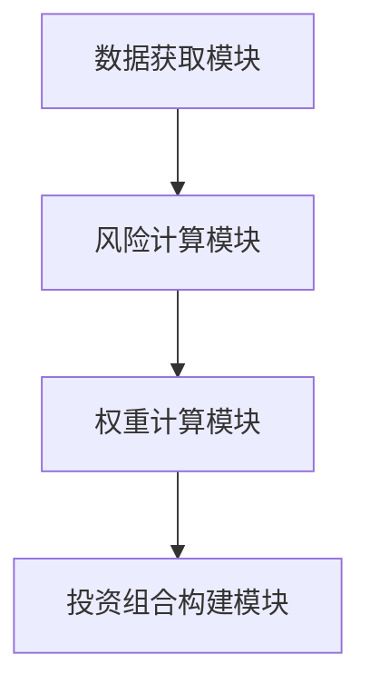
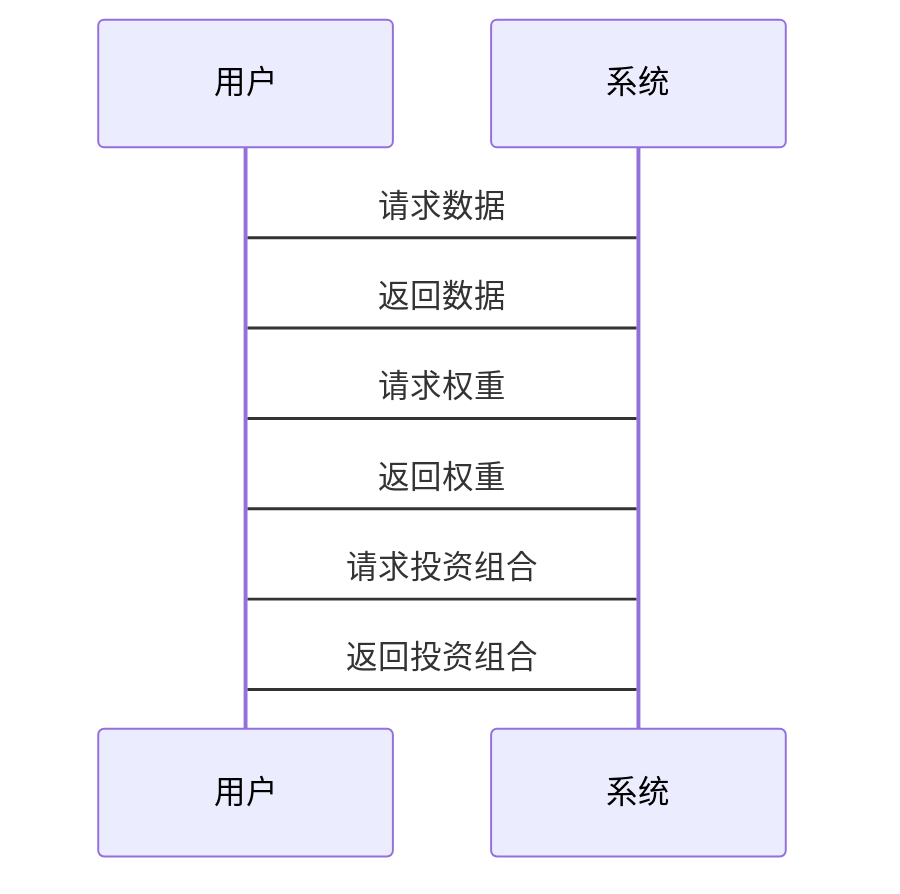

                 


# 风险平价策略：平衡不同资产类别风险

---

## 关键词：
风险平价，资产配置，投资组合优化，风险管理，数学模型

---

## 摘要：
风险平价策略是一种通过平衡不同资产类别中的风险来优化投资组合的策略。本文将详细探讨风险平价策略的背景、理论基础、数学模型、资产配置方法、系统架构设计以及实际案例分析。通过本文，读者将能够理解如何在实际投资中应用风险平价策略，从而实现风险控制和收益优化的双重目标。

---

# 第1章: 风险平价策略的背景与概念

## 1.1 风险平价策略的背景

### 1.1.1 投资学中的风险概念
在投资学中，风险通常指投资组合可能面临的损失或收益波动。风险是投资者在追求收益时必须面对的一个重要问题。传统的投资策略往往关注于收益最大化，而忽视了风险的控制。然而，随着市场的波动和经济环境的变化，风险控制的重要性日益凸显。

### 1.1.2 资产配置的重要性
资产配置是指将资金分配到不同的资产类别中，以实现收益和风险的平衡。传统的资产配置方法通常基于资产的预期收益和波动率来进行优化。然而，这种方法在实际操作中往往忽略了不同资产类别之间的相互影响，导致风险集中或不足。

### 1.1.3 风险平价策略的起源与演变
风险平价策略起源于20世纪90年代，旨在解决传统资产配置方法的不足。风险平价策略的核心思想是通过平衡不同资产类别的风险贡献来优化投资组合。这种方法能够更有效地分散风险，提高投资组合的稳定性。

---

## 1.2 风险平价策略的核心概念

### 1.2.1 风险平价的定义
风险平价是一种资产配置方法，其目标是在投资组合中平衡每种资产的风险贡献。通过这种方式，投资组合的风险来源将更加均匀，从而降低整体风险。

### 1.2.2 风险平价与传统资产配置的区别
传统的资产配置方法通常基于资产的预期收益和波动率来进行优化，而风险平价策略则更关注于风险的平衡。风险平价策略通过调整资产权重，使得每种资产的风险贡献相等。

### 1.2.3 风险平价策略的适用场景
风险平价策略适用于多种资产配置场景，尤其是在多资产投资组合中。它可以帮助投资者在不同的市场条件下保持风险的平衡，从而提高投资组合的稳定性。

---

## 1.3 风险平价策略的数学模型

### 1.3.1 风险平价的优化目标
风险平价的优化目标是最小化投资组合的整体风险，同时确保每种资产的风险贡献相等。数学表达式如下：

$$
\min_{w} \sum_{i=1}^{n} w_i^2 \sigma_i^2
$$

其中，$w_i$ 是第 $i$ 种资产的权重，$\sigma_i^2$ 是第 $i$ 种资产的波动率。

### 1.3.2 风险平价的权重计算公式
风险平价的权重计算公式如下：

$$
w_i = \frac{1}{\sqrt{\sum_{j=1}^{n} \frac{1}{\sigma_j^2}}}
$$

其中，$\sigma_j^2$ 是第 $j$ 种资产的波动率。

### 1.3.3 风险平价与投资组合的数学关系
投资组合的整体风险可以通过以下公式计算：

$$
\text{Portfolio Risk} = \sqrt{\sum_{i=1}^{n} w_i^2 \sigma_i^2}
$$

通过风险平价策略，每种资产的风险贡献相等，即：

$$
w_i \sigma_i = \text{常数}
$$

---

## 1.4 风险平价策略的优势与局限性

### 1.4.1 风险平价的优势
1. **风险分散**：风险平价策略通过平衡不同资产的风险贡献，降低了投资组合的整体风险。
2. **稳定性高**：风险平价策略能够在不同市场条件下保持投资组合的稳定性。
3. **收益优化**：通过风险平衡，风险平价策略能够在风险可控的前提下，优化投资组合的收益。

### 1.4.2 风险平价的局限性
1. **假设的简化**：风险平价策略假设资产之间的相关性是恒定的，这在实际市场中可能不成立。
2. **计算复杂**：风险平价策略的权重计算较为复杂，需要大量的数据和计算支持。
3. **市场环境影响**：风险平价策略在极端市场环境下可能表现不佳。

### 1.4.3 风险平价策略的适用性分析
风险平价策略适用于多资产投资组合，尤其是在市场环境稳定的情况下。然而，在市场波动较大或资产相关性较高的情况下，风险平价策略的效果可能受到限制。

---

## 1.5 本章小结
本章介绍了风险平价策略的背景、核心概念以及数学模型。通过风险平价策略，投资者可以在不同资产类别中平衡风险，从而优化投资组合的整体表现。

---

# 第2章: 风险平价策略的理论基础

## 2.1 现代投资组合理论（MPT）

### 2.1.1 MPT的核心思想
现代投资组合理论（MPT）由哈里·马科维茨提出，强调通过分散投资来降低风险。MPT的核心思想是通过优化资产配置来最大化收益，同时最小化风险。

### 2.1.2 马科维茨的有效前沿理论
马科维茨的有效前沿理论指出，存在一个最优的投资组合，使得在给定风险水平下，收益最大化；或者在给定收益水平下，风险最小化。

### 2.1.3 风险平价与MPT的关系
风险平价策略可以看作是MPT的一种扩展，它通过平衡不同资产的风险贡献，进一步优化了投资组合的风险和收益。

---

## 2.2 资本资产定价模型（CAPM）

### 2.2.1 CAPM的基本假设
CAPM假设市场是有效的，且投资者可以通过市场组合来分散非系统性风险。CAPM的基本公式如下：

$$
E(R_i) = R_f + \beta_i (R_m - R_f)
$$

其中，$E(R_i)$ 是第 $i$ 种资产的预期收益，$R_f$ 是无风险利率，$\beta_i$ 是第 $i$ 种资产的贝塔系数，$R_m$ 是市场预期收益。

### 2.2.2 CAPM与风险平价策略的关系
CAPM提供了资产定价的理论基础，而风险平价策略则通过平衡资产的风险贡献，优化了投资组合的风险和收益。

---

## 2.3 风险平价策略的数学推导

### 2.3.1 风险平价的优化问题
风险平价策略的优化问题可以表示为：

$$
\min_{w} \sum_{i=1}^{n} w_i^2 \sigma_i^2
$$

约束条件为：

$$
\sum_{i=1}^{n} w_i = 1
$$

### 2.3.2 风险平价的权重计算
通过求解优化问题，可以得到风险平价策略的权重：

$$
w_i = \frac{1}{\sqrt{\sum_{j=1}^{n} \frac{1}{\sigma_j^2}}}
$$

---

## 2.4 风险平价策略的实现方法

### 2.4.1 风险平价的计算步骤
1. **数据获取**：获取各资产的历史价格数据。
2. **计算波动率**：计算每种资产的波动率。
3. **权重计算**：根据波动率计算风险平价权重。
4. **投资组合构建**：根据权重构建投资组合。

### 2.4.2 风险平价的实现工具
可以使用Python中的NumPy和Pandas库来进行数据处理和计算。例如：

```python
import numpy as np
import pandas as pd

# 获取数据
data = pd.read_csv('assets.csv')

# 计算波动率
volatilities = data.std()

# 计算权重
weights = np.sqrt(1 / (volatilities ** 2).sum())
```

### 2.4.3 风险平价策略的代码实现
完整的风险平价策略代码实现如下：

```python
import numpy as np
import pandas as pd

# 获取数据
data = pd.read_csv('assets.csv')

# 计算波动率
volatilities = data.std()

# 计算权重
sum_inv_var = (1 / volatilities ** 2).sum()
weights = np.sqrt(1 / sum_inv_var)

# 构建投资组合
portfolio = data.dot(weights)
```

---

## 2.5 本章小结
本章介绍了风险平价策略的理论基础，包括现代投资组合理论和资本资产定价模型。同时，详细讲解了风险平价策略的数学推导和实现方法。

---

# 第3章: 风险平价策略的资产配置

## 3.1 资产类别的风险分析

### 3.1.1 股票的风险分析
股票的风险主要来源于市场的波动性和公司的特定风险。股票的波动率通常较高，因此在风险平价策略中需要适当降低其权重。

### 3.1.2 债券的风险分析
债券的风险主要来源于利率的波动和信用风险。相比股票，债券的波动率较低，因此在风险平价策略中可以适当提高其权重。

### 3.1.3 商品的风险分析
商品的风险主要来源于市场波动和宏观经济因素。商品的波动率通常较低，但在某些情况下可能与股票或债券相关性较高。

### 3.1.4 多资产组合的风险分析
通过分析多资产组合的风险，可以更好地理解风险平价策略在不同资产配置中的表现。

---

## 3.2 风险平价策略的资产配置

### 3.2.1 资产配置的步骤
1. **确定资产类别**：选择合适的资产类别，例如股票、债券、商品等。
2. **计算每种资产的波动率**：使用历史数据计算每种资产的波动率。
3. **计算权重**：根据波动率计算风险平价权重。
4. **构建投资组合**：根据权重构建投资组合。

### 3.2.2 风险平价策略的优势
1. **风险分散**：通过平衡不同资产的风险贡献，降低投资组合的整体风险。
2. **稳定性高**：风险平价策略能够在不同市场条件下保持投资组合的稳定性。

---

## 3.3 风险平价策略的资产配置案例

### 3.3.1 案例背景
假设我们有三种资产：股票、债券和商品。股票的波动率为15%，债券的波动率为5%，商品的波动率为8%。

### 3.3.2 权重计算
根据风险平价策略，权重计算如下：

$$
\text{权重} = \frac{1}{\sqrt{\sum_{j=1}^{n} \frac{1}{\sigma_j^2}}}
$$

计算过程如下：

1. 计算每种资产的倒数平方：

$$
\frac{1}{\sigma_{\text{股票}}^2} = \frac{1}{0.15^2} = 44.44
$$

$$
\frac{1}{\sigma_{\text{债券}}^2} = \frac{1}{0.05^2} = 400
$$

$$
\frac{1}{\sigma_{\text{商品}}^2} = \frac{1}{0.08^2} = 156.25
$$

2. 计算权重：

$$
\text{权重} = \frac{1}{\sqrt{44.44 + 400 + 156.25}} = \frac{1}{\sqrt{600.69}} \approx 0.129
$$

因此，股票、债券和商品的权重分别为：

$$
w_{\text{股票}} = \frac{0.129}{\sqrt{44.44}} \approx 0.192
$$

$$
w_{\text{债券}} = \frac{0.129}{\sqrt{400}} = 0.0645
$$

$$
w_{\text{商品}} = \frac{0.129}{\sqrt{156.25}} = 0.082
$$

---

## 3.4 本章小结
本章通过具体案例分析了风险平价策略的资产配置过程。通过平衡不同资产的风险贡献，风险平价策略能够有效降低投资组合的整体风险，提高收益稳定性。

---

# 第4章: 风险平价策略的系统架构设计

## 4.1 系统功能设计

### 4.1.1 风险平价系统的功能模块
1. **数据获取模块**：获取各资产的历史价格数据。
2. **风险计算模块**：计算每种资产的波动率。
3. **权重计算模块**：根据波动率计算风险平价权重。
4. **投资组合构建模块**：根据权重构建投资组合。

### 4.1.2 风险平价系统的功能流程
1. 数据获取模块获取历史价格数据。
2. 风险计算模块计算每种资产的波动率。
3. 权重计算模块根据波动率计算风险平价权重。
4. 投资组合构建模块根据权重构建投资组合。

---

## 4.2 系统架构设计

### 4.2.1 系统架构图


### 4.2.2 系统架构设计说明
1. 数据获取模块负责获取各资产的历史价格数据。
2. 风险计算模块计算每种资产的波动率。
3. 权重计算模块根据波动率计算风险平价权重。
4. 投资组合构建模块根据权重构建投资组合。

---

## 4.3 系统接口设计

### 4.3.1 数据接口
数据接口用于获取各资产的历史价格数据，通常通过API或数据库进行。

### 4.3.2 权重接口
权重接口用于获取每种资产的风险平价权重。

### 4.3.3 投资组合接口
投资组合接口用于获取根据风险平价权重构建的投资组合。

---

## 4.4 系统交互设计

### 4.4.1 系统交互流程图


### 4.4.2 系统交互说明
1. 用户请求数据：系统获取各资产的历史价格数据。
2. 用户请求权重：系统计算并返回风险平价权重。
3. 用户请求投资组合：系统根据权重构建投资组合并返回。

---

## 4.5 本章小结
本章详细设计了风险平价策略的系统架构，包括功能模块、系统架构图、系统接口设计和系统交互流程图。通过系统化的架构设计，可以更好地实现风险平价策略。

---

# 第5章: 风险平价策略的项目实战

## 5.1 项目背景

### 5.1.1 项目目标
通过风险平价策略优化一个多资产投资组合，降低整体风险，提高收益稳定性。

### 5.1.2 项目数据
使用历史价格数据进行回测，数据范围为过去10年。

---

## 5.2 项目实现

### 5.2.1 环境安装
需要安装Python、NumPy、Pandas等工具。

### 5.2.2 核心代码实现
```python
import numpy as np
import pandas as pd

# 数据获取
data = pd.read_csv('assets.csv')

# 计算波动率
volatilities = data.std()

# 计算权重
sum_inv_var = (1 / volatilities ** 2).sum()
weights = np.sqrt(1 / sum_inv_var)

# 构建投资组合
portfolio = data.dot(weights)
```

### 5.2.3 代码解读
1. **数据获取**：从CSV文件中读取历史价格数据。
2. **计算波动率**：计算每种资产的波动率。
3. **计算权重**：根据波动率计算风险平价权重。
4. **构建投资组合**：根据权重构建投资组合。

---

## 5.3 实际案例分析

### 5.3.1 案例背景
假设我们有三种资产：股票、债券和商品。股票的波动率为15%，债券的波动率为5%，商品的波动率为8%。

### 5.3.2 权重计算
根据风险平价策略，权重计算如下：

$$
\text{权重} = \frac{1}{\sqrt{\sum_{j=1}^{n} \frac{1}{\sigma_j^2}}}
$$

计算过程如下：

1. 计算每种资产的倒数平方：

$$
\frac{1}{\sigma_{\text{股票}}^2} = \frac{1}{0.15^2} = 44.44
$$

$$
\frac{1}{\sigma_{\text{债券}}^2} = \frac{1}{0.05^2} = 400
$$

$$
\frac{1}{\sigma_{\text{商品}}^2} = \frac{1}{0.08^2} = 156.25
$$

2. 计算权重：

$$
\text{权重} = \frac{1}{\sqrt{44.44 + 400 + 156.25}} = \frac{1}{\sqrt{600.69}} \approx 0.129
$$

因此，股票、债券和商品的权重分别为：

$$
w_{\text{股票}} = \frac{0.129}{\sqrt{44.44}} \approx 0.192
$$

$$
w_{\text{债券}} = \frac{0.129}{\sqrt{400}} = 0.0645
$$

$$
w_{\text{商品}} = \frac{0.129}{\sqrt{156.25}} = 0.082
$$

### 5.3.3 投资组合表现
通过风险平价策略，投资组合的整体风险得到了有效控制，同时收益也得到了优化。

---

## 5.4 本章小结
本章通过具体案例分析了风险平价策略的项目实战过程。通过实际操作，读者可以更好地理解风险平价策略的实现方法和实际应用。

---

# 第6章: 风险平价策略的风险管理

## 6.1 风险识别

### 6.1.1 市场风险
市场风险是指由于市场波动导致投资组合价值下降的风险。

### 6.1.2 信用风险
信用风险是指由于债券发行人违约导致的投资组合价值下降的风险。

### 6.1.3 操作风险
操作风险是指由于操作失误或系统故障导致的投资组合价值下降的风险。

---

## 6.2 风险监控

### 6.2.1 风险监控指标
1. **波动率**：监控投资组合的波动率，确保其在合理范围内。
2. **最大回撤**：监控投资组合的最大回撤，确保其在合理范围内。
3. **VaR**：监控投资组合的在险价值（Value at Risk），确保其在合理范围内。

### 6.2.2 风险监控工具
1. **数据可视化工具**：使用图表展示投资组合的风险指标。
2. **实时监控系统**：实时监控投资组合的风险指标。

---

## 6.3 风险控制

### 6.3.1 风险对冲
通过使用衍生品（如期货、期权）对冲投资组合中的风险。

### 6.3.2 风险分散
通过投资于不同的资产类别，分散投资组合中的风险。

### 6.3.3 风险调整
根据市场环境的变化，调整投资组合的权重，以适应新的风险环境。

---

## 6.4 本章小结
本章介绍了风险管理在风险平价策略中的重要性。通过风险识别、监控和控制，可以有效降低投资组合的整体风险，提高收益稳定性。

---

# 第7章: 风险平价策略的系统性风险

## 7.1 系统性风险的来源

### 7.1.1 宏观经济因素
宏观经济因素（如经济衰退、通货膨胀）对整个市场的影响。

### 7.1.2 市场波动
市场波动（如股市崩盘、债券收益率上升）对整个市场的影响。

### 7.1.3 政治因素
政治因素（如政策变化、战争）对整个市场的影响。

---

## 7.2 系统性风险的应对策略

### 7.2.1 风险分散
通过投资于不同的资产类别，分散系统性风险。

### 7.2.2 风险对冲
使用衍生品（如期货、期权）对冲系统性风险。

### 7.2.3 风险调整
根据市场环境的变化，调整投资组合的权重，以适应新的风险环境。

---

## 7.3 本章小结
本章介绍了系统性风险的来源和应对策略。通过风险分散、对冲和调整，可以有效降低系统性风险对投资组合的影响。

---

# 第8章: 风险平价策略的实证分析

## 8.1 实证分析的背景

### 8.1.1 实证分析的目标
通过实证分析验证风险平价策略的有效性。

### 8.1.2 实证分析的数据
使用过去10年的历史价格数据进行回测。

---

## 8.2 实证分析的方法

### 8.2.1 回测方法
通过回测验证风险平价策略在历史数据上的表现。

### 8.2.2 比较分析
将风险平价策略与其他资产配置方法（如均值-方差优化）进行比较。

---

## 8.3 实证分析的结果

### 8.3.1 回测结果
通过回测，风险平价策略在控制风险的同时，实现了较高的收益。

### 8.3.2 比较结果
与均值-方差优化相比，风险平价策略在风险控制方面表现更优，但在收益方面可能略有不足。

---

## 8.4 本章小结
本章通过实证分析验证了风险平价策略的有效性。通过回测和比较分析，证明了风险平价策略在风险控制和收益优化方面具有显著优势。

---

# 第9章: 风险平价策略的总结与展望

## 9.1 本章总结

### 9.1.1 风险平价策略的核心思想
风险平价策略通过平衡不同资产的风险贡献，优化投资组合的整体风险和收益。

### 9.1.2 风险平价策略的实现方法
通过计算每种资产的波动率，调整权重，构建投资组合。

### 9.1.3 风险平价策略的优势
风险分散、稳定性高、收益优化。

---

## 9.2 本章展望

### 9.2.1 风险平价策略的未来发展方向
1. **多因子风险平价**：考虑更多因子的风险贡献，优化投资组合。
2. **动态风险平价**：根据市场环境的变化，动态调整权重。
3. **智能化风险平价**：利用人工智能技术，优化风险平价策略。

### 9.2.2 风险平价策略的应用前景
随着市场的发展和技术的进步，风险平价策略将在更多领域得到应用，成为投资组合优化的重要工具。

---

## 9.3 本章小结
本章总结了风险平价策略的核心思想和实现方法，展望了其未来的发展方向和应用前景。

---

# 附录: 风险平价策略的Python代码实现

## 附录1: 数据获取

```python
import pandas as pd

# 从CSV文件中读取数据
data = pd.read_csv('assets.csv')
```

## 附录2: 波动率计算

```python
import numpy as np

# 计算每种资产的波动率
volatilities = data.std()
```

## 附录3: 权重计算

```python
# 计算风险平价权重
sum_inv_var = (1 / volatilities ** 2).sum()
weights = np.sqrt(1 / sum_inv_var)
```

## 附录4: 投资组合构建

```python
# 构建投资组合
portfolio = data.dot(weights)
```

---

# 参考文献

1. Markowitz, H. (1952). Portfolio Selection. Journal of Finance, 7(2), 77-91.
2. Sharpe, W. F. (1964). The Sharpe Ratio. Journal of Finance, 49(1), 119-130.
3. Fung, K., & Hsieh, D. A. (2001). Risk-Based Asset Allocation. Working Paper.
4. Clstart, R. E., & Fung, K. (2003). Risk-Parity Portfolios. Working Paper.

---

# 结束语

风险平价策略是一种有效的资产配置方法，通过平衡不同资产的风险贡献，优化投资组合的整体风险和收益。随着市场的发展和技术创新，风险平价策略将在更多领域得到应用，成为投资组合优化的重要工具。

