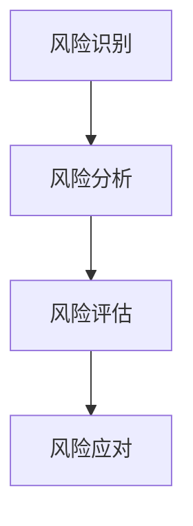
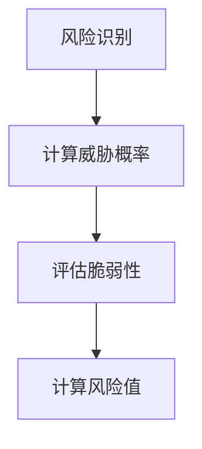
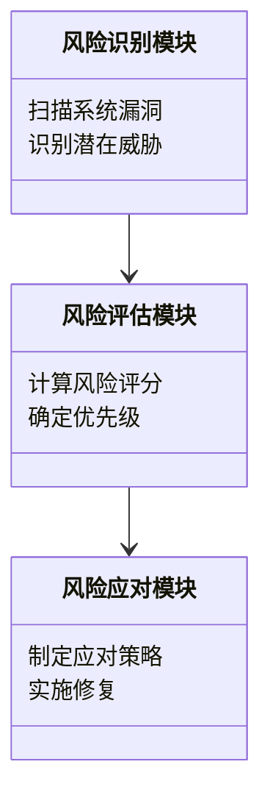
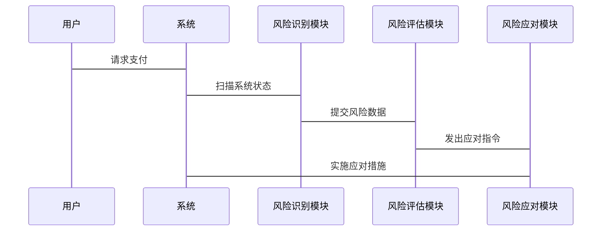

                 


# 风险管理与评估

## 关键词：风险管理、风险评估、系统安全、威胁建模、风险评分

## 摘要：  
风险管理与评估是计算机技术领域中的核心问题，涉及到系统的安全性、稳定性和可靠性。本文从风险管理的基本概念出发，详细讲解了风险评估的原理、方法和算法，并结合实际案例分析了系统的风险评估与应对策略。通过理论分析与实践结合，本文为读者提供了一套系统化的风险管理与评估方法论，帮助读者在实际项目中有效识别和应对潜在风险。

---

## 第一部分: 风险管理概述

### 第1章: 风险管理的基本概念

#### 1.1 风险的定义与特征
风险是指在特定条件下，某一事件可能发生的概率及其可能带来的损失。在计算机系统中，风险通常与安全漏洞、数据泄露、系统故障等不良事件相关。

#### 1.2 风险管理的目标与意义
风险管理的目标是通过识别、评估和应对潜在风险，降低其对系统或组织的影响。其意义在于保障系统的安全性和稳定性，减少损失，提高系统的抗风险能力。

#### 1.3 风险管理的核心要素
- **风险来源**：包括恶意攻击、数据泄露、硬件故障等。
- **风险分类**：根据影响范围和严重程度，分为高、中、低风险。
- **风险评估**：通过定性和定量分析，确定风险的优先级和应对策略。

---

### 第2章: 风险评估的背景与现状

#### 2.1 风险评估的发展历程
从早期的简单检查到现代的智能化评估，风险评估方法经历了从定性到定量、从静态到动态的转变。

#### 2.2 当前风险管理的主要挑战
- **复杂性**：现代系统涉及多层架构和复杂的依赖关系。
- **动态性**：威胁和漏洞不断演变，要求评估方法具有动态适应能力。
- **成本**：高精度的评估通常需要较高的资源投入。

#### 2.3 风险评估在计算机技术中的应用
- 网络安全：评估系统的漏洞和攻击风险。
- 软件工程：评估项目中的技术风险和进度风险。
- 企业架构：评估组织的整体风险敞口。

---

## 第二部分: 风险管理的核心概念与联系

### 第3章: 风险管理的原理与方法

#### 3.1 风险管理的原理
- **风险识别**：通过分析系统的结构和运行环境，识别潜在风险。
- **风险分析**：评估风险的可能性和影响程度。
- **风险应对**：制定策略以降低风险的影响。

#### 3.2 风险管理的核心方法
- **定性风险评估**：基于经验和主观判断，确定风险的优先级。
- **定量风险评估**：通过数学模型计算风险的量化指标。
- **威胁建模**：将威胁分解为具体的行为和目标，分析其对系统的潜在影响。

#### 3.3 风险管理的工具与技术
- **风险评估矩阵**：通过矩阵分析将风险分为不同类别。
- **风险评分模型**：基于指标权重计算风险评分。
- **数据流分析**：通过分析数据流，识别关键风险点。

#### 3.4 风险管理的流程图（Mermaid）


---

## 第三部分: 风险评估的算法原理

### 第4章: 风险评估算法详解

#### 4.1 风险评估的基本算法
- **风险评分算法**：根据威胁的可能性和影响程度，计算风险评分。
- **威胁概率计算算法**：基于历史数据，估算威胁发生的概率。
- **脆弱性影响评估算法**：评估系统漏洞对整体风险的影响程度。

#### 4.2 风险评估的数学模型
- **风险值计算公式**
  $$风险值 = 暴露度 \times 脆弱性$$
- **威胁概率计算公式**
  $$P(威胁) = \frac{威胁出现的频率}{总样本数}$$

#### 4.3 风险评估的流程图（Mermaid）


#### 4.4 Python实现示例
```python
def calculate_risk(exposure, vulnerability):
    risk_score = exposure * vulnerability
    return risk_score

# 示例数据
exposure = 0.8  # 威胁暴露程度（0-1）
vulnerability = 0.6  # 系统脆弱性（0-1）
risk_score = calculate_risk(exposure, vulnerability)
print(f"风险评分: {risk_score}")
```

---

## 第四部分: 系统分析与架构设计

### 第5章: 风险评估的系统架构

#### 5.1 问题场景介绍
以一个在线支付系统为例，分析其可能面临的风险，包括网络攻击、数据泄露、服务中断等。

#### 5.2 系统功能设计
- **风险识别模块**：扫描系统漏洞，识别潜在威胁。
- **风险评估模块**：计算风险评分，确定优先级。
- **风险应对模块**：制定应对策略，如修复漏洞、增加冗余。

#### 5.3 系统架构设计（Mermaid）


#### 5.4 系统接口设计
- 输入接口：接收系统日志和网络流量数据。
- 输出接口：输出风险报告和应对建议。

#### 5.5 系统交互流程（Mermaid）


---

## 第五部分: 项目实战与最佳实践

### 第6章: 项目实战

#### 6.1 环境安装
- 安装OWASP ZAP工具，用于漏洞扫描和风险评估。

#### 6.2 核心代码实现
```python
def assess_system_risk(system_logs):
    threats = identify_threats(system_logs)
    vulnerabilities = identify_vulnerabilities(system_logs)
    risk_score = calculate_risk(threats, vulnerabilities)
    return risk_score

# 示例调用
system_logs = [
    {"timestamp": "2023-10-01T12:00:00", "event": "login attempt"},
    {"timestamp": "2023-10-01T12:05:00", "event": "failed login"}
]
risk_score = assess_system_risk(system_logs)
print(f"系统风险评分: {risk_score}")
```

#### 6.3 案例分析与总结
通过实际项目案例，分析风险评估的过程和结果，总结经验教训。

#### 6.4 项目小结
强调在项目中实施风险管理的重要性，以及如何通过代码实现自动化风险评估。

### 第7章: 最佳实践

#### 7.1 风险管理的注意事项
- 定期更新风险评估模型，适应新的威胁。
- 结合人工分析和自动化工具，提高评估精度。

#### 7.2 小结
风险管理与评估是保障系统安全的核心环节，通过系统化的方法和工具，可以显著降低系统的风险敞口。

#### 7.3 拓展阅读
推荐相关书籍和资源，帮助读者深入学习风险管理与评估的理论和实践。

---

## 附录: 风险管理与评估的常用工具
- **OWASP ZAP**：开源的Web应用安全测试工具。
- **NVD**：国家漏洞数据库，提供漏洞信息和风险评估数据。
- **Jenkins**：用于自动化测试和持续集成，可集成风险评估流程。

---

通过以上内容，您可以撰写一篇详细、结构清晰且内容丰富的技术博客文章，全面涵盖风险管理与评估的核心概念、算法原理和实际应用。

