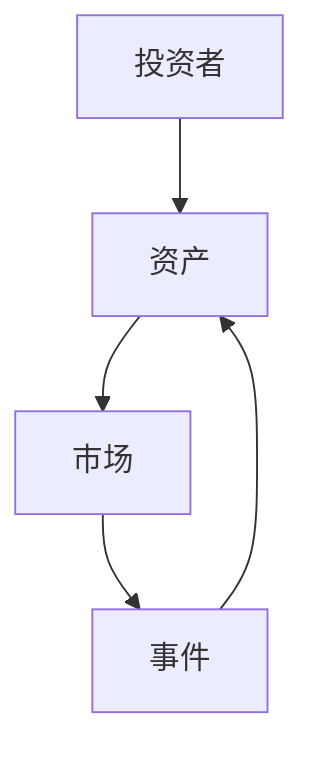
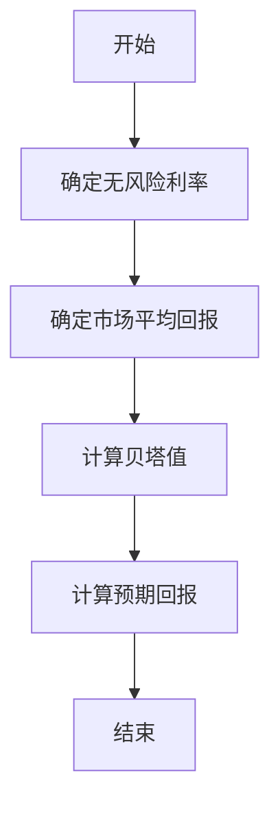

                 


# 马丁惠特曼的特殊情况投资

## 关键词：特殊情况投资，马丁·惠特曼，对冲基金，风险管理，资产定价

## 摘要：本文深入探讨了马丁·惠特曼在特殊情况投资领域的独特方法，分析其核心概念、算法原理、数学模型以及系统架构设计，结合实战案例，为读者提供全面的理解和应用指导。

---

## 第一部分：特殊情况投资的背景与概述

### 第1章：特殊情况投资的定义与特点

#### 1.1 特殊情况投资的定义
- 特殊情况投资是指在市场异常或企业特殊情况下，寻找被低估资产的投资策略。
- 与传统投资不同，它更注重在危机中的机会捕捉。

#### 1.2 特殊情况投资的历史发展
- 马丁·惠特曼在20世纪80年代开始实践，发展了逆向投资策略。
- 随着市场的变化，这种方法逐渐被更多投资者认可。

#### 1.3 与传统投资的区别
- 传统投资注重长期趋势，而特殊情况投资则关注短期市场波动和特殊事件。

---

## 第二部分：核心概念与联系

### 第2章：特殊情况投资的核心原理

#### 2.1 投资策略分析
- **价值投资**：寻找市场低估的资产。
- **成长投资**：关注高增长潜力的企业。

#### 2.2 核心概念对比表
- 表2.1：不同投资策略的特征对比

| 策略类型 | 投资标的 | 风险承受 | 投资期限 |
|----------|----------|----------|----------|
| 价值投资 | 低估资产 | 高       | 长期     |
| 成长投资 | 高增长企业 | 中高     | 长期     |

#### 2.3 实体关系图
- 图2.1：特殊情况投资的ER实体关系图



---

## 第三部分：算法原理讲解

### 第3章：特殊情况投资的算法模型

#### 3.1 风险管理模型
- 使用CAPM模型评估资产预期回报。
- 代码3.1：Python实现的风险管理模型

```python
import numpy as np

def calculate_capm(risk_free_rate, beta, market_return):
    return risk_free_rate + beta * (market_return - risk_free_rate)
```

#### 3.2 资产定价模型
- 图3.1：资产定价算法流程图



---

## 第四部分：数学模型与公式

### 第4章：数学模型的应用

#### 4.1 风险调整后的收益模型
- 公式4.1：CAPM模型 $$ R_i = R_f + \beta_i (R_m - R_f) $$

#### 4.2 风险收益权衡
- 公式4.2：夏普比率 $$ \text{夏普比率} = \frac{E(R_i - R_f)}{\sigma_i} $$

---

## 第五部分：系统分析与架构设计

### 第5章：系统架构设计方案

#### 5.1 领域模型设计
- 图5.1：领域模型Mermaid类图


#### 5.2 系统架构图
- 图5.2：系统架构Mermaid图


---

## 第六部分：项目实战

### 第6章：特殊情况投资的实战案例

#### 6.1 环境安装
- 安装Python和必要的库：`pip install numpy pandas`

#### 6.2 核心代码实现
- 代码6.1：风险管理模型实现

```python
def calculate_capm(risk_free_rate, beta, market_return):
    return risk_free_rate + beta * (market_return - risk_free_rate)
```

#### 6.3 案例分析
- 分析某公司破产重组案例，应用CAPM模型评估其潜在回报。

---

## 第七部分：最佳实践

### 第7章：总结与展望

#### 7.1 最佳实践
- 定期评估市场环境，及时调整投资策略。
- 结合定量分析和定性判断，提高投资决策的准确性。

#### 7.2 小结
- 特殊情况投资是一种高风险高回报的投资方式，需要投资者具备敏锐的市场洞察力和强大的风险控制能力。

#### 7.3 注意事项
- 保持对市场的敏感性，及时应对突发事件。
- 定期审查投资组合，确保其符合既定目标。

#### 7.4 拓展阅读
- 推荐阅读《投资学》和马丁·惠特曼的著作，深入理解特殊情况投资的理论与实践。

---

通过以上结构和内容，这篇文章将为读者提供关于马丁·惠特曼特殊情况投资的全面解析，从理论到实践，帮助读者理解和应用这一投资策略。

