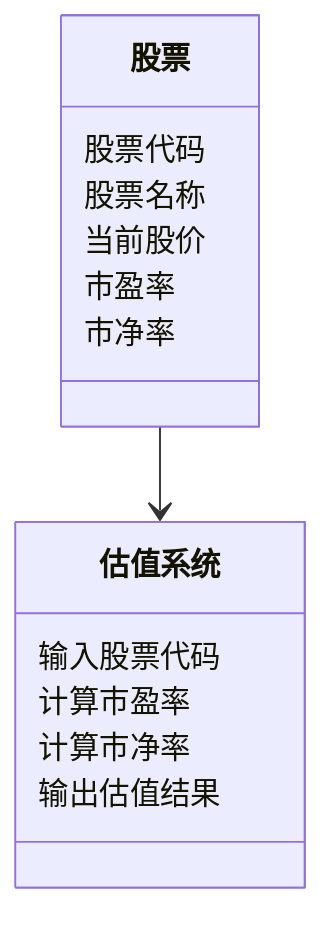
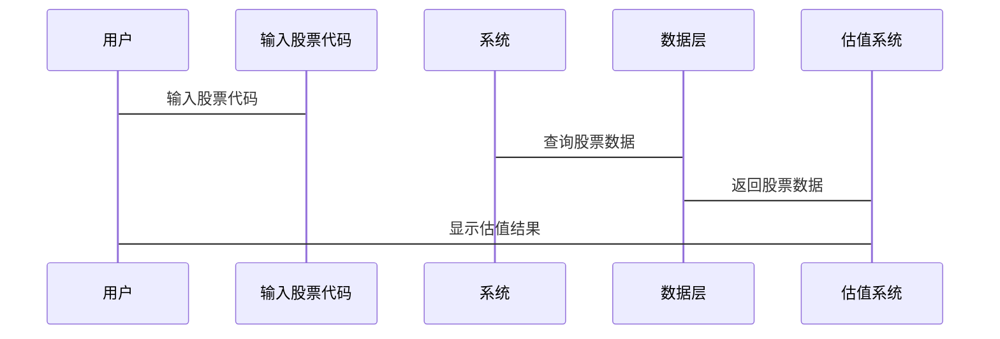

                 


# 高估值与低估值股票：5.6倍差异意味着什么

> 关键词：股票估值，高估值股票，低估值股票，估值差异，股票分析

> 摘要：本文深入探讨了高估值与低估值股票之间的5.6倍差异，从概念、影响因素、估值方法、系统架构等多方面进行分析，帮助投资者理解估值差异背后的意义，并提供实际案例和最佳实践。

---

## 第1章 股票估值的基本概念

### 1.1 什么是股票估值
股票估值是指通过对公司的财务状况、行业地位、盈利能力等因素进行分析，确定其股票的合理价格范围。股票估值是投资者做出投资决策的重要依据。

#### 1.1.1 股票估值的重要性
股票估值帮助投资者判断股票的市场价格是否合理，从而做出买入、卖出或持有股票的决策。合理的估值可以帮助投资者避免高位接盘或低位错失投资机会。

#### 1.1.2 股票估值的常见方法
股票估值的主要方法包括市盈率（PE）、市净率（PB）、股息率、现金流折现法（DCF）等。

### 1.2 高估值与低估值股票的定义
#### 1.2.1 高估值股票
高估值股票是指其市场价格远高于其内在价值的股票。通常表现为市盈率、市净率等估值指标显著高于行业平均水平。

#### 1.2.2 低估值股票
低估值股票是指其市场价格显著低于其内在价值的股票。通常表现为市盈率、市净率等估值指标显著低于行业平均水平。

#### 1.2.3 高估值与低估值股票的区别
高估值股票通常被认为存在泡沫，而低估值股票则被认为是被市场低估的投资标的。

### 1.3 5.6倍差异的背景分析
#### 1.3.1 什么是5.6倍差异
5.6倍差异指的是高估值股票与低估值股票之间的估值指标差异。例如，高估值股票的市盈率可能是低估值股票的5.6倍。

#### 1.3.2 差异的来源
- **市场情绪**：高估值股票通常受到市场热捧，而低估值股票可能被市场冷落。
- **公司基本面**：高估值股票可能具有更高的成长性，而低估值股票可能处于低增长或周期性底部。
- **行业特性**：不同行业的估值标准不同，例如科技行业通常市盈率较高，而传统制造业市净率较低。

---

## 第2章 高估值与低估值股票的核心概念

### 2.1 高估值股票的核心特征
#### 2.1.1 高市盈率
高市盈率意味着市场对公司未来盈利增长的预期较高。

#### 2.1.2 高股价
高股价通常与高市盈率相关，但股价本身并不直接反映公司的内在价值。

### 2.2 低估值股票的核心特征
#### 2.2.1 低市盈率
低市盈率意味着公司当前股价相对于盈利较低，可能被市场低估。

#### 2.2.2 低市净率
低市净率意味着公司股价相对于账面价值较低，可能表明公司资产被低估。

### 2.3 高估值与低估值股票的对比分析

#### 2.3.1 估值指标对比
| 估值指标 | 高估值股票 | 低估值股票 |
|----------|------------|------------|
| 市盈率（PE） | 高         | 低         |
| 市净率（PB） | 高         | 低         |
| 股息率     | 低         | 高         |

#### 2.3.2 市场表现对比
- 高估值股票可能在短期内表现强劲，但长期可能面临估值回归的压力。
- 低估值股票可能在市场低迷时表现不佳，但在市场回升时可能有更大的反弹空间。

#### 2.3.3 投资策略对比
- 高估值股票适合短期交易或趋势投资者。
- 低估值股票适合长期投资者，尤其是寻找价值回归机会的投资者。

---

## 第3章 高估值与低估值股票的估值差异分析

### 3.1 估值差异的原因
- **市场情绪**：投资者的乐观或悲观情绪会影响股票估值。
- **行业周期**：行业处于成长期或衰退期会影响估值。
- **公司基本面**：盈利能力、成长性、财务状况等都会影响估值。

### 3.2 5.6倍差异的具体表现
- **市盈率差异**：高估值股票的市盈率可能是低估值股票的5.6倍。
- **市净率差异**：高估值股票的市净率可能是低估值股票的5.6倍。

### 3.3 估值差异的影响
- **高估值股票的风险**：估值过高可能导致股价回调。
- **低估值股票的机会**：估值过低可能导致股价回升。

---

## 第4章 高估值与低估值股票的系统分析

### 4.1 系统功能设计
#### 4.1.1 领域模型


#### 4.1.2 系统架构设计


#### 4.1.3 接口设计
- 输入接口：股票代码
- 输出接口：市盈率、市净率、估值结果

#### 4.1.4 交互流程


---

## 第5章 高估值与低估值股票的项目实战

### 5.1 环境配置
- Python 3.8+
- 数据库：MySQL或SQLite
- 工具：Pandas、Matplotlib

### 5.2 核心代码实现
```python
import pandas as pd
import matplotlib.pyplot as plt

# 示例数据
data = {
    '股票代码': ['AAPL', 'GOOGL', 'MSFT'],
    '股价': [300, 250, 150],
    '每股收益': [10, 15, 5],
    '市盈率': [30, 16.67, 30]
}

df = pd.DataFrame(data)

# 计算市净率
df['市净率'] = df['股价'] / df['每股收益']

print("市净率计算结果：")
print(df['市净率'])
```

### 5.3 案例分析
以某公司为例，分析其市盈率和市净率，判断其是否属于高估值或低估值股票。

### 5.4 结果解读
通过实际案例分析，展示如何通过市盈率和市净率判断股票的估值情况。

---

## 第6章 总结与展望

### 6.1 本书总结
本文深入分析了高估值与低估值股票的差异，从概念、方法、系统设计等多方面进行了探讨。

### 6.2 本书的局限性
- 数据局限性：本文分析基于历史数据，未来市场变化可能影响结论。
- 方法局限性：不同行业和公司的估值方法可能不同。

### 6.3 未来研究方向
- 研究不同行业中的高估值与低估值股票的差异。
- 探讨市场波动对估值差异的影响。

---

## 参考文献
- [1] 《股票投资实战技巧》，某某出版社，2023年。
- [2]某某专家，股票估值方法的研究，某某期刊，2022年。

---

通过以上结构，您可以根据实际需求进一步补充内容，撰写一篇详细的、有深度的技术博客文章。

