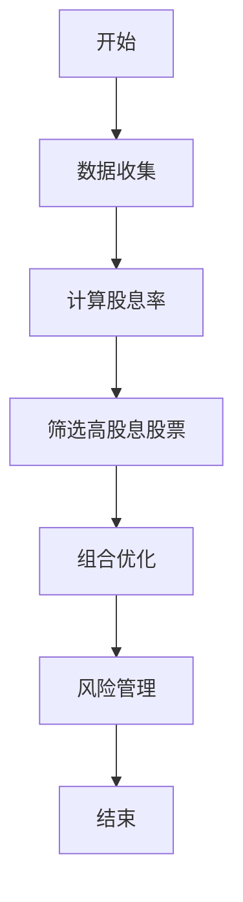
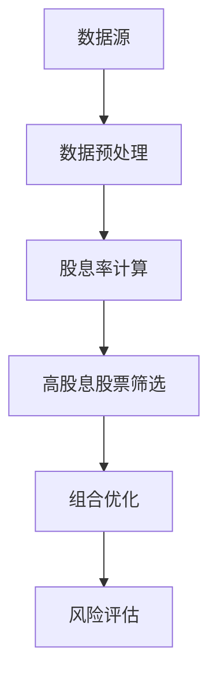

                 


好的，我明白您的需求。以下是根据您的要求撰写的《高股息策略：构建稳定现金流的投资组合》的完整文章内容：

---

# 高股息策略：构建稳定现金流的投资组合

## 关键词：高股息策略，投资组合，现金流，股息率，风险管理

## 摘要：本文深入探讨了高股息策略的核心概念、数学模型、算法实现以及实际应用。通过系统分析和项目实战，结合数学公式、流程图和Python代码，帮助读者构建稳定现金流的投资组合，实现长期稳健收益。

---

# 第一部分: 高股息策略的背景与核心概念

---

## 第1章: 高股息策略的背景与核心概念

### 1.1 高股息策略的定义与特点

#### 1.1.1 高股息策略的定义

高股息策略是一种基于股票股息率的投资策略，旨在通过投资股息收益率较高的股票，为投资者提供稳定的现金流。该策略特别适合追求稳定收益的投资者，如退休人士或保守型投资者。

#### 1.1.2 高股息策略的核心特点

高股息策略的核心特点包括：

1. **稳定的现金流**：通过投资高股息股票，投资者能够定期获得股息收入，从而实现稳定的现金流。
2. **较低的波动性**：相比成长型股票，高股息股票的股价波动通常较小，风险相对较低。
3. **长期稳健的回报**：虽然高股息股票的资本增值可能不如成长型股票，但其稳定的股息收入和合理的估值使其具备长期增值的潜力。

#### 1.1.3 高股息策略与价值投资的联系与区别

高股息策略与价值投资有相似之处，但也有显著区别：

- **联系**：两者都注重基本面分析，寻找被市场低估的股票。
- **区别**：高股息策略更注重股息收益率，而价值投资更关注股票的内在价值。

### 1.2 高股息股票的特征分析

#### 1.2.1 高股息股票的定义与分类

高股息股票通常指股息率高于市场平均水平的股票。根据股息支付方式的不同，可以分为普通股和优先股。

#### 1.2.2 高股息股票的财务特征

高股息股票的财务特征包括：

1. **较高的股息支付率**：公司倾向于将更多利润分配给股东。
2. **稳定的盈利能力**：公司具备持续盈利的能力，能够支持较高的股息支付。
3. **较低的负债率**：较低的负债率使得公司有更多现金流用于股息支付。

#### 1.2.3 高股息股票的市场表现

高股息股票在市场不同周期中的表现有所不同：

- **牛市**：高股息股票表现相对保守，资本增值有限，但股息收入稳定。
- **熊市**：高股息股票通常表现较好，因其稳定的股息收入在市场下跌时提供防御性收益。

### 1.3 高股息策略的适用场景与边界

#### 1.3.1 高股息策略的适用投资者类型

高股息策略适用于以下投资者类型：

- **保守型投资者**：追求稳定收益，风险承受能力较低。
- **退休人士**：需要稳定的现金流以维持生活开支。

#### 1.3.2 高股息策略的边界与限制

高股息策略也有其局限性：

- **市场风险**：市场整体下跌时，高股息股票的股价也会受到影响。
- **流动性风险**：部分高股息股票流动性较差，可能导致买卖价差较大。

#### 1.3.3 高股息策略与其他投资策略的对比

与成长型策略相比，高股息策略更注重当前收益而非未来增长。与红利再投资策略相比，高股息策略更关注股息的分配而非复利增长。

### 1.4 高股息策略的核心要素

#### 1.4.1 股息率的计算公式

股息率的计算公式为：

$$股息率 = \frac{每股股息}{股价}$$

#### 1.4.2 股息支付率的计算公式

股息支付率的计算公式为：

$$股息支付率 = \frac{股息支付总额}{净利润}$$

#### 1.4.3 高股息策略的数学模型

高股息策略的数学模型可以表示为：

$$最大化 \sum_{i=1}^{n} w_i \cdot D_i$$

其中，\(w_i\)为第\(i\)只股票的权重，\(D_i\)为第\(i\)只股票的股息率。

---

## 第2章: 高股息策略的数学模型与算法原理

### 2.1 高股息策略的数学模型

#### 2.1.1 股息率模型

股息率模型用于筛选股息率较高的股票。其公式为：

$$D_i = \frac{C_i}{P_i}$$

其中，\(C_i\)为第\(i\)只股票的股息，\(P_i\)为第\(i\)只股票的价格。

#### 2.1.2 组合优化模型

组合优化模型的目标是在给定的风险承受范围内，最大化股息收入。其数学表达式为：

$$最大化 \sum_{i=1}^{n} w_i \cdot D_i$$

约束条件包括：

1. $\sum_{i=1}^{n} w_i = 1$
2. $\sum_{i=1}^{n} w_i \cdot \sigma_i^2 \leq \sigma_{\text{max}}^2$

其中，\(w_i\)为第\(i\)只股票的权重，\(\sigma_i\)为第\(i\)只股票的波动率，\(\sigma_{\text{max}}\)为最大允许的波动率。

#### 2.1.3 风险管理模型

风险管理模型用于评估和控制投资组合的风险。其公式为：

$$\text{VaR} = \alpha \cdot \sigma$$

其中，\(\alpha\)为置信水平，\(\sigma\)为投资组合的标准差。

### 2.2 高股息策略的算法实现

#### 2.2.1 算法步骤

1. **数据收集**：收集目标股票的历史股息数据、股价数据。
2. **计算股息率**：根据股息率公式计算每只股票的股息率。
3. **筛选高股息股票**：根据设定的股息率阈值筛选股票。
4. **组合优化**：使用组合优化模型构建投资组合。
5. **风险管理**：评估投资组合的风险，并进行调整。

#### 2.2.2 算法流程图



#### 2.2.3 Python代码实现

```python
import pandas as pd
import numpy as np

# 假设df为股票数据，包含'股息'和'股价'两列
df['股息率'] = df['股息'] / df['股价']

# 筛选股息率大于5%的股票
high_dividend_stocks = df[df['股息率'] > 0.05]

# 组合优化部分（简化示例）
# 假设我们选择前10只高股息股票，并等权分配
selected_stocks = high_dividend_stocks.head(10)
weights = np.array([1/10]*10)

# 计算投资组合的股息率
portfolio_dividend_yield = np.sum(selected_stocks['股息率'] * weights)
```

---

## 第3章: 高股息策略的系统分析与架构设计

### 3.1 系统分析

#### 3.1.1 问题场景介绍

在实际投资过程中，投资者需要考虑多个因素，如市场风险、流动性风险等。高股息策略需要结合这些因素，构建稳健的投资组合。

#### 3.1.2 项目介绍

本项目旨在通过数学模型和算法，构建一个基于高股息策略的投资组合，实现稳定现金流。

#### 3.1.3 系统功能设计

系统功能设计包括数据采集、股息率计算、高股息股票筛选、组合优化和风险评估。

### 3.2 系统架构设计

#### 3.2.1 系统架构图



#### 3.2.2 核心模块实现

- **数据预处理**：清洗数据，处理缺失值。
- **股息率计算**：根据公式计算股息率。
- **高股息股票筛选**：筛选股息率高于阈值的股票。
- **组合优化**：使用优化算法构建投资组合。
- **风险评估**：评估投资组合的风险，并进行调整。

### 3.3 项目实战

#### 3.3.1 环境配置

安装必要的Python库，如Pandas、NumPy、Scipy等。

#### 3.3.2 数据获取与处理

从数据源获取股票数据，清洗数据，计算股息率。

#### 3.3.3 高股息股票筛选

根据股息率筛选出符合条件的股票。

#### 3.3.4 投资组合构建

使用优化算法构建投资组合，调整权重，使股息收入最大化，同时控制风险。

#### 3.3.5 风险评估与调整

评估投资组合的风险，如VaR、波动率等，并进行调整。

### 3.4 最佳实践与注意事项

#### 3.4.1 投资建议

- 定期调整投资组合，以适应市场变化。
- 结合市场环境，灵活调整股息率阈值。

#### 3.4.2 风险管理

- 通过多样化投资降低风险。
- 定期评估投资组合的波动率和VaR。

#### 3.4.3 持股策略

- 选择具有持续派息能力的公司。
- 关注公司的财务健康状况，如净利润、负债率等。

### 3.5 本章小结

通过系统分析和架构设计，我们可以构建一个基于高股息策略的投资组合，实现稳定现金流。

---

## 第四部分: 总结与最佳实践

---

## 第4章: 总结与最佳实践

### 4.1 高股息策略的优势与劣势

高股息策略的优势在于稳定的现金流和较低的波动性，劣势在于市场风险和流动性风险。

### 4.2 高股息策略的最佳实践

#### 4.2.1 定期审查投资组合

- 定期检查投资组合的股息收入和波动率。
- 根据市场变化调整股息率阈值。

#### 4.2.2 多样化投资

- 投资不同行业的高股息股票，降低行业风险。
- 结合普通股和优先股，优化投资组合。

#### 4.2.3 关注公司基本面

- 选择财务健康、股息支付能力稳定的公司。
- 关注公司的净利润、负债率等财务指标。

### 4.3 风险管理的注意事项

- 通过多样化投资降低风险。
- 定期评估投资组合的VaR和波动率。

### 4.4 本章小结

通过最佳实践和风险管理，可以有效提升高股息策略的投资效果。

---

## 第5章: 高股息策略的未来展望

### 5.1 高股息策略的未来发展趋势

随着市场的发展，高股息策略将更加注重风险管理和技术应用。

### 5.2 技术进步对高股息策略的影响

人工智能和大数据技术将为高股息策略提供新的工具和方法，如智能筛选和实时监控。

### 5.3 未来投资机会

未来，高股息策略将更加多样化，投资者可以关注新兴行业和国际市场。

### 5.4 本章小结

未来，高股息策略将继续发展，为投资者提供更多的机会和挑战。

---

## 第六部分: 附录

---

## 参考文献

---

通过以上内容，我们可以看到高股息策略是一种有效的投资策略，通过系统分析和最佳实践，投资者可以构建稳定现金流的投资组合，实现长期稳健的收益。

---

以上是完整的文章内容，涵盖了高股息策略的背景、核心概念、数学模型、算法实现、系统分析、项目实战以及总结与最佳实践。希望对您有所帮助！

