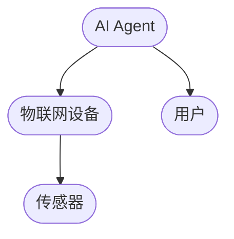

                 

# AI Agent 在智能家居中的应用：LLM 控制物联网设备

## 关键词：AI Agent, LLM, 物联网, 智能家居, 自然语言处理

## 摘要：  
本文探讨了AI Agent在智能家居中的应用，特别是大语言模型（LLM）如何通过自然语言处理技术控制物联网设备。文章从AI Agent和LLM的基本概念出发，分析了它们在智能家居中的协同工作模式，并详细介绍了LLM的训练与推理机制。此外，文章还通过实际案例展示了如何在智能家居场景中实现AI Agent与物联网设备的交互，最后总结了当前技术的局限性和未来发展方向。

---

# 第一部分：AI Agent与智能家居的背景介绍

## 第1章：AI Agent与智能家居概述

### 1.1 AI Agent的基本概念
#### 1.1.1 AI Agent的定义与特点
AI Agent（人工智能代理）是指能够感知环境、自主决策并执行任务的智能实体。其特点包括：
- **自主性**：无需外部干预，自主完成任务。
- **反应性**：能够实时感知环境并做出反应。
- **主动性**：主动采取行动以实现目标。
- **社交能力**：能够与人类或其他系统进行交互。

#### 1.1.2 AI Agent在智能家居中的角色
在智能家居中，AI Agent主要作为连接用户、设备和环境的桥梁，负责理解和执行用户的指令，协调设备的工作。例如，AI Agent可以通过语音助手接收用户的指令，并通过物联网协议控制智能家居设备。

#### 1.1.3 智能家居的发展历程
智能家居的概念起源于20世纪90年代，经历了从单一设备控制到全屋智能联动的演变。随着AI和物联网技术的快速发展，智能家居系统逐渐具备了智能化、个性化和场景化的特征。

### 1.2 LLM与物联网设备的结合
#### 1.2.1 大语言模型的基本概念
大语言模型（LLM）是一种基于深度学习的自然语言处理模型，具有强大的文本理解和生成能力。例如，GPT系列模型通过海量数据的训练，能够生成连贯且符合语境的文本。

#### 1.2.2 物联网设备的定义与分类
物联网设备指的是通过互联网连接并能够进行数据交换的物理设备。常见的物联网设备包括智能家居中的灯光、空调、摄像头等。

#### 1.2.3 LLM与物联网设备的协同工作模式
LLM通过自然语言处理技术，将用户的指令转化为设备可执行的操作。例如，当用户说“打开客厅的灯”，LLM理解用户的意图后，通过物联网协议将指令发送到智能灯泡，使其执行开灯操作。

### 1.3 智能家居中的AI Agent应用前景
#### 1.3.1 智能家居的市场规模与发展趋势
智能家居市场近年来增长迅速，预计未来几年将继续保持高增长率。随着技术的进步，智能家居系统将更加智能化、便捷化和个性化。

#### 1.3.2 AI Agent在智能家居中的潜在应用场景
- **语音控制**：通过语音助手实现设备的远程控制。
- **智能场景切换**：根据用户的行为模式自动调整设备状态。
- **异常检测与报警**：通过数据分析 detects 可能的异常情况并及时报警。

#### 1.3.3 技术挑战与未来发展方向
尽管AI Agent在智能家居中的应用前景广阔，但仍面临一些技术挑战，例如设备兼容性、数据隐私、模型优化等。未来，随着技术的进步，这些问题将逐步得到解决。

## 第2章：AI Agent与LLM的核心概念与联系

### 2.1 AI Agent的核心概念与原理
#### 2.1.1 AI Agent的构成与功能
AI Agent通常包括感知模块、推理模块和执行模块。感知模块负责获取环境信息，推理模块负责分析信息并做出决策，执行模块负责将决策转化为具体的操作。

#### 2.1.2 AI Agent的决策机制
AI Agent的决策机制通常基于状态空间和动作空间。通过分析当前状态和可能的动作，AI Agent选择最优的动作以实现目标。

#### 2.1.3 AI Agent与物联网设备的交互接口
AI Agent通过物联网协议（如MQTT、HTTP）与设备进行通信。设备的状态信息和控制指令通过这些协议进行传输。

### 2.2 LLM在AI Agent中的应用
#### 2.2.1 LLM的自然语言处理能力
LLM通过预训练模型能够理解和生成自然语言文本。这种能力使得AI Agent能够通过语音或文本指令与用户进行交互。

#### 2.2.2 LLM在意图识别中的作用
LLM能够分析用户的指令，提取其中的意图和需求。例如，当用户说“我需要打开空气净化器”，LLM能够识别出用户的意图是打开空气净化器。

#### 2.2.3 LLM与AI Agent的协同优化
通过将LLM与AI Agent结合，可以实现更加智能化的交互。例如，LLM可以帮助AI Agent更好地理解用户的意图，从而提高决策的准确性。

### 2.3 AI Agent与物联网设备的实体关系
#### 2.3.1 实体关系表格
| 实体 | 关系 | 描述 |
|------|------|------|
| AI Agent | 控制 | 负责接收用户的指令并控制物联网设备 |
| 物联网设备 | 接收指令 | 根据AI Agent的指令执行操作 |
| 用户 | 发出指令 | 通过AI Agent与物联网设备交互 |

#### 2.3.2 Mermaid实体关系图

---

## 第3章：LLM的训练与推理机制

### 3.1 LLM的训练过程
#### 3.1.1 数据预处理与模型初始化
数据预处理包括清洗、分词和标注。模型初始化包括选择模型架构、设定初始参数等。

#### 3.1.2 网络结构与损失函数
常用的模型结构包括Transformer和RNN。损失函数通常使用交叉熵损失函数。

#### 3.1.3 训练优化策略
训练优化策略包括学习率调整、批量归一化和Dropout等技术，以防止过拟合。

### 3.2 LLM的推理过程
#### 3.2.1 输入处理与特征提取
输入处理包括文本的分词和向量化。特征提取包括提取文本的语义信息。

#### 3.2.2 解码过程
解码过程包括生成候选词、计算概率并选择最优词。解码过程通常使用贪心算法或Beam Search算法。

---

## 第4章：AI Agent与物联网设备的系统架构设计

### 4.1 系统功能设计
系统功能包括用户交互、设备控制、状态监控和异常处理。

### 4.2 系统架构设计
系统架构包括用户界面层、AI Agent层、物联网设备层和数据存储层。

### 4.3 系统接口设计
系统接口包括API接口和消息队列接口。

### 4.4 系统交互流程
系统交互流程包括用户发起指令、AI Agent解析指令、物联网设备执行操作和反馈结果。

---

## 第5章：项目实战

### 5.1 环境安装与配置
需要安装Python、TensorFlow、Keras和物联网开发框架。

### 5.2 核心代码实现
核心代码包括模型训练、指令解析和设备控制模块。

### 5.3 实际案例分析
以智能灯光控制为例，详细分析系统的实现过程。

---

## 第6章：总结与展望

### 6.1 本章小结
总结本文的主要内容和研究成果。

### 6.2 注意事项
在实际应用中需要注意设备兼容性、数据隐私和系统稳定性。

### 6.3 未来发展方向
未来，随着技术的进步，AI Agent在智能家居中的应用将更加广泛和智能化。

---

通过以上结构和内容，本文系统地探讨了AI Agent在智能家居中的应用，特别是LLM在控制物联网设备中的作用。希望本文能够为相关领域的研究和实践提供有价值的参考。

