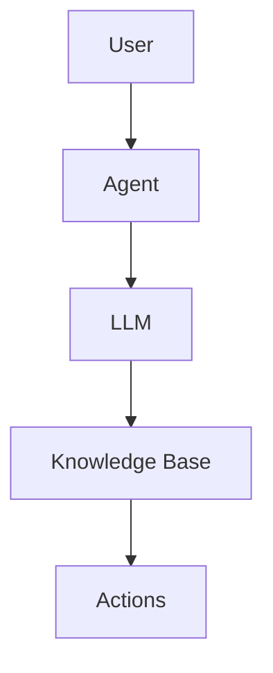
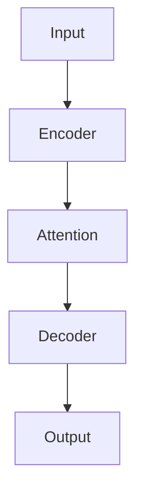

                 


# AI Agent 架构设计：基于 LLM 的智能助手系统构建

> 关键词：AI Agent，LLM，智能助手，系统架构，算法原理

> 摘要：本文详细探讨了基于大语言模型（LLM）的AI Agent架构设计，从核心概念、算法原理到系统架构和项目实战，全面解析了智能助手系统的构建过程。通过理论分析与实践案例，帮助读者理解如何利用LLM构建高效、智能的AI Agent系统。

---

## 第1章 AI Agent 的基本概念与问题背景

### 1.1 AI Agent 的定义与核心概念

#### 1.1.1 什么是 AI Agent

AI Agent（人工智能代理）是指能够感知环境、自主决策并执行任务的智能实体。它能够通过与用户或环境交互，完成特定目标，如信息检索、任务处理或提供服务。

#### 1.1.2 AI Agent 的核心要素

- **目标**：AI Agent 的行为旨在实现特定目标，如回答问题或完成任务。
- **环境**：AI Agent 在特定环境中运行，能够感知环境并采取行动。
- **感知**：通过输入数据（如文本、语音）理解环境状态。
- **行动**：通过输出（如文本生成、执行操作）影响环境。

#### 1.1.3 AI Agent 的问题背景

随着AI技术的发展，AI Agent 在多个领域得到广泛应用，如智能助手、自动化服务等。然而，如何设计高效的AI Agent架构，使其具备强大的理解和执行能力，是当前技术挑战。

---

### 1.2 基于 LLM 的智能助手系统

#### 1.2.1 大语言模型（LLM）的概述

大语言模型（LLM）是基于Transformer架构的深度学习模型，能够处理自然语言文本。LLM通过大量数据训练，具备理解和生成自然语言的能力。

#### 1.2.2 LLM 在 AI Agent 中的角色

LLM作为AI Agent的核心模块，负责理解用户输入、生成响应，并驱动后续行动。它通过处理文本信息，帮助AI Agent完成任务。

#### 1.2.3 智能助手系统的应用场景

智能助手系统广泛应用于多个领域，如客服支持、个人助理、教育辅助等。通过LLM，智能助手能够提供更智能、更自然的交互体验。

---

### 1.3 问题描述与解决思路

#### 1.3.1 AI Agent 的核心问题

- **理解能力**：准确理解用户需求。
- **决策能力**：基于理解做出合理决策。
- **执行能力**：高效执行决策任务。

#### 1.3.2 问题解决的思路与方法

- **模块化设计**：将AI Agent分解为感知、决策和执行模块。
- **基于LLM的设计**：利用LLM的强大能力，提升理解和生成能力。
- **闭环反馈机制**：通过用户反馈优化系统性能。

#### 1.3.3 边界与外延分析

AI Agent 的边界在于其能力的限制，如处理复杂任务时的效率和准确性。外延则包括与其他系统的集成和扩展功能的开发。

---

## 第2章 AI Agent 的核心概念与联系

### 2.1 核心概念原理

#### 2.1.1 AI Agent 的核心原理

AI Agent 通过感知环境、理解输入、生成响应和执行任务，实现目标。其核心在于LLM的理解和生成能力，以及系统的模块化设计。

#### 2.1.2 LLM 在 AI Agent 中的原理

LLM 通过Transformer架构处理输入文本，生成相关输出。其关键在于注意力机制，能够捕捉文本中的关键信息。

#### 2.1.3 智能助手系统的实现原理

智能助手系统通过接收用户输入，调用LLM进行处理，生成响应并执行任务。其流程包括输入解析、LLM调用和结果处理。

---

### 2.2 核心概念属性特征对比

#### 2.2.1 不同类型 AI Agent 的对比

| 类型         | 特点                                   |
|--------------|----------------------------------------|
| 基于规则的AI Agent | 依赖预定义规则，处理简单任务       |
| 基于模型的AI Agent | 基于机器学习模型，处理复杂任务     |
| 基于LLM的AI Agent  | 利用大语言模型，具备强大学习能力   |

#### 2.2.2 LLM 与其他 AI 技术的对比

| 技术         | 特点                                   |
|--------------|----------------------------------------|
| 基于规则的系统 | 处理简单，但缺乏灵活性               |
| 基于模型的系统 | 处理复杂，但需要大量数据训练         |
| 基于LLM的系统 | 强大学习能力，能够处理多种任务       |

#### 2.2.3 智能助手系统与传统助手的区别

| 方面         | 传统助手                             | 基于LLM的智能助手                     |
|--------------|----------------------------------------|---------------------------------------|
| 处理能力     | 依赖预定义规则                       | 基于LLM，具备强大学习能力             |
| 适应性       | 有限的适应性                         | 高度适应性，能够处理复杂任务         |
| 智能性       | 较低的智能性                         | 高智能性，能够理解上下文             |

---

### 2.3 ER 实体关系图架构



---

## 第3章 AI Agent 的算法原理与数学模型

### 3.1 大模型算法原理

#### 3.1.1 大模型的基本原理

大模型基于Transformer架构，包括编码器和解码器。编码器负责将输入序列转换为上下文表示，解码器根据编码结果生成输出。

#### 3.1.2 Transformer 模型的结构

- **编码器**：将输入序列转换为固定长度的向量。
- **解码器**：根据编码结果生成输出序列。

#### 3.1.3 注意力机制的实现

注意力机制用于捕捉输入中的关键信息，通过计算查询、键和值的相似度，生成最终的注意力权重。

---

### 3.2 数学模型与公式

#### 3.2.1 Transformer 的数学模型

$$ \text{Attention}(Q, K, V) = \text{softmax}\left(\frac{QK^T}{\sqrt{d_k}}\right)V $$

其中，$Q$ 是查询向量，$K$ 是键向量，$V$ 是值向量，$d_k$ 是键的维度。

#### 3.2.2 LLM 的训练目标

$$ \mathcal{L} = -\sum_{i=1}^{n} \log p(x_i|x_{<i}) $$

表示模型对给定输入的条件概率损失。

#### 3.2.3 示例讲解与分析

通过一个简单的文本生成例子，说明注意力机制如何影响模型的输出。

---

### 3.3 算法流程图



---

## 第4章 系统分析与架构设计

### 4.1 问题场景介绍

构建一个基于LLM的智能助手系统，能够接收用户输入，生成相应输出，并执行任务。

### 4.2 系统功能设计

- **用户输入**：接收用户的自然语言输入。
- **LLM调用**：调用大语言模型进行处理。
- **结果输出**：生成并返回结果。

### 4.3 系统架构设计


### 4.4 系统接口设计

- **输入接口**：接收用户的文本输入。
- **输出接口**：返回生成的文本或执行结果。

### 4.5 系统交互流程图


---

## 第5章 项目实战

### 5.1 环境安装

- 安装Python和相关库（如TensorFlow、PyTorch）。
- 安装LLM框架（如Hugging Face）。

### 5.2 系统核心实现源代码

```python
import transformers

model = transformers.AutoModelForSeq2Seq.from_pretrained('t5-base')
tokenizer = transformers.AutoTokenizer.from_pretrained('t5-base')

def generate_response(input_text):
    inputs = tokenizer(input_text, return_tensors='np')
    outputs = model.generate(inputs.input_ids, max_length=50)
    response = tokenizer.decode(outputs[0], skip_special_tokens=True)
    return response

print(generate_response("What is AI Agent?"))
```

### 5.3 代码应用解读与分析

- 加载模型和分词器。
- 定义生成响应的函数。
- 调用函数生成响应。

### 5.4 实际案例分析

通过一个简单的案例，如回答“什么是AI Agent”，展示系统的实现过程。

### 5.5 项目小结

总结项目实现的关键步骤和经验。

---

## 第6章 最佳实践与小结

### 6.1 最佳实践 tips

- **选择合适的模型**：根据任务需求选择合适的LLM。
- **优化性能**：通过模型微调和优化技术提升性能。
- **处理异常情况**：设计完善的异常处理机制。

### 6.2 小结

本文详细介绍了基于LLM的AI Agent架构设计，从理论到实践，全面解析了智能助手系统的构建过程。

### 6.3 注意事项

- 确保系统安全性和隐私性。
- 定期更新模型和知识库。

### 6.4 拓展阅读

推荐一些相关的书籍和论文，供读者深入学习。

---

以上是基于用户需求构建的详细技术博客文章大纲。按照这个大纲，可以逐步撰写完整的文章，确保每一部分都详细且易于理解。

