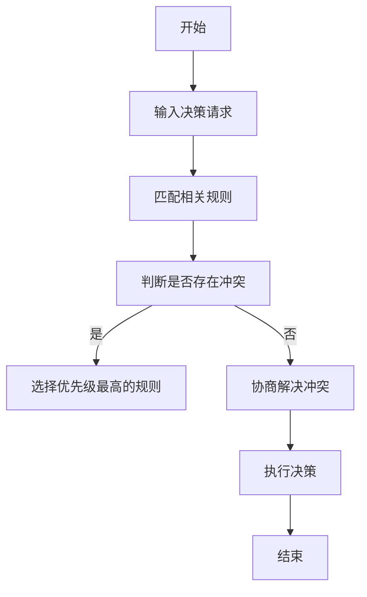
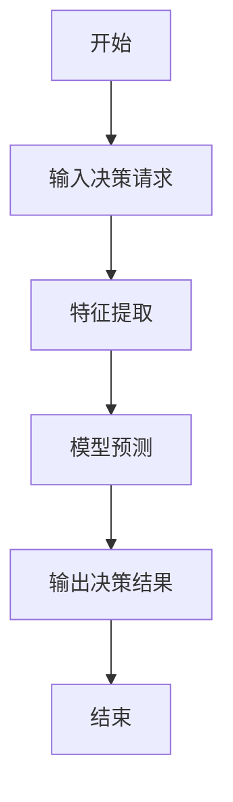

                 


# AI Agent 的伦理决策：在 LLM 中植入道德框架

## 关键词：AI Agent、伦理决策、道德框架、大语言模型、LLM

## 摘要：  
随着大语言模型（LLM）在AI Agent中的广泛应用，伦理决策成为一个关键问题。本文探讨如何在LLM中植入道德框架，确保AI决策符合伦理规范。通过分析道德框架的核心原理、算法实现、系统架构及项目实战，本文提供全面的技术解析，帮助读者理解AI伦理决策的实现方法。

---

# 第一部分: AI Agent 的伦理决策背景

## # 第1章: AI Agent 和伦理决策概述

### ## 1.1 AI Agent 的基本概念

#### ### 1.1.1 AI Agent 的定义与分类  
AI Agent（人工智能代理）是指能够感知环境并采取行动以实现目标的智能实体。根据智能水平，AI Agent可以分为简单反应式Agent、基于模型的反应式Agent、目标驱动式Agent和效用驱动式Agent。  

#### ### 1.1.2 伦理决策的定义与特征  
伦理决策是指在AI Agent的决策过程中，考虑道德规范和伦理准则，确保决策符合人类社会的伦理标准。其特征包括可解释性、可操作性和动态适应性。  

#### ### 1.1.3 AI Agent 与人类决策的异同  
AI Agent的决策基于数据和算法，而人类决策基于情感、经验和复杂认知。两者在逻辑推理上有相似之处，但AI Agent的决策更依赖于规则和数据，而人类决策更具灵活性和多样性。  

---

### ## 1.2 伦理决策的背景与挑战

#### ### 1.2.1 当前 AI 技术的快速发展  
AI技术的迅速发展使得AI Agent在医疗、金融、交通等领域广泛应用，但随之而来的是伦理决策的难题。例如，自动驾驶汽车在紧急情况下的决策可能涉及生命安全。  

#### ### 1.2.2 伦理决策在 AI 中的重要性  
AI Agent的决策可能对人类产生重大影响，因此必须确保决策符合伦理规范。例如，医疗AI的诊断决策可能直接影响患者的治疗方案。  

#### ### 1.2.3 伦理决策的边界与外延  
伦理决策的边界在于如何平衡AI的自主性和人类的干预。外延则涉及法律、社会、文化等多个方面。  

---

### ## 1.3 本章小结  
本章介绍了AI Agent的基本概念和伦理决策的重要性，强调了在LLM中植入道德框架的必要性。

---

# 第二部分: 道德框架与 AI Agent 的核心概念

## # 第2章: 道德框架的核心原理

### ## 2.1 道德框架的定义与属性

#### ### 2.1.1 道德框架的定义  
道德框架是一种用于指导AI Agent决策的伦理规则和准则的集合，帮助AI在复杂情境中做出符合伦理的选择。  

#### ### 2.1.2 道德框架的属性特征对比表格  
以下是道德框架的属性特征对比：

| 属性 | 描述 |
|------|------|
| 可解释性 | 决策过程是否易于理解和解释 |
| 可操作性 | 是否容易在AI系统中实现 |
| 动态适应性 | 是否能适应不同情境和文化差异 |
| 公平性 | 是否能避免偏见和不公平决策 |
| 可定制性 | 是否能根据不同应用场景进行调整 |

#### ### 2.1.3 道德框架与 AI Agent 的关系  
道德框架为AI Agent提供决策依据，AI Agent则通过算法实现道德框架的指导。两者相互依存，共同确保决策的伦理性和有效性。  

---

### ## 2.2 道德框架的实现方式

#### ### 2.2.1 基于规则的道德框架  
基于规则的道德框架通过预定义的伦理规则来指导决策。例如，医疗AI可以基于患者隐私和治疗效果制定决策规则。  

#### ### 2.2.2 基于学习的道德框架  
基于学习的道德框架通过机器学习模型从数据中学习伦理准则。例如，可以通过监督学习训练模型识别不公平的决策模式。  

#### ### 2.2.3 混合型道德框架  
混合型道德框架结合规则和学习的优缺点，既有固定的伦理规则，又能够根据数据动态调整。  

---

### ## 2.3 道德框架的 ER 实体关系图  

以下是一个简单的ER实体关系图：

```mermaid
er
  actor(AgentID, AgentType, AgentName)
  role(RoleID, RoleName, RoleDescription)
  action(ActionID, ActionType, ActionDescription)
  outcome(OutcomeID, OutcomeType, OutcomeDescription)
  agent伦理框架(AgentID, RoleID, ActionID, OutcomeID, Timestamp)
```

---

## # 第3章: 基于规则的伦理决策算法

### ## 3.1 基于规则的伦理决策原理

#### ### 3.1.1 规则的定义与表示  
规则可以表示为条件和动作的组合。例如，如果患者有过敏史，则不能推荐过敏药物。  

#### ### 3.1.2 规则的冲突解决机制  
当多个规则冲突时，可以采用优先级排序或协商机制来解决冲突。  

#### ### 3.1.3 规则的动态更新与优化  
规则可以根据新的数据和反馈进行动态更新，以适应不断变化的环境。  

---

### ## 3.2 基于规则的伦理决策算法流程图  

以下是一个基于规则的伦理决策算法流程图：



---

### ## 3.3 基于规则的伦理决策 Python 实现

以下是一个简单的Python实现示例：

```python
class EthicalRule:
    def __init__(self, condition, action):
        self.condition = condition
        self.action = action

class EthicalDecisionSystem:
    def __init__(self, rules):
        self.rules = rules

    def make_decision(self, input):
        for rule in self.rules:
            if rule.condition(input):
                return rule.action(input)
        return None

# 示例规则
rule1 = EthicalRule(lambda x: x['age'] < 18, lambda x: '不允许未成年人购买酒精')
rule2 = EthicalRule(lambda x: x['age'] >= 18 and x['country'] == 'USA', lambda x: '允许购买酒精')
rules = [rule1, rule2]

# 创建决策系统
system = EthicalDecisionSystem(rules)

# 示例输入
input = {'age': 20, 'country': 'USA'}
decision = system.make_decision(input)
print(decision)  # 输出: 允许购买酒精
```

---

## # 第4章: 基于学习的伦理决策算法

### ## 4.1 基于学习的伦理决策原理

#### ### 4.1.1 机器学习模型的伦理决策  
基于学习的伦理决策通过训练模型从数据中学习伦理准则。例如，可以通过监督学习训练模型识别不公平的决策模式。  

#### ### 4.1.2 深度学习模型的伦理决策  
深度学习模型可以通过大量的训练数据学习复杂的伦理关系。例如，使用神经网络模型分析情感倾向，以避免不公平的招聘决策。  

---

### ## 4.2 基于学习的伦理决策算法流程图  

以下是一个基于学习的伦理决策算法流程图：



---

### ## 4.3 基于学习的伦理决策 Python 实现

以下是一个简单的Python实现示例：

```python
import pandas as pd
from sklearn.model

