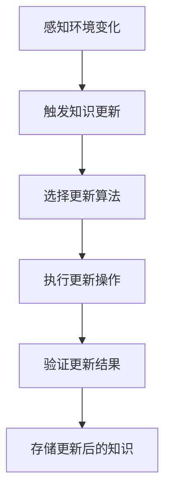
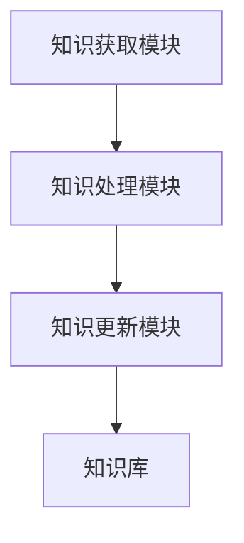
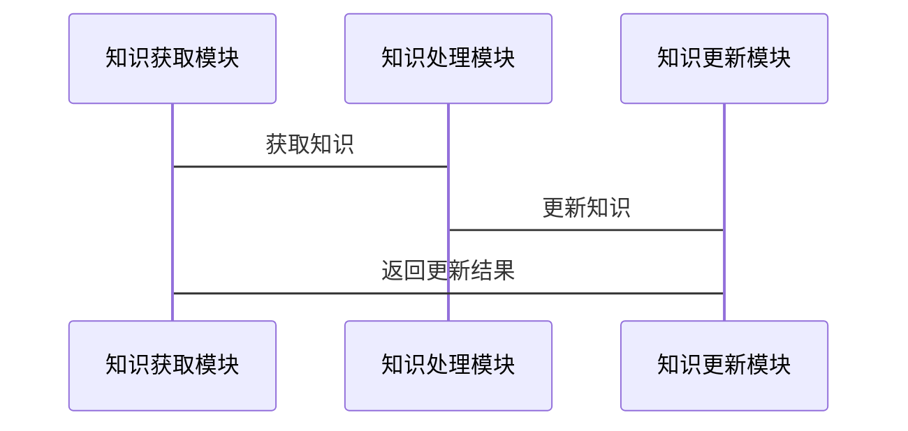

                 


# AI Agent 的动态知识更新：保持 LLM 知识的实时性

> 关键词：AI Agent，动态知识更新，LLM，知识实时性，机器学习，知识图谱，系统架构

> 摘要：本文深入探讨了AI Agent中的动态知识更新机制，重点分析了如何保持大型语言模型（LLM）知识的实时性。通过详细的技术分析和系统设计，本文提出了实现动态知识更新的算法原理、系统架构和项目实战方案，为AI Agent的持续优化提供了理论支持和实践指导。

---

## 第一部分：AI Agent 的动态知识更新概述

### 第1章：AI Agent 与动态知识更新的背景介绍

#### 1.1 AI Agent 的基本概念

##### 1.1.1 什么是 AI Agent
AI Agent（人工智能代理）是指能够感知环境、自主决策并执行任务的智能实体。AI Agent 可以是软件程序、机器人或其他智能系统，其核心目标是通过与环境交互来实现特定任务。

##### 1.1.2 AI Agent 的核心特征
- **自主性**：AI Agent 可以自主决策，无需外部干预。
- **反应性**：能够实时感知环境并做出反应。
- **目标导向**：具有明确的目标，并通过行动实现目标。
- **学习能力**：能够通过经验或数据进行优化和改进。

##### 1.1.3 AI Agent 的应用场景
- **智能助手**：如 Siri、Alexa 等，为用户提供信息查询、任务执行等服务。
- **自动驾驶**：通过实时感知环境和决策，实现车辆的自主驾驶。
- **智能推荐系统**：根据用户行为和偏好，实时推荐相关内容。

#### 1.2 动态知识更新的背景与意义

##### 1.2.1 知识实时性的需求
AI Agent 的核心能力依赖于知识的准确性和实时性。随着环境的变化，旧的知识可能迅速过时，因此需要动态更新知识以保持其有效性。

##### 1.2.2 动态知识更新的必要性
- **适应性**：动态更新使 AI Agent 能够适应快速变化的环境。
- **准确性**：通过实时更新，确保知识的准确性。
- **效率提升**：动态更新可以减少错误决策，提高任务执行效率。

##### 1.2.3 动态知识更新的挑战
- **数据源的多样性**：需要从多种数据源获取信息，保证数据的全面性。
- **数据的质量控制**：如何处理噪声数据和错误信息是一个关键问题。
- **更新频率与计算资源的平衡**：频繁的更新可能带来计算资源的消耗问题。

---

### 第2章：动态知识更新的核心概念与联系

#### 2.1 动态知识更新的原理

##### 2.1.1 知识表示与存储
知识表示是动态更新的基础。常用的表示方法包括：
- **符号表示**：使用符号逻辑表示知识，如规则库。
- **向量表示**：使用向量空间模型表示知识，如 Word2Vec。
- **知识图谱**：使用图结构表示实体及其关系，如 RDF、知识图谱。

##### 2.1.2 知识更新的触发机制
知识更新的触发机制决定了何时进行更新：
- **基于时间的触发**：定期更新知识库。
- **基于事件的触发**：当检测到特定事件时，触发知识更新。
- **基于反馈的触发**：根据用户反馈或系统性能指标，触发知识更新。

##### 2.1.3 知识验证与校准
知识更新后需要进行验证和校准：
- **验证**：通过对比新旧知识，确保更新后知识的正确性。
- **校准**：通过调整权重或引入外部数据，优化知识表示。

#### 2.2 动态知识更新的系统架构

##### 2.2.1 知识库的设计与实现
知识库是动态知识更新的核心部分，设计时需要考虑：
- **可扩展性**：支持大规模数据的存储和查询。
- **高效性**：支持快速的查询和更新操作。
- **一致性**：确保知识库中数据的逻辑一致。

##### 2.2.2 知识更新的流程图



##### 2.2.3 系统组件之间的关系
系统组件包括：
- **感知模块**：负责感知环境变化并触发知识更新。
- **更新模块**：负责选择和执行知识更新算法。
- **验证模块**：负责验证更新后的知识。
- **存储模块**：负责存储更新后的知识。

---

### 第3章：动态知识更新的算法原理

#### 3.1 知识更新的算法选择

##### 3.1.1 基于概率的更新算法
基于概率的算法通过概率模型更新知识，常用的方法包括贝叶斯推断。

##### 3.1.2 基于规则的更新算法
基于规则的算法通过预定义的规则进行知识更新，适用于规则明确的场景。

##### 3.1.3 基于机器学习的更新算法
基于机器学习的算法通过训练模型自动更新知识，常用的模型包括深度学习模型。

#### 3.2 算法实现的详细步骤

##### 3.2.1 数据预处理与特征提取
数据预处理包括数据清洗和特征提取，特征提取可以通过 Word2Vec 或其他方法实现。

##### 3.2.2 模型训练与优化
模型训练需要选择合适的算法并进行优化，如调整学习率和批量大小。

##### 3.2.3 知识更新的执行流程
知识更新的执行流程包括数据获取、模型训练、知识更新和验证。

---

### 第4章：动态知识更新的数学模型与公式

#### 4.1 知识更新的概率模型

##### 4.1.1 贝叶斯定理的应用
贝叶斯定理用于计算在新证据下的概率：

$$ P(A|B) = \frac{P(B|A)P(A)}{P(B)} $$

##### 4.1.2 知识更新的马尔可夫链模型
马尔可夫链模型用于描述状态转移过程：

$$ P(X_{t+1} | X_t) $$

##### 4.1.3 动态知识更新的数学表达式
动态知识更新可以通过以下公式表示：

$$ \Delta K = K_{\text{new}} - K_{\text{old}} $$

其中，$K_{\text{new}}$ 是更新后的知识，$K_{\text{old}}$ 是旧的知识。

#### 4.2 知识更新的优化算法

##### 4.2.1 常见优化算法的比较
常用的优化算法包括梯度下降、Adam 等。

##### 4.2.2 基于梯度下降的知识更新公式
梯度下降的更新公式为：

$$ \theta_{t+1} = \theta_t - \eta \nabla L(\theta_t) $$

其中，$\eta$ 是学习率，$\nabla L$ 是损失函数的梯度。

##### 4.2.3 算法的收敛性分析
分析算法的收敛性需要考虑学习率、批量大小等因素。

---

### 第5章：动态知识更新的系统架构设计

#### 5.1 系统功能模块划分

##### 5.1.1 知识获取模块
负责从多种数据源获取知识，如网络爬虫、API 等。

##### 5.1.2 知识处理模块
负责对获取的知识进行清洗、转换和存储。

##### 5.1.3 知识更新模块
负责根据触发条件执行知识更新操作。

#### 5.2 系统架构的实现

##### 5.2.1 系统组件的交互流程



##### 5.2.2 系统的可扩展性设计
系统设计时需要考虑模块的独立性和可扩展性。

##### 5.2.3 系统的容错与纠错机制
需要设计容错机制，如错误检测和恢复机制。

#### 5.3 系统接口设计

##### 5.3.1 接口定义
系统接口需要定义输入输出格式和调用方式。

##### 5.3.2 接口实现
接口实现需要考虑性能和安全性。

#### 5.4 系统交互的序列图



---

### 第6章：动态知识更新的项目实战

#### 6.1 项目环境的安装与配置

##### 6.1.1 开发工具的安装
安装 Python、Jupyter 等开发工具。

##### 6.1.2 依赖库的安装与配置
安装必要的依赖库，如 TensorFlow、PyTorch 等。

##### 6.1.3 环境变量的设置
设置必要的环境变量，如 API 接口密钥等。

#### 6.2 核心代码实现

##### 6.2.1 知识更新算法

```python
def update_knowledge(old_knowledge, new_data):
    # 数据预处理
    processed_data = preprocess(new_data)
    # 知识更新
    updated_knowledge = update_algorithm(old_knowledge, processed_data)
    return updated_knowledge
```

##### 6.2.2 知识验证与存储

```python
def verify_knowledge(updated_knowledge):
    # 验证逻辑
    if verify(updated_knowledge):
        return True
    else:
        return False

def store_knowledge(knowledge_base, updated_knowledge):
    # 存储逻辑
    knowledge_base.update(updated_knowledge)
```

#### 6.3 实际案例分析

##### 6.3.1 案例背景
假设我们有一个智能问答系统，需要实时更新问答对。

##### 6.3.2 实施步骤
1. 获取新的问答对数据。
2. 对数据进行清洗和转换。
3. 执行知识更新算法。
4. 验证更新后的知识。
5. 存储更新后的知识。

#### 6.4 项目小结
通过项目实战，我们可以验证动态知识更新算法的有效性和可行性。

---

## 总结与展望

本文详细探讨了 AI Agent 的动态知识更新机制，从背景介绍到系统架构设计，再到项目实战，为实现知识的实时性提供了全面的技术支持。未来的研究可以进一步优化算法和系统架构，以应对更复杂的应用场景。

