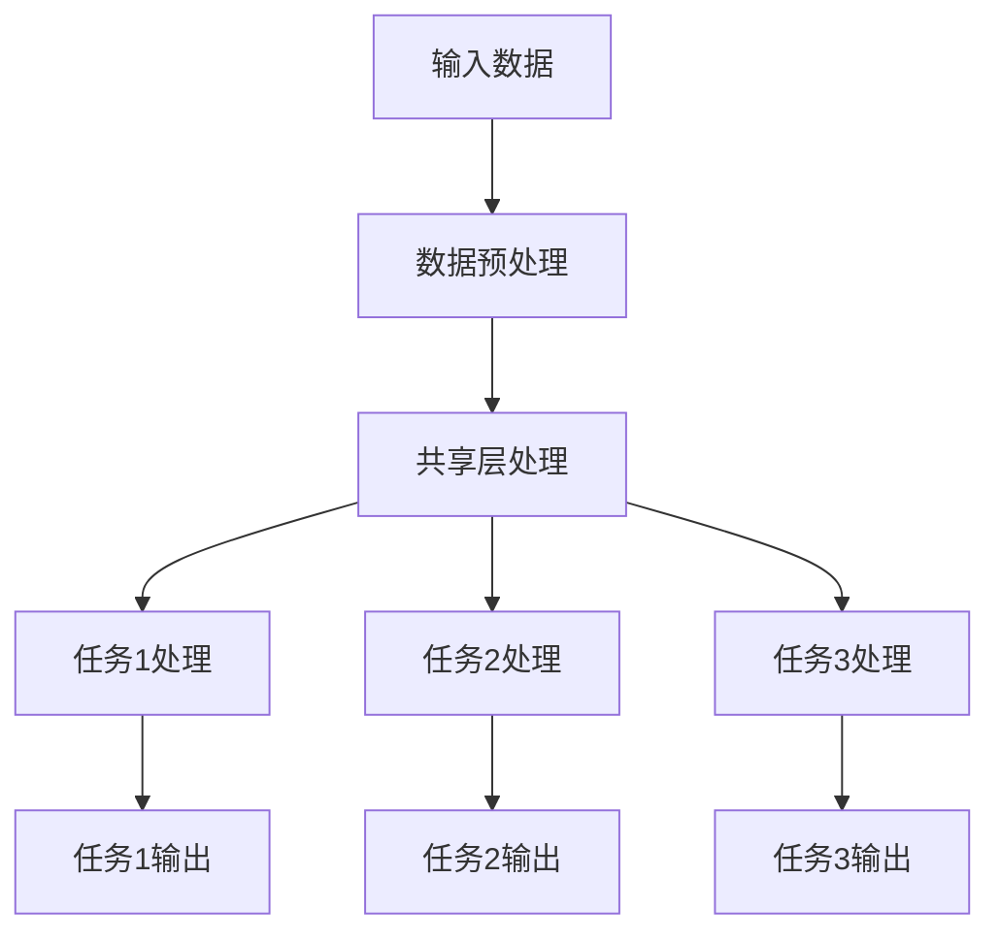
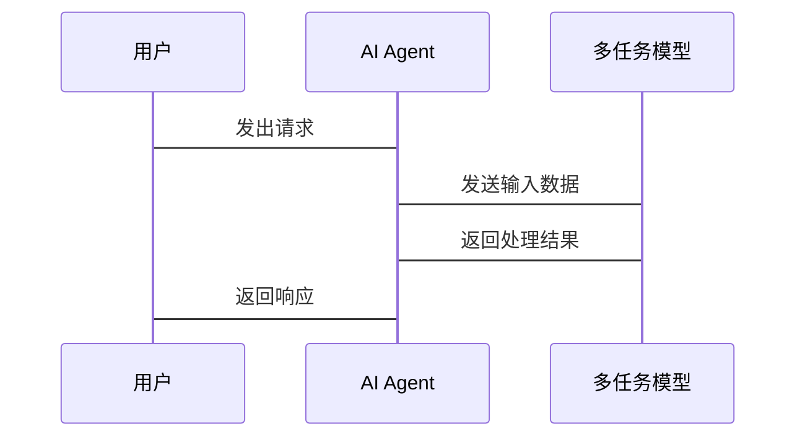

                 


# AI Agent 的多任务学习：增强 LLM 的泛化能力

**关键词**：AI Agent，多任务学习，LLM，泛化能力，强化学习，模型优化，任务协调

**摘要**：本文探讨AI Agent如何通过多任务学习技术增强大语言模型（LLM）的泛化能力。文章从背景、原理、算法、系统设计到项目实战，全面分析多任务学习如何提升LLM的多任务处理能力，帮助读者理解AI Agent在复杂任务中的应用。

---

# 第1章 AI Agent与多任务学习的背景与基础

## 1.1 AI Agent的基本概念

### 1.1.1 AI Agent的定义
AI Agent是一种智能实体，能够感知环境、执行任务并做出决策。它通过传感器获取信息，使用算法处理数据，驱动执行器完成目标。

### 1.1.2 AI Agent的核心特征
- **自主性**：无需外部干预，自主决策。
- **反应性**：实时响应环境变化。
- **目标导向**：基于目标驱动行动。
- **社会能力**：与人和其他系统交互协作。

### 1.1.3 AI Agent的应用场景
- 服务机器人：提供咨询、配送服务。
- 智能助手：如Siri、Alexa，协助日常任务。
- 自动驾驶：处理复杂交通环境。
- 游戏AI：在电竞中做出决策。

## 1.2 多任务学习的定义与特点

### 1.2.1 多任务学习的定义
多任务学习（Multi-task Learning, MTL）指让模型同时学习多个任务，共享知识以提升整体性能。

### 1.2.2 多任务学习的核心优势
- **知识共享**：减少数据需求，提升学习效率。
- **任务协同**：利用任务间关联，增强模型表现。
- **泛化能力**：提升模型在新任务中的适应性。

### 1.2.3 多任务学习与单任务学习的对比
| 特性 | 单任务学习 | 多任务学习 |
|------|------------|------------|
| 数据需求 | 高 | 低 |
| 任务独立性 | 高 | 低 |
| 泛化能力 | 有限 | 强 |

## 1.3 LLM的泛化能力与多任务学习的关系

### 1.3.1 LLM的泛化能力定义
泛化能力指模型在未见过的数据上表现良好，依赖其学习能力和数据分布的覆盖。

### 1.3.2 多任务学习对LLM泛化能力的提升
多任务学习通过共享参数，增强模型在不同任务中的表现，提升其泛化能力。

### 1.3.3 多任务学习在AI Agent中的作用
AI Agent需处理多种任务，多任务学习帮助其高效学习和执行，增强整体性能。

## 1.4 本章小结
本章介绍了AI Agent和多任务学习的基本概念，分析了多任务学习对LLM泛化能力的提升作用，为后续章节打下基础。

---

# 第2章 多任务学习的核心概念与原理

## 2.1 多任务学习的原理

### 2.1.1 参数共享机制
多任务学习通过共享参数，减少模型参数量，提升任务间的关联性。

### 2.1.2 任务间关系的建模
分析任务间关系，优化模型结构，提升多任务学习效果。

### 2.1.3 多任务学习的优化目标
最小化多个任务的损失函数，寻找参数最优解。

## 2.2 多任务学习的算法框架

### 2.2.1 基于梯度的多任务学习
使用梯度下降优化，平衡多个任务损失。

### 2.2.2 参数分离的多任务学习
为不同任务分配独立参数，避免干扰。

### 2.2.3 任务优先级的动态调整
根据任务重要性动态调整优化策略。

## 2.3 多任务学习的挑战与解决方案

### 2.3.1 任务间冲突的处理
通过任务权重调整和参数分离减少冲突。

### 2.3.2 任务不平衡问题的解决
采用加权损失函数和数据采样技术。

### 2.3.3 计算资源的优化分配
优化计算资源分配，平衡任务间计算需求。

## 2.4 本章小结
本章深入探讨了多任务学习的原理、算法和挑战，为后续应用打下基础。

---

# 第3章 LLM的泛化能力分析

## 3.1 LLM的泛化能力现状

### 3.1.1 LLM的训练目标
通过大量数据训练，提升模型在不同任务中的表现。

### 3.1.2 LLM的推理机制
利用生成模型，根据输入生成合理输出。

### 3.1.3 LLM的泛化能力的瓶颈
数据覆盖不足和模型鲁棒性限制泛化能力。

## 3.2 多任务学习对LLM泛化能力的提升

### 3.2.1 多任务学习的特征提取能力
通过多任务学习，模型能提取更多通用特征。

### 3.2.2 多任务学习的迁移能力
提升模型在新任务中的迁移能力。

### 3.2.3 多任务学习的鲁棒性增强
增强模型在不同场景下的稳定性。

## 3.3 AI Agent中的应用

### 3.3.1 多任务学习在AI Agent中的具体应用
AI Agent处理多种任务，如问答、推理和决策。

### 3.3.2 多任务学习提升AI Agent的综合能力
通过多任务学习，AI Agent能更高效地执行复杂任务。

## 3.4 本章小结
本章分析了LLM的泛化能力现状，探讨了多任务学习在提升其能力中的作用。

---

# 第4章 多任务学习的算法实现与优化

## 4.1 多任务学习的算法实现

### 4.1.1 参数共享的实现
通过共享参数，降低模型复杂度。

### 4.1.2 任务权重的动态调整
根据任务重要性调整权重，优化性能。

### 4.1.3 任务间的梯度平衡
平衡不同任务的梯度影响，避免某一任务主导优化。

## 4.2 多任务学习的优化策略

### 4.2.1 使用预训练模型
基于预训练模型，进行多任务微调。

### 4.2.2 任务优先级排序
根据任务重要性动态调整优化顺序。

### 4.2.3 知识蒸馏
通过蒸馏技术，优化模型结构，减少参数量。

## 4.3 算法实现的代码示例

```python
import torch
import torch.nn as nn
import torch.optim as optim

class MultiTaskModel(nn.Module):
    def __init__(self, num_tasks=3):
        super().__init__()
        self.shared_layer = nn.Linear(10, 5)  # 共享层
        self.task_specific_layers = nn.ModuleList([nn.Linear(5, 1) for _ in range(num_tasks)])
        
    def forward(self, x):
        x = self.shared_layer(x)
        outputs = []
        for i, layer in enumerate(self.task_specific_layers):
            outputs.append(layer(x))
        return outputs

model = MultiTaskModel()
criterion = nn.MSELoss()
optimizer = optim.Adam(model.parameters(), lr=0.001)

# 假设有多任务批次的数据
inputs = torch.randn(10, 10)
labels = [torch.randn(10, 1), torch.randn(10, 1), torch.randn(10, 1)]

outputs = model(inputs)
loss = 0
for out, label in zip(outputs, labels):
    loss += criterion(out, label)
loss /= len(outputs)
loss.backward()
optimizer.step()
```

### 代码解读
- **MultiTaskModel**：定义一个多任务模型，包含共享层和任务特定层。
- **forward**：前向传播，共享层输出后，通过任务特定层生成多任务输出。
- **训练循环**：计算多个任务的损失，反向传播更新参数。

## 4.4 算法优化策略

### 4.4.1 参数空间优化
通过调整共享参数，减少参数数量，提升效率。

### 4.4.2 任务间梯度平衡
平衡不同任务在优化过程中的梯度影响，防止某一任务主导优化。

### 4.4.3 任务动态权重
根据任务难度动态调整权重，提升整体性能。

## 4.5 本章小结
本章详细讲解了多任务学习的算法实现与优化策略，为实际应用提供指导。

---

# 第5章 系统分析与架构设计方案

## 5.1 系统架构设计

### 5.1.1 系统功能设计
- 数据输入模块：接收多任务输入。
- 处理模块：执行多任务处理。
- 输出模块：生成多任务输出。

### 5.1.2 系统架构图


### 5.1.3 系统交互流程


## 5.2 系统接口设计

### 5.2.1 输入接口
- 接收多个任务输入，进行数据预处理。

### 5.2.2 输出接口
- 提供多个任务的输出结果。

### 5.2.3 任务协调接口
- 负责任务间的协调和优先级管理。

## 5.3 本章小结
本章详细分析了AI Agent的系统架构设计，展示了如何通过多任务学习实现复杂任务处理。

---

# 第6章 项目实战：基于多任务学习的AI Agent开发

## 6.1 环境安装

### 6.1.1 安装Python
确保安装Python 3.8及以上版本。

### 6.1.2 安装PyTorch
使用pip安装：`pip install torch torchvision torchaudio`

### 6.1.3 安装其他依赖
安装Hugging Face库：`pip install transformers`

## 6.2 核心代码实现

### 6.2.1 多任务模型定义
```python
class MultiTaskModel(nn.Module):
    def __init__(self, input_size=10, hidden_size=5, output_size=3):
        super().__init__()
        self.shared_layer = nn.Linear(input_size, hidden_size)
        self.task_specific_layers = nn.ModuleList([
            nn.Linear(hidden_size, output_size) for _ in range(3)
        ])
        
    def forward(self, x):
        x = self.shared_layer(x)
        outputs = []
        for layer in self.task_specific_layers:
            outputs.append(layer(x))
        return outputs
```

### 6.2.2 训练循环
```python
model = MultiTaskModel()
optimizer = optim.Adam(model.parameters(), lr=0.001)
criterion = nn.MSELoss()

for epoch in range(num_epochs):
    for inputs, labels in dataloader:
        outputs = model(inputs)
        total_loss = 0
        for out, label in zip(outputs, labels):
            loss = criterion(out, label)
            total_loss += loss.item()
        total_loss /= len(outputs)
        optimizer.zero_grad()
        loss.backward()
        optimizer.step()
```

### 6.2.3 测试与评估
```python
with torch.no_grad():
    for inputs, labels in test_dataloader:
        outputs = model(inputs)
        for out, label in zip(outputs, labels):
            loss = criterion(out, label)
            print(f"Loss: {loss.item()}")
```

## 6.3 项目实战案例分析

### 6.3.1 项目介绍
开发一个多任务AI Agent，处理问答、推理和决策任务。

### 6.3.2 实施步骤
1. 收集多任务数据。
2. 模型训练。
3. 模型评估与优化。

### 6.3.3 案例分析
通过具体案例，展示多任务学习在提升AI Agent性能中的作用。

## 6.4 本章小结
本章通过项目实战，展示了多任务学习在AI Agent开发中的具体应用，帮助读者掌握实际操作技能。

---

# 第7章 总结与展望

## 7.1 本章总结
本文详细探讨了AI Agent的多任务学习，分析了其对LLM泛化能力的提升，展示了实际应用案例。

## 7.2 未来展望
未来，多任务学习将在AI Agent中发挥更大作用，结合强化学习和知识图谱，进一步提升性能。

## 7.3 最佳实践Tips
- 合理设计任务结构。
- 优化参数共享机制。
- 动态调整任务优先级。

## 7.4 注意事项
- 避免任务间过度干扰。
- 保证数据质量与多样性。
- 定期评估与优化模型。

## 7.5 拓展阅读
推荐相关书籍和论文，帮助读者深入学习。

---

**全文小结**
本文全面探讨了AI Agent的多任务学习，分析了其对LLM泛化能力的提升，展示了实际应用案例。通过系统分析和项目实战，帮助读者理解多任务学习在AI Agent中的应用，为未来研究提供方向。

