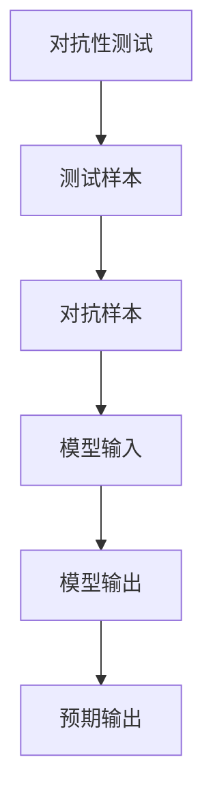
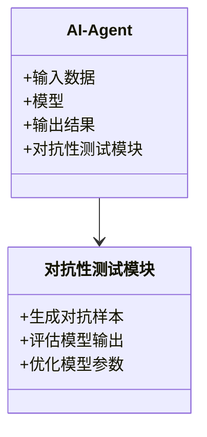

                 


# AI Agent 的对抗性测试：提高 LLM 的鲁棒性

## 关键词：AI Agent，对抗性测试，大语言模型，鲁棒性，模型安全，机器学习

## 摘要：  
随着大语言模型（LLM）在各个领域的广泛应用，模型的鲁棒性和安全性问题日益重要。对抗性测试作为一种有效的手段，能够揭示模型在极端情况下的表现，从而提高其鲁棒性。本文从对抗性测试的基本概念出发，详细探讨其在AI Agent中的应用，结合实际案例和系统设计，为提升LLM的鲁棒性提供全面的解决方案。

---

# 第一部分: AI Agent 的对抗性测试基础

## 第1章: 对抗性测试的背景与概念

### 1.1 对抗性测试的定义与背景  
- **对抗性测试**：通过故意引入干扰或噪声，评估模型在异常输入下的表现。  
- **AI Agent**：具备自主决策能力的智能体，依赖模型进行推理和决策。  
- **对抗性测试的目的**：发现模型的脆弱性，提升其在复杂环境中的可靠性。  

### 1.2 大语言模型（LLM）的基本原理  
- **LLM 的基本工作原理**：基于大规模数据训练的深度神经网络，通过概率生成文本。  
- **LLM 的训练与推理过程**：监督学习与无监督学习的结合，自适应调整模型参数。  
- **LLM 的优势与局限性**：高准确率但对异常输入敏感，鲁棒性不足。  

### 1.3 对抗性测试在AI Agent中的作用  
- **提高模型鲁棒性的必要性**：对抗性测试是模型安全的重要保障。  
- **对抗性测试在安全领域的应用**：防御攻击，确保模型在恶意输入下的稳定运行。  
- **对抗性测试对模型性能的提升作用**：通过压力测试优化模型，增强其适应能力。  

---

## 第2章: 对抗性测试的核心概念与联系  

### 2.1 对抗性测试的原理与方法  
- **对抗样本的生成原理**：通过扰动输入数据，使得模型输出错误的结果。  
- **对抗性攻击的分类与特征**：包括白盒攻击、黑盒攻击，以及基于梯度和非梯度的攻击方法。  
- **对抗性测试的数学模型**：通过优化目标函数生成对抗样本。  

| **对抗性攻击类型** | **攻击目标** | **攻击方式** |  
|---------------------|---------------|---------------|  
| 白盒攻击           | 模型内部参数   | 利用梯度信息生成对抗样本 |  
| 黑盒攻击           | 模型外部接口   | 使用目标模型的输出反馈进行迭代优化 |  

### 2.2 对抗性测试与模型鲁棒性的关系  
- **鲁棒性定义与衡量标准**：模型在面对干扰时的输出一致性。  
- **对抗性测试对模型鲁棒性的评估作用**：揭示模型在异常输入下的脆弱性。  
- **提高模型鲁棒性的策略**：增强模型对干扰的免疫能力，优化模型结构。  

### 2.3 对抗性测试的实体关系图  


---

## 第3章: 对抗性测试的算法原理  

### 3.1 对抗样本生成算法  
- **FGSM 算法的原理与实现**：通过计算梯度，生成对抗样本。  
- **PGD 算法的原理与实现**：基于优化目标，迭代生成对抗样本。  
- **梯度下降法的数学推导**：通过最小化损失函数，找到最优对抗样本。  

### 3.2 对抗性测试的数学模型  
- **对抗样本生成的目标函数**：  
  $$ \text{loss}(x, y) = \mathbb{E}_{x,y}[\text{loss}(x, y)] $$
- **对抗性攻击的优化目标**：  
  $$ \min_{\epsilon} \text{loss}(x + \epsilon, y) $$  

### 3.3 对抗性测试的算法流程图  
```mermaid
graph T
A[开始] --> B[输入原始样本x]
B --> C[计算梯度]
C --> D[生成对抗样本x + \epsilon]
D --> E[输入模型]
E --> F[输出结果]
F --> G[评估结果]
G --> H[结束]
```

---

## 第4章: 对抗性测试的系统分析与架构设计  

### 4.1 问题场景介绍  
- **对抗性测试的应用场景**：模型部署在复杂环境中的鲁棒性测试。  

### 4.2 系统功能设计  


### 4.3 系统架构设计  


### 4.4 接口设计与交互流程图  


---

## 第5章: 对抗性测试的项目实战  

### 5.1 环境安装与配置  
- **Python版本**：Python 3.8 或更高版本。  
- **依赖库安装**：PyTorch、Transformers、Scikit-learn。  

### 5.2 核心代码实现  
```python
import torch
import torch.nn as nn
import torch.optim as optim

# 定义模型
class SimpleModel(nn.Module):
    def __init__(self):
        super(SimpleModel, self).__init__()
        self.fc = nn.Linear(10, 5)
    
    def forward(self, x):
        return self.fc(x)

# 定义对抗样本生成器
def generate_adversarial_example(model, x, y):
    x = x.clone().requires_grad_(True)
    optimizer = optim.SGD([x], lr=0.1)
    criterion = nn.CrossEntropyLoss()
    for _ in range(10):
        y_pred = model(x)
        loss = criterion(y_pred, y)
        loss.backward()
        optimizer.step()
        x.grad.zero_()
    return x
```

### 5.3 案例分析与结果解读  
- **案例分析**：生成对抗样本并测试模型输出的变化。  
- **结果解读**：对抗样本导致模型输出错误，揭示模型的脆弱性。  

### 5.4 项目总结  
- **对抗性测试的有效性**：成功发现模型的缺陷。  
- **模型优化的方向**：通过对抗性测试结果优化模型结构。  

---

## 第6章: 对抗性测试的最佳实践  

### 6.1 小结与回顾  
- 对抗性测试是提升模型鲁棒性的关键手段。  

### 6.2 注意事项  
- **数据多样性**：确保测试数据的多样性，避免过拟合。  
- **模型评估**：结合多种测试方法，全面评估模型性能。  

### 6.3 拓展阅读  
- 推荐阅读相关论文和书籍，深入理解对抗性测试的前沿技术。  

---

## 总结  
通过对AI Agent的对抗性测试的系统分析和实战应用，我们能够有效提高大语言模型的鲁棒性，确保其在复杂环境中的稳定性和可靠性。

