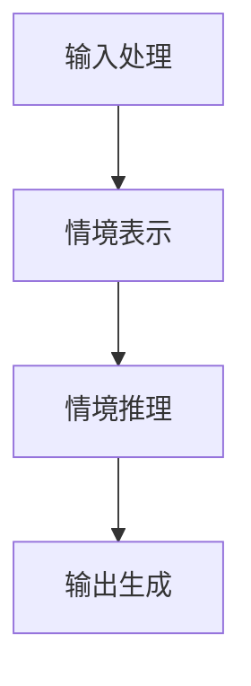
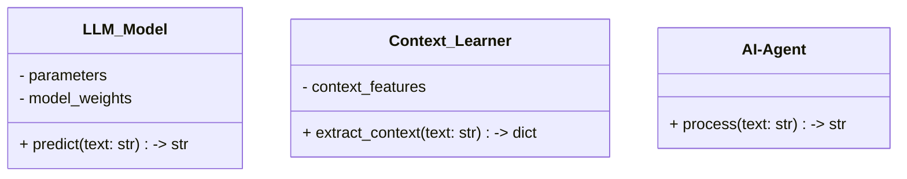
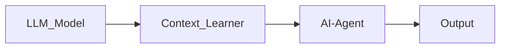

                 


# AI Agent 的情境学习：增强 LLM 的场景适应性

## 关键词：AI Agent, 情境学习, LLM, 场景适应性, 增强学习, 模型优化

## 摘要：  
本文探讨了AI Agent如何通过情境学习提升大语言模型（LLM）的场景适应性。首先介绍了AI Agent和情境学习的基本概念及其在不同场景中的应用。接着分析了当前LLM在场景适应性方面的挑战，详细阐述了情境学习如何帮助LLM更好地理解和适应各种动态场景。通过构建情境学习模型和优化算法，本文提出了将情境学习应用于LLM的具体策略。最后，通过实际项目案例展示了情境学习在增强LLM适应性中的应用效果，总结了当前研究的成果与未来发展方向。

---

## 第1章: AI Agent 的基本概念与情境学习概述

### 1.1 AI Agent 的定义与核心特征  
AI Agent（人工智能代理）是指能够感知环境、自主决策并执行任务的智能实体。其核心特征包括自主性、反应性、目标导向和情境适应性。  

- **自主性**：AI Agent能够独立决策，无需外部干预。  
- **反应性**：能够实时感知环境变化并做出响应。  
- **目标导向**：通过设定目标来指导行为和决策。  
- **情境适应性**：能够根据当前情境调整行为和策略。  

### 1.2 情境学习的定义与特点  
情境学习是一种基于实际情境的学习方法，强调在真实或模拟的环境中通过实践和交互来获取知识和技能。其特点包括：  
1. **情境关联性**：学习内容与实际情境高度相关。  
2. **动态适应性**：能够根据情境变化调整学习策略。  
3. **交互性**：通过与环境和他人的交互促进学习。  

### 1.3 AI Agent 与情境学习的关系  
AI Agent通过情境学习能够更好地理解和适应复杂场景，从而提升其在动态环境中的表现。情境学习为AI Agent提供了丰富的上下文信息，帮助其做出更合理的决策。  

---

## 第2章: LLM 的场景适应性挑战

### 2.1 LLM 的基本原理  
大语言模型（LLM）通过大量数据训练，能够生成自然语言文本并理解上下文。然而，其在特定场景中的适应性仍存在不足。  

- **领域知识的局限性**：LLM通常基于通用数据训练，缺乏特定领域的深度知识。  
- **上下文理解的不足**：在复杂对话中，LLM可能无法准确捕捉情境信息。  
- **动态场景的适应性**：面对快速变化的场景，LLM难以实时调整输出。  

### 2.2 情境学习在增强 LLM 场景适应性中的作用  
通过情境学习，LLM能够结合具体场景的信息，生成更符合上下文的响应。  

- **提升对话质量**：在多轮对话中，情境学习帮助模型更好地理解用户意图。  
- **增强任务执行能力**：通过情境信息，LLM能够更准确地执行复杂任务。  
- **动态适应场景变化**：情境学习使模型能够快速调整以适应新场景。  

---

## 第3章: AI Agent 的情境学习模型

### 3.1 情境学习模型的构建  
情境学习模型包括输入处理、情境表示、情境推理和输出生成四个主要部分。  

- **输入处理**：接收多模态输入（文本、图像等），提取关键信息。  
- **情境表示**：通过向量或图结构表示情境信息，便于模型理解和推理。  
- **情境推理**：基于表示的情境信息，进行关联和推理，生成合理的输出。  
- **输出生成**：根据推理结果生成自然语言文本或其他形式的输出。  

### 3.2 情境学习的算法实现  

#### 算法流程图（mermaid）：  


#### 核心代码示例：  
```python  
def process_input(context):  
    # 提取关键信息  
    return context_features  

def generate_output(context_features):  
    # 基于情境特征生成输出  
    return output_text  
```

### 3.3 情境学习模型的优化  
通过引入强化学习和迁移学习，可以进一步优化情境学习模型的性能。  

- **强化学习**：通过奖励机制，优化模型在特定情境下的决策能力。  
- **迁移学习**：利用已有的知识，快速适应新场景。  

---

## 第4章: 基于情境学习的 LLM 优化策略

### 4.1 LLM 作为基础模型  
大语言模型为情境学习提供了强大的文本生成和理解能力，是AI Agent的核心模块。  

- **模型选择**：选择适合任务的LLM模型（如GPT、BERT等）。  
- **模型微调**：根据特定任务调整模型参数。  

### 4.2 情境学习模块的嵌入  
将情境学习模块嵌入到LLM中，增强其场景适应性。  

- **输入增强**：在LLM的输入中加入情境信息。  
- **输出优化**：基于情境信息调整生成文本的内容和语气。  

### 4.3 模型的协同工作  
通过多模型协作，进一步提升整体性能。  

- **协同学习**：多个模型互相协作，共同完成任务。  
- **知识共享**：模型之间共享知识和经验，提升整体能力。  

---

## 第5章: 项目实战：情境学习增强 LLM 的实现

### 5.1 项目背景与目标  
本项目旨在通过情境学习提升LLM在对话系统中的适应性。  

- **项目背景**：现有对话系统在复杂场景中表现不佳。  
- **项目目标**：通过情境学习优化LLM的对话能力。  

### 5.2 系统功能设计  

#### 领域模型类图（mermaid）：  


### 5.3 系统架构设计  

#### 系统架构图（mermaid）：  


### 5.4 系统实现与优化  
通过实验验证情境学习对LLM性能的提升。  

- **实验设计**：比较有无情境学习的情况下的模型表现。  
- **性能评估**：通过准确率、响应时间等指标评估优化效果。  

---

## 第6章: 总结与展望

### 6.1 全文总结  
本文探讨了AI Agent如何通过情境学习提升LLM的场景适应性，提出了构建情境学习模型和优化策略，并通过项目实战验证了方法的有效性。  

### 6.2 未来研究方向  
- 深化情境学习的理论研究，探索更高效的学习方法。  
- 推动多模态情境学习的研究，提升模型的综合能力。  
- 推广情境学习在更多领域的应用，如教育、医疗等。  

### 6.3 注意事项  
在实际应用中，需注意数据隐私、模型的泛化能力等问题。  

### 6.4 拓展阅读  
推荐阅读相关领域的最新论文和技术博客，深入了解情境学习和大语言模型的前沿技术。

---

通过以上结构，文章详细阐述了AI Agent的情境学习及其对LLM场景适应性的增强，为相关研究和实践提供了有价值的参考。

