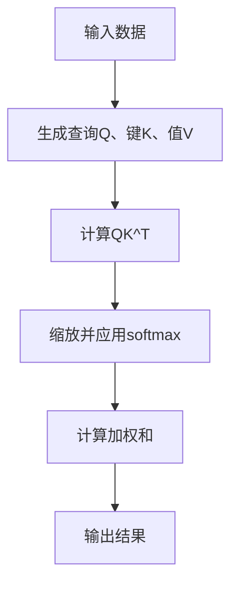
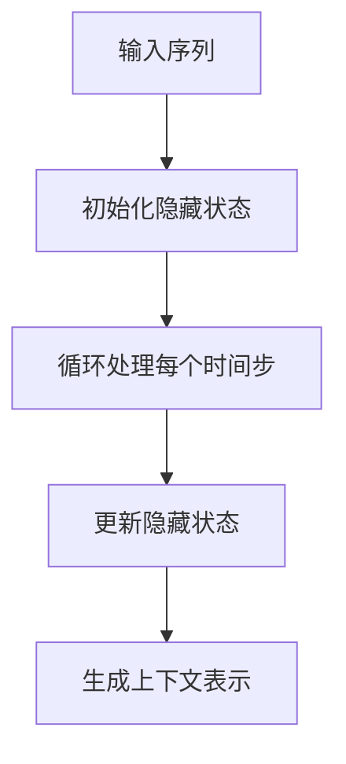
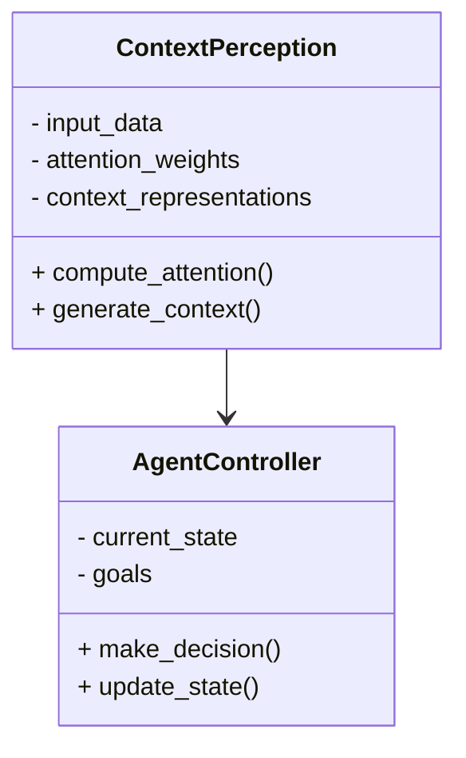
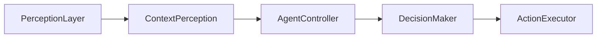
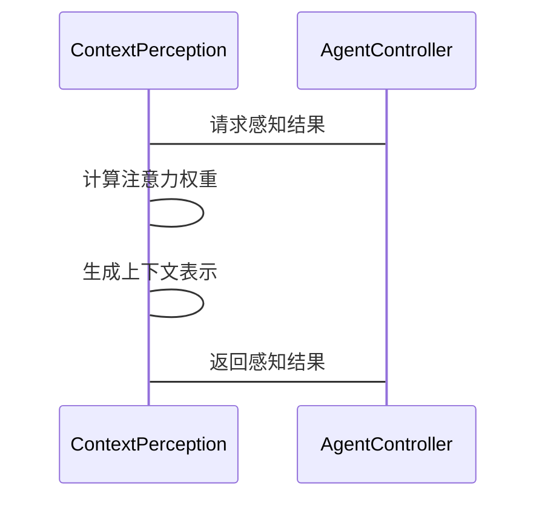

                 


# AI Agent 的情境感知：增强 LLM 的环境适应能力

**关键词：** AI Agent, 情境感知, LLM, 环境适应, 注意力机制, 实体关系图

**摘要：** 本文探讨了AI Agent如何通过情境感知技术增强大语言模型（LLM）的环境适应能力。文章从AI Agent的基本概念入手，详细分析了情境感知的核心概念与原理，包括注意力机制和上下文理解算法。通过系统架构设计和项目实战，展示了如何实现情境感知功能，并通过实际案例分析，进一步探讨了未来的研究方向。

---

# 第三部分: 情境感知的算法原理

# 第3章: 情境感知的核心算法

## 3.1 注意力机制在情境感知中的应用

### 3.1.1 注意力机制的定义

注意力机制是一种模拟人类注意力的选择性关注机制，用于在处理多模态数据时，突出重要信息，降低噪声影响。

### 3.1.2 注意力机制的数学模型

注意力机制的核心是计算查询（Query）、键（Key）和值（Value）之间的相似度，公式如下：

$$
\text{Attention}(Q, K, V) = \text{softmax}\left(\frac{QK^T}{\sqrt{d}}\right)V
$$

其中，$Q$、$K$、$V$分别为查询、键和值向量，$d$为向量维度。

### 3.1.3 注意力机制的实现流程（Mermaid流程图）



### 3.1.4 注意力机制的Python实现示例

```python
import torch

def attention(query, key, value, d_model):
    # 计算相似度
    scores = torch.matmul(query, key.transpose(-2, -1)) / torch.sqrt(torch.tensor(d_model, dtype=torch.float32))
    # 应用Softmax
    attention_weights = torch.softmax(scores, dim=-1)
    # 加权求和
    output = torch.matmul(attention_weights, value)
    return output
```

## 3.2 上下文理解算法

### 3.2.1 上下文理解算法的定义

上下文理解算法旨在通过分析周围环境的信息，生成与当前任务相关的上下文表示。

### 3.2.2 上下文理解算法的数学模型

上下文理解算法通常采用循环神经网络（RNN）或其变体（如LSTM、GRU）进行建模，公式如下：

$$
h_t = \text{RNN}(h_{t-1}, x_t)
$$

其中，$h_t$为当前时间步的隐藏状态，$x_t$为输入数据。

### 3.2.3 上下文理解算法的实现流程（Mermaid流程图）



## 3.3 情境感知算法的对比分析

### 3.3.1 不同情境感知算法的对比表格

| 算法名称      | 核心思想                | 优缺点                     |
|---------------|-------------------------|----------------------------|
| 注意力机制    | 关注重要信息             | 高效但依赖预定义特征         |
| 上下文理解    | 建模序列关系            | 需要大量训练数据             |
| 实体关系图    | 基于图结构分析           | 高准确性但计算复杂           |

### 3.3.2 情境感知算法的优缺点分析

- **优点**：注意力机制能够高效捕捉重要信息；上下文理解算法能够建模复杂序列关系。
- **缺点**：注意力机制依赖预定义特征；上下文理解算法需要大量训练数据。

### 3.3.3 情境感知算法的适用场景

- 注意力机制适用于需要快速定位关键信息的场景。
- 上下文理解算法适用于需要建模动态关系的场景。

## 3.4 本章小结

本章详细介绍了注意力机制和上下文理解算法在情境感知中的应用，分析了不同算法的优缺点及其适用场景。

---

# 第四部分: 系统分析与架构设计

# 第4章: 系统架构设计

## 4.1 问题场景介绍

AI Agent需要在复杂环境中实时感知并做出决策，面临数据多模态、动态变化的挑战。

## 4.2 系统功能设计

### 4.2.1 领域模型类图（Mermaid类图）



### 4.2.2 系统架构图（Mermaid架构图）



### 4.2.3 系统接口设计

- 输入接口：接收多模态数据。
- 输出接口：输出感知结果和决策指令。

### 4.2.4 系统交互序列图（Mermaid序列图）



## 4.3 本章小结

本章通过系统架构设计，展示了AI Agent如何通过情境感知模块实现环境适应能力。

---

# 第五部分: 项目实战

# 第5章: 项目实战

## 5.1 环境安装

安装必要的Python库：

```bash
pip install torch mermaid4jupyter
```

## 5.2 系统核心实现源代码

### 5.2.1 注意力机制实现

```python
import torch

class AttentionModule(torch.nn.Module):
    def __init__(self, embed_dim):
        super().__init__()
        self.embed_dim = embed_dim
        self.W_q = torch.nn.Linear(embed_dim, embed_dim)
        self.W_k = torch.nn.Linear(embed_dim, embed_dim)
        self.W_v = torch.nn.Linear(embed_dim, embed_dim)
    
    def forward(self, x):
        # 计算查询、键、值
        Q = self.W_q(x)
        K = self.W_k(x)
        V = self.W_v(x)
        # 计算注意力权重
        scores = (Q @ K.transpose(-2, -1)) / torch.sqrt(torch.tensor(self.embed_dim, dtype=torch.float32))
        attention_weights = torch.softmax(scores, dim=-1)
        # 加权求和
        output = (V @ attention_weights)
        return output
```

### 5.2.2 上下文理解实现

```python
import torch

class ContextModel(torch.nn.Module):
    def __init__(self, input_dim, hidden_dim):
        super().__init__()
        self.input_dim = input_dim
        self.hidden_dim = hidden_dim
        self.lstm = torch.nn.LSTM(input_dim, hidden_dim, batch_first=True)
    
    def forward(self, x, hidden=None):
        out, hidden = self.lstm(x, hidden)
        return out, hidden
```

## 5.3 项目实战小结

通过实际代码实现，展示了如何将注意力机制和上下文理解算法应用于AI Agent的情境感知模块。

---

# 第六部分: 总结与展望

## 6.1 总结

本文详细探讨了AI Agent的情境感知技术，分析了其在增强LLM环境适应能力中的应用，介绍了相关算法和系统架构设计。

## 6.2 未来展望

未来的研究方向包括更高效的情境感知算法、多模态数据融合技术以及更强大的上下文理解模型。

---

# 结语

通过情境感知技术，AI Agent能够更好地适应复杂环境，为大语言模型的环境适应能力提供了新的思路。

