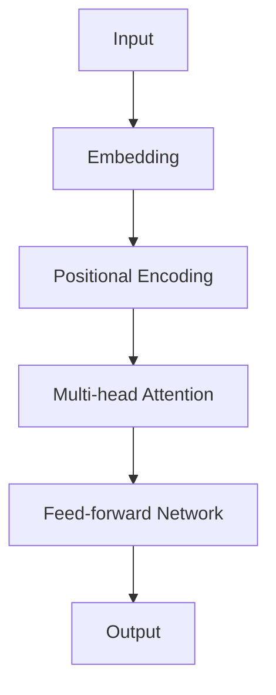
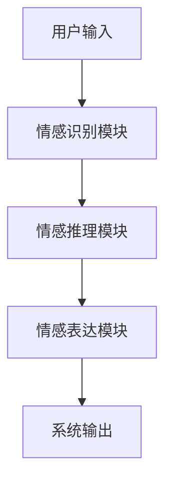

                 


# AI Agent 的情感计算：增强 LLM 的情感交互能力

---

## 关键词

- 情感计算
- AI Agent
- 大型语言模型
- 情感交互
- 机器学习

---

## 摘要

本文探讨了AI Agent在情感计算中的应用，重点分析了如何通过情感计算增强大型语言模型（LLM）的情感交互能力。文章从情感计算的基本概念、AI Agent的特点、情感计算在LLM中的应用、情感计算的算法原理、系统架构设计以及实际项目案例等方面展开，详细阐述了如何通过技术手段提升AI Agent的情感理解与表达能力，从而实现更自然、更高效的交互体验。

---

## 第一部分: 情感计算与AI Agent 的基础

### 第1章: 情感计算的定义与发展

#### 1.1 情感计算的定义

情感计算（Affective Computing）是研究如何通过计算机技术来识别、理解、模拟和回应人类情感的学科。它不仅关注用户的语言内容，还关注用户的情感状态，如喜悦、愤怒、悲伤和惊讶等。

#### 1.2 情感计算的发展历程

- **20世纪90年代**：情感计算的概念首次提出，研究重点集中在情感识别技术上。
- **21世纪初**：随着人工智能技术的发展，情感计算开始应用于人机交互领域。
- **近年来**：深度学习技术的引入，使得情感计算在准确性和实时性上取得了显著进步。

#### 1.3 情感计算的核心要素

| 核心要素 | 描述 |
|----------|------|
| 情感识别 | 通过语言、语音或面部表情识别用户情感 |
| 情感建模 | 建立情感表示模型，描述情感的多维特征 |
| 情感推理 | 根据上下文推断用户的情感状态 |
| 情感表达 | 生成与用户情感相符的回应 |

---

### 第2章: AI Agent 的定义与特点

#### 2.1 AI Agent 的定义

AI Agent（人工智能代理）是指能够感知环境、自主决策并执行任务的智能实体。它可以是一个软件程序、机器人或其他智能设备。

#### 2.2 AI Agent 的核心特点

| 特点 | 描述 |
|------|------|
| 自主性 | 能够自主决策和行动 |
| 反应性 | 能够实时感知并响应环境变化 |
| 学习性 | 能够通过经验改进自身性能 |
| 社交性 | 能够与人类或其他智能体进行交互 |

#### 2.3 情感计算在AI Agent 中的作用

- **提升交互体验**：通过理解用户情感，AI Agent可以提供更个性化的服务。
- **增强决策能力**：情感信息可以帮助AI Agent更好地理解用户需求，从而做出更合理的决策。
- **提高信任度**：情感交互可以增强用户对AI Agent的信任感。

---

## 第二部分: 情感计算的核心概念与联系

### 第3章: 情感计算的核心概念

#### 3.1 情感特征提取

情感特征提取是情感计算的关键步骤，主要包括以下几种方法：

- **基于词汇的方法**：通过分析文本中的关键词来判断情感倾向。
- **基于语调的方法**：通过分析语音的音调、速度和停顿来判断情感。
- **基于语义的方法**：通过分析文本的语义结构来推断情感。

#### 3.2 情感分类与推理

- **情感分类**：将文本划分为不同的情感类别，如正面、负面和中性。
- **情感推理**：根据上下文推断用户的情感状态，例如从“我今天遇到了麻烦”推断出用户的负面情绪。

#### 3.3 情感计算与LLM 的结合

- **LLM 的情感表达能力**：大型语言模型可以通过训练数据模拟人类的情感表达。
- **情感计算对LLM 的增强**：通过情感计算技术，可以进一步提升LLM 在情感交互中的表现。

---

### 第4章: 情感计算的算法原理

#### 4.1 情感分类算法

- **基于深度学习的情感分类模型**：例如使用循环神经网络（RNN）或Transformer模型进行情感分类。
- **模型结构**：以下是一个简单的Transformer模型结构图：



- **数学公式**：情感分类模型的输出可以表示为：

$$ P(y|x) = \text{softmax}(Wx + b) $$

其中，$x$ 是输入向量，$W$ 和 $b$ 是模型的参数。

#### 4.2 情感推理算法

- **基于上下文的推理**：通过分析对话历史来推断用户的情感状态。
- **推理模型**：可以使用图注意力网络（Graph Attention Network）来建模对话中的情感依赖关系。

---

## 第三部分: 系统架构与项目实战

### 第5章: 情感交互系统的架构设计

#### 5.1 系统功能设计

- **情感识别模块**：负责识别用户的情感状态。
- **情感推理模块**：根据上下文推断用户的情感需求。
- **情感表达模块**：生成与用户情感相符的回应。

#### 5.2 系统架构图



---

### 第6章: 项目实战

#### 6.1 环境配置

- **工具安装**：安装Python、TensorFlow、Keras等工具。
- **数据集准备**：获取情感标注的数据集，例如IMDB情感分类数据集。

#### 6.2 核心代码实现

```python
import tensorflow as tf
from tensorflow.keras import layers

# 情感分类模型
model = tf.keras.Sequential([
    layers.Embedding(input_dim=10000, output_dim=16),
    layers.Dropout(0.5),
    layers.Conv1D(filters=16, kernel_size=5, padding="valid", activation="relu"),
    layers.GlobalMaxPooling1D(),
    layers.Dense(1, activation="sigmoid")
])

model.compile(optimizer="adam", loss="binary_crossentropy", metrics=["accuracy"])
model.summary()
```

---

## 第四部分: 最佳实践与总结

### 第7章: 最佳实践

#### 7.1 小结

通过本文的探讨，我们了解了情感计算在AI Agent 中的重要作用，以及如何通过算法和系统设计提升LLM 的情感交互能力。

#### 7.2 注意事项

- 在实际应用中，情感计算的准确性可能会受到数据质量和模型复杂度的影响。
- 需要注意保护用户的隐私，避免情感数据的滥用。

#### 7.3 拓展阅读

- 阅读相关论文，如《Affective Computing: A Survey》。
- 关注情感计算在不同领域的最新应用。

---

## 结语

通过本文的系统性分析，我们深入探讨了AI Agent 的情感计算能力，并展示了如何通过技术手段提升大型语言模型的情感交互能力。未来，随着人工智能技术的不断发展，情感计算将在更多领域发挥重要作用。

