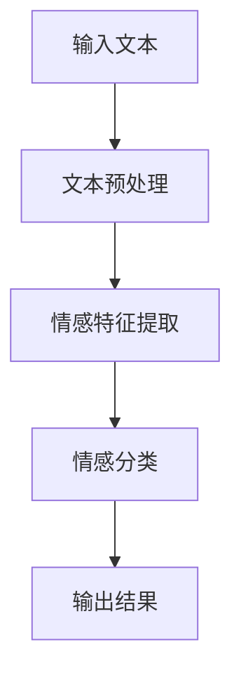
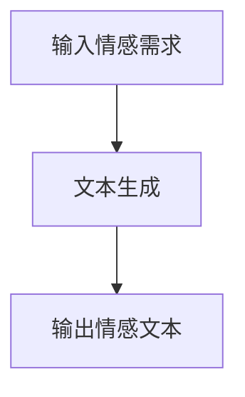
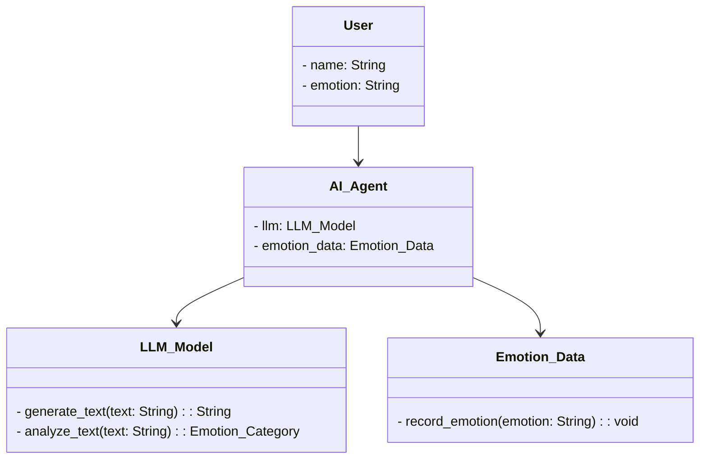
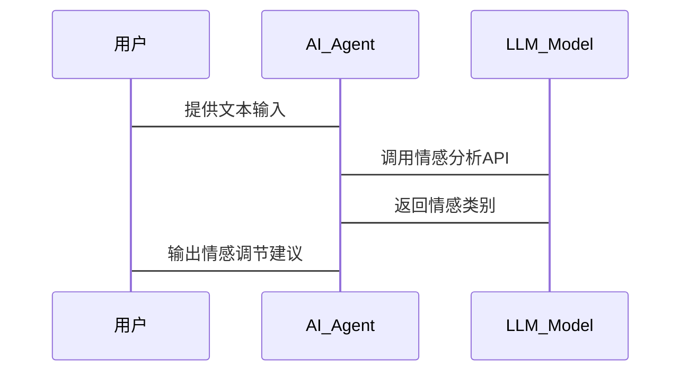

                 


# AI Agent 的情感调节：利用 LLM 进行情绪管理

**关键词**：AI Agent，LLM，情感调节，情绪管理，大语言模型，情感计算

**摘要**：本文探讨了如何利用大语言模型（LLM）进行AI Agent的情感调节，通过背景介绍、核心概念、算法原理、系统架构和项目实战等多角度分析，阐述了情感调节的实现方法及其在实际应用中的潜力。

---

## 第1章: AI Agent 与情感调节的背景介绍

### 1.1 AI Agent 的基本概念
- 1.1.1 AI Agent 的定义与特点
  - AI Agent 是一种能够感知环境并采取行动以实现目标的智能体。
  - 其特点包括自主性、反应性、目标导向性和社会性。

- 1.1.2 情感调节的定义与重要性
  - 情感调节是指管理和控制情绪状态的过程，旨在促进心理健康和提高决策能力。
  - 在AI Agent中，情感调节有助于提升人机交互的自然性和用户体验。

- 1.1.3 AI Agent 在情感调节中的作用
  - AI Agent 可以通过分析用户的情感状态，提供相应的反馈或建议，帮助用户进行情绪管理。

### 1.2 情感调节的背景与问题背景
- 1.2.1 当代社会中的情绪管理需求
  - 现代社会节奏快，压力大，人们需要有效的工具来管理情绪。
  - AI技术的发展为情感调节提供了新的可能性。

- 1.2.2 AI 技术在情绪管理中的应用潜力
  - LLM 具备处理自然语言和理解情感的能力，可应用于情感分析、情感生成等领域。
  - AI Agent 可以通过实时互动帮助用户调节情绪。

- 1.2.3 情感调节的边界与外延
  - 情感调节的边界在于尊重用户隐私和伦理规范。
  - 外延包括情绪识别、情感支持和行为引导等功能。

### 1.3 问题描述与解决方案
- 1.3.1 情绪失控的常见问题
  - 包括焦虑、抑郁、愤怒等情绪问题，影响日常生活和工作效率。

- 1.3.2 AI Agent 在情绪管理中的解决方案
  - 利用 LLM 进行情感分析和生成，提供实时情感支持和建议。

- 1.3.3 情感调节的核心要素与组成
  - 包括情感识别、情感分析、情感生成和反馈机制等。

---

## 第2章: 核心概念与联系

### 2.1 AI Agent 与 LLM 的核心概念
- 2.1.1 AI Agent 的核心原理
  - AI Agent 通过感知环境、分析信息并采取行动来实现目标。
  - 其核心在于智能体的行为决策和交互能力。

- 2.1.2 LLM 的核心原理
  - 大语言模型通过大量数据训练，具备理解和生成自然语言的能力。
  - 其核心在于深度学习和预训练技术。

- 2.1.3 情感调节的数学模型与公式
  - 情感调节模型通常基于概率论和统计学方法，例如贝叶斯网络和马尔可夫链。

### 2.2 核心概念的属性特征对比
- 2.2.1 AI Agent 的属性特征
  - 包括自主性、适应性、学习能力和交互能力等。

- 2.2.2 LLM 的属性特征
  - 包括数据驱动、上下文理解、生成能力和可扩展性等。

- 2.2.3 情感调节的属性特征
  - 包括实时性、个性化、隐私保护和情感准确性等。

### 2.3 ER 实体关系图架构
```mermaid
er
actor(AI Agent) -[>]-> emotion_data(情感数据)
actor(LLM) -[>]-> text_analysis(文本分析)
actor(AI Agent) -[>]-> emotion_regulation(情感调节)
```

### 2.4 本章小结
- 本章通过对比分析AI Agent和LLM的核心概念，明确了情感调节的关键要素和实现路径。

---

## 第3章: 算法原理讲解

### 3.1 情感分析算法
- 3.1.1 基于LLM的情感分析流程
  - 输入文本 -> 文本预处理 -> 情感特征提取 -> 情感分类 -> 输出结果。



- 3.1.2 情感分类的数学模型
  - 使用概率模型计算情感类别，例如贝叶斯分类器。

### 3.2 情感生成算法
- 3.2.1 基于LLM的情感生成流程
  - 输入情感需求 -> 文本生成 -> 输出情感文本。



- 3.2.2 情感生成的数学模型
  - 使用生成对抗网络（GAN）或Transformer模型进行文本生成。

---

## 第4章: 系统分析与架构设计

### 4.1 问题场景介绍
- 以一个AI心理咨询师为例，描述系统需求和目标。

### 4.2 系统功能设计
- 4.2.1 领域模型设计
  - 使用类图展示用户、AI Agent、LLM等组件的关系。



- 4.2.2 系统架构设计
  - 使用分层架构，包括数据层、业务逻辑层和用户界面层。


- 4.2.3 接口设计
  - 定义API接口，例如 `/analyze_emotion` 和 `/generate_response`。

- 4.2.4 交互流程
  - 使用序列图展示用户与AI Agent之间的交互过程。



---

## 第5章: 项目实战

### 5.1 环境安装
- 安装必要的Python库，如 `transformers` 和 `fastapi`。

### 5.2 系统核心实现
- 5.2.1 情感分析模块
  ```python
  from transformers import pipeline
  
  sa_pipeline = pipeline("sentiment-analysis")
  def analyze_emotion(text):
      return sa_pipeline(text)
  ```

- 5.2.2 情感生成模块
  ```python
  from transformers import AutoModelForCausalLM, AutoTokenizer
  
  model_name = "gpt2"
  tokenizer = AutoTokenizer.from_pretrained(model_name)
  model = AutoModelForCausalLM.from_pretrained(model_name)
  
  def generate_emotion_text(prompt):
      inputs = tokenizer.encode(prompt, return_tensors="pt")
      outputs = model.generate(inputs, max_length=50)
      return tokenizer.decode(outputs[0], skip_special_tokens=True)
  ```

### 5.3 案例分析
- 分析一个具体案例，展示如何利用LLM进行情感调节。

### 5.4 项目小结
- 总结项目实现的关键点和经验教训。

---

## 第6章: 最佳实践与小结

### 6.1 最佳实践 tips
- 提供一些实际应用中的注意事项和优化建议。

### 6.2 小结
- 总结全文内容，强调AI Agent在情感调节中的重要性和未来发展方向。

### 6.3 注意事项
- 强调隐私保护和伦理问题，避免滥用技术。

### 6.4 拓展阅读
- 推荐一些相关书籍和论文，供读者深入学习。

---

## 附录: 术语表

- AI Agent：人工智能代理。
- LLM：大语言模型。
- ER图：实体关系图。
- Mermaid：图表绘制工具。
- API：应用程序编程接口。

---

通过以上目录结构，本文将系统地介绍AI Agent的情感调节方法，从理论到实践，帮助读者全面理解并掌握相关技术。

