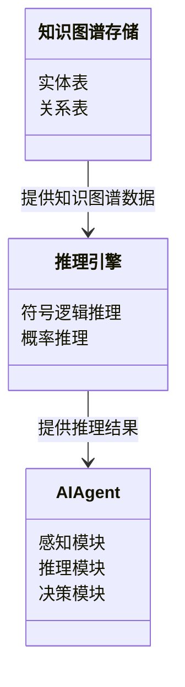
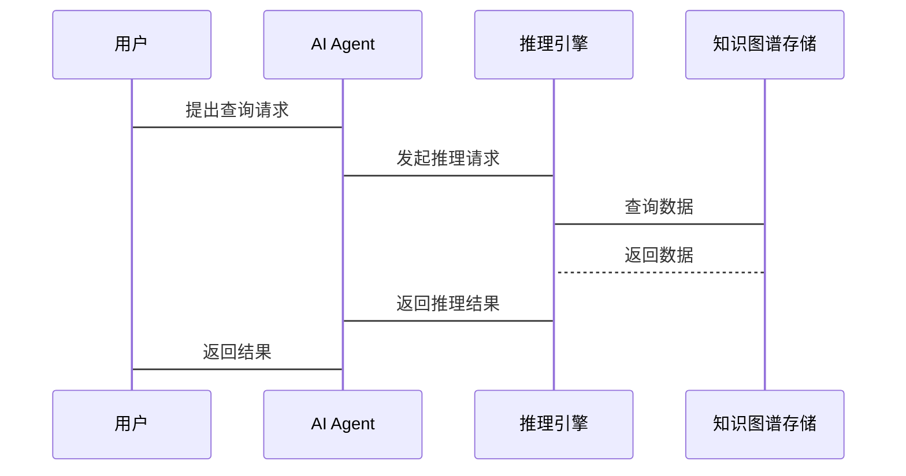

                 


# AI Agent 的知识图谱推理：增强 LLM 的关系理解

> **关键词**：知识图谱，AI Agent，LLM，关系理解，推理，符号逻辑，概率推理，系统架构

> **摘要**：本文探讨了AI Agent如何通过知识图谱推理增强大语言模型（LLM）的关系理解能力。文章从背景介绍、核心概念、算法原理、系统架构设计、项目实战到最佳实践，全面解析了知识图谱推理在提升AI Agent智能水平中的关键作用。通过详细阐述符号逻辑推理和概率推理算法，结合实际项目案例，展示了如何构建高效的系统架构以支持知识图谱推理。最后，总结了知识图谱推理在AI Agent中的应用前景，并提供了实践中的注意事项和拓展阅读建议。

---

## 第一部分：背景与概念

### 第1章：知识图谱与AI Agent概述

#### 1.1 知识图谱的基本概念

知识图谱是一种以结构化的形式表示知识的网络，由三元组（头实体，关系，尾实体）构成。例如，知识图谱可以表示为“张三（人）是李四（人）的儿子”，即（张三，儿子，李四）。知识图谱的特点包括：

- **语义可解释性**：三元组结构使知识易于理解和解释。
- **可扩展性**：支持大规模数据的构建和存储。
- **动态性**：能够根据新数据进行更新和扩展。

知识图谱的应用领域广泛，包括搜索引擎优化、推荐系统、语义搜索、问答系统等。它与传统数据库的区别在于，知识图谱不仅存储数据，还描述数据之间的关系，从而提供更丰富的语义信息。

#### 1.2 AI Agent的基本概念

AI Agent（人工智能代理）是一种智能实体，能够感知环境并采取行动以实现目标。AI Agent的核心功能包括感知、推理、决策和执行。感知通过传感器或数据输入获取信息；推理通过逻辑推理或机器学习模型处理信息；决策基于推理结果制定行动方案；执行则将决策转化为具体操作。

AI Agent的应用场景包括智能助手（如Siri、Alexa）、推荐系统、自动驾驶、智能客服等。AI Agent的分类主要依据其智能水平，从简单的基于规则的代理到复杂的具有学习和自适应能力的代理。

#### 1.3 知识图谱推理的定义与意义

知识图谱推理是指从已有的知识图谱数据中推导出新的知识或关系的过程。它通过逻辑推理或概率推理等方法，利用知识图谱中的已有信息，推断出隐含的事实或关系。知识图谱推理的意义在于：

- **增强AI Agent的理解能力**：通过推理，AI Agent能够更好地理解输入信息的语义和上下文，从而做出更准确的决策。
- **提升系统的智能水平**：推理能力使AI Agent能够处理复杂问题，从简单的信息查询到复杂的逻辑推理。
- **支持动态环境适应**：知识图谱推理使AI Agent能够在动态变化的环境中，根据新信息调整其行为和决策。

---

## 第二部分：核心概念与联系

### 第2章：知识图谱与AI Agent的核心原理

#### 2.1 知识图谱的核心原理

知识图谱的构建过程通常包括数据抽取、实体识别、关系抽取和知识融合等步骤。符号逻辑推理是知识图谱推理的一种基本方法，通过逻辑规则（如谓词逻辑）进行推理。例如，如果A是B的父亲，B是C的父亲，则A是C的祖父。

知识图谱的存储与查询通常使用图数据库（如Neo4j）或基于语义网的RDF（资源描述框架）技术。查询语言如SPARQL用于在知识图谱中执行复杂查询。

#### 2.2 AI Agent的核心原理

AI Agent的感知能力通过传感器或API获取数据，决策能力依赖于推理引擎，执行能力则通过调用外部服务或API实现。AI Agent的知识表示通常采用符号逻辑或概率表示法，以处理不确定性或模糊性。

#### 2.3 知识图谱与AI Agent的关系

知识图谱为AI Agent提供了丰富的语义信息和推理基础，而AI Agent则利用知识图谱推理能力提升其智能水平。知识图谱推理使AI Agent能够理解上下文关系，处理复杂问题，并在动态环境中自适应调整。

---

## 第三部分：算法原理讲解

### 第3章：知识图谱推理的算法原理

#### 3.1 符号逻辑推理算法

符号逻辑推理是一种基于谓词逻辑的推理方法，通过逻辑规则进行推导。例如，规则“如果A是B的子类，那么A是B的实例”可以用于推导新的事实。

**符号逻辑推理步骤：**

1. **规则定义**：定义谓词和逻辑规则。
2. **事实提取**：从知识图谱中提取已知事实。
3. **规则应用**：根据规则推导新的事实。
4. **结果验证**：验证推导结果的正确性。

**符号逻辑推理的数学模型**：

$$ \text{如果 } P(x) \land Q(x) \text{ 成立，则 } R(x) \text{ 成立。} $$

$$ P(x) \land Q(x) \rightarrow R(x) $$

#### 3.2 概率推理算法

概率推理基于概率论，用于处理不确定性问题。例如，根据统计数据显示，下雨的概率为70%，则可以推断出今天可能下雨。

**概率推理步骤：**

1. **数据收集**：收集相关数据。
2. **概率建模**：建立概率模型（如贝叶斯网络）。
3. **概率计算**：计算事件发生的概率。
4. **结果解释**：解释概率结果。

**概率推理的数学模型**：

$$ P(A|B) = \frac{P(B|A)P(A)}{P(B)} $$

---

## 第四部分：系统架构设计

### 第4章：知识图谱推理的系统架构

#### 4.1 问题场景介绍

构建一个支持知识图谱推理的AI Agent系统，需要考虑知识图谱的存储、推理算法的实现以及与外部系统的交互。

#### 4.2 项目介绍

**项目名称**：知识图谱推理系统

**项目目标**：实现基于知识图谱的推理功能，增强AI Agent的关系理解能力。

#### 4.3 系统功能设计

**领域模型（Mermaid类图）**：



#### 4.4 系统架构设计

**系统架构（Mermaid架构图）**：


#### 4.5 系统接口设计

**API接口**：

- **查询接口**：`/query?q={query}`
- **推理接口**：`/infer?from={from}&to={to}`

#### 4.6 系统交互流程（Mermaid序列图）**



---

## 第五部分：项目实战

### 第5章：知识图谱构建与推理

#### 5.1 知识图谱构建

**环境安装**：

```bash
pip install neo4j
```

**核心代码实现**：

```python
from neo4j import GraphDatabase

class KnowledgeGraph:
    def __init__(self, uri, user, password):
        self.driver = GraphDatabase.driver(uri, user, password)

    def add_relationship(self, start_node, relation, end_node):
        with self.driver.session() as session:
            session.run(
                "MATCH (a {id: $start}), (b {id: $end}) "
                "CREATE (a)-[r: {relation}]->(b)",
                parameters={"start": start_node, "end": end_node, "relation": relation}
            )
```

### 第6章：AI Agent的实现

#### 6.1 环境安装

```bash
pip install spacy
```

#### 6.2 核心代码实现

```python
import spacy

nlp = spacy.load("en_core_web_sm")

def infer_relationships(doc):
    for token in doc:
        if token.pos_ == "VERB":
            print(f"{token.text}: {token.dep_}")
```

#### 6.3 实际案例分析

假设我们有一个关于公司组织结构的知识图谱，包含员工、职位、部门等实体。通过符号逻辑推理，可以推断出某个员工的直接上级或所属部门。

---

## 第六部分：最佳实践与总结

### 6.1 最佳实践 tips

- **数据质量**：确保知识图谱的数据准确性和完整性。
- **算法选择**：根据具体问题选择合适的推理算法。
- **系统优化**：优化知识图谱的存储和查询效率。

### 6.2 小结

本文详细探讨了知识图谱推理在增强AI Agent关系理解能力中的应用，从理论基础到实际应用，全面解析了相关技术。通过符号逻辑推理和概率推理的算法实现，结合系统架构设计和项目实战，展示了如何构建高效的知识图谱推理系统。

### 6.3 注意事项

- 知识图谱的构建和维护需要大量资源，需谨慎处理数据质量和完整性。
- 推理算法的选择应基于具体应用场景和数据特性。
- 系统设计需考虑可扩展性和可维护性。

### 6.4 拓展阅读

- **推荐书籍**：《知识图谱：概念、方法与应用》
- **在线资源**：Neo4j官方文档、自然语言处理工具spaCy的官方文档

---

通过本文的学习和实践，读者可以深入了解知识图谱推理在AI Agent中的应用，并能够实际操作构建相关系统。希望本文能为读者提供有价值的参考和指导。

