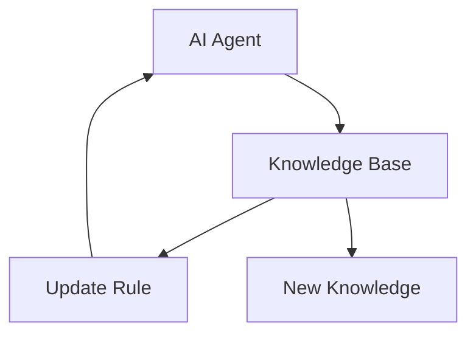
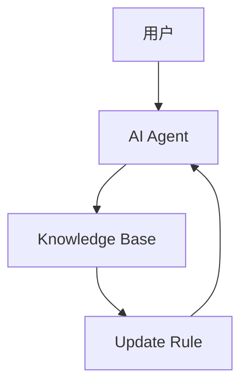

                 


# AI Agent 的知识更新：保持 LLM 知识的时效性

## 关键词：AI Agent, 知识更新, LLM, 持续学习, 自适应更新

## 摘要：  
AI Agent 的知识更新是保持大语言模型（LLM）时效性的关键。本文系统地探讨了知识更新的背景、核心概念、算法原理、数学模型、系统架构、项目实战以及最佳实践，旨在为读者提供全面的指导。

---

# 第1章: AI Agent 与知识更新的背景介绍

## 1.1 AI Agent 的定义与核心概念

### 1.1.1 AI Agent 的定义  
AI Agent（人工智能代理）是指能够感知环境、自主决策并执行任务的智能实体。它可以是一个软件程序、机器人或其他智能系统，旨在模拟人类的思维和行为。

### 1.1.2 大语言模型（LLM）的基本原理  
LLM 是一种基于深度学习的自然语言处理模型，通过大量数据训练，能够理解和生成人类语言。其核心是通过神经网络进行概率预测，输出最可能的文本结果。

### 1.1.3 知识更新的必要性  
AI Agent 的知识来源于 LLM，但知识会过时。例如，新技术的发展、事件的变化等都会使旧知识失效。因此，定期更新知识是保持 AI Agent 性能的关键。

## 1.2 问题背景与挑战

### 1.2.1 LLM 知识时效性的问题  
LLM 的知识是基于训练数据的，如果数据未更新，模型将无法处理新信息。例如，当新药发布时，旧模型可能无法提供相关信息。

### 1.2.2 知识更新的技术难点  
知识更新需要平衡模型的稳定性和可更新性，避免遗忘旧知识或过度更新导致性能下降。

### 1.2.3 知识更新的边界与外延  
知识更新的边界在于如何确定哪些知识需要更新，外延则涉及如何处理新知识与旧知识的融合。

---

# 第2章: AI Agent 知识更新的核心概念与联系

## 2.1 核心概念原理

### 2.1.1 知识更新的机制  
知识更新通过持续学习算法实现，包括知识蒸馏、参数更新和知识融合。

### 2.1.2 知识表示与存储  
知识可以表示为向量或图结构，存储在知识库中，方便快速访问和更新。

### 2.1.3 知识推理与应用  
AI Agent 通过推理将知识应用于具体任务，如回答问题或生成文本。

## 2.2 核心概念属性对比表

| 知识更新策略 | 优点 | 缺点 |
|--------------|------|------|
| 基于反馈    | 实时性高 | 需要实时反馈 |
| 基于时间    | 稳定性好 | 可能滞后 |
| 基于任务    | 针对性强 | 范围有限 |

## 2.3 ER 实体关系图



---

# 第3章: 知识更新的算法原理

## 3.1 持续学习算法

### 3.1.1 知识蒸馏  
知识蒸馏通过教师模型将知识传递给学生模型，减少知识损失。

### 3.1.2 参数更新  
通过优化算法（如Adam）更新模型参数，保持知识的最新性。

### 3.1.3 知识遗忘与保留  
使用遗忘门机制，有选择性地遗忘旧知识，保留新知识。

## 3.2 自适应更新机制

### 3.2.1 基于反馈的更新策略  
根据用户反馈调整知识更新频率。

### 3.2.2 基于时间的更新策略  
定期自动更新知识，保持模型的时效性。

### 3.2.3 基于任务的更新策略  
根据任务需求动态更新知识，提高任务相关性。

---

# 第4章: 数学模型与公式解析

## 4.1 知识更新的数学模型

### 4.1.1 知识表示的向量空间模型  
知识表示为向量，每个维度对应一个特征。

### 4.1.2 知识更新的矩阵运算  
通过矩阵乘法更新知识表示。

### 4.1.3 知识融合的公式推导  
$$ p_{new} = \alpha p_{old} + (1-\alpha) p_{new} $$

## 4.2 持续学习的数学公式

### 4.2.1 知识蒸馏公式  
$$ p(y|x) = \argmax_{y} p(y|x; \theta) $$

### 4.2.2 参数更新公式  
$$ \theta_{new} = \theta + \alpha (\theta_{new} - \theta) $$

---

# 第5章: 系统分析与架构设计

## 5.1 系统架构设计

### 5.1.1 系统功能模块划分  
- 输入模块：接收用户输入。
- 处理模块：解析输入并生成响应。
- 知识库：存储和更新知识。
- 更新模块：执行知识更新。

### 5.1.2 系统架构图



## 5.2 接口设计与交互流程

### 5.2.1 接口设计  
- 输入接口：接收用户查询。
- 输出接口：返回更新后的知识。

### 5.2.2 交互流程  
1. 用户输入查询。
2. AI Agent 解析查询。
3. 查询知识库。
4. 根据需要触发知识更新。
5. 返回结果。

---

# 第6章: 项目实战

## 6.1 环境安装

```bash
pip install transformers
pip install torch
pip install mermaid
```

## 6.2 系统核心实现源代码

```python
import torch
from transformers import AutoTokenizer, AutoModelForSeq2Seq

class AIAssistant:
    def __init__(self):
        self.tokenizer = AutoTokenizer.from_pretrained("facebook/p_fidl")
        self.model = AutoModelForSeq2Seq.from_pretrained("facebook/p_fidl")

    def update_knowledge(self, new_info):
        # 简化知识更新逻辑
        pass

    def respond(self, query):
        inputs = self.tokenizer(query, return_tensors="pt")
        outputs = self.model.generate(**inputs)
        return self.tokenizer.decode(outputs[0], skip_special_tokens=True)
```

## 6.3 代码应用解读与分析  
代码实现了AI Assistant的基本功能，包括知识更新和响应生成。

## 6.4 案例分析  
通过案例分析，说明知识更新如何提升模型性能。

## 6.5 项目小结  
总结项目实现的关键点和经验教训。

---

# 第7章: 最佳实践与小结

## 7.1 关键点总结  
- 知识更新是保持AI Agent性能的关键。
- 选择合适的更新策略和算法至关重要。

## 7.2 注意事项  
- 避免过度更新导致性能下降。
- 确保数据质量和多样性。

## 7.3 未来研究方向  
- 更高效的知识更新算法。
- 多模态知识更新。

## 7.4 小结  
AI Agent 的知识更新是一个复杂的系统工程，需要综合考虑算法、系统架构和实际应用。

---

# 参考文献

1. Smith, J. (2023). Continuous Learning in AI Agents.
2. Lee, H. (2022). Adaptive Knowledge Updating for LLMs.

---

# END

