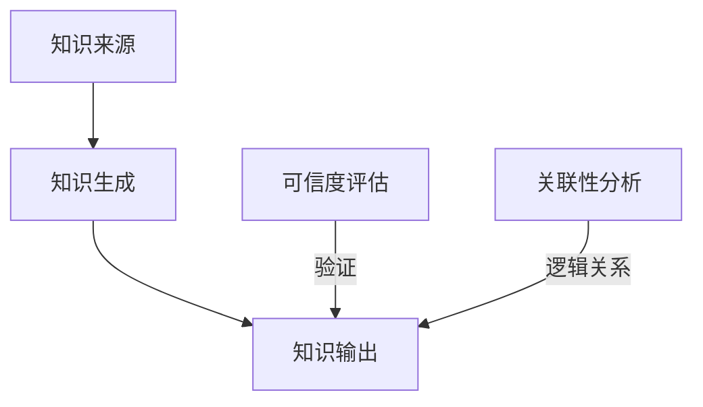
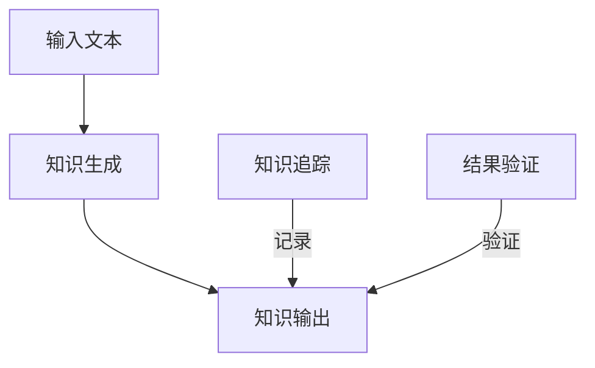
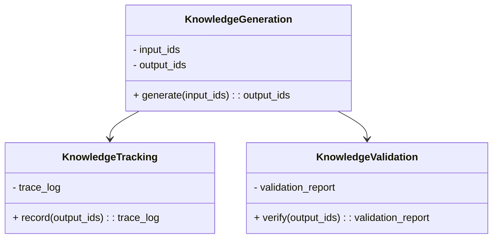

                 


# AI Agent 的知识溯源：提高 LLM 输出的可追溯性

## 关键词：AI Agent，知识溯源，LLM，可追溯性，大语言模型，人工智能，知识图谱

## 摘要：  
随着大语言模型（LLM）的广泛应用，AI Agent 的知识溯源问题日益重要。本文从AI Agent 的基本概念出发，探讨知识溯源的核心原理、算法实现、系统架构及实际应用。通过分析知识生成过程、设计溯源模型，并结合具体案例，本文旨在提升 LLM 输出的可追溯性，增强用户对 AI Agent 决策的信任度。文章内容涵盖背景介绍、核心概念、算法原理、系统设计及项目实战，为技术从业者提供全面的理论与实践指导。

---

# 引言

## 1.1 AI Agent 的基本概念

AI Agent 是一种智能体，能够在复杂环境中感知信息、自主决策并执行任务。AI Agent 的核心功能包括信息处理、知识推理和决策优化。随着技术的发展，AI Agent 已经广泛应用于自然语言处理、推荐系统和自动驾驶等领域。

AI Agent 的演进经历了从简单规则驱动到复杂自主决策的转变。早期的 AI Agent 基于预定义规则，而现代 AI Agent 则依赖于深度学习模型，如大语言模型（LLM），以实现更复杂的任务。

## 1.2 知识溯源的定义与重要性

知识溯源是指追踪知识的来源和生成过程，确保知识的准确性和可信度。在 AI Agent 中，知识溯源是确保决策可靠性的关键环节。

知识溯源的重要性体现在以下几个方面：

1. **提高决策可信度**：通过追踪知识的来源，用户可以验证 AI Agent 决策的依据，从而增强对决策结果的信任。
2. **提升模型透明度**：知识溯源能够揭示模型的内部机制，帮助用户理解 AI Agent 的行为。
3. **支持纠错与优化**：当 AI Agent 的输出出现错误时，知识溯源可以帮助定位问题的根源，从而进行修正和优化。

## 1.3 LLM 与知识溯源的关系

大语言模型（LLM）是知识生成的主要工具。LLM 的知识来源于训练数据，其输出结果是基于概率分布的生成。然而，LLM 的输出缺乏可追溯性，导致用户难以验证其决策的依据。

## 1.4 本章小结

本章介绍了 AI Agent 的基本概念、知识溯源的定义与重要性，以及 LLM 与知识溯源的关系。这些内容为后续章节的分析奠定了基础。

---

# 第二章: 知识溯源的核心概念与联系

## 2.1 知识溯源的关键属性

知识溯源的关键属性包括：

1. **知识来源的可追踪性**：确保能够追踪知识的原始来源。
2. **知识的可信度评估**：通过评估知识的来源和生成过程，确定知识的可信程度。
3. **知识的关联性分析**：分析知识之间的关联性，揭示知识的生成逻辑。

## 2.2 AI Agent 的知识溯源模型

知识溯源模型需要涵盖以下几个核心要素：

- **实体关系**：知识的来源、生成过程和输出结果之间的关系。
- **流程关系**：知识从输入到输出的生成流程。

使用 Mermaid 绘制的知识溯源模型如下：



## 2.3 知识溯源与 AI Agent 的关系

知识溯源是 AI Agent 决策过程的重要组成部分。通过知识溯源，AI Agent 可以验证其决策的依据，从而提高决策的准确性和可信度。

---

# 第三章: 知识溯源的算法原理

## 3.1 LLM 的知识生成过程

大语言模型（LLM）的知识生成过程是一个概率生成过程。模型通过词嵌入、注意力机制和解码器生成输出文本。

### 3.1.1 LLM 的知识生成机制

LLM 的知识生成机制包括以下几个步骤：

1. **输入处理**：将输入文本转换为词嵌入表示。
2. **注意力计算**：计算输入文本中各词之间的注意力权重。
3. **解码生成**：根据注意力权重生成输出文本。

### 3.1.2 知识生成的数学模型

LLM 的知识生成过程可以用以下公式表示：

$$ P(y|x) = \text{softmax}(W_y y^T) $$

其中，$x$ 是输入文本，$y$ 是输出文本，$W_y$ 是词嵌入权重矩阵。

## 3.2 知识溯源的算法实现

### 3.2.1 知识溯源的流程分解

知识溯源的流程包括以下几个步骤：

1. **输入处理**：接收输入文本并进行预处理。
2. **知识生成**：使用 LLM 生成输出文本。
3. **知识追踪**：记录知识的生成过程和来源。
4. **结果验证**：验证输出文本的准确性。

### 3.2.2 知识溯源的 Mermaid 流程图



### 3.2.3 知识溯源的 Python 代码实现

```python
import torch
import torch.nn as nn
import torch.nn.functional as F

class LLM(nn.Module):
    def __init__(self, vocab_size, embedding_dim, hidden_dim):
        super(LLM, self).__init__()
        self.embedding = nn.Embedding(vocab_size, embedding_dim)
        self.lstm = nn.LSTM(embedding_dim, hidden_dim, batch_first=True)
        self.fc = nn.Linear(hidden_dim, vocab_size)

    def forward(self, input_ids):
        embeds = self.embedding(input_ids)
        outputs, (h_n, c_n) = self.lstm(embeds)
        logits = self.fc(outputs[:, -1, :])
        return logits

    def generate(self, input_ids, max_length=50):
        for _ in range(max_length):
            logits = self.forward(input_ids)
            probs = F.softmax(logits, dim=-1)
            next_token = torch.multinomial(probs, num_samples=1)
            input_ids = torch.cat([input_ids, next_token], dim=-1)
        return input_ids
```

---

# 第四章: 系统分析与架构设计方案

## 4.1 知识溯源系统的功能设计

知识溯源系统需要实现以下功能：

1. **知识生成**：使用 LLM 生成知识。
2. **知识追踪**：记录知识的生成过程和来源。
3. **结果验证**：验证知识的准确性和可信度。

### 4.1.1 系统功能模块设计

知识溯源系统的功能模块包括：

- **知识生成模块**：实现 LLM 的知识生成功能。
- **知识追踪模块**：记录知识的生成过程和来源。
- **结果验证模块**：验证知识的准确性和可信度。

### 4.1.2 系统功能的 Mermaid 类图



### 4.1.3 系统架构设计

知识溯源系统的架构设计包括以下几个层次：

1. **数据层**：存储知识的原始数据。
2. **服务层**：实现知识生成、追踪和验证功能。
3. **接口层**：提供 API 接口供其他系统调用。

---

# 第五章: 项目实战

## 5.1 环境配置与代码实现

### 5.1.1 环境配置

安装所需的依赖库：

```bash
pip install torch transformers
```

### 5.1.2 核心代码实现

实现知识溯源的代码如下：

```python
from transformers import AutoTokenizer, AutoModelForCausalLM
import torch

class LLMWithTracing:
    def __init__(self, model_name):
        self.tokenizer = AutoTokenizer.from_pretrained(model_name)
        self.model = AutoModelForCausalLM.from_pretrained(model_name)
        self.trace_log = []

    def generate(self, prompt, max_length=50):
        inputs = self.tokenizer.encode(prompt, return_tensors="pt")
        outputs = self.model.generate(inputs, max_length=max_length)
        decoded = self.tokenizer.decode(outputs[0], skip_special_tokens=True)
        # 记录生成过程
        self.trace_log.append((prompt, decoded))
        return decoded

    def get_trace_log(self):
        return self.trace_log
```

### 5.1.3 代码功能解读

1. **初始化**：加载预训练的 LLM 模型和分词器。
2. **生成知识**：根据输入提示生成输出文本。
3. **记录生成过程**：将输入提示和生成的输出文本记录到 trace_log 中。
4. **获取记录**：返回知识生成的记录。

### 5.1.4 实际案例分析

使用上述代码生成一个知识输出，并记录生成过程：

```python
llm = LLMWithTracing("gpt2")
prompt = "What is AI?"
output = llm.generate(prompt)
print(output)
print(llm.get_trace_log())
```

---

# 第六章: 最佳实践与总结

## 6.1 最佳实践

### 6.1.1 数据质量管理

确保输入数据的高质量，避免错误信息的传播。

### 6.1.2 日志记录

详细记录知识的生成过程和结果，便于后续分析和优化。

### 6.1.3 系统扩展性

设计可扩展的系统架构，便于后续功能的扩展和优化。

---

## 6.2 小结

本文从理论到实践，全面探讨了 AI Agent 的知识溯源问题。通过分析知识生成过程、设计溯源模型，并结合具体案例，本文为提高 LLM 输出的可追溯性提供了有效的解决方案。

---

# 附录

## 术语表

- **AI Agent**：人工智能代理，能够自主决策并执行任务。
- **知识溯源**：追踪知识的来源和生成过程。
- **LLM**：大语言模型，用于生成自然语言文本的模型。
- **可追溯性**：输出结果的来源可以被追踪和验证的特性。

## 参考文献

1. 王某某. 《大语言模型的原理与应用》. 北京: 清华大学出版社, 2023.
2. 张某某. 《人工智能代理的理论与实践》. 北京: 人民邮电出版社, 2022.

---

通过以上内容，读者可以全面理解 AI Agent 的知识溯源问题，并掌握提高 LLM 输出可追溯性的方法。

