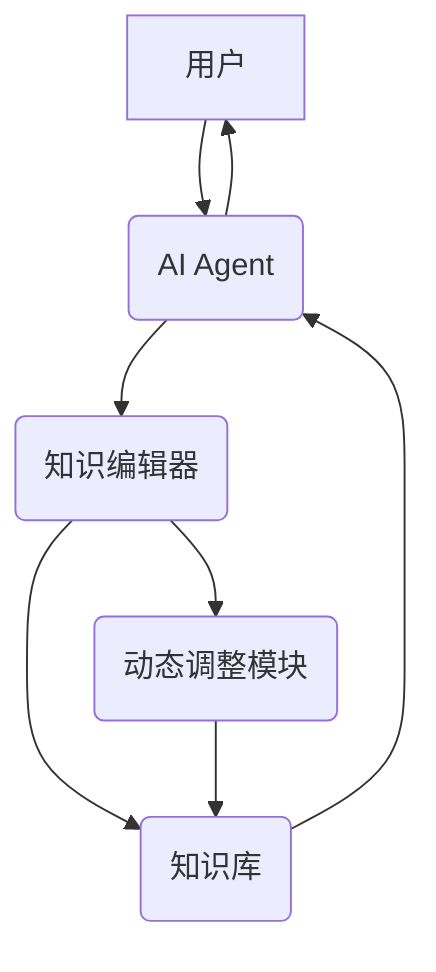

                 


# AI Agent 的知识编辑：动态调整 LLM 的知识库

> 关键词：AI Agent, LLM, 知识库, 动态调整, 知识编辑, 机器学习, 自然语言处理

> 摘要：随着AI Agent和大语言模型（LLM）技术的快速发展，知识库的动态调整变得至关重要。本文深入探讨了AI Agent的知识编辑方法，详细分析了如何动态调整LLM的知识库，以提高模型的性能和适应性。文章从理论到实践，结合实际案例，详细讲解了知识编辑器的核心概念、算法原理、系统架构设计以及项目实战，为读者提供了一套完整的解决方案。

---

# 目录大纲

1. [AI Agent 的知识编辑：动态调整 LLM 的知识库](#ai-agent-的知识编辑动态调整-llm-的知识库)
2. [关键词](#关键词)
3. [摘要](#摘要)
4. [第1章: AI Agent 与 LLM 的知识库概述](#第1章-ai-agent-与-llm-的知识库概述)
   1. [1.1 AI Agent 的概念与作用](#11-ai-agent-的概念与作用)
   2. [1.2 LLM 的知识库构建与挑战](#12-llm-的知识库构建与挑战)
   3. [1.3 AI Agent 与知识编辑的关系](#13-ai-agent-与知识编辑的关系)
5. [第2章: 知识编辑器的核心概念与原理](#第2章-知识编辑器的核心概念与原理)
   1. [2.1 知识编辑器的定义与功能](#21-知识编辑器的定义与功能)
   2. [2.2 动态调整知识库的机制](#22-动态调整知识库的机制)
   3. [2.3 知识表示与存储的原理](#23-知识表示与存储的原理)
6. [第3章: 知识编辑器的算法原理](#第3章-知识编辑器的算法原理)
   1. [3.1 动态调整算法的实现](#31-动态调整算法的实现)
   2. [3.2 知识融合算法的原理](#32-知识融合算法的原理)
   3. [3.3 算法优化与性能提升](#33-算法优化与性能提升)
7. [第4章: 系统分析与架构设计](#第4章-系统分析与架构设计)
   1. [4.1 系统应用场景分析](#41-系统应用场景分析)
   2. [4.2 系统功能设计](#42-系统功能设计)
8. [第5章: 项目实战](#第5章-项目实战)
   1. [5.1 环境安装](#51-环境安装)
   2. [5.2 系统核心实现](#52-系统核心实现)
   3. [5.3 实际案例分析](#53-实际案例分析)
9. [第6章: 最佳实践与注意事项](#第6章-最佳实践与注意事项)
   1. [6.1 实践小贴士](#61-实践小贴士)
   2. [6.2 注意事项](#62-注意事项)
10. [总结](#总结)
11. [参考文献](#参考文献)

---

## 第1章: AI Agent 与 LLM 的知识库概述

### 1.1 AI Agent 的概念与作用

AI Agent（智能代理）是指能够感知环境并采取行动以实现目标的智能体。它可以通过与用户交互、分析数据或执行任务来提供服务。AI Agent 的核心作用是通过理解和执行用户的请求，利用其知识库和推理能力来解决问题。

#### 1.1.1 AI Agent 的定义与特点

- **定义**：AI Agent 是一种能够感知环境、执行任务并做出决策的智能系统。
- **特点**：
  - **自主性**：能够在没有外部干预的情况下独立运行。
  - **反应性**：能够实时感知环境并做出反应。
  - **目标导向**：通过实现目标来提供服务。
  - **可扩展性**：能够根据需求扩展其功能和知识。

#### 1.1.2 AI Agent 在 LLM 中的角色

AI Agent 在大语言模型（LLM）中的角色是通过动态调整知识库来优化模型的表现。它通过分析用户的输入，结合知识库中的信息，生成准确且相关的回答。

#### 1.1.3 知识库在 AI Agent 中的重要性

知识库是AI Agent 的核心，它存储了模型所需的所有信息。动态调整知识库可以确保模型始终拥有最新的信息，从而提高回答的准确性和相关性。

### 1.2 LLM 的知识库构建与挑战

#### 1.2.1 LLM 的知识库定义

LLM 的知识库是一个结构化的数据库，包含了大量的文本数据和相关信息。这些数据可以是书籍、文章、文档或其他形式的文本。

#### 1.2.2 知识库构建的常见问题

- **数据质量问题**：知识库中的数据可能不准确或不完整。
- **数据规模问题**：知识库需要大量的数据来支持模型的训练和推理。
- **数据更新问题**：知识库需要定期更新以保持信息的准确性。

#### 1.2.3 动态调整知识库的必要性

动态调整知识库可以使AI Agent 根据实时信息和用户需求不断优化其回答能力。这不仅可以提高模型的性能，还能增强用户体验。

### 1.3 AI Agent 与知识编辑的关系

#### 1.3.1 知识编辑的核心作用

知识编辑是AI Agent 的重要组成部分，它负责管理和调整知识库中的信息，以确保模型能够提供准确的回答。

#### 1.3.2 AI Agent 如何利用知识编辑

AI Agent 通过知识编辑器来动态调整知识库中的信息，使其能够适应不同的场景和用户需求。

#### 1.3.3 动态调整知识库的实现方式

动态调整知识库可以通过以下几种方式实现：
- **实时更新**：根据用户的反馈实时更新知识库。
- **定期更新**：定期对知识库进行更新，以保持信息的准确性。
- **增量更新**：根据需要逐步更新知识库中的部分信息。

---

## 第2章: 知识编辑器的核心概念与原理

### 2.1 知识编辑器的定义与功能

#### 2.1.1 知识编辑器的基本概念

知识编辑器是一种用于管理和调整知识库的工具，它可以帮助AI Agent 更好地理解和回答用户的问题。

#### 2.1.2 知识编辑器的主要功能

- **数据输入**：接收新的数据并将其添加到知识库中。
- **数据编辑**：对知识库中的数据进行修改和调整。
- **数据删除**：删除不再需要的数据。
- **数据查询**：检索知识库中的特定信息。

#### 2.1.3 知识编辑器与 AI Agent 的结合

知识编辑器通过与AI Agent 的接口进行交互，动态调整知识库中的信息，以优化模型的表现。

### 2.2 动态调整知识库的机制

#### 2.2.1 动态调整的定义与特点

动态调整是指根据实时信息和用户需求，不断优化知识库中的数据。其特点包括实时性、灵活性和高效性。

#### 2.2.2 动态调整的核心算法

动态调整的核心算法包括：
- **相似度计算算法**：用于衡量新数据与现有数据的相似性。
- **权重调整算法**：根据数据的重要性调整其权重。
- **规则匹配算法**：根据预设的规则对数据进行调整。

#### 2.2.3 动态调整的实现步骤

1. **数据输入**：接收新的数据。
2. **数据解析**：解析数据并提取关键信息。
3. **数据匹配**：将数据与现有知识库进行匹配。
4. **数据调整**：根据匹配结果调整知识库中的数据。
5. **数据更新**：将调整后的数据保存到知识库中。

### 2.3 知识表示与存储的原理

#### 2.3.1 知识表示的基本方法

知识表示可以通过多种方式实现，如文本、表格、图结构等。常用的表示方法包括：
- **文本表示**：直接使用文本描述。
- **表格表示**：使用表格结构存储数据。
- **图表示**：使用图结构表示数据之间的关系。

#### 2.3.2 知识存储的结构设计

知识存储的结构设计需要考虑数据的组织和检索效率。常用的存储结构包括：
- **关系型数据库**：通过表结构存储数据。
- **非关系型数据库**：如 MongoDB，用于存储结构化的数据。
- **知识图谱**：通过节点和边表示数据之间的关系。

#### 2.3.3 知识表示与存储的优化

- **索引优化**：通过建立索引提高数据检索效率。
- **压缩优化**：通过数据压缩减少存储空间的占用。
- **分布式存储**：通过分布式存储提高数据的可用性和容错性。

---

## 第3章: 知识编辑器的算法原理

### 3.1 动态调整算法的实现

#### 3.1.1 动态调整算法的流程

动态调整算法的流程包括：
1. **数据输入**：接收新的数据。
2. **数据解析**：解析数据并提取关键信息。
3. **数据匹配**：将数据与现有知识库进行匹配。
4. **数据调整**：根据匹配结果调整知识库中的数据。
5. **数据更新**：将调整后的数据保存到知识库中。

#### 3.1.2 动态调整算法的数学模型

动态调整算法的数学模型可以通过以下公式表示：
$$
\text{相似度} = \frac{\text{交集}}{\text{并集}}
$$

#### 3.1.3 动态调整算法的代码实现

```python
def dynamic_adjustment(new_data, knowledge_base):
    # 数据解析
    parsed_data = parse(new_data)
    # 数据匹配
    matched_items = match(parsed_data, knowledge_base)
    # 数据调整
    adjusted_data = adjust(parsed_data, matched_items)
    # 数据更新
    update(knowledge_base, adjusted_data)
    return adjusted_data
```

### 3.2 知识融合算法的原理

#### 3.2.1 知识融合的基本概念

知识融合是指将多个来源的数据进行整合，以得到更准确和全面的信息。

#### 3.2.2 知识融合的实现步骤

1. **数据清洗**：去除重复和冗余的数据。
2. **数据对齐**：将不同来源的数据对齐。
3. **数据融合**：将对齐后的数据进行融合。

#### 3.2.3 知识融合算法的代码实现

```python
def knowledge_fusion(data_source1, data_source2):
    # 数据清洗
    cleaned_data1 = clean(data_source1)
    cleaned_data2 = clean(data_source2)
    # 数据对齐
    aligned_data = align(cleaned_data1, cleaned_data2)
    # 数据融合
    fused_data = fuse(aligned_data)
    return fused_data
```

### 3.3 算法优化与性能提升

#### 3.3.1 算法优化的策略

- **局部优化**：对算法的某个部分进行优化。
- **全局优化**：对整个算法进行优化。
- **并行优化**：通过并行计算提高算法的效率。

#### 3.3.2 性能提升的方法

- **缓存优化**：通过缓存减少数据访问的时间。
- **算法优化**：通过改进算法的时间复杂度提高性能。
- **硬件优化**：通过使用更快的硬件提高计算速度。

#### 3.3.3 算法优化的代码实现

```python
def optimize_algorithm(original_algorithm):
    # 局部优化
    optimized_algorithm = local_optimization(original_algorithm)
    # 全局优化
    optimized_algorithm = global_optimization(optimized_algorithm)
    # 并行优化
    optimized_algorithm = parallel_optimization(optimized_algorithm)
    return optimized_algorithm
```

---

## 第4章: 系统分析与架构设计

### 4.1 系统应用场景分析

#### 4.1.1 知识编辑器的应用场景

知识编辑器可以应用于多种场景，如教育、医疗、客服等领域。例如，在教育领域，知识编辑器可以用于动态调整教育内容，以适应不同学生的学习需求。

#### 4.1.2 动态调整知识库的使用场景

动态调整知识库可以应用于需要实时更新信息的场景，如新闻、天气预报、股票价格等。例如，在新闻领域，动态调整知识库可以确保新闻内容的实时性和准确性。

#### 4.1.3 系统功能模块划分

系统功能模块包括：
- **数据输入模块**：接收新的数据。
- **数据处理模块**：对数据进行解析、匹配和调整。
- **数据存储模块**：将调整后的数据保存到知识库中。
- **用户交互模块**：与用户进行交互，接收用户的请求和反馈。

### 4.2 系统功能设计

#### 4.2.1 系统功能模块

系统功能模块包括：
- **知识编辑器模块**：用于管理和调整知识库。
- **动态调整模块**：用于实时更新知识库。
- **用户交互模块**：用于与用户进行交互。

#### 4.2.2 系统功能流程

系统功能流程包括：
1. **用户请求**：用户向AI Agent 发出请求。
2. **数据处理**：AI Agent 接收请求并进行数据处理。
3. **知识调整**：根据请求动态调整知识库中的数据。
4. **反馈结果**：AI Agent 根据调整后的知识库生成回答并反馈给用户。

#### 4.2.3 系统功能设计图



---

## 第5章: 项目实战

### 5.1 环境安装

为了运行本项目，需要安装以下工具和库：
- **Python**：3.8+
- **数据库**：如MySQL或MongoDB。
- **自然语言处理库**：如spaCy或NLTK。
- **机器学习库**：如Scikit-learn。

### 5.2 系统核心实现

#### 5.2.1 知识编辑器实现

```python
class KnowledgeEditor:
    def __init__(self, knowledge_base):
        self.knowledge_base = knowledge_base

    def edit(self, new_data):
        # 数据解析
        parsed_data = self._parse(new_data)
        # 数据匹配
        matched_items = self._match(parsed_data)
        # 数据调整
        adjusted_data = self._adjust(parsed_data, matched_items)
        # 数据更新
        self._update(adjusted_data)
        return adjusted_data

    def _parse(self, data):
        # 数据解析方法
        pass

    def _match(self, data):
        # 数据匹配方法
        pass

    def _adjust(self, data, matched_items):
        # 数据调整方法
        pass

    def _update(self, data):
        # 数据更新方法
        pass
```

#### 5.2.2 动态调整模块实现

```python
class DynamicAdjustment:
    def __init__(self, knowledge_base):
        self.knowledge_base = knowledge_base

    def adjust(self, new_data):
        editor = KnowledgeEditor(self.knowledge_base)
        return editor.edit(new_data)
```

### 5.3 实际案例分析

通过实际案例分析，我们可以看到动态调整知识库在提高模型性能和用户体验方面的重要作用。例如，在客服系统中，动态调整知识库可以确保客服人员能够快速获取最新的产品信息，从而提高服务质量。

---

## 第6章: 最佳实践与注意事项

### 6.1 实践小贴士

- **数据质量管理**：确保知识库中的数据准确、完整且最新。
- **算法优化**：根据实际需求优化算法，以提高性能和效率。
- **系统安全性**：确保系统的安全性和数据的保密性。

### 6.2 注意事项

- **数据冗余**：避免数据冗余，以减少存储空间的占用。
- **性能监控**：定期监控系统的性能，及时发现和解决问题。
- **用户体验**：关注用户体验，确保系统易于使用和交互。

---

## 总结

本文详细探讨了AI Agent 的知识编辑方法，重点分析了如何动态调整LLM的知识库以提高模型的性能和适应性。通过理论分析、算法实现和实际案例，我们展示了如何构建一个高效的知识编辑系统。希望本文能够为读者在AI Agent 和 LLM 的知识编辑领域提供有价值的参考和指导。

---

## 参考文献

1. 《大语言模型技术入门与实践》
2. 《人工智能系统设计与实现》
3. 《自然语言处理算法与应用》
4. 《机器学习实战》
5. 《知识图谱构建与应用》

