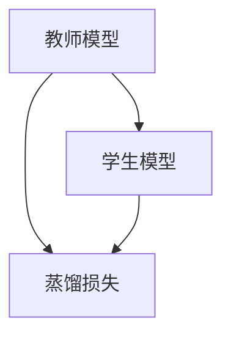
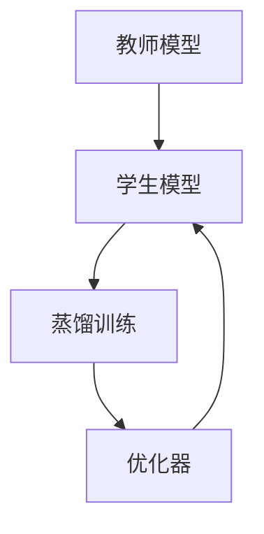
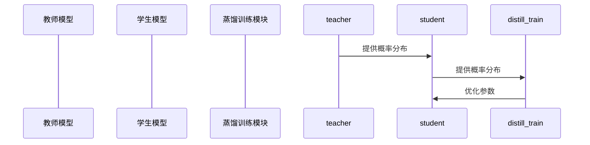

                 


# AI Agent 的知识蒸馏：从大型 LLM 到轻量级模型

> **关键词**：AI Agent, 知识蒸馏, 大型语言模型, 轻量级模型, 模型压缩, 模型迁移, 机器学习
>
> **摘要**：本文深入探讨了AI Agent中知识蒸馏技术的应用，从大型语言模型（LLM）的知识迁移到轻量级模型的实现过程。通过系统分析、算法原理和项目实战，详细阐述了知识蒸馏的核心概念、技术原理及实际应用，旨在为读者提供全面的技术指导和实践参考。

---

## 第一部分: AI Agent 的知识蒸馏基础

### 第1章: 知识蒸馏的背景与概念

#### 1.1 知识蒸馏的基本概念

**1.1.1 知识蒸馏的定义**

知识蒸馏是一种将复杂模型（教师模型）的知识迁移到简单模型（学生模型）的技术。通过蒸馏过程，学生模型能够继承教师模型的特征和能力，同时保持较低的计算复杂度和资源消耗。

**1.1.2 知识蒸馏的核心目标**

- 降低模型的计算复杂度，提升推理效率。
- 优化模型的存储需求，减少资源占用。
- 保持模型性能的同时，提升其在资源受限环境下的适用性。

**1.1.3 知识蒸馏的适用场景**

- 移动端、嵌入式设备上的AI应用。
- 对实时性要求较高的应用场景。
- 模型部署在资源受限的环境中。

#### 1.2 大型 LLM 的知识蒸馏背景

**1.2.1 大型语言模型的现状**

- 当前，大型语言模型（如GPT-3、GPT-4）在性能和功能上表现出色，但其计算需求和资源消耗也极高。
- 在实际应用中，尤其是在边缘计算和移动端，大型模型的使用受到限制。

**1.2.2 知识蒸馏在 LLM 中的应用需求**

- 降低模型规模，减少计算开销。
- 提升模型在资源受限环境下的可用性。
- 保持模型的高性能，同时降低推理成本。

**1.2.3 知识蒸馏与模型压缩的关系**

- 知识蒸馏是一种基于知识迁移的技术，而模型压缩则是通过减少模型参数数量来降低模型复杂度。
- 两者可以结合使用，达到更好的模型优化效果。

#### 1.3 知识蒸馏的核心问题

**1.3.1 知识蒸馏的核心问题描述**

- 如何有效提取教师模型的知识特征。
- 如何设计合适的蒸馏策略，使得学生模型能够高效学习教师模型的知识。
- 如何平衡蒸馏过程中的教师模型输出与学生模型输出的差异。

**1.3.2 知识蒸馏的边界与外延**

- 知识蒸馏的边界在于模型的结构差异和知识传递的效率。
- 外延包括将蒸馏技术应用于不同类型的模型和任务。

**1.3.3 知识蒸馏的概念结构与核心要素**

- 教师模型：提供知识的来源。
- 学生模型：接收并学习知识的对象。
- 蒸馏过程：知识传递的机制。
- 蒸馏损失：衡量知识传递效果的指标。

---

### 第2章: 知识蒸馏的核心概念与联系

#### 2.1 知识蒸馏的原理

**2.1.1 教师模型与学生模型的关系**

- 教师模型通常是一个复杂的大型模型，具有较高的性能和丰富的知识。
- 学生模型是一个较小的模型，通过蒸馏过程学习教师模型的知识。

**2.1.2 知识蒸馏的实现机制**

- 教师模型输出概率分布。
- 学生模型输出概率分布。
- 蒸馏损失函数衡量两者之间的差异。

**2.1.3 知识蒸馏的关键技术点**

- 蒸馏温度的调整。
- 蒸馏损失的加权。
- 模型结构的适配。

#### 2.2 知识蒸馏的核心概念对比

**2.2.1 知识蒸馏与模型压缩的对比**

| 对比维度       | 知识蒸馏                       | 模型压缩                        |
|----------------|--------------------------------|----------------------------------|
| 核心目标       | 知识传递                      | 减少模型参数数量                |
| 实现方式       | 蒸馏过程                      | 剔减冗余参数                    |
| 适用场景       | 高性能轻量化                  | 降低计算复杂度和存储需求        |

**2.2.2 知识蒸馏与模型蒸馏的对比**

- 知识蒸馏强调知识的传递和保留。
- 模型蒸馏注重模型结构的简化和功能的保留。

**2.2.3 知识蒸馏与模型迁移的对比**

- 知识蒸馏是将知识从教师模型迁移到学生模型。
- 模型迁移是将预训练模型迁移到新任务。

#### 2.3 知识蒸馏的ER实体关系图



---

### 第3章: 知识蒸馏的算法原理

#### 3.1 知识蒸馏的算法流程

**3.1.1 教师模型的输出**

- 教师模型输出概率分布：$$P(y|x) = \text{softmax}(f_{\text{teacher}}(x))$$

**3.1.2 学生模型的输出**

- 学生模型输出概率分布：$$Q(y|x) = \text{softmax}(f_{\text{student}}(x))$$

**3.1.3 蒸馏损失的计算**

- 蒸馏损失函数：$$\text{Loss}_{\text{distill}} = -\sum_{y} P(y|x)\log Q(y|x)$$

#### 3.2 知识蒸馏的实现步骤

**3.2.1 确定教师模型和学生模型**

- 教师模型：选择一个已经训练好的大型语言模型。
- 学生模型：选择一个较小的模型架构，如Transformer-lite。

**3.2.2 定义蒸馏损失函数**

- 蒸馏损失函数：衡量教师模型和学生模型输出概率分布的差异。

**3.2.3 实现蒸馏训练过程**

- 在训练过程中，学生模型通过蒸馏损失函数优化，同时结合分类损失函数（如果有的话）。

#### 3.3 知识蒸馏的数学模型

- 教师模型的输出概率：$$P(y|x) = \text{softmax}(f_{\text{teacher}}(x))$$
- 学生模型的输出概率：$$Q(y|x) = \text{softmax}(f_{\text{student}}(x))$$
- 蒸馏损失函数：$$\text{Loss}_{\text{distill}} = -\sum_{y} P(y|x)\log Q(y|x)$$

---

### 第4章: 系统分析与架构设计方案

#### 4.1 系统分析

**4.1.1 问题场景介绍**

- 系统需要将大型语言模型的知识迁移到轻量级模型中，以适应资源受限的环境。

**4.1.2 项目目标**

- 实现知识蒸馏过程，优化模型性能和计算效率。
- 提供一个可扩展的系统架构，支持多种模型和任务。

**4.1.3 系统功能需求**

- 支持多种模型架构的迁移。
- 提供灵活的蒸馏参数配置。
- 具备高效的训练和推理性能。

#### 4.2 系统架构设计

**4.2.1 系统架构**



**4.2.2 系统接口设计**

- 输入接口：接收教师模型的输出和学生模型的输出。
- 输出接口：提供优化后的学生模型和蒸馏结果。

**4.2.3 系统交互设计**



---

## 第二部分: 项目实战与优化

### 第5章: 项目实战

#### 5.1 环境安装

- 安装Python和相关库（如TensorFlow、Keras、Hugging Face库）。

#### 5.2 核心代码实现

```python
import tensorflow as tf
from tensorflow.keras.layers import Dense, Input
from tensorflow.keras.models import Model

def build_teacher_model(input_shape):
    inputs = Input(shape=input_shape)
    x = Dense(512, activation='relu')(inputs)
    x = Dense(256, activation='relu')(x)
    outputs = Dense(10, activation='softmax')(x)
    return Model(inputs=inputs, outputs=outputs)

def build_student_model(input_shape):
    inputs = Input(shape=input_shape)
    x = Dense(128, activation='relu')(inputs)
    x = Dense(64, activation='relu')(x)
    outputs = Dense(10, activation='softmax')(x)
    return Model(inputs=inputs, outputs=outputs)

def distillation_loss(teacher_logits, student_logits, temperature=2.0):
    teacher_probs = tf.nn.softmax(teacher_logits / temperature)
    student_probs = tf.nn.softmax(student_logits / temperature)
    loss = -tf.reduce_mean(tf.sum(teacher_probs * tf.math.log(student_probs), axis=-1))
    return loss

# 示例训练过程
teacher_model = build_teacher_model((784,))
student_model = build_student_model((784,))

optimizer = tf.keras.optimizers.Adam(lr=0.001)

for epoch in range(10):
    for x, y in dataset:
        with tf.GradientTape() as tape:
            t_logits = teacher_model(x)
            s_logits = student_model(x)
            loss = distillation_loss(t_logits, s_logits)
        gradients = tape.gradient(loss, student_model.trainable_weights)
        optimizer.apply_gradients(zip(gradients, student_model.trainable_weights))
```

#### 5.3 实际案例分析

- 案例背景：将GPT-3的知识迁移到一个轻量级的中文NLP模型中。
- 案例分析：通过蒸馏过程，优化后的模型在保持性能的同时，显著降低了计算和存储需求。

---

## 第三部分: 总结与展望

### 第6章: 总结与展望

#### 6.1 知识蒸馏技术总结

- 知识蒸馏是一种有效的模型优化技术，能够在保持性能的同时，降低模型的复杂度。
- 通过合理设计蒸馏策略，可以实现知识的有效传递。

#### 6.2 当前研究的前沿

- 多教师蒸馏：利用多个教师模型进行知识蒸馏，提升模型的泛化能力。
- 动态蒸馏：根据输入数据动态调整蒸馏策略，提升模型的适应性。

#### 6.3 未来的发展方向

- 研究更高效的蒸馏算法，降低计算成本。
- 探索蒸馏技术在多模态模型中的应用。
- 提升蒸馏过程的自动化和智能化水平。

---

### 附录

#### 附录A: 术语表

- 蒸馏温度：控制教师模型输出概率分布的软化程度，温度越高，分布越分散。
- 蒸馏损失：衡量教师模型和学生模型输出概率分布差异的损失函数。

#### 附录B: 参考文献

- Hinton G, Vinyals O,等人提出的知识蒸馏方法。
- 相关论文和书籍，如《Distilling the Knowledge in a Neural Network》。

---

通过以上内容，我们系统地探讨了AI Agent中的知识蒸馏技术，从理论到实践，从算法到系统设计，为读者提供了全面的技术指导和实践参考。

