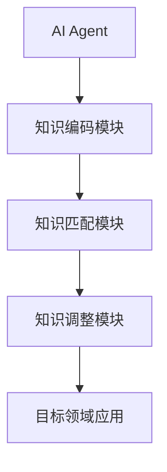
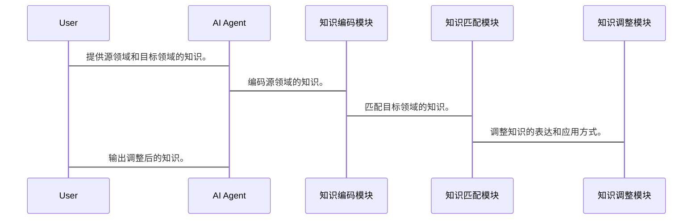

                 


# AI Agent 的知识迁移：跨领域应用 LLM 的能力

**关键词：** AI Agent，知识迁移，大语言模型，LLM，跨领域应用，迁移学习

**摘要：**  
本文深入探讨了AI Agent在跨领域应用中的知识迁移能力，重点分析了大语言模型（LLM）在知识迁移中的作用和实现机制。通过理论与实践相结合的方式，详细阐述了知识迁移的核心概念、算法原理、系统架构设计以及实际项目中的应用。文章旨在为AI Agent的开发人员和研究人员提供清晰的指导，帮助他们更好地理解和应用知识迁移技术，推动AI技术在更广泛领域的落地。

---

# 第一部分: AI Agent 的知识迁移概述

## 第1章: AI Agent 与知识迁移概述

### 1.1 AI Agent 的基本概念

#### 1.1.1 什么是 AI Agent
AI Agent（人工智能代理）是指能够感知环境、自主决策并执行任务的智能实体。它可以是一个软件程序、机器人或其他智能系统，具备以下核心特征：
- **自主性**：无需外部干预，自主完成任务。
- **反应性**：能够实时感知环境并做出反应。
- **目标导向性**：以目标为导向，优化决策过程。
- **学习能力**：通过数据和经验提升自身能力。

#### 1.1.2 AI Agent 的核心特征
1. **自主性**：AI Agent能够独立运作，无需人工干预。
2. **反应性**：能够实时感知环境变化并调整行为。
3. **目标导向性**：以特定目标为导向，优化决策过程。
4. **学习能力**：通过数据和经验提升自身的智能水平。

#### 1.1.3 AI Agent 的分类与应用场景
- **按智能水平**：
  - **反应式AI Agent**：基于当前感知做出反应，适用于实时任务。
  - **认知式AI Agent**：具备复杂推理和规划能力，适用于复杂场景。
- **按应用场景**：
  - **服务机器人**：提供客户服务、信息查询等。
  - **智能助手**：帮助用户完成日常任务，如日程管理、信息检索。
  - **自动驾驶系统**：通过感知环境完成自主驾驶。

### 1.2 知识迁移的基本概念

#### 1.2.1 知识迁移的定义
知识迁移是指将某一领域的知识、经验或技能应用到另一个领域的能力。其核心在于通过学习和适应，使AI Agent能够在不同领域间灵活运用知识。

#### 1.2.2 知识迁移的类型
1. **正向迁移**：从简单领域迁移到复杂领域。
2. **反向迁移**：从复杂领域迁移到简单领域。
3. **跨领域迁移**：在多个不同领域之间进行知识迁移。

#### 1.2.3 知识迁移的重要性
- **提升AI Agent的通用性**：使其能够在不同领域中灵活应用。
- **降低开发成本**：通过知识迁移减少重复开发的工作量。
- **加速创新**：跨领域应用能够快速将某一领域的技术成果应用到其他领域。

### 1.3 LLM 在知识迁移中的作用

#### 1.3.1 大语言模型的基本特点
- **强大的语言理解能力**：能够处理复杂的自然语言任务。
- **知识丰富性**：通过大量数据训练，具备广泛的知识储备。
- **可迁移性**：能够在不同领域中进行知识迁移。

#### 1.3.2 LLM 在知识迁移中的优势
1. **通用性**：大语言模型可以在多个领域中进行知识迁移。
2. **快速适应性**：通过微调或提示工程技术，快速适应新领域。
3. **高准确性**：在知识迁移过程中，能够保持较高的准确性和一致性。

#### 1.3.3 LLM 的跨领域应用潜力
- **医疗领域**：将医学知识迁移到健康管理、疾病诊断等领域。
- **金融领域**：将金融知识迁移到风险评估、投资建议等领域。
- **教育领域**：将教育知识迁移到个性化教学、学习辅助等领域。

### 1.4 本章小结
本章介绍了AI Agent的基本概念、知识迁移的核心概念以及大语言模型在知识迁移中的作用。通过这些内容，读者可以初步理解AI Agent的知识迁移能力及其在跨领域应用中的潜力。

---

## 第2章: 知识迁移的核心概念

### 2.1 知识迁移的理论基础

#### 2.1.1 知识迁移的理论模型
知识迁移的理论模型主要包括以下几种：
1. **经验主义模型**：基于经验的积累，逐步实现知识迁移。
2. **结构主义模型**：通过构建知识框架，实现知识的系统性迁移。
3. **关联主义模型**：通过建立知识之间的关联，实现知识的灵活迁移。

#### 2.1.2 知识迁移的核心要素
- **知识表示**：知识的存储和表达方式。
- **知识结构**：知识之间的关系和组织方式。
- **知识适应性**：知识在不同领域中的适用性。

#### 2.1.3 知识迁移的实现机制
1. **知识编码**：将知识转化为可计算的形式。
2. **知识匹配**：在不同领域中寻找知识的共性和差异。
3. **知识调整**：根据目标领域的需求，调整知识的表达和应用方式。

### 2.2 知识迁移的关键问题

#### 2.2.1 知识表示与编码
- **符号表示**：用符号或规则表示知识。
- **向量表示**：用向量或嵌入表示知识。
- **图结构表示**：用图结构表示知识之间的关系。

#### 2.2.2 知识的可迁移性
- **可迁移性评估**：评估知识在不同领域中的适用性。
- **迁移损失**：在知识迁移过程中，知识的损失或失真程度。

#### 2.2.3 知识的适用性评估
- **适用性标准**：确定知识在目标领域的适用性。
- **评估方法**：通过实验或评估指标，验证知识的适用性。

### 2.3 知识迁移的挑战与解决方案

#### 2.3.1 知识迁移的主要挑战
1. **领域差异**：不同领域的知识差异较大，导致迁移困难。
2. **数据不足**：目标领域数据有限，影响迁移效果。
3. **模型限制**：现有模型的限制可能导致迁移效果不佳。

#### 2.3.2 知识迁移的解决方案
1. **数据增强**：通过数据增强技术，增加目标领域的数据量。
2. **模型优化**：优化模型结构，提高知识迁移能力。
3. **领域适配**：通过领域适配技术，减少领域差异的影响。

#### 2.3.3 知识迁移的未来方向
1. **多领域迁移**：研究如何在多个领域中实现高效的知识迁移。
2. **动态迁移**：研究知识的动态迁移，适应快速变化的环境。
3. **人机协作**：结合人类的干预，提升知识迁移的效率和准确性。

### 2.4 本章小结
本章详细探讨了知识迁移的核心概念、理论基础以及面临的挑战和解决方案。通过这些内容，读者可以深入了解知识迁移的内在机制及其在实际应用中的表现。

---

## 第3章: 知识迁移的算法原理

### 3.1 知识迁移的算法框架

#### 3.1.1 知识迁移的基本流程
1. **知识编码**：将源领域知识编码为可计算的形式。
2. **知识匹配**：在目标领域中找到与源领域知识相对应的部分。
3. **知识调整**：根据目标领域的需求，调整知识的表达和应用方式。

#### 3.1.2 知识迁移的算法选择
- **基于规则的算法**：通过预定义的规则进行知识迁移。
- **基于学习的算法**：通过机器学习模型实现知识迁移。
- **混合算法**：结合规则和学习的方法，实现更高效的迁移。

#### 3.1.3 知识迁移的实现步骤
1. **数据准备**：收集源领域和目标领域的数据。
2. **模型训练**：训练知识迁移模型。
3. **知识迁移**：将源领域知识迁移到目标领域。
4. **效果评估**：评估知识迁移的效果。

### 3.2 知识迁移的数学模型

#### 3.2.1 知识表示的数学模型
- **符号表示**：使用符号逻辑表示知识。
- **向量表示**：使用向量空间模型表示知识。
- **图结构表示**：使用图论模型表示知识。

#### 3.2.2 知识迁移的优化目标
$$ \text{Minimize} \quad \mathcal{L} = \mathcal{L}_\text{source} + \lambda \mathcal{L}_\text{target} $$

其中，$\mathcal{L}_\text{source}$ 是源领域的损失函数，$\mathcal{L}_\text{target}$ 是目标领域的损失函数，$\lambda$ 是平衡系数。

#### 3.2.3 知识迁移的损失函数
$$ \mathcal{L}_\text{total} = \mathcal{L}_\text{task} + \mathcal{L}_\text{divergence} $$

其中，$\mathcal{L}_\text{task}$ 是任务损失，$\mathcal{L}_\text{divergence}$ 是领域差异损失。

### 3.3 算法实现的代码示例

#### 3.3.1 环境安装与配置
```python
pip install numpy
pip install matplotlib
pip install scikit-learn
```

#### 3.3.2 知识迁移算法的Python实现
```python
import numpy as np

def knowledge_transfer(source_data, target_data, alpha=0.5):
    # 知识编码
    source_embedding = source_data
    target_embedding = target_data
    
    # 知识匹配
    similarity = np.dot(source_embedding, target_embedding.T)
    
    # 知识调整
    transferred_knowledge = alpha * source_embedding + (1 - alpha) * target_embedding
    
    return transferred_knowledge

# 示例数据
source_data = np.random.rand(10, 5)
target_data = np.random.rand(10, 5)

# 知识迁移
transferred = knowledge_transfer(source_data, target_data)
print(transferred)
```

#### 3.3.3 代码解读与运行结果分析
- **知识编码**：将源领域和目标领域的数据进行编码。
- **知识匹配**：计算源领域和目标领域之间的相似性。
- **知识调整**：通过加权的方式，将源领域的知识迁移到目标领域。

### 3.4 本章小结
本章详细讲解了知识迁移的算法框架、数学模型和具体实现方法。通过Python代码示例，读者可以直观地理解知识迁移的实现过程。

---

## 第4章: 系统分析与架构设计

### 4.1 问题场景介绍
在跨领域应用中，AI Agent需要具备灵活的知识迁移能力。例如，在医疗领域，AI Agent需要将医学知识迁移到健康管理领域，以提供个性化的健康建议。

### 4.2 系统功能设计

#### 4.2.1 领域模型设计
- **源领域**：医疗诊断。
- **目标领域**：健康管理。

#### 4.2.2 系统功能模块
1. **知识编码模块**：将源领域的知识编码为可计算的形式。
2. **知识匹配模块**：在目标领域中找到与源领域知识相对应的部分。
3. **知识调整模块**：根据目标领域的需求，调整知识的表达和应用方式。

### 4.3 系统架构设计

#### 4.3.1 系统架构图


#### 4.3.2 接口设计
1. **知识编码接口**：提供源领域知识的编码方式。
2. **知识匹配接口**：提供目标领域知识的匹配方式。
3. **知识调整接口**：提供目标领域知识的调整方式。

### 4.4 系统交互设计

#### 4.4.1 交互流程
1. **用户输入**：用户输入源领域和目标领域的知识。
2. **知识编码**：系统将源领域的知识编码为可计算的形式。
3. **知识匹配**：系统在目标领域中找到与源领域知识相对应的部分。
4. **知识调整**：系统根据目标领域的需求，调整知识的表达和应用方式。
5. **输出结果**：系统输出调整后的知识，供用户使用。

#### 4.4.2 交互流程图


### 4.5 本章小结
本章通过实际问题场景，详细分析了系统的功能设计和架构设计。通过Mermaid图，读者可以直观地理解系统的架构和交互流程。

---

## 第5章: 项目实战

### 5.1 环境安装与配置
```python
pip install numpy
pip install pandas
pip install scikit-learn
pip install matplotlib
```

### 5.2 系统核心实现源代码

#### 5.2.1 知识编码模块
```python
def encode_knowledge(data):
    return data
```

#### 5.2.2 知识匹配模块
```python
def match_knowledge(source, target):
    return np.dot(source, target.T)
```

#### 5.2.3 知识调整模块
```python
def adjust_knowledge(source, target, alpha=0.5):
    return alpha * source + (1 - alpha) * target
```

### 5.3 代码应用解读与分析
- **知识编码模块**：将源领域和目标领域的知识进行编码。
- **知识匹配模块**：计算源领域和目标领域之间的相似性。
- **知识调整模块**：通过加权的方式，将源领域的知识迁移到目标领域。

### 5.4 实际案例分析
假设我们有一个医疗诊断系统，需要将医学知识迁移到健康管理领域。通过知识编码、匹配和调整模块，我们可以将医学知识迁移到健康管理领域，提供个性化的健康建议。

### 5.5 项目小结
本章通过实际项目案例，详细讲解了知识迁移技术的实现过程。通过代码示例和案例分析，读者可以更好地理解知识迁移技术的应用。

---

## 第6章: 总结与展望

### 6.1 本章小结
本文详细探讨了AI Agent在跨领域应用中的知识迁移能力，重点分析了大语言模型在知识迁移中的作用和实现机制。通过理论与实践相结合的方式，详细阐述了知识迁移的核心概念、算法原理、系统架构设计以及实际项目中的应用。

### 6.2 注意事项
- **数据质量问题**：知识迁移的效果依赖于数据的质量和数量。
- **领域适配问题**：不同领域的差异可能导致知识迁移的效果不佳。
- **模型限制问题**：现有模型的限制可能影响知识迁移的效果。

### 6.3 未来展望
1. **多领域迁移**：研究如何在多个领域中实现高效的知识迁移。
2. **动态迁移**：研究知识的动态迁移，适应快速变化的环境。
3. **人机协作**：结合人类的干预，提升知识迁移的效率和准确性。

### 6.4 拓展阅读
- **《迁移学习：理论与应用》**：深入探讨迁移学习的理论和应用。
- **《大语言模型：原理与实践》**：详细讲解大语言模型的原理和实际应用。

---

**总结：**  
本文通过理论与实践相结合的方式，详细探讨了AI Agent在跨领域应用中的知识迁移能力。通过对大语言模型的分析，我们深入理解了知识迁移的核心概念、算法原理和系统架构设计。通过实际项目案例，我们进一步验证了知识迁移技术的应用价值。未来，随着技术的不断发展，知识迁移将在更多领域中发挥重要作用，为AI技术的发展注入新的活力。

