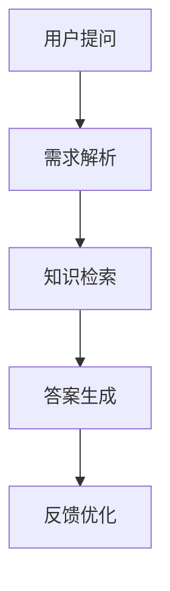
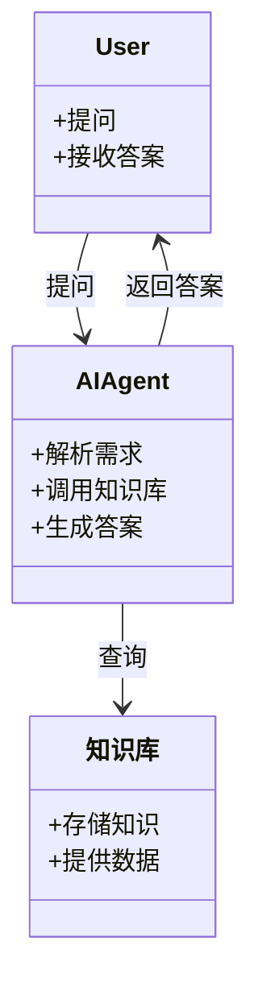
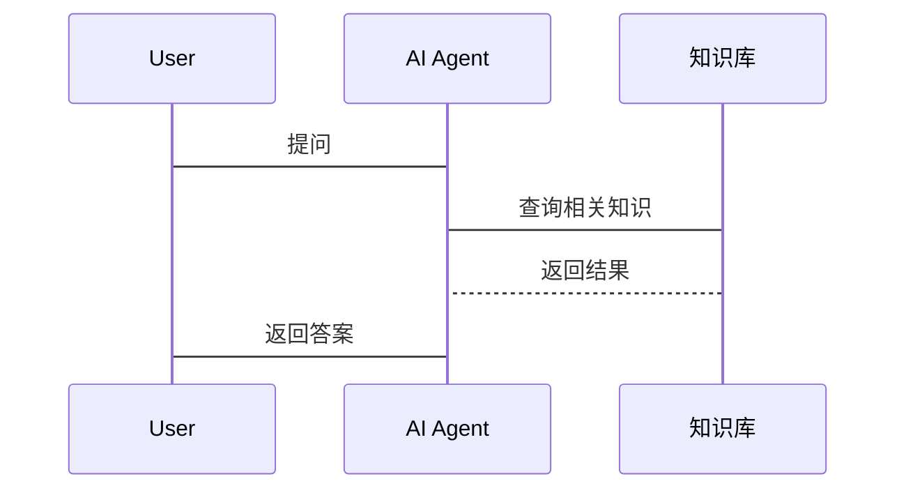

                 


```markdown
# AI Agent 的知识问答：构建基于 LLM 的智能问答系统

> 关键词：AI Agent，LLM，智能问答系统，知识问答，大语言模型，问答系统设计，系统架构

> 摘要：本文详细探讨了基于大语言模型（LLM）的AI Agent在知识问答系统中的构建方法。通过分析核心概念、算法原理、系统架构设计以及项目实战，全面揭示了如何利用AI Agent与LLM技术结合，构建高效、智能的问答系统。文章从理论到实践，深入浅出地展示了整个系统的设计思路和实现过程。

---

## 第一部分: 核心概念与背景

### 第1章: 问题背景与核心概念

#### 1.1 问题背景
##### 1.1.1 传统问答系统的局限性
传统问答系统在处理复杂问题时存在不足，例如依赖固定的规则和知识库，难以应对动态变化的查询。

##### 1.1.2 大语言模型的崛起
大语言模型（如GPT-3、GPT-4）凭借其强大的文本生成能力和上下文理解能力，为智能问答系统提供了新的可能性。

##### 1.1.3 AI Agent 的概念与特点
AI Agent是一种能够理解用户需求、主动提供解决方案的智能体，具备学习、推理和自适应能力。

#### 1.2 问题描述
##### 1.2.1 知识问答系统的定义
知识问答系统是一种能够根据用户输入，提供准确信息或解答的智能系统。

##### 1.2.2 基于 LLM 的问答系统的优势
基于LLM的问答系统能够处理复杂语义，提供更自然的对话体验。

##### 1.2.3 AI Agent 在问答系统中的角色
AI Agent作为系统的核心，负责解析用户需求、调用模型生成答案，并根据反馈优化响应。

#### 1.3 问题解决
##### 1.3.1 基于 LLM 的问答系统构建方法
通过微调LLM模型，结合领域知识库，构建定制化的问答系统。

##### 1.3.2 AI Agent 的任务分解
包括需求解析、知识检索、答案生成和反馈优化四个主要任务。

##### 1.3.3 系统设计的核心要素
知识库、LLM模型、对话管理模块和反馈优化机制是系统设计的关键部分。

#### 1.4 边界与外延
##### 1.4.1 知识问答系统的边界
系统主要关注基于文本的问答，不涉及多模态数据处理。

##### 1.4.2 AI Agent 的能力范围
AI Agent能够处理自然语言查询，但其能力受限于训练数据和模型架构。

##### 1.4.3 系统的可扩展性与局限性
系统可以通过扩展知识库和模型能力提升性能，但目前仍难以处理复杂的逻辑推理问题。

#### 1.5 概念结构与核心要素
##### 1.5.1 系统架构的核心要素
包括用户输入、知识库、LLM模型和AI Agent四个核心要素。

##### 1.5.2 AI Agent 的功能模块
包括需求解析模块、知识检索模块、答案生成模块和反馈优化模块。

##### 1.5.3 知识库与模型的关系
知识库为模型提供支持，模型通过知识库生成准确的答案。

---

## 第二部分: 核心概念与联系

### 第2章: 核心概念与联系

#### 2.1 AI Agent 的核心原理
##### 2.1.1 大语言模型的原理
LLM通过大量的训练数据，学习语言的模式和语义，能够生成连贯的文本。

##### 2.1.2 AI Agent 的决策机制
AI Agent基于用户输入，结合知识库和模型生成最优回答。

##### 2.1.3 知识问答的实现流程
包括用户输入、需求解析、知识检索、答案生成和反馈优化五个步骤。

#### 2.2 核心概念对比
##### 2.2.1 LLM 与传统 NLP 模型的对比
从训练数据、处理能力、灵活性等方面进行对比，LLM在多个方面具有明显优势。

##### 2.2.2 AI Agent 与传统问答系统的对比
AI Agent具备主动性和学习能力，而传统问答系统依赖预设规则。

##### 2.2.3 知识库与对话系统的对比
知识库提供静态知识，对话系统侧重动态交互。

#### 2.3 ER 实体关系图
```mermaid
er
    entity: User
    entity: AI Agent
    entity: 知识库
    entity: 对话历史
    relation: User -> 提问
    relation: AI Agent -> 解答
    relation: 知识库 -> 提供答案
    relation: 对话历史 -> 记录交互
```

---

## 第三部分: 算法原理讲解

### 第3章: 算法原理与实现

#### 3.1 LLM 的训练过程
##### 3.1.1 监督微调
对预训练的LLM进行微调，使其适应特定任务。

##### 3.1.2 强化学习
通过强化学习优化模型的生成策略，提升回答的准确性和相关性。

#### 3.2 AI Agent 的决策机制
##### 3.2.1 基于规则的决策
通过预设规则，快速生成回答。

##### 3.2.2 基于模型的决策
利用深度学习模型进行复杂的推理和决策。

#### 3.3 算法流程图


#### 3.4 核心算法代码实现
```python
def answer_question(user_input):
    # 需求解析
    parsed_request = parse_request(user_input)
    # 知识检索
    relevant_data = retrieve_data(parsed_request)
    # 答案生成
    generated_answer = generate_answer(relevant_data)
    return generated_answer
```

---

## 第四部分: 系统分析与架构设计

### 第4章: 系统分析与架构设计

#### 4.1 问题场景介绍
##### 4.1.1 问题场景描述
系统需要支持用户通过自然语言提问，快速获得准确答案。

##### 4.1.2 系统目标
构建一个高效、智能的知识问答系统，支持多种交互方式。

#### 4.2 系统功能设计
##### 4.2.1 领域模型


##### 4.2.2 系统架构


#### 4.3 接口设计与交互流程
##### 4.3.1 系统接口
- 用户输入接口
- 知识库查询接口
- 答案生成接口

##### 4.3.2 交互流程


---

## 第五部分: 项目实战

### 第5章: 项目实战与案例分析

#### 5.1 环境安装
##### 5.1.1 安装 Python 和相关库
```bash
pip install python-transformers
pip install torch
pip install numpy
```

#### 5.2 核心代码实现
##### 5.2.1 需求解析模块
```python
def parse_request(user_input):
    # 使用自然语言处理技术解析用户输入
    pass
```

##### 5.2.2 知识检索模块
```python
def retrieve_data(parsed_request):
    # 从知识库中检索相关数据
    pass
```

##### 5.2.3 答案生成模块
```python
def generate_answer(relevant_data):
    # 使用大语言模型生成答案
    pass
```

#### 5.3 实际案例分析
##### 5.3.1 案例描述
用户提问“如何提高Python编程能力？”

##### 5.3.2 系统处理流程
1. 用户输入：如何提高Python编程能力？
2. 需求解析：生成学习计划
3. 知识检索：查询相关学习资源
4. 答案生成：生成详细的学习计划
5. 反馈优化：记录用户反馈，优化后续回答

#### 5.4 项目小结
##### 5.4.1 成功的关键点
知识库的完善性、模型的调优、系统的稳定性。

##### 5.4.2 可能的改进方向
增加多模态支持、提升推理能力、优化用户交互体验。

---

## 第六部分: 最佳实践与总结

### 第6章: 最佳实践与总结

#### 6.1 小结
构建基于LLM的AI Agent知识问答系统是一个复杂但极具价值的过程。

#### 6.2 注意事项
- 确保知识库的准确性和全面性
- 合理设计系统的架构，确保可扩展性
- 注重用户体验，优化交互流程

#### 6.3 拓展阅读
- 大语言模型的最新研究
- AI Agent 的其他应用场景
- 智能问答系统的优化方法

---

## 附录

### 附录 A: 知识库构建方法
- 数据收集与清洗
- 知识抽取与表示
- 知识存储与管理

### 附录 B: 代码示例
```python
import torch
from transformers import AutoModelForQuestionAnswering, AutoTokenizer

model = AutoModelForQuestionAnswering.from_pretrained('deepset/bert-large-wwm-ext')
tokenizer = AutoTokenizer.from_pretrained('deepset/bert-large-wwm-ext')

def generate_answer(context, question):
    inputs = tokenizer.encode_plus(context, question, add_special_tokens=True, return_tensors='pt')
    outputs = model(**inputs)
    # 解析输出，生成答案
    pass
```

---

### 附录 C: 系统性能测试方法
- 响应时间测试
- 系统吞吐量测试
- 系统稳定性测试

---

## 结语

通过本文的详细讲解，读者可以全面了解如何构建基于大语言模型的AI Agent知识问答系统。从理论到实践，从设计到实现，文章提供了丰富的指导和参考。希望本文能为相关领域的研究和实践者提供有价值的帮助。
</think>

```markdown
# AI Agent 的知识问答：构建基于 LLM 的智能问答系统

> 关键词：AI Agent，LLM，智能问答系统，知识问答，大语言模型，问答系统设计，系统架构

> 摘要：本文详细探讨了基于大语言模型（LLM）的AI Agent在知识问答系统中的构建方法。通过分析核心概念、算法原理、系统架构设计以及项目实战，全面揭示了如何利用AI Agent与LLM技术结合，构建高效、智能的问答系统。文章从理论到实践，深入浅出地展示了整个系统的设计思路和实现过程。

---

## 第一部分: 核心概念与背景

### 第1章: 问题背景与核心概念

#### 1.1 问题背景
##### 1.1.1 传统问答系统的局限性
传统问答系统在处理复杂问题时存在不足，例如依赖固定的规则和知识库，难以应对动态变化的查询。

##### 1.1.2 大语言模型的崛起
大语言模型（如GPT-3、GPT-4）凭借其强大的文本生成能力和上下文理解能力，为智能问答系统提供了新的可能性。

##### 1.1.3 AI Agent 的概念与特点
AI Agent是一种能够理解用户需求、主动提供解决方案的智能体，具备学习、推理和自适应能力。

#### 1.2 问题描述
##### 1.2.1 知识问答系统的定义
知识问答系统是一种能够根据用户输入，提供准确信息或解答的智能系统。

##### 1.2.2 基于 LLM 的问答系统的优势
基于LLM的问答系统能够处理复杂语义，提供更自然的对话体验。

##### 1.2.3 AI Agent 在问答系统中的角色
AI Agent作为系统的核心，负责解析用户需求、调用模型生成答案，并根据反馈优化响应。

#### 1.3 问题解决
##### 1.3.1 基于 LLM 的问答系统构建方法
通过微调LLM模型，结合领域知识库，构建定制化的问答系统。

##### 1.3.2 AI Agent 的任务分解
包括需求解析、知识检索、答案生成和反馈优化四个主要任务。

##### 1.3.3 系统设计的核心要素
知识库、LLM模型、对话管理模块和反馈优化机制是系统设计的关键部分。

#### 1.4 边界与外延
##### 1.4.1 知识问答系统的边界
系统主要关注基于文本的问答，不涉及多模态数据处理。

##### 1.4.2 AI Agent 的能力范围
AI Agent能够处理自然语言查询，但其能力受限于训练数据和模型架构。

##### 1.4.3 系统的可扩展性与局限性
系统可以通过扩展知识库和模型能力提升性能，但目前仍难以处理复杂的逻辑推理问题。

#### 1.5 概念结构与核心要素
##### 1.5.1 系统架构的核心要素
包括用户输入、知识库、LLM模型和AI Agent四个核心要素。

##### 1.5.2 AI Agent 的功能模块
包括需求解析模块、知识检索模块、答案生成模块和反馈优化模块。

##### 1.5.3 知识库与模型的关系
知识库为模型提供支持，模型通过知识库生成准确的答案。

---

## 第二部分: 核心概念与联系

### 第2章: 核心概念与联系

#### 2.1 AI Agent 的核心原理
##### 2.1.1 大语言模型的原理
LLM通过大量的训练数据，学习语言的模式和语义，能够生成连贯的文本。

##### 2.1.2 AI Agent 的决策机制
AI Agent基于用户输入，结合知识库和模型生成最优回答。

##### 2.1.3 知识问答的实现流程
包括用户输入、需求解析、知识检索、答案生成和反馈优化五个步骤。

#### 2.2 核心概念对比
##### 2.2.1 LLM 与传统 NLP 模型的对比
从训练数据、处理能力、灵活性等方面进行对比，LLM在多个方面具有明显优势。

##### 2.2.2 AI Agent 与传统问答系统的对比
AI Agent具备主动性和学习能力，而传统问答系统依赖预设规则。

##### 2.2.3 知识库与对话系统的对比
知识库提供静态知识，对话系统侧重动态交互。

#### 2.3 ER 实体关系图
```mermaid
er
    entity: User
    entity: AI Agent
    entity: 知识库
    entity: 对话历史
    relation: User -> 提问
    relation: AI Agent -> 解答
    relation: 知识库 -> 提供答案
    relation: 对话历史 -> 记录交互
```

---

## 第三部分: 算法原理讲解

### 第3章: 算法原理与实现

#### 3.1 LLM 的训练过程
##### 3.1.1 监督微调
对预训练的LLM进行微调，使其适应特定任务。

##### 3.1.2 强化学习
通过强化学习优化模型的生成策略，提升回答的准确性和相关性。

#### 3.2 AI Agent 的决策机制
##### 3.2.1 基于规则的决策
通过预设规则，快速生成回答。

##### 3.2.2 基于模型的决策
利用深度学习模型进行复杂的推理和决策。

#### 3.3 算法流程图


#### 3.4 核心算法代码实现
```python
def answer_question(user_input):
    # 需求解析
    parsed_request = parse_request(user_input)
    # 知识检索
    relevant_data = retrieve_data(parsed_request)
    # 答案生成
    generated_answer = generate_answer(relevant_data)
    return generated_answer
```

---

## 第四部分: 系统分析与架构设计

### 第4章: 系统分析与架构设计

#### 4.1 问题场景介绍
##### 4.1.1 问题场景描述
系统需要支持用户通过自然语言提问，快速获得准确答案。

##### 4.1.2 系统目标
构建一个高效、智能的知识问答系统，支持多种交互方式。

#### 4.2 系统功能设计
##### 4.2.1 领域模型


##### 4.2.2 系统架构


#### 4.3 接口设计与交互流程
##### 4.3.1 系统接口
- 用户输入接口
- 知识库查询接口
- 答案生成接口

##### 4.3.2 交互流程


---

## 第五部分: 项目实战

### 第5章: 项目实战与案例分析

#### 5.1 环境安装
##### 5.1.1 安装 Python 和相关库
```bash
pip install python-transformers
pip install torch
pip install numpy
```

#### 5.2 核心代码实现
##### 5.2.1 需求解析模块
```python
def parse_request(user_input):
    # 使用自然语言处理技术解析用户输入
    pass
```

##### 5.2.2 知识检索模块
```python
def retrieve_data(parsed_request):
    # 从知识库中检索相关数据
    pass
```

##### 5.2.3 答案生成模块
```python
def generate_answer(relevant_data):
    # 使用大语言模型生成答案
    pass
```

#### 5.3 实际案例分析
##### 5.3.1 案例描述
用户提问“如何提高Python编程能力？”

##### 5.3.2 系统处理流程
1. 用户输入：如何提高Python编程能力？
2. 需求解析：生成学习计划
3. 知识检索：查询相关学习资源
4. 答案生成：生成详细的学习计划
5. 反馈优化：记录用户反馈，优化后续回答

#### 5.4 项目小结
##### 5.4.1 成功的关键点
知识库的完善性、模型的调优、系统的稳定性。

##### 5.4.2 可能的改进方向
增加多模态支持、提升推理能力、优化用户交互体验。

---

## 第六部分: 最佳实践与总结

### 第6章: 最佳实践与总结

#### 6.1 小结
构建基于LLM的AI Agent知识问答系统是一个复杂但极具价值的过程。

#### 6.2 注意事项
- 确保知识库的准确性和全面性
- 合理设计系统的架构，确保可扩展性
- 注重用户体验，优化交互流程

#### 6.3 拓展阅读
- 大语言模型的最新研究
- AI Agent 的其他应用场景
- 智能问答系统的优化方法

---

## 附录

### 附录 A: 知识库构建方法
- 数据收集与清洗
- 知识抽取与表示
- 知识存储与管理

### 附录 B: 代码示例
```python
import torch
from transformers import AutoModelForQuestionAnswering, AutoTokenizer

model = AutoModelForQuestionAnswering.from_pretrained('deepset/bert-large-wwm-ext')
tokenizer = AutoTokenizer.from_pretrained('deepset/bert-large-wwm-ext')

def generate_answer(context, question):
    inputs = tokenizer.encode_plus(context, question, add_special_tokens=True, return_tensors='pt')
    outputs = model(**inputs)
    # 解析输出，生成答案
    pass
```

---

### 附录 C: 系统性能测试方法
- 响应时间测试
- 系统吞吐量测试
- 系统稳定性测试

---

## 结语

通过本文的详细讲解，读者可以全面了解如何构建基于大语言模型的AI Agent知识问答系统。从理论到实践，从设计到实现，文章提供了丰富的指导和参考。希望本文能为相关领域的研究和实践者提供有价值的帮助。
```

