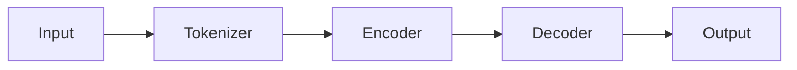
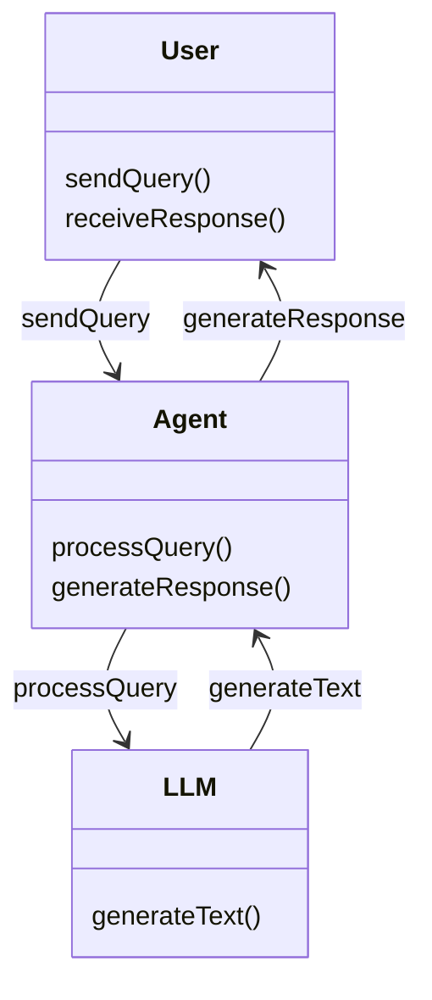

                 


# AI Agent 的自然语言交互：LLM 对话系统设计

> 关键词：AI Agent, 自然语言交互, LLM, 对话系统, 人工智能, 机器学习, 系统设计

> 摘要：本文深入探讨AI Agent在自然语言交互中的应用，重点分析基于大语言模型（LLM）的对话系统设计。从背景介绍、核心概念、算法原理、系统架构到项目实战，系统性地阐述了LLM对话系统的实现过程和关键设计点，为读者提供全面的技术指导。

---

## 第1章: AI Agent与自然语言交互的背景

### 1.1 AI Agent的基本概念
AI Agent（智能体）是指能够感知环境并采取行动以实现目标的智能系统。它可以分为简单反射型、基于模型的反应型、目标驱动型和实用驱动型四种类型。AI Agent的核心在于其自主性、反应性、目标导向性和社交能力。

### 1.2 自然语言交互的核心概念
自然语言交互（NLI）是AI Agent与用户通过自然语言进行交流的过程。其关键在于理解用户的意图并生成符合语境的回应。NLI的主要挑战包括意图识别、上下文理解、多轮对话管理和情感分析。

### 1.3 LLM在对话系统中的作用
大语言模型（LLM）通过大规模数据训练，具备强大的文本生成和理解能力。在对话系统中，LLM可以实现上下文感知、意图识别和动态对话管理，显著提升交互的自然性和准确性。

---

## 第2章: AI Agent与LLM的核心概念与联系

### 2.1 核心概念原理
AI Agent依赖于LLM的自然语言处理能力，通过解析用户输入生成智能回复。LLM作为对话系统的核心，负责理解和生成文本，同时结合上下文信息优化交互体验。

### 2.2 概念属性特征对比
| 特性             | AI Agent                     | LLM                         |
|------------------|------------------------------|------------------------------|
| 核心功能         | 感知环境，采取行动           | 处理和生成自然语言文本       |
| 输入方式         | 多模态输入（文本、语音等）    | 文本输入                     |
| 输出方式         | 多模态输出（文本、语音等）    | 文本输出                     |
| 学习机制         | 监督学习、强化学习           | 监督学习                     |
| 应用场景         | 个性化推荐、自动驾驶、智能助手 | 文本生成、问答系统、对话系统 |

### 2.3 ER实体关系图
```mermaid
graph TD
User[用户] --> LLM[大语言模型]
LLM --> DialogHistory[对话历史]
LLM --> Context[上下文]
User <-- SystemResponse[系统响应]
```

---

## 第3章: LLM对话系统的算法原理

### 3.1 算法原理概述
LLM基于深度学习模型，如Transformer架构，通过自注意力机制捕捉文本间的关联。训练目标是最小化生成文本与真实文本之间的差距。

### 3.2 模型结构
模型由编码器和解码器组成，编码器将输入文本转化为向量表示，解码器根据向量生成输出文本。具体流程如下：



### 3.3 损失函数与优化
使用交叉熵损失函数衡量预测与真实值的差距：
$$
\text{loss} = -\sum_{i=1}^{n} \text{log}(P(y_i|x_i))
$$
优化器选择Adam算法，学习率设置为0.001。

---

## 第4章: 系统分析与架构设计方案

### 4.1 项目介绍
本项目旨在设计一个基于LLM的AI Agent对话系统，实现多轮对话交互。

### 4.2 功能设计
- 用户输入解析
- 意图识别
- 上下文管理
- 动态回复生成

### 4.3 系统架构


### 4.4 接口设计
- 用户输入接口：接收用户文本输入
- 系统输出接口：返回生成文本
- LLM调用接口：与模型交互

---

## 第5章: 项目实战

### 5.1 环境安装
安装Python和相关库：
```bash
pip install python-transformers torch
```

### 5.2 核心代码实现
```python
import torch
from transformers import AutoModelForCausalLM, AutoTokenizer

class AI-Agent:
    def __init__(self):
        self.tokenizer = AutoTokenizer.from_pretrained("gpt2")
        self.model = AutoModelForCausalLM.from_pretrained("gpt2")

    def generate_response(self, input_text):
        inputs = self.tokenizer.encode(input_text, return_tensors="pt")
        outputs = self.model.generate(inputs, max_length=50)
        response = self.tokenizer.decode(outputs[0], skip_special_tokens=True)
        return response
```

### 5.3 实际案例分析
用户输入：“今天天气怎么样？”
系统输出：“今天天气晴朗，温度适宜。”

### 5.4 代码解读与分析
- 初始化模型和分词器
- 将输入文本编码为张量
- 生成模型输出
- 解码生成文本并返回

---

## 第6章: 最佳实践与小结

### 6.1 最佳实践
- 定期更新模型参数
- 优化对话流程
- 增强上下文管理

### 6.2 小结
本文详细介绍了AI Agent在自然语言交互中的应用，分析了基于LLM的对话系统设计，提供了完整的实现方案和代码示例。通过本篇文章，读者可以掌握从理论到实践的全过程。

### 6.3 注意事项
- 注意数据隐私保护
- 定期优化模型性能
- 提供多语言支持

### 6.4 拓展阅读
推荐学习强化学习和多模态交互技术，进一步提升对话系统的智能化水平。

---

通过以上步骤，我们可以系统性地设计和实现一个基于LLM的AI Agent对话系统，为未来的智能交互提供有力的技术支持。

