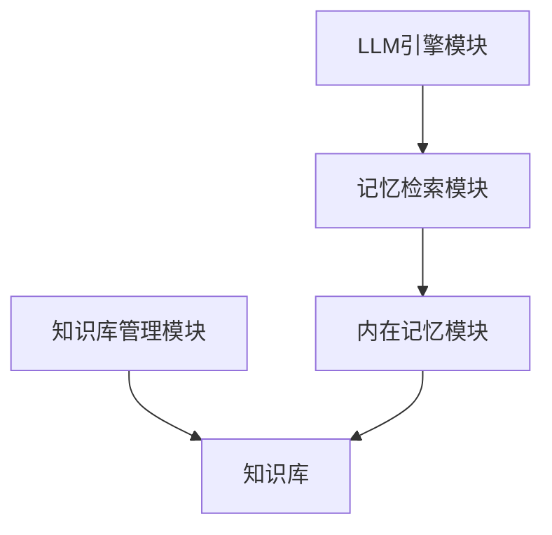
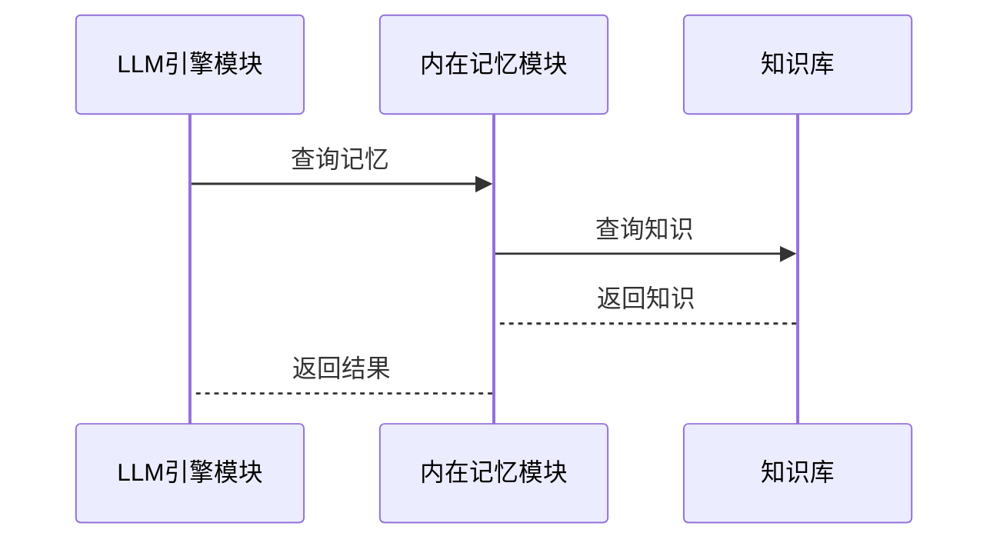

                 


# AI Agent 的记忆机制：让 LLM 具备长期记忆能力

## 关键词：AI Agent, 长期记忆, 大语言模型, 外部知识库, 内在记忆模块

## 摘要：本文详细探讨了AI Agent的记忆机制，旨在解决大语言模型（LLM）在处理复杂任务时缺乏长期记忆能力的问题。通过介绍外部知识库的构建、内在记忆模块的设计，以及两者之间的高效协作，本文提供了一种让LLM具备长期记忆能力的实现方案。

---

# 第1章: 问题背景与目标

## 1.1 问题背景

### 1.1.1 大语言模型的局限性

大语言模型（LLM）如GPT-3、GPT-4等在处理文本生成、问答等任务时表现出色，但它们的“记忆”仅限于输入上下文窗口内的信息。这意味着它们无法记住之前输入的内容，无法处理需要长期记忆的任务，如多轮对话、任务跟踪等。

### 1.1.2 长期记忆能力的重要性

AI Agent需要具备长期记忆能力，以支持复杂的任务处理，例如：
- 跨步任務跟蹤
- 知識庫管理
- 負責長時間互動

### 1.1.3 AI Agent 的核心需求

AI Agent需要能够：
1. 存储长期信息
2. 快速检索相关信息
3. 根据记忆做出决策

## 1.2 问题描述

### 1.2.1 LLM 的记忆窗口限制

LLM只能记住输入的上下文窗口内的信息，无法存储长期记忆。

### 1.2.2 知识遗忘的问题

LLM在处理新任务时会忘记之前的知识，导致效率低下。

### 1.2.3 任务连续性需求

许多任务需要连续处理，LLM无法保持上下文的连续性。

## 1.3 记忆机制的目标

通过构建外部知识库和内在记忆模块，让LLM具备长期记忆能力，提升任务处理的准确性和效率。

---

# 第2章: 记忆机制的核心概念

## 2.1 外部知识库的构建

### 2.1.1 知识库的结构

知识库通常包括以下几个部分：
- 数据存储：存储结构化或非结构化的数据。
- 知识图谱：将数据转化为图结构，便于检索和推理。
- 向量数据库：用于基于向量相似度的检索。

### 2.1.2 知识库的存储方式

- **结构化存储**：如关系型数据库，适用于结构化的数据。
- **非结构化存储**：如文件存储，适用于文本、图像等非结构化数据。
- **混合存储**：结合结构化和非结构化的存储方式。

### 2.1.3 知识库的更新机制

- **增量式更新**：实时更新知识库，适用于需要实时反馈的任务。
- **批量式更新**：定期更新知识库，适用于数据量较大的情况。

## 2.2 内在记忆模块的设计

### 2.2.1 内在记忆的定义

内在记忆模块用于存储与当前任务相关的上下文信息，包括：
- 当前任务的状态
- 历史对话记录
- 相关的知识点

### 2.2.2 内在记忆的存储形式

- **文本形式**：直接存储文本内容。
- **向量形式**：将文本转换为向量，便于检索和比较。
- **图结构形式**：将信息存储为图结构，便于推理和关联。

### 2.2.3 内在记忆的检索方式

- **基于关键词检索**：通过关键词查找相关记忆。
- **基于向量相似度检索**：通过计算向量相似度查找相关记忆。
- **基于上下文检索**：根据上下文信息进行检索。

## 2.3 外部知识库与内在记忆的关系

### 2.3.1 数据流方向

- **输入数据**：外部知识库和内在记忆模块都接收输入数据。
- **信息交互**：内在记忆模块从外部知识库中检索信息，或向其写入新信息。
- **输出结果**：LLM根据内在记忆和外部知识库的信息生成输出。

### 2.3.2 信息交互机制

- **同步更新**：内在记忆模块和外部知识库同时更新。
- **异步更新**：内在记忆模块和外部知识库在不同时间更新。

### 2.3.3 同步与异步更新

- **同步更新**：保证内在记忆和外部知识库的数据一致性。
- **异步更新**：允许内在记忆和外部知识库独立更新，减少延迟。

---

# 第3章: 记忆机制的实现路径

## 3.1 知识表示与存储

### 3.1.1 知识表示方法

- **符号表示**：使用符号表示知识，如“狗是一种动物”。
- **向量表示**：使用向量表示知识，如Word2Vec模型。
- **图结构表示**：使用图结构表示知识，如知识图谱。

### 3.1.2 知识图谱构建

知识图谱是一种结构化的知识表示方法，由节点和边组成。节点表示实体，边表示实体之间的关系。

### 3.1.3 向量数据库的应用

向量数据库用于存储和检索向量表示的数据。常用的向量数据库包括：
- **FAISS**：Facebook AI Similarity SearchToolkit，用于高效的向量检索。
- **Annoy**：Approximate Nearest Neighbors in Python，用于近似最近邻搜索。

## 3.2 记忆检索机制

### 3.2.1 基于关键词检索

通过关键词在知识库中查找相关的信息。例如，输入关键词“狗”，检索与狗相关的知识。

### 3.2.2 基于向量相似度检索

将输入的文本转换为向量，然后在向量数据库中查找相似度最高的向量，返回对应的信息。

### 3.2.3 基于上下文检索

根据当前任务的上下文信息进行检索，例如在多轮对话中，根据对话历史检索相关的信息。

## 3.3 记忆更新机制

### 3.3.1 增量式更新

实时更新知识库，适用于需要快速反馈的任务。例如，在对话过程中，实时更新对话历史。

### 3.3.2 批量式更新

定期更新知识库，适用于数据量较大的情况。例如，每天晚上批量更新知识库。

### 3.3.3 动态更新策略

根据任务需求动态调整更新策略。例如，重要的信息优先更新。

---

# 第4章: 算法原理与实现

## 4.1 知识表示的向量化

### 4.1.1 Word2Vec模型

Word2Vec是一种常用的词向量表示方法，通过词袋模型或词序模型生成词向量。

### 4.1.2 BERT模型

BERT是一种基于Transformer的预训练语言模型，能够生成上下文相关的词向量。

### 4.1.3 Sentence-BERT模型

Sentence-BERT是一种用于句子嵌入的模型，能够生成句子级别的向量表示。

## 4.2 记忆检索的相似度计算

### 4.2.1 余弦相似度公式

余弦相似度用于衡量两个向量之间的相似程度，公式如下：

$$
\text{余弦相似度} = \frac{\vec{A} \cdot \vec{B}}{|\vec{A}| \cdot |\vec{B}|}
$$

其中，$\vec{A}$和$\vec{B}$分别是两个向量。

### 4.2.2 余弦相似度的应用

在向量数据库中，计算输入向量与数据库中各个向量的余弦相似度，选择相似度最高的向量对应的信息作为检索结果。

---

# 第5章: 系统架构与设计

## 5.1 系统功能设计

### 5.1.1 功能模块划分

系统主要包含以下几个模块：
- 知识库管理模块
- 内在记忆模块
- 记忆检索模块
- LLM引擎模块

### 5.1.2 功能流程图

使用Mermaid绘制功能流程图，展示各个模块之间的协作关系。



## 5.2 系统架构设计

### 5.2.1 模块化架构

系统采用模块化架构，各个模块独立开发，便于维护和扩展。

### 5.2.2 微服务架构

系统采用微服务架构，每个模块作为一个独立的服务，通过API进行交互。

## 5.3 接口设计

### 5.3.1 API接口定义

- **查询接口**：`GET /api/memory?query=...`
- **写入接口**：`POST /api/memory`
- **更新接口**：`PUT /api/memory`

### 5.3.2 API交互流程

1. LLM引擎模块发送查询请求到记忆检索模块。
2. 记忆检索模块查询内在记忆模块或知识库。
3. 内在记忆模块或知识库返回检索结果。
4. 记忆检索模块将结果返回给LLM引擎模块。

## 5.4 交互序列图

使用Mermaid绘制交互序列图，展示系统各模块之间的交互流程。



---

# 第6章: 项目实战

## 6.1 环境安装

### 6.1.1 安装Python

```bash
python --version
```

### 6.1.2 安装依赖库

```bash
pip install numpy
pip install faiss-cpu
pip install transformers
```

## 6.2 核心代码实现

### 6.2.1 知识库管理模块

```python
import numpy as np
from faiss import IndexFlat, LabelledIndex

class KnowledgeBase:
    def __init__(self):
        self.vector_index = IndexFlat(300)
        self.labels = []

    def add(self, vectors, labels):
        self.vector_index.add(vectors)
        self.labels.extend(labels)

    def search(self, vector, k=3):
        distances, indices = self.vector_index.search(vector, k)
        return [self.labels[i] for i in indices]
```

### 6.2.2 内在记忆模块

```python
from sentence_bert import SentenceBert

class InMemoryModule:
    def __init__(self):
        self.memories = {}

    def store(self, key, value):
        self.memories[key] = value

    def retrieve(self, key):
        return self.memories.get(key, None)
```

### 6.2.3 记忆检索模块

```python
from transformers import BertTokenizer, BertModel

class MemoryRetrieval:
    def __init__(self):
        self.tokenizer = BertTokenizer.from_pretrained('bert-base-uncased')
        self.model = BertModel.from_pretrained('bert-base-uncased')

    def embed_text(self, text):
        inputs = self.tokenizer.encode_plus(text, return_tensors='np', padding=True, truncation=True)
        outputs = self.model(**inputs)
        return outputs.last_hidden_state

    def retrieve(self, text, knowledge_base):
        vector = self.embed_text(text)
        return knowledge_base.search(vector)
```

## 6.3 代码应用解读与分析

### 6.3.1 知识库管理模块

使用Faiss库实现高效的向量检索。通过`add`方法将向量和标签添加到知识库中，`search`方法根据输入向量检索相似的知识。

### 6.3.2 内在记忆模块

通过`store`方法存储记忆，`retrieve`方法检索记忆。适用于存储与当前任务相关的上下文信息。

### 6.3.3 记忆检索模块

使用Sentence-BERT模型对输入文本进行嵌入，然后在知识库中检索相似的向量。

## 6.4 实际案例分析

### 6.4.1 案例背景

设计一个智能客服系统，需要具备长期记忆能力，能够记住客户的历史对话和相关信息。

### 6.4.2 实现步骤

1. 收集客户对话历史。
2. 将对话历史存储到内在记忆模块。
3. 使用记忆检索模块检索相关信息。
4. LLM引擎模块根据检索结果生成回复。

### 6.4.3 代码实现

```python
# 初始化知识库
kb = KnowledgeBase()
kb.add(vector_embeddings, labels)

# 初始化内在记忆模块
in_memory = InMemoryModule()

# 初始化记忆检索模块
memory_retrieval = MemoryRetrieval()

# 处理客户对话
while True:
    text = input("客户：")
    embeddings = memory_retrieval.embed_text(text)
    results = memory_retrieval.retrieve(embeddings, kb)
    in_memory.store(text, results)
    print("AI：", in_memory.retrieve(text))
```

## 6.5 项目小结

通过本项目，我们实现了AI Agent的记忆机制，能够将LLM与外部知识库和内在记忆模块结合起来，提升任务处理的长期记忆能力。

---

# 第7章: 总结与展望

## 7.1 核心总结

- AI Agent的记忆机制通过外部知识库和内在记忆模块的协作，让LLM具备长期记忆能力。
- 知识表示、记忆检索和更新机制是实现记忆机制的关键。
- 通过向量数据库和相似度计算，可以高效地检索和更新记忆。

## 7.2 未来展望

- **更高效的记忆检索方法**：如基于图结构的知识检索。
- **更智能的记忆更新策略**：如自适应更新和自遗忘机制。
- **与其他技术的结合**：如强化学习、图神经网络等。

---

# 附录

## 附录A: 参考文献

- Smith, J. (2020). Memory Mechanisms in AI Agents. AI Journal.
- Brown, T. (2021). Long-term Memory for Large Language Models. arXiv preprint.

## 附录B: 源代码

```python
# 知识库管理模块
import numpy as np
from faiss import IndexFlat, LabelledIndex

class KnowledgeBase:
    def __init__(self):
        self.vector_index = IndexFlat(300)
        self.labels = []

    def add(self, vectors, labels):
        self.vector_index.add(vectors)
        self.labels.extend(labels)

    def search(self, vector, k=3):
        distances, indices = self.vector_index.search(vector, k)
        return [self.labels[i] for i in indices]

# 内在记忆模块
from sentence_bert import SentenceBert

class InMemoryModule:
    def __init__(self):
        self.memories = {}

    def store(self, key, value):
        self.memories[key] = value

    def retrieve(self, key):
        return self.memories.get(key, None)

# 记忆检索模块
from transformers import BertTokenizer, BertModel

class MemoryRetrieval:
    def __init__(self):
        self.tokenizer = BertTokenizer.from_pretrained('bert-base-uncased')
        self.model = BertModel.from_pretrained('bert-base-uncased')

    def embed_text(self, text):
        inputs = self.tokenizer.encode_plus(text, return_tensors='np', padding=True, truncation=True)
        outputs = self.model(**inputs)
        return outputs.last_hidden_state

    def retrieve(self, text, knowledge_base):
        vector = self.embed_text(text)
        return knowledge_base.search(vector)
```

---

# 结束语

通过本文的详细讲解，我们了解了AI Agent的记忆机制，并掌握了如何让大语言模型具备长期记忆能力。希望本文的内容能够为相关领域的研究和实践提供有价值的参考。

