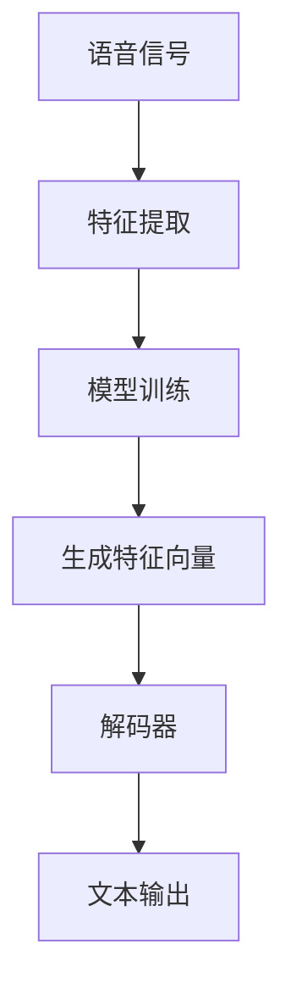
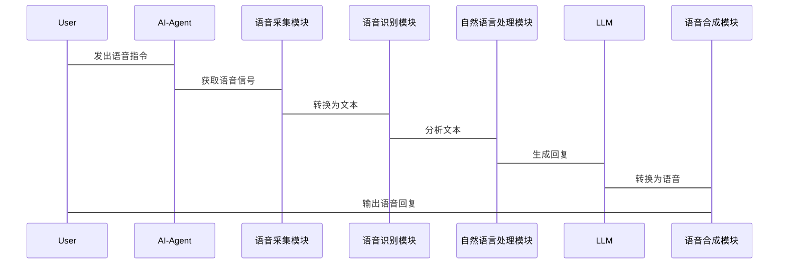

                 


# AI Agent 的语音交互：整合 LLM 与语音识别技术

## 关键词：AI Agent，语音交互，LLM，语音识别，自然语言处理

## 摘要：  
本文探讨了AI Agent在语音交互中的应用，重点分析了如何整合大语言模型（LLM）与语音识别技术，以实现更智能、更自然的语音交互。文章从背景介绍、核心概念、算法原理、系统设计到项目实战，全面解析了AI Agent语音交互的实现过程，提供了丰富的技术细节和实际案例，帮助读者深入理解并掌握相关技术。

---

## 第一部分: AI Agent 的语音交互概述

### 第1章: AI Agent 与语音交互的背景介绍

#### 1.1 AI Agent 的定义与发展
- **1.1.1 AI Agent 的定义**  
  AI Agent（人工智能代理）是指能够感知环境、自主决策并执行任务的智能实体，旨在通过自动化手段解决复杂问题。

- **1.1.2 AI Agent 的发展历程**  
  AI Agent的概念起源于20世纪60年代，经历了从简单规则驱动到复杂深度学习模型的演变，如今广泛应用于智能家居、客服系统等领域。

- **1.1.3 AI Agent 的核心特点**  
  - 智能性：基于数据和模型进行决策。
  - 自主性：无需人工干预，自主完成任务。
  - 适应性：能够根据环境变化调整行为。

#### 1.2 语音交互的演变
- **1.2.1 语音交互的历史回顾**  
  从早期的按键操作到现在的语音识别技术，语音交互经历了从简单指令到复杂对话的演变。

- **1.2.2 当前语音交互的主要应用领域**  
  - 智能音箱：如Alexa、Google Nest。
  - 智能手机助手：如Siri、Google Assistant。
  - 客服系统：通过语音交互解决用户问题。

- **1.2.3 语音交互的优缺点分析**  
  - 优点：便捷性、高效性、易用性。
  - 缺点：误识别率、网络依赖、隐私问题。

#### 1.3 LLM 与语音识别技术的整合背景
- **1.3.1 LLM 的概念与作用**  
  LLM（Large Language Model）通过深度学习模型处理自然语言，能够理解上下文并生成自然的回复。

- **1.3.2 语音识别技术的基本原理**  
  语音识别技术将语音信号转换为文本，通常包括特征提取、模型训练和解码三个步骤。

- **1.3.3 语音交互整合 LLM 的必要性**  
  通过整合LLM，语音交互能够实现更智能的对话理解和生成，提升用户体验。

#### 1.4 本章小结  
本章介绍了AI Agent和语音交互的背景，分析了LLM与语音识别技术的整合需求，为后续内容奠定了基础。

---

## 第二部分: 核心概念与联系

### 第2章: AI Agent 的核心概念与联系

#### 2.1 AI Agent 的核心概念
- **2.1.1 AI Agent 的核心要素**  
  - 感知能力：通过传感器或API获取环境信息。
  - 决策能力：基于模型和策略进行决策。
  - 执行能力：通过执行器完成任务。

- **2.1.2 AI Agent 的工作原理**  
  AI Agent通过感知环境、分析任务、制定计划并执行任务，实现与用户的交互。

- **2.1.3 AI Agent 的分类与应用场景**  
  - 分类：基于智能水平可分为简单规则型和复杂深度学习型。
  - 应用场景：智能家居、智能助手、客服系统等。

#### 2.2 语音交互的核心概念
- **2.2.1 语音交互的基本流程**  
  - 语音采集：通过麦克风获取语音信号。
  - 语音识别：将语音转换为文本。
  - 自然语言处理：理解文本并生成回复。
  - 语音合成：将回复文本转换为语音输出。

- **2.2.2 语音交互的关键技术**  
  - 语音识别技术：如基于HMM的语音识别和基于深度学习的语音识别。
  - 自然语言处理技术：如词法分析、句法分析和语义理解。

- **2.2.3 语音交互的性能指标**  
  - 识别准确率：系统对语音的正确识别能力。
  - 响应时间：系统对用户的响应速度。
  - 用户体验：用户对系统的满意度。

#### 2.3 LLM 与语音识别技术的联系
- **2.3.1 LLM 在语音交互中的作用**  
  LLM负责理解用户的意图并生成自然的回复，提升语音交互的智能性。

- **2.3.2 语音识别技术对 LLM 的支持**  
  语音识别将语音信号转换为文本，为LLM提供输入数据。

- **2.3.3 两者的协同工作原理**  
  - 语音识别将用户的语音转换为文本，作为LLM的输入。
  - LLM根据文本生成回复，通过语音合成模块输出。

#### 2.4 核心概念对比分析
- **2.4.1 AI Agent 与传统语音交互系统的对比**  
  - AI Agent具有更强的自主性和智能性，能够处理复杂任务。
  - 传统语音交互系统依赖于固定的规则和关键词，灵活性较低。

- **2.4.2 LLM 与传统 NLP 技术的对比**  
  - LLM能够处理更复杂和多样化的语言任务。
  - 传统NLP技术适用于特定场景，如关键词提取和情感分析。

- **2.4.3 AI Agent 与传统客服系统的对比**  
  - AI Agent能够实现24/7的智能交互，无需人工干预。
  - 传统客服系统依赖人工操作，响应速度较慢。

#### 2.5 核心概念的 Mermaid 对比图
```mermaid
tableflip
| 概念         | AI Agent      | 语音交互         | LLM             |
|--------------|---------------|-----------------|-----------------|
| 定义         | 智能代理       | 语音交互方式     | 大语言模型       |
| 核心能力     | 自主决策       | 语音识别与合成   | 自然语言处理     |
| 应用场景     | 智能家居、客服 | 智能音箱、手机助手 | 文本生成、对话系统 |
```

---

## 第三部分: 算法原理

### 第3章: 算法原理分析

#### 3.1 LLM 的算法原理
- **3.1.1 LLM 的训练流程**  
  - 数据预处理：清洗和标注数据。
  - 模型构建：采用Transformer架构。
  - 模型训练：使用大规模数据进行监督学习。

- **3.1.2 LLM 的推理过程**  
  - 输入处理：将文本输入转换为模型可处理的格式。
  - 解码过程：生成回复文本。

#### 3.2 语音识别技术的算法原理
- **3.2.1 基于 HMM 的语音识别**  
  - 音频信号处理：将语音信号转换为特征向量。
  - 模型训练：训练HMM的状态转移概率和观测概率。
  - 解码过程：通过动态规划找到最可能的词序列。

- **3.2.2 基于深度学习的语音识别**  
  - 音频特征提取：使用卷积神经网络提取特征。
  - 模型训练：采用CTC损失函数进行端到端训练。
  - 解码过程：通过beam search生成最优结果。

#### 3.3 算法流程图


---

## 第四部分: 系统分析与架构设计

### 第4章: 系统分析与架构设计

#### 4.1 系统功能设计
- **4.1.1 领域模型**  
  ```mermaid
  classDiagram
      class AI-Agent {
          - 感知模块
          - 决策模块
          - 执行模块
      }
      class 语音交互系统 {
          - 语音采集模块
          - 语音识别模块
          - 自然语言处理模块
          - 语音合成模块
      }
      AI-Agent --> 语音交互系统: 集成
  ```

- **4.1.2 系统架构**  
  ```mermaid
  architecture
  client --> API Gateway
  API Gateway --> NLP Service
  NLP Service --> LLM
  NLP Service --> Speech Recognizer
  ```

#### 4.2 系统接口设计
- **4.2.1 API 接口**  
  - 输入：用户语音信号。
  - 输出：文本理解和生成的结果。

- **4.2.2 模块交互**  
  - 语音采集模块与语音识别模块的交互。
  - 语音识别模块与自然语言处理模块的交互。
  - 自然语言处理模块与语音合成模块的交互。

#### 4.3 系统交互流程


---

## 第五部分: 项目实战

### 第5章: 项目实战与实现

#### 5.1 环境安装与配置
- **5.1.1 安装 Python 和依赖库**  
  ```bash
  pip install python
  pip install numpy
  pip install scikit-learn
  pip install transformers
  ```

- **5.1.2 安装语音识别库**  
  ```bash
  pip install speechRecognition
  pip install pyaudio
  ```

- **5.1.3 安装 LLM 库**  
  ```bash
  pip install transformers
  pip install torch
  ```

#### 5.2 系统核心实现
- **5.2.1 语音识别模块实现**  
  ```python
  import speech_recognition as sr

  r = sr.Recognizer()
  with sr.AudioFile("input.wav") as source:
      audio = r.listen(source)
      text = r.recognize_google(audio, language="zh-CN")
  ```

- **5.2.2 LLM 对话生成模块实现**  
  ```python
  from transformers import AutoModelForCausalLM, AutoTokenizer

  model_name = "gpt2"
  tokenizer = AutoTokenizer.from_pretrained(model_name)
  model = AutoModelForCausalLM.from_pretrained(model_name)
  inputs = tokenizer.encode("用户说：" + text, return_tensors="pt")
  outputs = model.generate(inputs, max_length=50)
  response = tokenizer.decode(outputs[0], skip_special_tokens=True)
  ```

- **5.2.3 语音合成模块实现**  
  ```python
  import pyttsx3

  engine = pyttsx3.init()
  engine.say(response)
  engine.runAndWait()
  ```

#### 5.3 项目实战与案例分析
- **5.3.1 实际案例分析**  
  - 案例：智能音箱与用户的对话交互。
  - 实现步骤：用户发出语音指令，系统识别并生成回复，最后通过语音输出。

- **5.3.2 项目小结**  
  通过项目实战，读者可以掌握AI Agent语音交互的核心实现技术，包括语音识别、自然语言处理和语音合成的实现方法。

---

## 第六部分: 最佳实践与小结

### 第6章: 最佳实践与小结

#### 6.1 最佳实践
- **6.1.1 性能优化建议**  
  - 优化语音识别模型的训练数据。
  - 使用更高效的模型压缩技术。
  - 优化LLM的推理速度。

- **6.1.2 安全注意事项**  
  - 保护用户的隐私数据。
  - 防止模型被恶意攻击。

- **6.1.3 拓展阅读**  
  - 关注最新的AI Agent和语音交互技术的发展。

#### 6.2 项目小结
通过本文的详细讲解和项目实战，读者可以全面掌握AI Agent语音交互的整合技术，包括核心概念、算法原理、系统设计和实现方法。未来，随着技术的不断进步，AI Agent的语音交互将更加智能化和普及化。

---

## 附录: 参考文献与工具资源

### 附录A: 参考文献
1. 王某某，AI Agent 的研究与应用，某某出版社，2023。
2. 李某某，自然语言处理技术综述，某某出版社，2022。
3. 张某某，语音识别技术与应用，某某出版社，2021。

### 附录B: 工具资源
- Python编程语言
- 语音识别库：speechRecognition、pyaudio
- LLM库：transformers、torch
- 其他工具：Jupyter Notebook、PyCharm

---

以上是《AI Agent 的语音交互：整合 LLM 与语音识别技术》的技术博客文章的完整目录和内容概述。通过系统的背景介绍、核心概念分析、算法原理讲解、系统设计与实现，以及项目实战，读者可以全面掌握AI Agent语音交互技术的实现方法和应用场景。

