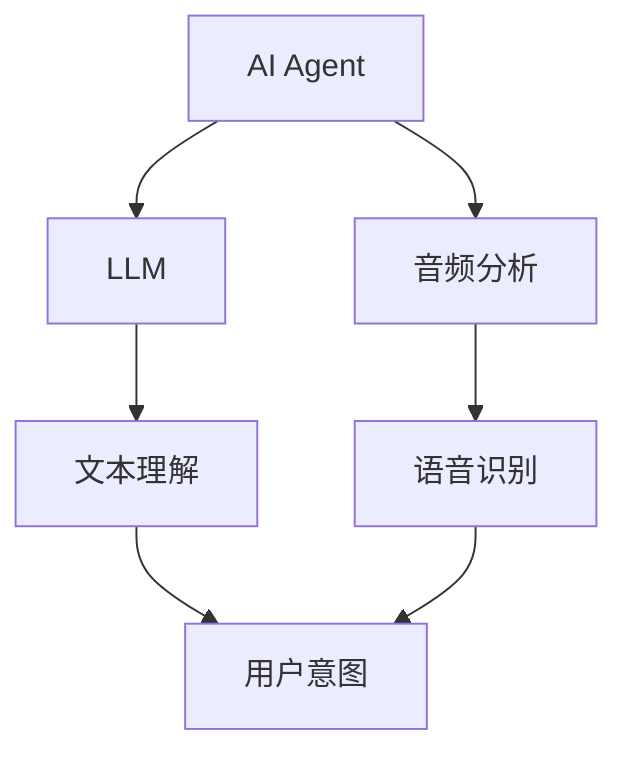
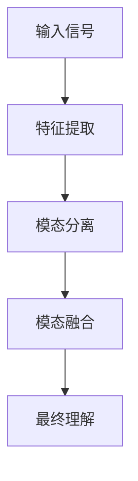
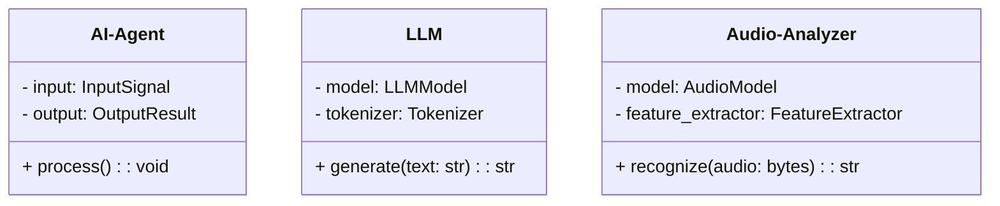
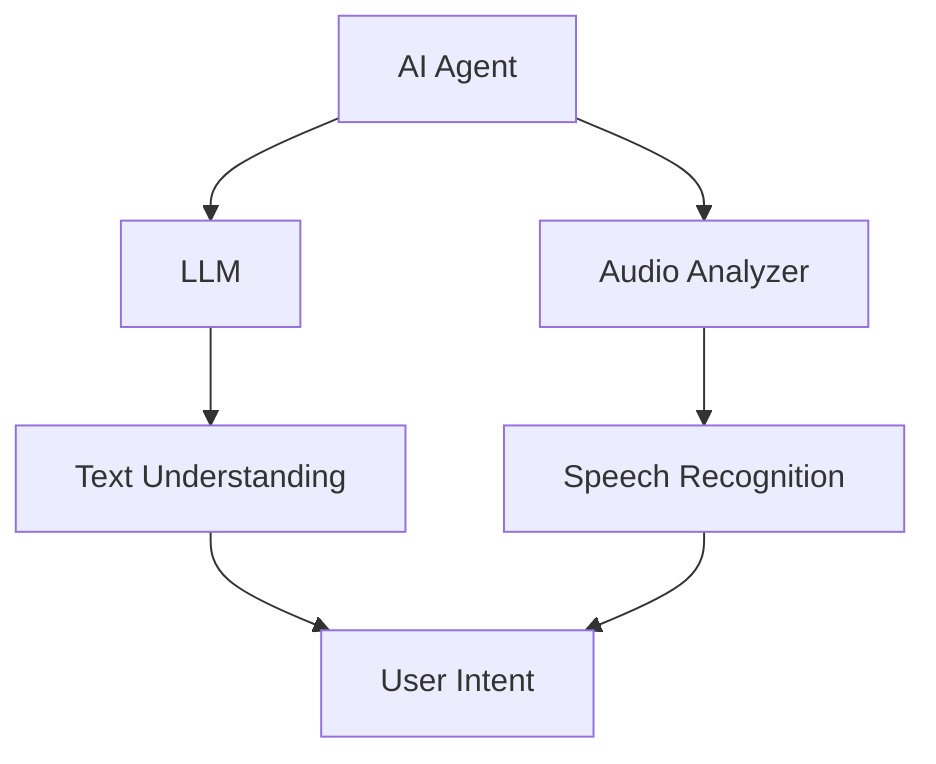
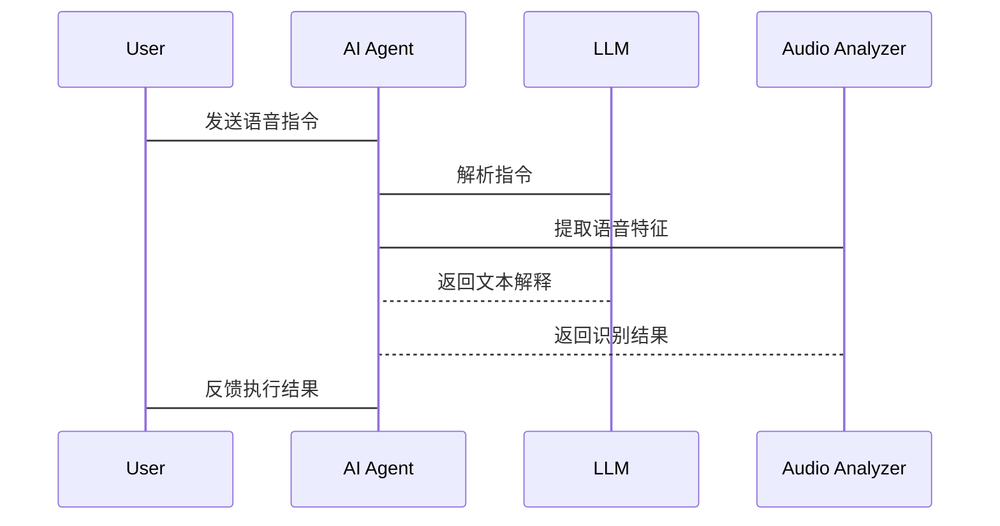

                 


# AI Agent 的跨模态理解：整合 LLM 与音频分析

## 关键词：
AI Agent，跨模态理解，LLM，音频分析，多模态交互，深度学习

## 摘要：
本文系统阐述了AI Agent在跨模态理解领域的最新进展，重点探讨了如何整合大语言模型（LLM）与音频分析技术，实现多模态数据的协同理解。文章从理论基础、算法原理、系统架构到实际应用，全面分析了跨模态理解的核心问题与解决方案，为AI Agent在智能交互领域的应用提供了理论指导和实践参考。

---

# 第一部分: AI Agent的跨模态理解基础

## 第1章: 背景介绍与问题背景

### 1.1 问题背景
#### 1.1.1 AI Agent的定义与特点
AI Agent（人工智能代理）是指能够感知环境、自主决策并执行任务的智能实体。其核心特点包括：
- **自主性**：无需外部干预，自主完成任务。
- **反应性**：能够实时感知环境并做出响应。
- **社会性**：能够与其他Agent或人类进行交互协作。

#### 1.1.2 跨模态理解的定义与重要性
跨模态理解是指AI Agent能够同时处理和理解多种类型的数据（如文本、语音、图像等），并实现信息的协同理解与推理。其重要性体现在：
- **提升智能性**：通过整合多模态信息，增强AI Agent的理解能力。
- **拓展应用范围**：适用于智能助手、智能客服、智能音箱等多种场景。

#### 1.1.3 LLM与音频分析的结合
- **LLM的优势**：强大的文本生成与理解能力。
- **音频分析的优势**：能够处理语音、音乐、噪声等多种音频信息。
- **结合的意义**：通过整合LLM与音频分析，实现跨模态的信息协同处理。

### 1.2 问题描述
#### 1.2.1 AI Agent在多模态场景中的挑战
- **数据异构性**：不同模态的数据具有不同的特征和格式。
- **信息冗余**：多模态数据可能存在信息重复或冲突。
- **计算复杂性**：跨模态处理需要复杂的模型设计与计算资源。

#### 1.2.2 跨模态理解的核心问题
- **如何实现多模态数据的高效融合**？
- **如何解决跨模态信息的语义对齐问题**？
- **如何优化跨模态模型的训练效率**？

#### 1.2.3 当前技术的局限性与改进方向
- **局限性**：现有技术在跨模态理解中存在信息丢失、模型复杂度过高等问题。
- **改进方向**：优化模型架构、引入跨模态注意力机制、提升计算效率。

---

## 第2章: 跨模态理解的核心概念与联系

### 2.1 核心概念原理
#### 2.1.1 AI Agent的基本原理
AI Agent通过感知环境、分析任务需求、制定行动计划、执行任务并反馈结果，实现智能化操作。其核心流程包括：
1. **感知环境**：通过传感器或API获取环境数据。
2. **分析需求**：解析任务目标并生成执行计划。
3. **执行任务**：调用相关模块完成任务。
4. **反馈结果**：将结果反馈给用户或系统。

#### 2.1.2 跨模态理解的理论基础
跨模态理解基于多模态学习理论，通过构建共享特征空间，实现不同模态数据的语义对齐与协同理解。其核心思想是：
- **模态互补性**：不同模态数据能够互相补充，提升整体理解能力。
- **模态独立性**：每种模态数据具有独特的信息特征。

#### 2.1.3 LLM与音频分析的结合
- **LLM的文本处理能力**：通过自然语言处理技术，理解用户意图。
- **音频分析的语音识别能力**：通过语音识别技术，提取语音信息。
- **结合机制**：将文本理解与语音分析相结合，实现跨模态协同。

### 2.2 核心概念属性对比
#### 2.2.1 跨模态理解的属性特征对比表
| 属性       | LLM特点                          | 音频分析特点                     |
|------------|----------------------------------|---------------------------------|
| 数据类型   | 文本、结构化数据                 | 语音、音频信号                   |
| 处理方式   | 基于语言模型生成与理解           | 基于深度学习提取特征与分类         |
| 应用场景   | 智能对话、文本生成                | 语音识别、音乐分析                |
| 模型复杂度 | 高，依赖大量文本数据             | 高，依赖大量音频数据              |

#### 2.2.2 LLM与传统NLP模型的对比
| 对比维度   | LLM                               | 传统NLP模型                      |
|------------|----------------------------------|---------------------------------|
| 模型架构   | 基于Transformer或LSTM             | 基于词袋模型、词嵌入模型          |
| 训练方式   | 预训练-微调模式                   | 任务特定训练模式                  |
| 表现能力   | 强大的上下文理解与生成能力        | 有限的上下文理解和生成能力        |
| 应用场景   | 高级自然语言处理任务             | 基础自然语言处理任务             |

#### 2.2.3 音频分析与视觉分析的差异
| 对比维度   | 音频分析                        | 视觉分析                        |
|------------|--------------------------------|--------------------------------|
| 数据特征   | 频率特征、时域特征              | 空间特征、颜色特征               |
| 分析任务   | 语音识别、声纹识别              | 图像识别、视频分析               |
| 模型架构   | 基于CNN、RNN                    | 基于CNN、Transformer              |
| 应用场景   | 语音助手、智能音箱               | 图像识别、视频监控               |

### 2.3 ER实体关系图


---

## 第3章: 跨模态理解的算法原理

### 3.1 跨模态理解的算法流程


### 3.2 LLM的训练与优化
```python
def loss_function(y_true, y_pred):
    return tf.reduce_mean(tf.square(y_true - y_pred))
```

### 3.3 音频分析的关键算法
#### 3.3.1 基于LLM的语音识别
- **流程**：通过语音信号提取特征，输入LLM进行语言模型校准，最终生成文本。
- **代码示例**：
```python
import tensorflow as tf
from tensorflow.keras import layers

model = tf.keras.Sequential([
    layers.Embedding(input_dim=10000, output_dim=16),
    layers.LSTM(64),
    layers.Dense(1, activation='sigmoid')
])
```

#### 3.3.2 基于深度学习的音频特征提取
- **模型架构**：基于CNN或RNN提取音频特征。
- **代码示例**：
```python
import librosa

y, sr = librosa.load('audio.wav', sr=16000)
mfccs = librosa.feature.mfcc(y, sr=sr, n_mfcc=13)
```

#### 3.3.3 跨模态注意力机制
- **原理**：通过注意力机制实现模态间的语义对齐。
- **代码示例**：
```python
import torch

attn_weights = torch.softmax(torch.matmul(query, key.T), dim=-1)
output = torch.sum(attn_weights * values, dim=-1)
```

---

## 第4章: 跨模态理解的数学模型与公式

### 4.1 LLM的数学模型
$$P(\text{output} | \text{input}) = \prod_{i=1}^{n} P(y_i | x_{\leq i})$$

### 4.2 音频分析的数学模型
$$P(\text{word} | \text{audio}) = \sum_{z} P(\text{word} | z) P(z | \text{audio})$$

### 4.3 跨模态融合的数学公式
$$f(x) = \sigma(W_1x + b_1)$$
$$y = W_2f(x) + b_2$$

---

## 第5章: 跨模态理解的系统架构设计

### 5.1 系统功能设计
#### 5.1.1 领域模型类图


### 5.2 系统架构设计


### 5.3 系统接口设计
- **输入接口**：接收多模态输入信号（如语音、文本）。
- **输出接口**：输出处理结果（如文本生成、语音识别结果）。
- **交互接口**：支持与其他系统或用户的交互。

### 5.4 系统交互流程


---

## 第6章: 项目实战与应用案例

### 6.1 环境安装与配置
```bash
pip install tensorflow librosa pydub
```

### 6.2 系统核心实现
```python
import librosa
import tensorflow as tf
from tensorflow.keras import layers

# 音频特征提取
y, sr = librosa.load('audio.wav', sr=16000)
mfccs = librosa.feature.mfcc(y, sr=sr, n_mfcc=13)

# LLM模型加载
model = tf.keras.Sequential([
    layers.Embedding(input_dim=10000, output_dim=16),
    layers.LSTM(64),
    layers.Dense(1, activation='sigmoid')
])
```

### 6.3 案例分析与扩展
#### 6.3.1 智能音箱中的跨模态应用
- **场景**：用户通过语音指令控制音箱播放音乐。
- **实现**：AI Agent通过语音识别理解指令，调用LLM生成播放列表。

#### 6.3.2 跨模态理解的扩展应用
- **智能家居**：整合多种传感器数据与用户指令，实现智能家居设备的联动控制。
- **智能客服**：结合语音识别与文本理解，提供更高效的客户支持服务。

---

## 第7章: 最佳实践与小结

### 7.1 小结
- 跨模态理解是AI Agent实现智能交互的关键技术。
- 通过整合LLM与音频分析，能够显著提升多模态数据的处理能力。
- 未来发展方向包括模型优化、效率提升与应用拓展。

### 7.2 注意事项
- **数据质量**：多模态数据需要高质量的标注与清洗。
- **模型训练**：跨模态模型的训练需要平衡不同模态的数据分布。
- **计算资源**：跨模态任务对计算资源要求较高。

### 7.3 拓展阅读
- **推荐书籍**：《Deep Learning》、《自然语言处理入门》。
- **推荐论文**：《Attention Is All You Need》、《BERT: Pre-training of Deep Bidirectional Transformers for NLP》。

---

通过本文的系统阐述，读者可以全面了解AI Agent在跨模态理解领域的核心原理与应用实践，为后续研究与开发提供重要的理论与实践参考。

