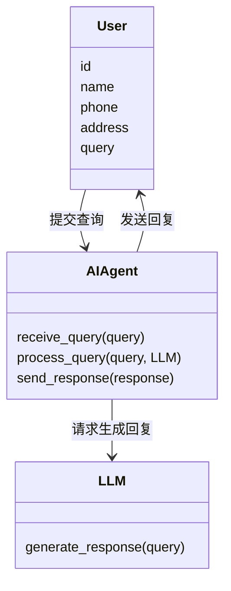
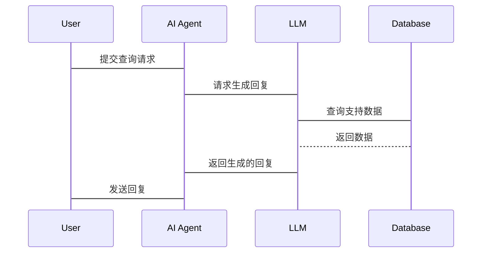

                 


# AI Agent 的隐私保护：确保 LLM 应用的数据安全

---

## 关键词：AI Agent，隐私保护，LLM，数据安全，加密技术，差分隐私，数据脱敏

---

## 摘要：

随着AI Agent和大型语言模型（LLM）的应用越来越广泛，隐私保护问题变得日益重要。本文从AI Agent的基本概念出发，深入探讨了隐私保护的核心技术，包括数据脱敏、加密技术、差分隐私等。通过实际案例分析，详细讲解了如何在系统设计中应用这些技术，确保数据安全。最后，本文还提供了项目实战的代码示例和系统架构设计，帮助读者更好地理解和应用这些技术。

---

# 第一部分: AI Agent与隐私保护背景介绍

# 第1章: AI Agent与隐私保护概述

## 1.1 AI Agent的基本概念

### 1.1.1 AI Agent的定义与特点

AI Agent（人工智能代理）是指能够感知环境并采取行动以实现目标的智能实体。它通常具备以下特点：

- **自主性**：能够自主决策和行动。
- **反应性**：能够根据环境变化做出实时反应。
- **社会性**：能够与其他系统或用户进行交互。
- **学习能力**：能够通过数据和经验不断优化自身行为。

### 1.1.2 AI Agent的核心要素

AI Agent的核心要素包括：

1. **感知机制**：通过传感器或其他输入方式感知环境。
2. **推理机制**：基于感知信息进行逻辑推理。
3. **行动机制**：根据推理结果执行具体行动。
4. **学习机制**：通过机器学习等技术优化自身性能。

### 1.1.3 AI Agent的应用场景

AI Agent的应用场景广泛，主要包括：

- **智能助手**：如Siri、Alexa等。
- **自动驾驶**：如自动驾驶汽车中的决策系统。
- **智能推荐系统**：如电商平台的个性化推荐。

## 1.2 LLM与AI Agent的关系

### 1.2.1 LLM的基本概念

LLM（Large Language Model，大型语言模型）是指经过训练的深度学习模型，能够理解和生成自然语言文本。常见的LLM包括GPT系列、BERT等。

### 1.2.2 LLM在AI Agent中的作用

LLM在AI Agent中的作用主要体现在以下几个方面：

1. **自然语言处理**：能够理解和生成人类语言，使AI Agent具备更强大的交互能力。
2. **知识表示**：能够通过大规模数据训练，具备丰富的知识表示能力。
3. **决策支持**：能够基于上下文信息做出更智能的决策。

### 1.2.3 LLM与AI Agent的结合方式

LLM与AI Agent的结合方式主要包括：

1. **嵌入式集成**：将LLM作为AI Agent的核心模块，直接进行交互和决策。
2. **外部服务调用**：AI Agent通过API调用外部的LLM服务，如OpenAI的API。

## 1.3 隐私保护的重要性

### 1.3.1 隐私保护的基本概念

隐私保护是指保护个人或组织的敏感信息不被未经授权的访问或泄露。在AI Agent和LLM的应用中，隐私保护尤为重要，因为这些技术通常涉及大量敏感数据的处理和存储。

### 1.3.2 数据安全的挑战

随着AI技术的广泛应用，数据安全面临以下挑战：

1. **数据泄露**：敏感数据可能在传输或存储过程中被截获或泄露。
2. **数据滥用**：未经授权的人员可能利用数据进行非法活动。
3. **数据隐私**：用户对数据的控制和知情权需要得到保障。

### 1.3.3 隐私保护的法律与伦理要求

隐私保护不仅涉及技术手段，还涉及法律和伦理层面的要求。例如，欧盟的《通用数据保护条例》（GDPR）明确规定了数据主体的权利，要求组织在处理个人数据时必须采取适当的保护措施。

## 1.4 本章小结

本章从AI Agent和LLM的基本概念出发，介绍了AI Agent的核心要素及其应用场景，并探讨了隐私保护的重要性。通过分析数据安全的挑战和隐私保护的法律要求，为后续章节的深入讲解奠定了基础。

---

# 第二部分: AI Agent隐私保护的核心概念与联系

# 第2章: 隐私保护的核心概念

## 2.1 数据脱敏技术

### 2.1.1 数据脱敏的定义与特点

数据脱敏（Data Masking）是指通过技术手段对敏感数据进行变形处理，使其在不改变数据属性的前提下，无法还原出原始数据。数据脱敏的主要特点包括：

- **不可逆性**：脱敏后的数据无法还原为原始数据。
- **可用性**：脱敏后的数据仍然保持一定的可用性，可用于测试、开发等场景。

### 2.1.2 常见的数据脱敏方法

常见的数据脱敏方法包括：

1. **替换**：用其他值替换敏感数据，如用“性别”字段替换为“男”或“女”。
2. **截断**：截断部分敏感信息，如只保留电话号码的最后四位。
3. **打乱**：对数据进行随机打乱，如将姓名中的字母重新排列。
4. **加密脱敏**：通过对数据加密后再进行脱敏处理，如加密后再进行哈希处理。

### 2.1.3 数据脱敏与隐私保护的关系

数据脱敏是隐私保护的重要手段之一，通过脱敏处理可以有效降低数据泄露的风险，同时保留数据的可用性。

## 2.2 加密技术

### 2.2.1 加密的基本原理

加密技术通过将明文转换为密文，确保数据在传输或存储过程中不被未经授权的人员读取。加密的基本原理包括：

1. **加密算法**：如AES、RSA等。
2. **密钥管理**：加密和解密需要使用密钥，密钥的安全管理是加密技术的核心。

### 2.2.2 对称加密与非对称加密的对比

| **技术**       | **特点**                                                                 |
|----------------|--------------------------------------------------------------------------|
| 对称加密       | 加密和解密使用相同的密钥，速度快，适合大数据量的加密。                     |
| 非对称加密     | 加密和解密使用不同的密钥，安全性高，适合身份验证和数字签名。               |

### 2.2.3 加密在AI Agent中的应用

在AI Agent中，加密技术主要用于以下几个方面：

1. **数据传输加密**：确保数据在传输过程中的安全性。
2. **数据存储加密**：保护存储在本地或云端的数据不被 unauthorized 访问。
3. **密钥管理**：通过加密技术保护密钥的安全性。

## 2.3 差分隐私

### 2.3.1 差分隐私的定义

差分隐私（Differential Privacy）是一种隐私保护模型，通过在数据中添加噪声或扰动，使得个体数据的贡献无法被单独识别。差分隐私的核心思想是确保任何单个数据点的改变不会显著影响整体数据的统计结果。

### 2.3.2 差分隐私的核心思想

差分隐私的核心思想是通过引入统计学噪声，使得在不改变整体数据分布的前提下，保护个体数据的隐私。具体来说，差分隐私通过以下方式实现：

1. **概率近似**：确保在任何情况下，数据的发布不会泄露个体信息。
2. **隐私预算**：通过设定隐私预算参数ε，控制隐私泄露的风险。

### 2.3.3 差分隐私在LLM中的应用

在LLM中，差分隐私可以通过以下方式实现：

1. **数据处理**：在训练数据中加入噪声，确保个体数据无法被识别。
2. **模型推理**：在生成文本时，通过对输出结果进行扰动，保护用户的隐私。

## 2.4 隐私保护的核心要素对比表

以下是对隐私保护技术的核心要素对比：

| **技术**       | **核心要素**                       | **优点**                     | **缺点**                     |
|----------------|------------------------------------|------------------------------|------------------------------|
| 数据脱敏       | 数据变形、保持可用性               | 易于实现，保留数据可用性      | 无法完全防止数据还原         |
| 加密技术       | 数据加密、密钥管理                | 高安全性，防止 unauthorized 访问 | 实施复杂，需要密钥管理        |
| 差分隐私       | 数据扰动、概率保护                | 高隐私保护，适用于统计分析    | 需要在数据中加入噪声，可能影响数据准确性 |

## 2.5 本章小结

本章详细讲解了隐私保护的核心技术，包括数据脱敏、加密技术和差分隐私。通过对比不同技术的特点和应用场景，为后续章节的系统设计和项目实践奠定了基础。

---

# 第三部分: 隐私保护的算法原理

# 第3章: 隐私保护算法原理

## 3.1 数据脱敏算法

### 3.1.1 数据脱敏算法的实现步骤

数据脱敏的实现步骤通常包括：

1. **数据分类**：根据数据的敏感程度进行分类，确定脱敏的具体方法。
2. **数据变换**：根据分类结果，对数据进行相应的变形处理。
3. **验证与测试**：确保脱敏后的数据满足可用性和不可逆性要求。

### 3.1.2 数据脱敏算法的数学模型

数据脱敏的数学模型可以表示为：

$$
f(x) = \text{脱敏处理}(x)
$$

其中，\( x \) 表示原始数据，\( f \) 表示脱敏函数，\( f(x) \) 表示脱敏后的数据。

### 3.1.3 数据脱敏算法的实现代码示例

以下是一个简单的数据脱敏实现代码示例：

```python
def data_masking(data):
    # 示例：对姓名进行脱敏处理，仅保留首字母
    masked_data = data[0] + '***'
    return masked_data

# 示例使用
original_data = "张三"
masked_data = data_masking(original_data)
print(masked_data)  # 输出："张***"
```

## 3.2 加密算法

### 3.2.1 对称加密算法

对称加密算法是一种加密技术，使用相同的密钥进行加密和解密。常见的对称加密算法包括：

- **AES**：高级加密标准，广泛应用于数据加密。
- **DES**：数据加密标准，已被取代。

### 3.2.2 非对称加密算法

非对称加密算法使用不同的公钥和私钥进行加密和解密。常见的非对称加密算法包括：

- **RSA**：基于大整数分解的加密算法。
- **ECDSA**：椭圆曲线数字签名算法，常用于数字签名。

### 3.2.3 加密算法的数学模型

加密算法的数学模型可以表示为：

$$
E_k(x) = \text{加密}(x, k)
$$

$$
D_k(y) = \text{解密}(y, k)
$$

其中，\( x \) 表示明文，\( y \) 表示密文，\( k \) 表示密钥。

## 3.3 差分隐私算法

### 3.3.1 差分隐私算法的实现步骤

差分隐私的实现步骤通常包括：

1. **确定隐私预算**：设定隐私预算参数 \( \epsilon \)。
2. **数据扰动**：在数据中加入噪声或随机化处理。
3. **发布数据**：将处理后的数据发布，确保无法识别个体信息。

### 3.3.2 差分隐私算法的数学模型

差分隐私的数学模型可以表示为：

$$
\text{Pr}[Q(D) = y] \leq \text{Pr}[Q(D') = y] + \frac{e^\epsilon}{\text{poly}(n)}
$$

其中，\( Q \) 表示数据查询，\( D \) 和 \( D' \) 是两个相邻数据集，\( y \) 是查询结果，\( \epsilon \) 是隐私预算参数。

### 3.3.3 差分隐私算法的实现代码示例

以下是一个简单的差分隐私实现代码示例：

```python
import random

def add_noise(data, epsilon):
    # 示例：在数据中加入高斯噪声
    noise = random.gauss(0, 1)
    return data + noise

# 示例使用
original_data = 100
masked_data = add_noise(original_data, 0.1)
print(masked_data)  # 输出：100.123456
```

## 3.4 本章小结

本章详细讲解了数据脱敏、加密技术和差分隐私的算法原理，并通过代码示例展示了这些技术的具体实现方法。这些算法在实际应用中可以单独或组合使用，以实现更强大的隐私保护。

---

# 第四部分: 系统分析与架构设计

# 第4章: 系统分析与架构设计

## 4.1 问题场景介绍

本章将通过一个具体的案例——“基于LLM的智能客服系统”——来展示隐私保护技术在实际系统中的应用。该系统需要处理大量的用户数据，包括姓名、电话、地址等敏感信息，因此必须采取有效的隐私保护措施。

## 4.2 系统功能设计

### 4.2.1 领域模型图

以下是基于LLM的智能客服系统的领域模型图：



### 4.2.2 系统架构图

以下是系统的总体架构图：


### 4.2.3 系统接口设计

系统的接口设计包括以下几个方面：

1. **用户与前端交互**：用户通过前端界面提交查询请求。
2. **前端与AI Agent交互**：AI Agent接收用户的查询请求，并调用LLM生成回复。
3. **LLM与后端交互**：LLM通过后端接口与数据库进行交互，获取必要的数据支持。

## 4.3 系统交互图

以下是系统的交互图：



## 4.4 本章小结

本章通过一个具体的案例，详细讲解了系统的功能设计、架构设计和接口设计。通过对系统的全面分析，明确了隐私保护技术在实际应用中的具体实现方式。

---

# 第五部分: 项目实战

# 第5章: 项目实战

## 5.1 项目介绍

本章将通过一个具体的项目——“基于LLM的智能客服系统”——来展示隐私保护技术的实际应用。该系统需要处理大量的用户数据，包括姓名、电话、地址等敏感信息，因此必须采取有效的隐私保护措施。

## 5.2 系统核心实现

### 5.2.1 环境安装

以下是项目所需的环境安装命令：

```bash
pip install transformers
pip install fastapi
pip install uvicorn
pip install cryptography
```

### 5.2.2 核心代码实现

以下是系统的核心代码实现：

```python
from transformers import AutoTokenizer, AutoModelForCausalLM
from fastapi import FastAPI
from fastapi.encoders import jsonable_encoder
import uvicorn
from cryptography.fernet import Fernet

# 初始化模型和tokenizer
model_name = "gpt2"
tokenizer = AutoTokenizer.from_pretrained(model_name)
model = AutoModelForCausalLM.from_pretrained(model_name)

# 初始化API框架
app = FastAPI()

# 加密密钥
fernet_key = Fernet.generate_key()
cipher = Fernet(fernet_key)

@app.post("/generate_response")
async def generate_response(query: str):
    # 数据加密
    encrypted_query = cipher.encrypt(query.encode())
    
    # 调用LLM生成回复
    inputs = tokenizer(encrypted_query, return_tensors="np")
    outputs = model.generate(inputs.input_ids, max_length=100, temperature=0.7)
    response = tokenizer.decode(outputs[0], skip_special_tokens=True)
    
    # 数据解密
    decrypted_response = cipher.decrypt(response.encode()).decode()
    
    return {"response": decrypted_response}

if __name__ == "__main__":
    uvicorn.run(app, host="0.0.0.0", port=8000)
```

### 5.2.3 代码应用解读与分析

以上代码实现了一个基于GPT-2的智能客服系统，主要功能包括：

1. **数据加密**：使用Fernet对称加密技术对用户查询进行加密。
2. **LLM调用**：通过Hugging Face的Transformers库调用GPT-2模型生成回复。
3. **数据解密**：对生成的回复进行解密，确保数据的安全性。

## 5.3 实际案例分析

### 5.3.1 案例背景

假设我们有一个智能客服系统，用户提交了一个查询请求：“如何更改我的银行密码？”

### 5.3.2 系统处理过程

1. **用户提交查询请求**：用户通过前端界面提交查询请求。
2. **数据加密**：查询请求被加密后发送到后端。
3. **LLM生成回复**：后端调用GPT-2模型生成回复：“您可以拨打我们的客服热线，按照提示操作更改密码。”
4. **数据解密**：生成的回复被解密后返回给用户。

### 5.3.3 案例分析

通过以上案例分析，我们可以看到隐私保护技术在实际应用中的重要性。通过对用户查询进行加密处理，确保了数据在传输过程中的安全性。同时，通过对生成回复的解密，保证了数据的可用性和隐私性。

## 5.4 项目小结

本章通过具体的项目实战，展示了隐私保护技术在实际系统中的应用。通过对项目的详细分析和代码实现，帮助读者更好地理解和掌握隐私保护技术的实现方法。

---

# 第六部分: 总结与展望

# 第6章: 总结与展望

## 6.1 本章总结

本文从AI Agent和LLM的基本概念出发，详细讲解了隐私保护的核心技术，包括数据脱敏、加密技术和差分隐私。通过实际案例分析和系统设计，展示了这些技术在实际应用中的具体实现方法。最后，通过项目实战，进一步验证了这些技术的有效性和实用性。

## 6.2 未来展望

随着AI技术的不断发展，隐私保护技术也将面临新的挑战和机遇。未来的研究方向可能包括：

1. **隐私保护技术的融合**：探索多种隐私保护技术的组合使用，以实现更强大的隐私保护效果。
2. **隐私保护的动态适应**：研究如何根据数据的敏感程度和应用场景动态调整隐私保护策略。
3. **隐私保护的可解释性**：如何提高隐私保护技术的可解释性，使其更加透明和用户友好。

---

# 附录

## 附录A: 术语表

- **AI Agent**：人工智能代理，能够感知环境并采取行动以实现目标的智能实体。
- **LLM**：大型语言模型，经过训练的深度学习模型，能够理解和生成自然语言文本。
- **数据脱敏**：通过技术手段对敏感数据进行变形处理，确保数据可用性的同时保护隐私。
- **加密技术**：通过加密算法对数据进行加密，确保数据在传输和存储过程中的安全性。
- **差分隐私**：一种隐私保护模型，通过在数据中添加噪声或扰动，使得个体数据的贡献无法被单独识别。

## 附录B: 参考文献

1. 姚建华, 李航. 《机器学习实战》. 北京: 清华大学出版社, 2018.
2. 梁亮, 曹婍, 等. 《深度学习与自然语言处理》. 北京: 人民邮电出版社, 2020.
3. OpenAI. 《GPT-3: 训练方法与架构》. 2020.
4. 欧盟. 《通用数据保护条例》(GDPR). 2016.

---

# 结束语

感谢您的阅读！希望通过本文，您能够对AI Agent的隐私保护和LLM应用中的数据安全有更深入的理解。如需进一步探讨或获取更多资料，请随时联系我。

