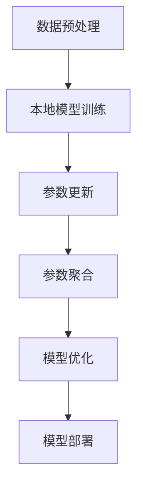
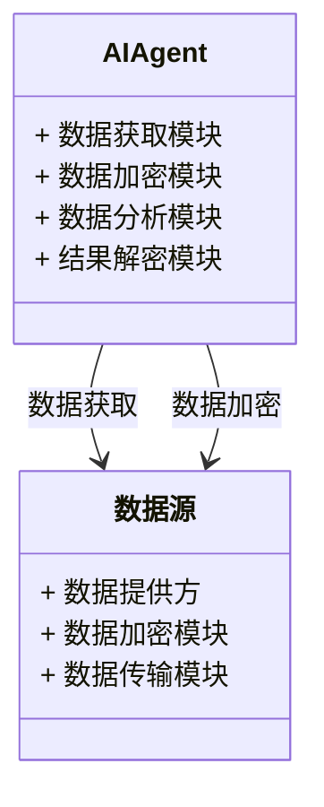
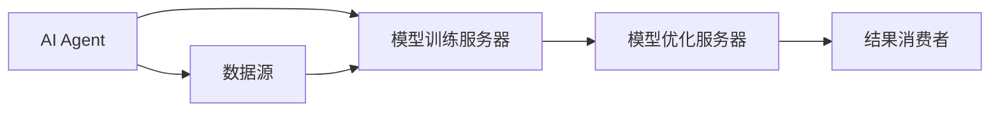
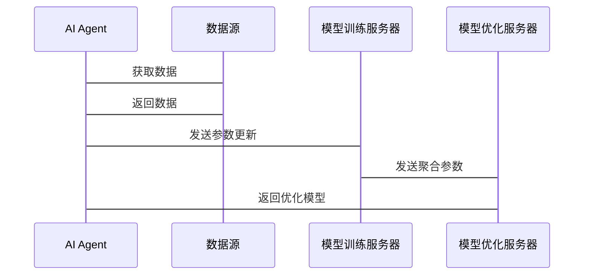

                 


# AI Agent 的隐私计算：在保护数据隐私的同时应用 LLM

> **关键词**：AI Agent，隐私计算，数据隐私，大型语言模型，联邦学习，安全多方计算

> **摘要**：  
> 在数据隐私日益重要的今天，AI Agent 的应用需求也在不断增加。如何在保护数据隐私的前提下，充分利用大型语言模型（LLM）的能力，是当前技术领域的重要挑战。本文将详细探讨 AI Agent 的隐私计算方法，从基本概念、算法原理、系统架构设计到实际案例分析，全面解析如何在保护数据隐私的同时，实现 LLM 的高效应用。

---

## 第1章: 隐私计算与AI Agent概述

### 1.1 隐私计算的核心概念

#### 1.1.1 隐私计算的定义与特点
- **隐私计算**是指在不泄露原始数据的前提下，对数据进行处理和分析的技术。其特点包括数据可用性、不可见性和隐私保护性。
- **数据可用性**：允许数据被计算和分析，但数据本身不会被泄露。
- **不可见性**：数据在计算过程中保持加密状态，计算方无法直接接触到明文数据。
- **隐私保护性**：通过技术手段确保数据隐私不被侵犯。

#### 1.1.2 AI Agent的基本概念与功能
- **AI Agent**：智能体，能够感知环境、自主决策并执行任务的实体。
- **功能**：
  - 感知环境：通过传感器或数据接口获取信息。
  - 分析决策：利用机器学习模型进行数据分析和决策。
  - 执行任务：根据决策结果执行操作。

#### 1.1.3 隐私计算与AI Agent的结合
- AI Agent 可以通过隐私计算技术，在不泄露数据的情况下，实现对数据的分析和决策。
- 隐私计算为 AI Agent 提供了数据处理的安全性和隐私保护，使其在敏感场景中也能高效运行。

### 1.2 问题背景与需求分析

#### 1.2.1 数据隐私保护的重要性
- 随着数据量的增加，数据泄露风险也在上升。
- 数据隐私保护已成为法律和伦理的强制要求，尤其是在金融、医疗等领域。

#### 1.2.2 AI Agent在数据隐私保护中的作用
- AI Agent 可以通过隐私计算技术，实现数据的局部处理和分析。
- 在保护数据隐私的同时，AI Agent 可以提供高效的决策支持和自动化服务。

#### 1.2.3 当前隐私计算技术的挑战
- 数据处理效率：隐私计算技术通常会增加计算开销。
- 技术复杂性：隐私计算需要复杂的加密和通信协议。
- 适用性：如何在不同场景下灵活应用隐私计算技术。

### 1.3 技术背景与发展趋势

#### 1.3.1 隐私计算的技术演进
- 从早期的加密数据库到现代的联邦学习，隐私计算技术不断发展。
- 联邦学习和安全多方计算（MPC）成为当前主流的隐私计算方法。

#### 1.3.2 AI Agent在各行业的应用现状
- 金融行业：AI Agent 用于信用评估和欺诈检测。
- 医疗行业：AI Agent 用于患者数据分析和诊断支持。
- 零售行业：AI Agent 用于个性化推荐和库存管理。

#### 1.3.3 隐私计算与AI Agent的未来发展方向
- 技术融合：隐私计算与 AI Agent 的深度结合。
- 标准化：制定统一的隐私计算和 AI Agent 标准。
- 行业应用：在更多领域推广隐私计算支持的 AI Agent。

### 1.4 本章小结
本章介绍了隐私计算和 AI Agent 的基本概念，分析了数据隐私保护的重要性，以及当前隐私计算技术的挑战和未来发展方向。

---

## 第2章: 隐私计算的核心原理

### 2.1 隐私计算的原理与方法

#### 2.1.1 数据加密与隐私保护
- **加密数据**：通过加密技术保护数据隐私。
- **同态加密**：允许在加密状态下对数据进行计算。
- **秘密共享**：将数据分割成多个密片，分别进行计算。

#### 2.1.2 安全多方计算（MPC）
- **定义**：多个参与方在不泄露各自数据的前提下，共同完成计算。
- **流程**：
  1. 数据分割：将数据分割成多个密片。
  2. 分布计算：各参与方在密片上进行计算。
  3. 结果合并：将计算结果合并，得到最终结果。

#### 2.1.3 联邦学习
- **定义**：多个机构在不共享数据的前提下，联合训练模型。
- **流程**：
  1. 数据预处理：对数据进行清洗和格式化。
  2. 模型训练：各机构本地训练模型，并将参数更新同步到中心服务器。
  3. 模型优化：通过参数聚合优化模型性能。

### 2.2 AI Agent的隐私保护机制

#### 2.2.1 AI Agent中的数据处理流程
- 数据获取：通过传感器或 API 获取数据。
- 数据加密：对敏感数据进行加密处理。
- 数据分析：在加密状态下进行数据分析和模型训练。
- 结果解密：将计算结果解密，供决策使用。

#### 2.2.2 隐私保护在AI Agent中的实现方式
- 数据加密：对敏感字段进行加密处理。
- 模型训练：在加密数据上训练模型。
- 通信安全：通过安全通道进行数据传输。

#### 2.2.3 隐私计算对AI Agent性能的影响
- 计算效率：加密和隐私计算会增加计算开销。
- 数据可用性：部分隐私计算技术可能导致数据可用性降低。

### 2.3 隐私计算与AI Agent的关联性分析

#### 2.3.1 隐私计算对AI Agent数据处理的影响
- 数据处理的透明性：隐私计算使得数据处理过程更加透明。
- 数据安全：隐私计算保障了数据的安全性。

#### 2.3.2 AI Agent在隐私计算中的独特优势
- 自主决策：AI Agent 可以自主决策，减少对中心服务器的依赖。
- 多方协作：AI Agent 可以在多个参与方之间协作，实现联合计算。

#### 2.3.3 隐私计算与AI Agent的协同效应
- 提高数据利用率：通过隐私计算，AI Agent 可以在保护隐私的前提下，充分利用数据。
- 降低计算成本：通过联邦学习等技术，减少数据传输和计算成本。

### 2.4 核心概念对比表

| 概念         | 定义与特点                                                                 |
|--------------|--------------------------------------------------------------------------|
| 隐私计算     | 在不泄露数据的前提下，对数据进行处理和分析的技术。                     |
| AI Agent     | 具备感知、决策和执行能力的智能体。                                       |
| 联邦学习     | 多个参与方在不共享数据的前提下，联合训练模型的技术。                     |
| 安多方计算   | 多个参与方在不泄露各自数据的前提下，共同完成计算的技术。                 |

---

## 第3章: 隐私计算与AI Agent的算法原理

### 3.1 隐私计算的算法实现

#### 3.1.1 联邦学习的算法流程



- 数据预处理：对数据进行清洗和格式化。
- 本地模型训练：各机构在本地数据上训练模型，并生成参数更新。
- 参数聚合：将各机构的参数更新聚合，形成全局模型参数。
- 模型优化：对聚合后的模型参数进行优化，提升模型性能。
- 模型部署：将优化后的模型部署到各个机构，供实际应用使用。

#### 3.1.2 安多方计算的数学模型

$$ y = f(x_1, x_2, \ldots, x_n) $$

- $x_i$：第 $i$ 个参与方的数据。
- $y$：计算结果。

### 3.2 AI Agent的隐私保护算法

#### 3.2.1 数据加密与解密算法

$$ E(x) = x \oplus k $$

$$ D(y) = y \oplus k $$

- $E(x)$：加密算法，$x$ 为明文，$k$ 为密钥。
- $D(y)$：解密算法，$y$ 为密文，$k$ 为密钥。

#### 3.2.2 模型训练的隐私保护

$$ w_{i+1} = w_i + \Delta w_i $$

- $w_i$：第 $i$ 轮模型参数。
- $\Delta w_i$：第 $i$ 轮参数更新。

---

## 第4章: AI Agent的系统架构设计

### 4.1 项目背景与目标

#### 4.1.1 项目背景
- 数据隐私保护需求日益增加。
- AI Agent 在各行业的应用需求不断增长。

#### 4.1.2 项目目标
- 实现 AI Agent 的隐私计算功能。
- 提供高效、安全的数据处理能力。

### 4.2 系统功能设计

#### 4.2.1 领域模型设计



- 数据获取模块：负责从数据源获取数据。
- 数据加密模块：对数据进行加密处理。
- 数据分析模块：在加密数据上进行分析和计算。
- 结果解密模块：将计算结果解密，供决策使用。

### 4.3 系统架构设计

#### 4.3.1 系统架构图



- AI Agent：负责数据获取、加密和分析。
- 数据源：提供原始数据。
- 模型训练服务器：负责模型训练和参数更新。
- 模型优化服务器：负责参数聚合和模型优化。
- 结果消费者：接收最终的计算结果。

### 4.4 接口设计与交互流程

#### 4.4.1 系统接口设计



- 数据获取：AI Agent 从数据源获取数据。
- 参数更新：AI Agent 将本地训练的参数更新发送到模型训练服务器。
- 参数聚合：模型训练服务器将各机构的参数更新聚合，发送到模型优化服务器。
- 模型优化：模型优化服务器对聚合后的参数进行优化，返回给 AI Agent。

---

## 第5章: 项目实战与案例分析

### 5.1 环境安装与配置

```bash
pip install -r requirements.txt
```

- `requirements.txt` 包含项目所需的依赖包。
- 安装完成后，运行项目脚本。

### 5.2 核心代码实现

#### 5.2.1 数据加密模块

```python
def encrypt(x, key):
    return x ^ key

def decrypt(y, key):
    return y ^ key
```

- `encrypt`：对数据进行加密。
- `decrypt`：对数据进行解密。

#### 5.2.2 模型训练模块

```python
def train_model(data, model):
    model.fit(data)
    return model.get_weights()

def aggregate(weights_list):
    return sum(weights_list) / len(weights_list)
```

- `train_model`：在本地数据上训练模型，并返回参数更新。
- `aggregate`：对各机构的参数更新进行聚合。

### 5.3 案例分析与解读

#### 5.3.1 案例背景
- 数据源：多个金融机构。
- 任务：联合训练信用评估模型。

#### 5.3.2 实施步骤
1. 数据预处理：对各机构的数据进行清洗和格式化。
2. 数据加密：对敏感字段进行加密处理。
3. 模型训练：各机构在本地数据上训练模型，并生成参数更新。
4. 参数聚合：将各机构的参数更新聚合，形成全局模型参数。
5. 模型优化：对聚合后的模型参数进行优化，提升模型性能。
6. 模型部署：将优化后的模型部署到各个机构，供实际应用使用。

### 5.4 项目小结
通过本项目，我们实现了 AI Agent 的隐私计算功能，验证了隐私计算技术在实际场景中的应用可行性。

---

## 第6章: 最佳实践与总结

### 6.1 最佳实践

#### 6.1.1 数据预处理
- 数据清洗：去除噪声数据。
- 数据格式化：统一数据格式，方便后续处理。

#### 6.1.2 模型优化
- 参数调整：根据实际需求调整模型参数。
- 模型评估：通过交叉验证评估模型性能。

#### 6.1.3 系统安全性
- 加密算法选择：选择合适的加密算法，确保数据安全性。
- 安全通信：通过安全通道进行数据传输，防止数据泄露。

### 6.2 小结

通过本文的详细讲解，我们了解了 AI Agent 的隐私计算方法，掌握了隐私计算的核心原理和系统架构设计。同时，通过实际案例分析，验证了隐私计算技术在实际应用中的可行性。

### 6.3 注意事项

- 数据隐私保护：在实际应用中，必须严格遵守数据隐私保护相关法律法规。
- 系统安全性：确保系统设计和实现过程中的安全性，防止数据泄露。
- 技术选型：根据实际需求选择合适的技术方案，避免技术复杂性过高。

### 6.4 拓展阅读

- 《Privacy-preserving Machine Learning with Federated Learning》
- 《Secure Multi-party Computation: From Foundations to Applications》
- 《Applied Cryptography: Protocols, Algorithms, and Source Code in C》

---

**结语**  
通过本文的探讨，我们不仅了解了 AI Agent 的隐私计算方法，还掌握了隐私计算的核心原理和系统架构设计。希望本文能为读者在保护数据隐私的同时，应用 LLM 提供有价值的参考和指导。

