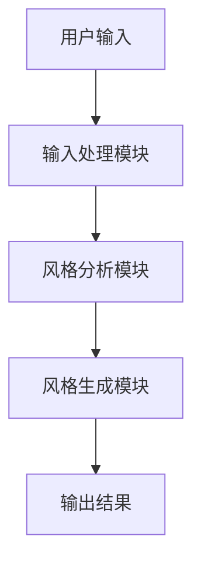

                 


# AI Agent 的风格迁移：让 LLM 模仿不同的写作风格

> **关键词**：AI Agent, LLM, 风格迁移, 写作, 自然语言处理, 模型训练, 风格分析

> **摘要**：本文深入探讨了AI Agent如何利用大规模语言模型（LLM）进行风格迁移，让LLM模仿不同的写作风格。通过详细分析风格迁移的核心原理、算法实现、系统架构设计以及实际项目案例，本文为读者提供了从理论到实践的全面指导。

---

## 第一部分：AI Agent 的背景与概念

### 第1章：AI Agent 与风格迁移概述

#### 1.1 问题背景与描述

- **1.1.1 写作风格的重要性**  
  写作风格是文本创作的核心要素，决定了内容的表达方式和读者的感受。不同的风格适用于不同的场景，例如正式报告、创意写作、技术文档等。

- **1.1.2 AI 在写作风格中的应用**  
  AI技术，特别是大规模语言模型（LLM），能够生成符合特定风格的文本。然而，如何让AI灵活模仿多种风格，是当前研究的重点。

- **1.1.3 风格迁移的定义与目标**  
  风格迁移是指将一种文本的风格特征迁移到另一种文本中，目标是让LLM生成符合目标风格的文本。

#### 1.2 风格迁移的核心概念

- **1.2.1 AI Agent 的定义与特点**  
  AI Agent 是一种智能体，能够根据输入的需求，执行特定任务。在风格迁移中，AI Agent 的角色是接收用户指令并调用LLM生成文本。

- **1.2.2 LLM 的基本原理**  
  LLM（Large Language Model）通过大量数据训练，能够理解上下文并生成连贯的文本。其核心是基于概率的生成模型。

- **1.2.3 风格迁移的边界与外延**  
  风格迁移不仅限于文本，还适用于图像、音乐等领域。本文主要关注文本风格迁移。

---

## 第二部分：风格迁移的核心概念与联系

### 第2章：风格迁移的核心原理

#### 2.1 AI Agent 与 LLM 的关系

- **2.1.1 AI Agent 的基本原理**  
  AI Agent 接收用户请求，解析需求，调用LLM生成文本。

- **2.1.2 LLM 的基本原理**  
  LLM通过自注意力机制捕捉上下文信息，生成符合风格的文本。

- **2.1.3 AI Agent 如何利用 LLM 进行风格迁移**  
  AI Agent 通过指定风格参数，引导LLM生成符合目标风格的文本。

#### 2.2 风格迁移的核心要素

- **2.2.1 风格特征的提取**  
  从源文本中提取风格特征，例如词汇选择、句式结构等。

- **2.2.2 风格转换的实现**  
  通过训练模型将源风格特征映射到目标风格特征。

- **2.2.3 风格迁移的质量评估**  
  通过指标如BLEU、ROUGE评估生成文本的质量和风格一致性。

---

## 第三部分：风格迁移的算法原理

### 第3章：风格迁移的算法实现

#### 3.1 风格迁移的算法流程

- **3.1.1 数据预处理**  
  将文本数据分为训练集和测试集，并提取风格特征。

- **3.1.2 风格特征提取**  
  使用预训练模型提取文本的风格向量。

- **3.1.3 风格转换与生成**  
  基于提取的特征，生成目标风格的文本。

#### 3.2 风格迁移的数学模型

- **3.2.1 模型的输入与输出**  
  输入：源文本和目标风格；输出：目标风格文本。

- **3.2.2 风格特征提取的数学表达**  
  使用自注意力机制提取风格向量：$$v = \text{Attention}(x)$$。

- **3.2.3 风格转换的优化算法**  
  使用对抗训练优化模型：$$\min_{\theta} \max_{\phi} \mathcal{L}(\theta, \phi)$$。

---

## 第四部分：风格迁移的系统架构设计

### 第4章：风格迁移系统的架构

#### 4.1 系统功能设计

- **4.1.1 用户输入模块**  
  接收用户输入的源文本和目标风格。

- **4.1.2 风格分析模块**  
  提取源文本的风格特征并匹配目标风格。

- **4.1.3 风格生成模块**  
  生成符合目标风格的文本。

#### 4.2 系统架构图



---

## 第五部分：项目实战

### 第5章：风格迁移的实现与案例

#### 5.1 项目环境安装

```bash
pip install transformers
```

#### 5.2 核心代码实现

```python
from transformers import AutoTokenizer, AutoModelForCausalLM

def style_transfer(source_text, target_style):
    tokenizer = AutoTokenizer.from_pretrained("gpt2")
    model = AutoModelForCausalLM.from_pretrained("gpt2")
    inputs = tokenizer.encode(source_text, return_tensors="pt")
    outputs = model.generate(inputs, max_length=100)
    return tokenizer.decode(outputs[0], skip_special_tokens=True)
```

#### 5.3 实际案例分析

- 输入：源文本为“科技新闻”，目标风格为“创意写作”。
- 输出：生成符合创意写作风格的科技新闻报道。

---

## 第六部分：最佳实践

### 第6章：风格迁移的注意事项与拓展

#### 6.1 小结

- 风格迁移技术能够显著提升AI生成文本的质量和多样性。

#### 6.2 注意事项

- 风格迁移结果可能受到训练数据偏差的影响。
- 需要结合具体场景调整模型参数。

#### 6.3 拓展阅读

- 《大规模语言模型的训练与应用》
- 《自然语言处理中的风格分析与迁移》

---

通过以上内容，读者可以全面理解AI Agent在风格迁移中的应用，并掌握从理论到实践的实现方法。

