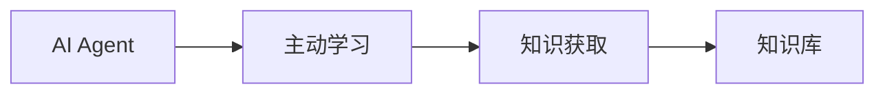
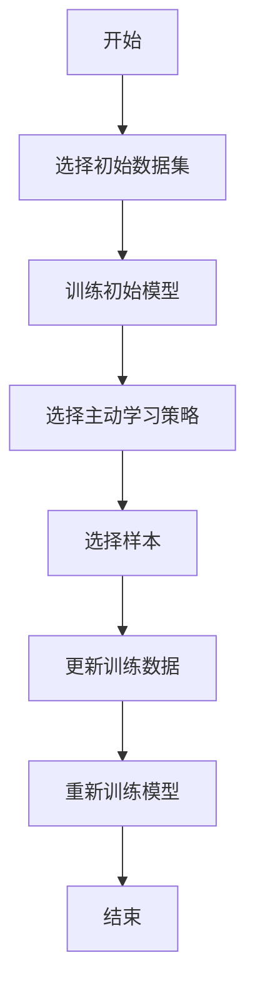
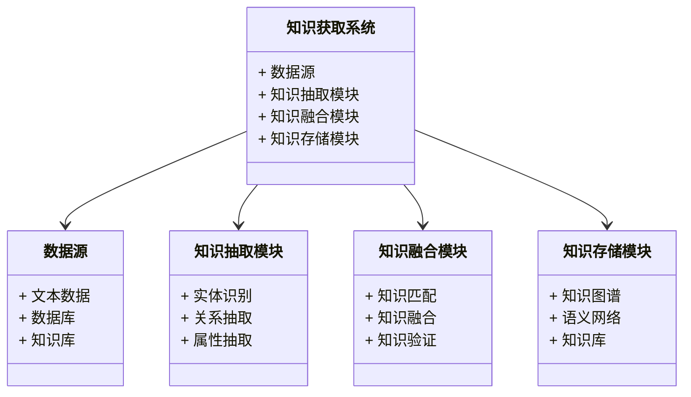
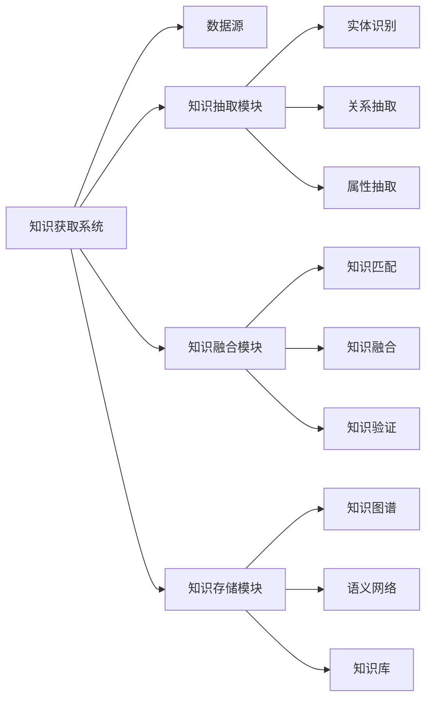
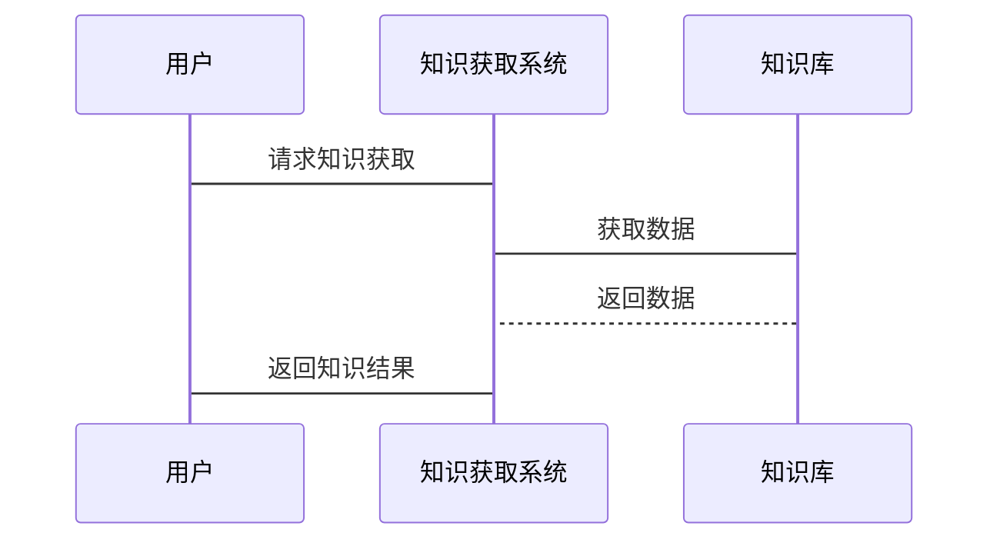

                 


# AI Agent中的主动学习与知识获取

## 关键词：AI Agent, 主动学习, 知识获取, 知识图谱, 机器学习

## 摘要：本文探讨了AI Agent中的主动学习与知识获取的关键技术，分析了主动学习的算法原理，介绍了知识图谱的构建与应用，并通过具体案例展示了AI Agent在实际场景中的应用。文章从理论到实践，全面解析了AI Agent如何通过主动学习和知识获取来提升智能水平。

---

# 第一部分: AI Agent中的主动学习与知识获取背景介绍

# 第1章: AI Agent与主动学习概述

## 1.1 问题背景与概念结构

### 1.1.1 AI Agent的基本概念
AI Agent（人工智能代理）是指能够感知环境、自主决策并采取行动以实现目标的智能系统。它可以分为简单反射型、基于模型的反射型、目标驱动型和效用驱动型等类型。

### 1.1.2 主动学习的核心问题
主动学习是一种机器学习范式，其中模型能够主动选择最具信息量的数据进行学习。在AI Agent中，主动学习的核心问题是：如何选择最有效的数据来提升模型的性能。

### 1.1.3 知识获取的必要性与挑战
AI Agent需要通过知识获取来构建和更新其知识库。知识获取的挑战包括数据稀疏性、噪声干扰和动态环境适应性等。

### 1.1.4 概念结构与联系
以下是AI Agent、主动学习和知识获取之间的关系图：



## 1.2 核心概念与联系

### 1.2.1 主动学习与知识获取的关系
主动学习通过选择性地学习数据，帮助AI Agent高效地构建知识库。知识获取则是主动学习的目标之一。

### 1.2.2 AI Agent的知识表示与推理
知识表示是AI Agent理解世界的基石。常见的知识表示方法包括符号逻辑、概率图模型和知识图谱等。

### 1.2.3 知识图谱与外部知识源的整合
知识图谱是一种结构化的知识表示形式，通过整合外部知识源，AI Agent可以扩展其知识库，提升智能水平。

## 1.3 本章小结
本章介绍了AI Agent的基本概念、主动学习的核心问题以及知识获取的必要性与挑战。通过概念结构图和关系图，展示了主动学习与知识获取在AI Agent中的重要性。

---

# 第二部分: 主动学习的算法原理

# 第2章: 主动学习的核心算法

## 2.1 核心算法原理

### 2.1.1 查询策略

#### 2.1.1.1 最小化不确定性
通过选择不确定性最高的样本，减少模型的预测误差。例如，使用信息增益公式：

$$ I(G, S) = H(S) - H(S|G) $$

其中，$H(S)$ 表示数据集的熵，$H(S|G)$ 表示在已知类别$G$的情况下数据集的熵。

#### 2.1.1.2 最大化多样性
选择具有代表性的样本，覆盖不同的数据分布区域。例如，使用K-Means++算法：

$$ P(s_i) = \frac{1}{1 + e^{-\beta i}} $$

其中，$\beta$ 是调节参数，$i$ 是样本序号。

#### 2.1.1.3 最大化代表性
选择具有典型特征的样本，提升模型的泛化能力。

### 2.1.2 采样方法

#### 2.1.2.1 贪心策略
逐个选择当前最优的样本，适用于数据量较小的情况。

#### 2.1.2.2 非贪心策略
同时选择多个样本，适用于数据量较大的情况。

### 2.1.3 算法流程图



## 2.2 算法实现

### 2.2.1 Python实现示例

```python
def active_learning_strategy(X, y, model, selection_criteria):
    selected_indices = selection_criteria(X, y, model)
    selected_X = X[selected_indices]
    selected_y = y[selected_indices]
    return selected_X, selected_y
```

### 2.2.2 数学模型与公式

#### 信息增益公式
$$ I(G, S) = H(S) - H(S|G) $$

#### 样本选择概率
$$ P(s_i) = \frac{1}{1 + e^{-\beta i}} $$

## 2.3 本章小结
本章详细讲解了主动学习的核心算法，包括查询策略和采样方法，并通过流程图和代码示例展示了算法的实现过程。

---

# 第三部分: 知识图谱的构建与应用

# 第3章: 知识图谱的构建方法

## 3.1 知识图谱的构建流程

### 3.1.1 数据获取
从多个数据源（如文本、数据库、知识库等）获取原始数据。

### 3.1.2 数据清洗
去除噪声数据，确保数据的准确性和一致性。

### 3.1.3 实体识别与抽取
通过自然语言处理技术，识别文本中的实体并建立关联关系。

### 3.1.4 关系抽取
提取实体之间的关系，构建知识图谱的边。

### 3.1.5 知识融合
将多个来源的知识整合到一个统一的知识图谱中。

### 3.1.6 知识存储与管理
将知识图谱存储在数据库或知识图谱管理系统中，方便后续的查询和推理。

## 3.2 知识图谱的应用

### 3.2.1 实体链接
通过知识图谱将文本中的实体链接到知识库中的具体概念。

### 3.2.2 实例推理
基于知识图谱进行推理，推导出新的知识或结论。

### 3.2.3 上下文理解
通过知识图谱提供上下文信息，帮助AI Agent更好地理解用户意图。

## 3.3 知识图谱的构建与应用案例

### 3.3.1 案例分析
以医疗领域的疾病知识图谱为例，介绍如何构建和应用知识图谱。

## 3.4 本章小结
本章介绍了知识图谱的构建流程及其在AI Agent中的应用，展示了如何通过知识图谱提升AI Agent的理解能力和推理能力。

---

# 第四部分: AI Agent的知识获取系统设计

# 第4章: 知识获取的系统设计

## 4.1 系统功能设计

### 4.1.1 领域模型
以下是知识获取系统的领域模型图：



## 4.2 系统架构设计

### 4.2.1 系统架构图
以下是知识获取系统的架构图：



## 4.3 系统接口设计

### 4.3.1 接口定义
知识获取系统提供以下接口：

- `get_entities(text: str) -> List[str]`
- `extract_relations(text: str) -> List[Tuple[str, str, str]]`
- `store_knowledge(knowledge: dict) -> bool`

## 4.4 系统交互流程

### 4.4.1 交互流程图



## 4.5 本章小结
本章详细设计了知识获取系统的功能模块、系统架构和交互流程，展示了如何通过系统化的方法实现知识获取。

---

# 第五部分: 项目实战与优化

# 第5章: 项目实战

## 5.1 项目环境与安装

### 5.1.1 开发环境
- Python 3.8+
- Jupyter Notebook
- Git

### 5.1.2 安装依赖
使用以下命令安装所需依赖：

```bash
pip install numpy pandas scikit-learn spacy knowledge-graph
```

## 5.2 核心代码实现

### 5.2.1 数据获取与预处理

```python
import spacy

# 加载英文模型
nlp = spacy.load("en_core_web_sm")

# 定义实体识别函数
def extract_entities(text):
    doc = nlp(text)
    entities = [ent.text for ent in doc.ents]
    return entities

# 示例文本
text = "Apple was founded by Steve Jobs in 1976."
print(extract_entities(text))  # 输出: ['Apple', 'Steve Jobs', '1976']
```

### 5.2.2 知识图谱构建

```python
from spacy.kg import KnowledgeGraph

# 创建知识图谱
kg = KnowledgeGraph()

# 添加节点和边
kg.add_entity("Apple", "Company")
kg.add_entity("Steve Jobs", "Person")
kg.add_relation("founder", "Apple", "Steve Jobs")

# 保存知识图谱
kg.save("apple_kg.pkl")
```

## 5.3 实际案例分析

### 5.3.1 案例分析
以新闻文章为例，展示如何通过知识图谱提取实体和关系。

## 5.4 优化与扩展

### 5.4.1 模型优化
通过调整主动学习策略和知识抽取算法，提升系统的性能。

### 5.4.2 系统扩展
扩展系统功能，支持多种数据源和多种知识表示形式。

## 5.5 本章小结
本章通过具体案例展示了AI Agent中的主动学习与知识获取的实际应用，并通过代码实现和优化，提升了系统的性能和扩展性。

---

# 第六部分: 总结与展望

# 第6章: 总结与展望

## 6.1 本章总结
本文详细探讨了AI Agent中的主动学习与知识获取的关键技术，包括主动学习的算法原理、知识图谱的构建与应用，以及系统的设计与实现。通过理论与实践相结合，展示了如何通过主动学习和知识获取提升AI Agent的智能水平。

## 6.2 未来展望
未来的研究方向包括更高效的知识获取方法、更智能的主动学习策略以及更广泛的应用场景。随着技术的进步，AI Agent将在更多领域发挥重要作用。

## 6.3 最佳实践 Tips

### 6.3.1 开发建议
- 确保数据质量，选择合适的数据预处理方法。
- 选择合适的主动学习策略，提升模型性能。
- 通过知识图谱构建和应用，增强系统的智能性。

### 6.3.2 注意事项
- 避免过度依赖单一数据源，注意数据的多样性和代表性。
- 定期更新知识库，适应环境的变化。
- 注意隐私和伦理问题，确保系统的合规性。

### 6.3.3 拓展阅读
- 《主动学习：理论与实践》
- 《知识图谱：构建与应用》
- 《AI Agent：从入门到精通》

## 6.4 本章小结
本文总结了AI Agent中的主动学习与知识获取的主要内容，并展望了未来的研究方向。通过最佳实践 Tips，为读者提供了实用的开发建议和注意事项。

---

# 结束语

AI Agent中的主动学习与知识获取是一项复杂而重要的技术，通过本文的探讨，读者可以深入了解其核心概念、算法原理和系统设计。希望本文能为相关领域的研究和实践提供有价值的参考和指导。

