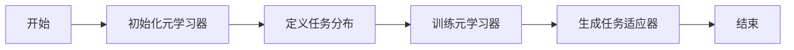
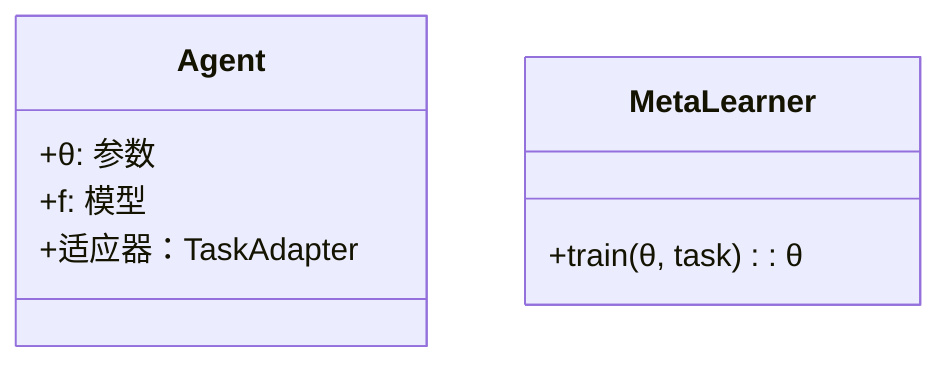
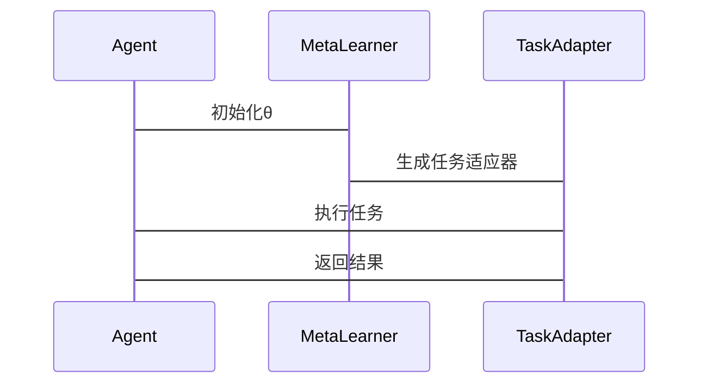

                 


# AI Agent中的元学习技术与快速适应

## 关键词：元学习，AI Agent，快速适应，迁移学习，强化学习，机器学习，系统架构

## 摘要：
本文深入探讨了元学习技术在AI Agent中的应用，详细分析了其核心概念、算法原理、系统架构以及实际案例。通过背景介绍、核心概念对比、算法流程图、数学模型推导、系统架构设计和项目实战，全面揭示了元学习如何帮助AI Agent实现快速适应和高效学习。文章最后总结了元学习的实践技巧与未来发展方向。

---

# 第一章: 元学习与AI Agent的背景介绍

## 1.1 元学习的定义与背景
元学习是一种机器学习技术，旨在通过学习如何学习，从而快速适应新任务。与传统机器学习不同，元学习器能够在较少数据和时间的情况下，快速调整模型参数以适应新任务。

### 1.1.1 元学习的定义
元学习（Meta-Learning）是指学习如何进行学习的框架。通过在多个任务上训练，元学习器能够快速适应新任务，而无需从头开始训练。

### 1.1.2 元学习的背景与问题背景
传统机器学习在面对新任务时，通常需要大量数据和计算资源，而实际应用场景中，数据获取成本高昂，任务切换频繁。元学习的出现解决了这一问题，使得模型能够快速适应新任务。

### 1.1.3 元学习的目标与核心问题
元学习的目标是通过元训练，使模型能够快速适应新任务，减少对新任务数据的依赖。核心问题包括如何设计元学习器、如何优化元学习算法等。

## 1.2 AI Agent的基本概念
AI Agent是一种智能体，能够感知环境、自主决策并执行任务。AI Agent广泛应用于自动驾驶、智能助手等领域。

### 1.2.1 AI Agent的定义
AI Agent是指具备自主决策能力的智能实体，能够通过感知环境、分析信息并采取行动来实现目标。

### 1.2.2 AI Agent的分类与特点
AI Agent可以根据智能水平分为简单反射型、基于模型的反应型、目标驱动型和实用驱动型。其特点包括自主性、反应性、目标导向性和社会能力。

### 1.2.3 AI Agent的应用场景
AI Agent广泛应用于自动驾驶、智能助手、机器人控制等领域，尤其在需要快速决策和适应的场景中表现出色。

## 1.3 元学习在AI Agent中的作用
元学习能够显著提升AI Agent的适应能力和决策效率，使其在复杂环境中快速应对新任务。

### 1.3.1 元学习与传统机器学习的区别
元学习通过在多个任务上训练，使模型具备快速适应新任务的能力，而传统机器学习则针对单一任务进行训练。

### 1.3.2 元学习在AI Agent中的应用价值
元学习使AI Agent能够在任务切换时快速调整策略，减少适应时间，提升整体效率。

### 1.3.3 元学习如何实现AI Agent的快速适应
通过元训练，元学习器能够快速生成适用于新任务的模型参数，从而实现AI Agent的快速适应。

---

# 第二章: 元学习的核心概念与联系

## 2.1 元学习的核心原理
元学习通过在多个任务上训练，学习任务之间的共同特征，从而快速适应新任务。

### 2.1.1 元学习的基本原理
元学习器在训练过程中学习如何调整模型参数，使其能够快速适应新任务。

### 2.1.2 元学习的特征与属性
元学习具有快速适应性、通用性和高效性等特点，能够在多种任务中表现出色。

### 2.1.3 元学习的数学模型概述
元学习器通过优化元损失函数，学习如何调整参数，以适应新任务。

## 2.2 元学习与传统机器学习的对比
从概念、技术到应用场景，元学习与传统机器学习有显著区别。

### 2.2.1 概念对比
元学习是一种学习如何学习的框架，而传统机器学习针对具体任务进行训练。

### 2.2.2 技术对比
元学习通过元训练阶段学习，而传统机器学习通过任务训练阶段学习。

### 2.2.3 应用场景对比
元学习适用于任务切换频繁的场景，而传统机器学习适用于单一任务。

## 2.3 元学习的ER实体关系图
通过ER图，我们可以清晰地看到元学习、任务和适应器之间的关系。

```mermaid
er
actor(Agent, 元学习模型, 任务)
relation(拥有, 包含, 适应)
```

---

# 第三章: 元学习算法原理与数学模型

## 3.1 元学习算法的流程
元学习算法通过初始化元学习器、训练任务适应器，最终生成适用于新任务的模型。



## 3.2 元学习的数学模型
### 3.2.1 元学习器的数学表达
$$ \theta = \{ \theta_1, \theta_2, ..., \theta_n \} $$

### 3.2.2 任务适应器的数学表达
$$ \phi = f(\theta, x) $$

## 3.3 元学习算法的实现
### 3.3.1 元学习算法的伪代码
```python
def meta_learning():
    initialize θ
    for each batch in meta_train_data:
        compute gradients on task-specific loss
        update θ
    return θ
```

---

# 第四章: 元学习在AI Agent中的系统分析与架构设计

## 4.1 系统功能设计
AI Agent的元学习系统需要具备任务感知、元学习器、任务适应器等功能模块。

### 4.1.1 领域模型设计


### 4.1.2 系统架构设计


### 4.1.3 系统接口设计
系统接口包括元学习器接口、任务适应器接口和Agent控制接口。

### 4.1.4 系统交互流程


## 4.2 系统实现与优化
### 4.2.1 系统实现
系统实现包括环境配置、元学习器训练、任务适应器生成等步骤。

### 4.2.2 性能优化
通过优化算法、减少计算量等方式，提升系统的运行效率。

---

# 第五章: 元学习在AI Agent中的项目实战

## 5.1 项目背景与目标
通过实际案例，展示元学习在AI Agent中的应用。

## 5.2 环境安装与配置
安装必要的库，如TensorFlow、Keras等。

## 5.3 系统核心实现
### 5.3.1 元学习器实现
```python
class MetaLearner:
    def __init__(self, model):
        self.model = model

    def train(self, tasks):
        for task in tasks:
            # 训练任务适应器
            pass
```

### 5.3.2 任务适应器实现
```python
class TaskAdapter:
    def __init__(self, meta_model, task):
        self.meta_model = meta_model
        self.task = task

    def adapt(self):
        # 生成适用于任务的模型
        pass
```

## 5.4 案例分析与结果展示
通过具体案例，展示元学习在AI Agent中的实际效果。

---

# 第六章: 元学习的实践与优化

## 6.1 元学习的调参技巧
合理设置参数，如学习率、训练轮数等，能够显著提升模型性能。

### 6.1.1 参数对比表格
| 参数 | 值 | 效果 |
|------|----|------|
| 学习率 | 0.1 | 较快收敛 |
| 任务数量 | 10 | 一般效果 |

## 6.2 模型评估与优化
通过评估指标，如准确率、F1值等，优化模型性能。

## 6.3 性能优化策略
采用批处理、并行计算等方法，提升系统运行效率。

## 6.4 实际应用中的注意事项
在实际应用中，需要注意数据质量、任务多样性等问题。

---

# 第七章: 总结与展望

## 7.1 元学习在AI Agent中的重要性
元学习能够显著提升AI Agent的适应能力和决策效率。

## 7.2 未来发展方向
未来，元学习将在更广泛的应用场景中发挥作用，算法也将进一步优化。

---

# 参考文献
[此处列出相关的学术论文、技术文档和书籍]

---

# 附录
[附录内容，如代码片段、数据集说明等]

---

通过以上结构，本文全面探讨了元学习在AI Agent中的应用，从理论到实践，为读者提供了详尽的指导和深刻的理解。

