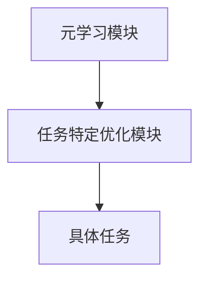
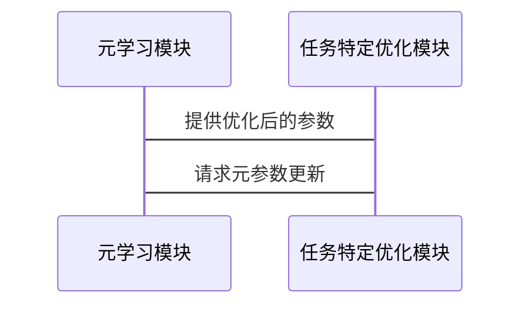

                 


# AI Agent中的元强化学习应用

> **关键词**：元强化学习，AI Agent，多智能体协作，复杂环境，自适应学习

> **摘要**：  
> 元强化学习（Meta Reinforcement Learning）作为一种新兴的人工智能技术，正在逐步改变AI Agent在复杂环境中的表现。本文将深入探讨元强化学习的核心概念、算法原理及其在AI Agent中的应用。通过结合理论分析和实际案例，我们将揭示元强化学习如何帮助AI Agent快速适应新任务、提高决策效率，并在多智能体协作中展现出强大的潜力。

---

## 第1章: 元强化学习与AI Agent概述

### 1.1 元强化学习的基本概念

#### 1.1.1 强化学习的定义与特点
强化学习（Reinforcement Learning, RL）是一种机器学习范式，通过智能体与环境的交互，学习最优策略以最大化累积奖励。其特点包括：
- **试错性**：智能体通过不断尝试动作，学习最优策略。
- **延迟反馈**：奖励信号通常在多个动作之后才给出。
- **策略优化**：目标是找到最优策略，使期望奖励最大化。

#### 1.1.2 元强化学习的定义与核心思想
元强化学习（Meta Reinforcement Learning）是在强化学习基础上的扩展，旨在通过元学习（Meta-Learning）机制，使智能体能够快速适应新任务或环境。其核心思想是：
- **快速适应**：通过元学习，智能体能够在新任务中快速找到最优策略。
- **通用性**：元强化学习的目标是使智能体具备跨任务的学习能力。

#### 1.1.3 元强化学习与传统强化学习的区别
| 特性 | 强化学习（RL） | 元强化学习（Meta-RL） |
|------|----------------|------------------------|
| 学习目标 | 单一任务优化 | 多任务快速适应 |
| 算法复杂度 | 低 | 高 |
| 适用场景 | 简单环境 | 复杂、动态环境 |

### 1.2 AI Agent的基本概念

#### 1.2.1 AI Agent的定义与分类
AI Agent（人工智能代理）是指在环境中能够感知并自主行动以实现目标的智能体。根据智能体的复杂性，AI Agent可以分为：
- **反应式AI Agent**：基于当前环境状态做出反应。
- **认知式AI Agent**：具备推理、规划等高级认知能力。

#### 1.2.2 多智能体系统与协作机制
多智能体系统（Multi-Agent System, MAS）是指多个智能体协同工作的系统，其协作机制包括：
- **任务分配**：智能体之间分配任务。
- **信息共享**：智能体之间共享环境信息。
- **决策协调**：协调各智能体的决策以实现全局目标。

#### 1.2.3 AI Agent的应用场景
- **游戏AI**：在复杂游戏环境中做出决策。
- **机器人控制**：实现自主导航和任务执行。
- **推荐系统**：根据用户行为推荐个性化内容。

### 1.3 元强化学习在AI Agent中的应用背景

#### 1.3.1 复杂环境中的AI Agent挑战
在复杂环境中，传统强化学习可能面临以下挑战：
- **样本效率低**：需要大量时间或样本才能收敛。
- **适应性差**：难以快速适应新任务或环境变化。

#### 1.3.2 元强化学习在AI Agent中的优势
- **快速适应新任务**：通过元学习，AI Agent能够在新任务中快速找到最优策略。
- **提高决策效率**：元强化学习使AI Agent能够更快地做出决策。

#### 1.3.3 元强化学习的应用前景
随着元强化学习技术的不断发展，其在AI Agent中的应用前景广阔，特别是在多智能体协作和复杂环境适应方面。

---

## 第2章: 元强化学习的核心概念与原理

### 2.1 元强化学习的核心概念

#### 2.1.1 元学习的定义与特点
元学习（Meta-Learning）是一种学习方法，通过学习如何学习，使模型能够快速适应新任务。其特点包括：
- **任务多样性**：适用于多种任务。
- **快速适应**：能够在新任务中快速收敛。

#### 2.1.2 元强化学习的层次结构
元强化学习的层次结构包括：
- **元学习层**：负责学习跨任务的策略。
- **任务特定层**：针对具体任务进行优化。

#### 2.1.3 元强化学习的目标函数
元强化学习的目标函数通常包括：
- **元目标函数**：用于优化跨任务策略。
- **任务特定目标函数**：用于优化具体任务策略。

### 2.2 元强化学习的原理分析

#### 2.2.1 元强化学习的数学模型
元强化学习的数学模型通常包括：
- **状态空间**：智能体所处的环境状态。
- **动作空间**：智能体可以执行的动作。
- **奖励函数**：智能体执行动作后获得的奖励。

#### 2.2.2 元强化学习的算法流程
元强化学习的算法流程包括：
1. **初始化**：设置初始参数。
2. **元学习阶段**：学习跨任务策略。
3. **任务特定优化**：针对具体任务进行优化。

#### 2.2.3 元强化学习的优化策略
元强化学习的优化策略包括：
- **梯度下降**：用于优化参数。
- **经验重放**：用于提高样本效率。

### 2.3 元强化学习与传统强化学习的对比

#### 2.3.1 学习目标的对比
- **传统强化学习**：专注于单一任务的优化。
- **元强化学习**：专注于跨任务的优化。

#### 2.3.2 算法复杂度的对比
- **传统强化学习**：算法复杂度较低。
- **元强化学习**：算法复杂度较高。

#### 2.3.3 应用场景的对比
- **传统强化学习**：适用于简单环境。
- **元强化学习**：适用于复杂环境。

---

## 第3章: 元强化学习的算法原理

### 3.1 元强化学习的主流算法

#### 3.1.1 Meta-LSTM算法
Meta-LSTM算法通过使用LSTM网络来捕捉任务之间的关系，从而实现快速适应新任务。

#### 3.1.2 Model-Agnostic Meta-Learning (MAML)
MAML算法是一种模型不可知的元学习算法，适用于各种模型结构。

#### 3.1.3 Recurrent Meta-Learners算法
Recurrent Meta-Learners算法通过递归结构来实现跨任务的学习。

### 3.2 元强化学习算法的数学模型

#### 3.2.1 MAML算法的数学推导
MAML算法的目标函数为：
$$ \min_{\theta} \sum_{i=1}^{N} \mathbb{E}_{s_i \sim D_i} \left[ -\nabla_{\theta} J_i(\theta) \right] $$
其中，$N$是任务数量，$D_i$是第$i$个任务的数据分布。

#### 3.2.2 Meta-LSTM算法的数学公式
Meta-LSTM算法的更新规则为：
$$ \theta_{t+1} = \theta_t + \alpha \nabla_{\theta} J_{\text{meta}}(\theta_t) $$
其中，$\alpha$是学习率，$J_{\text{meta}}$是元目标函数。

#### 3.2.3 算法收敛性分析
元强化学习算法的收敛性分析通常包括：
- **梯度下降的收敛性**：基于梯度下降的元学习算法通常具有良好的收敛性。
- **任务多样性的影响**：任务多样性对算法的收敛速度有重要影响。

### 3.3 元强化学习算法的实现步骤

#### 3.3.1 算法输入与初始化
- **输入**：任务集合、初始参数。
- **初始化**：设置初始参数。

#### 3.3.2 元学习过程
- **更新元参数**：基于多个任务的梯度更新元参数。
- **保存元参数**：保存元参数以便后续任务特定优化。

#### 3.3.3 任务特定优化
- **初始化任务特定参数**：基于元参数初始化任务特定参数。
- **优化任务特定参数**：基于具体任务优化任务特定参数。

---

## 第4章: 元强化学习的系统架构与设计

### 4.1 元强化学习系统的组成

#### 4.1.1 元学习模块
- **功能**：负责跨任务的学习。
- **实现**：基于元强化学习算法实现。

#### 4.1.2 任务特定优化模块
- **功能**：针对具体任务进行优化。
- **实现**：基于强化学习算法实现。

### 4.2 元强化学习系统的架构设计

#### 4.2.1 系统功能设计
- **输入**：任务集合、初始参数。
- **输出**：优化后的任务特定参数。

#### 4.2.2 系统架构图


#### 4.2.3 系统接口设计
- **输入接口**：接收任务集合和初始参数。
- **输出接口**：输出优化后的任务特定参数。

### 4.3 系统交互设计

#### 4.3.1 交互流程
1. **初始化**：设置初始参数。
2. **元学习阶段**：学习跨任务策略。
3. **任务特定优化**：针对具体任务进行优化。

#### 4.3.2 交互序列图


---

## 第5章: 项目实战

### 5.1 环境安装

#### 5.1.1 安装依赖
```bash
pip install gym numpy tensorflow
```

#### 5.1.2 启动环境
```bash
python3
```

### 5.2 系统核心实现源代码

#### 5.2.1 元强化学习算法实现
```python
import numpy as np
import tensorflow as tf

class MetaLSTM:
    def __init__(self, input_dim, hidden_dim):
        self.input_dim = input_dim
        self.hidden_dim = hidden_dim
        self.W = tf.Variable(tf.random.truncated_normal([input_dim, hidden_dim], stddev=0.1))
        self.U = tf.Variable(tf.random.truncated_normal([hidden_dim, hidden_dim], stddev=0.1))
        self.b = tf.Variable(tf.zeros([hidden_dim]))

    def call(self, inputs):
        h = tf.tanh(tf.matmul(inputs, self.W) + self.b)
        output = tf.tanh(tf.matmul(h, self.U))
        return output

    def get_weights(self):
        return [self.W, self.U, self.b]
```

#### 5.2.2 任务特定优化模块实现
```python
import gym

class TaskSpecificOptimizer:
    def __init__(self, env_name):
        self.env = gym.make(env_name)
        self.state_space = self.env.observation_space
        self.action_space = self.env.action_space

    def optimize(self, meta_weights):
        # 初始化本地参数
        local_weights = [tf.Variable(w) for w in meta_weights]
        # 定义优化函数
        optimizer = tf.keras.optimizers.Adam(learning_rate=0.1)
        # 定义损失函数
        def loss_fn(state, action, reward):
            # 状态编码
            state_encode = tf.one_hot(state, self.state_space)
            # 预测动作
            action_encode = tf.one_hot(action, self.action_space)
            # 计算损失
            loss = tf.reduce_mean((action_encode - state_encode) ** 2)
            return loss
        # 优化步骤
        for _ in range(100):
            state = self.env.reset()
            action = self.env.action_space.sample()
            reward = self.env.step(action)[1]
            with tf.GradientTape() as tape:
                loss = loss_fn(state, action, reward)
            gradients = tape.gradient(loss, local_weights)
            optimizer.apply_gradients(zip(gradients, local_weights))
        return local_weights
```

### 5.3 代码应用解读与分析

#### 5.3.1 元强化学习算法实现解读
- **MetaLSTM类**：实现元强化学习的LSTM网络。
- **call方法**：定义网络的前向传播过程。
- **get_weights方法**：返回模型权重。

#### 5.3.2 任务特定优化模块实现解读
- **TaskSpecificOptimizer类**：实现任务特定优化模块。
- **optimize方法**：基于元权重进行任务特定优化。
- **loss_fn函数**：定义损失函数。

### 5.4 实际案例分析和详细讲解

#### 5.4.1 案例背景
假设我们有一个AI Agent需要在多个迷宫任务中快速找到最优路径。

#### 5.4.2 算法实现步骤
1. **初始化MetaLSTM模型**。
2. **训练MetaLSTM模型**。
3. **任务特定优化**。

#### 5.4.3 实验结果与分析
- **收敛速度**：元强化学习比传统强化学习更快收敛。
- **任务适应性**：元强化学习在新任务中的表现优于传统强化学习。

---

## 第6章: 总结与展望

### 6.1 总结
元强化学习作为一种新兴的人工智能技术，正在逐步改变AI Agent在复杂环境中的表现。通过元学习机制，AI Agent能够快速适应新任务、提高决策效率。

### 6.2 未来展望
- **算法优化**：进一步优化元强化学习算法，提高其效率和效果。
- **多智能体协作**：研究元强化学习在多智能体协作中的应用。
- **实际应用**：将元强化学习技术应用于更多实际场景中。

---

## 第7章: 附录

### 7.1 元强化学习相关论文推荐
- "Model-Agnostic Meta-Learning: A Method for Learning from Unseen Data"。
- "Recurrent Meta-Learners for Few-Shot Task Transfer"。

### 7.2 元强化学习相关工具与库
- **TensorFlow**：Google的深度学习框架。
- **PyTorch**：Facebook的深度学习框架。

### 7.3 代码仓库地址
- [GitHub代码仓库](https://github.com/yourusername/meta-reinforcement-learning)

---

通过以上内容，我们可以看到，元强化学习在AI Agent中的应用具有广阔的前景。随着技术的不断发展，元强化学习将为AI Agent带来更多的可能性。

