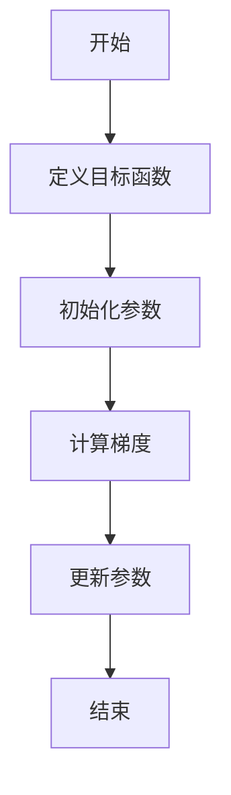
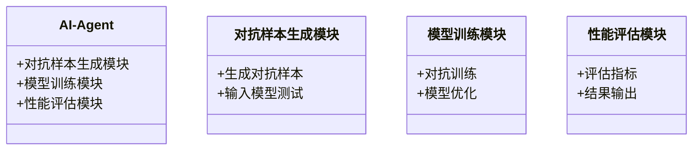
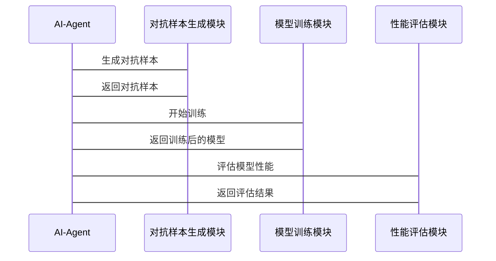

                 


# AI Agent中的对抗学习与鲁棒性增强

> 关键词：AI Agent，对抗学习，鲁棒性增强，机器学习，算法实现

> 摘要：本文深入探讨了AI Agent中的对抗学习与鲁棒性增强的核心概念、算法原理、系统设计及项目实现。通过详细的背景分析、原理讲解、系统架构设计和项目实战，全面解析了如何通过对抗学习提升AI Agent的鲁棒性，确保其在复杂环境中的稳定性和可靠性。

---

# 目录

## 第1章: 对抗学习与鲁棒性增强概述

## 第2章: 对抗学习的核心概念与原理

## 第3章: 对抗学习的算法原理与实现

## 第4章: 系统分析与架构设计

## 第5章: 项目实战

## 第6章: 总结与展望

---

## 第1章: 对抗学习与鲁棒性增强概述

### 1.1 对抗学习的背景与问题背景

#### 1.1.1 从传统机器学习到对抗学习的演进
传统机器学习模型在面对对抗性攻击时往往表现脆弱。例如，深度神经网络在处理对抗样本时容易被误导。对抗学习的概念由此诞生，旨在通过模拟攻击与防御的过程，提升模型的鲁棒性。

#### 1.1.2 AI Agent中的对抗性攻击问题
AI Agent在现实场景中面临多种对抗性攻击，如恶意用户干扰、数据注入攻击等。这些攻击可能导致AI Agent决策失误，甚至引发安全风险。

#### 1.1.3 鲁棒性增强的必要性与目标
鲁棒性增强的目标是使AI Agent在面对对抗性输入时仍能保持正确的行为。通过对抗学习，可以在模型训练阶段引入对抗样本，提升其对干扰的抵抗力。

### 1.2 对抗学习的核心概念与问题描述

#### 1.2.1 对抗学习的定义与核心要素
对抗学习是一种通过两个或多个参与者（生成器和判别器）相互竞争来优化模型的技术。生成器试图生成欺骗判别器的样本，而判别器则试图区分真实样本和生成样本。

#### 1.2.2 对抗学习中的角色与关系
- **生成器（Generator）**：尝试生成与真实数据相似的对抗样本。
- **判别器（Discriminator）**：负责区分真实数据和生成数据。
- **对抗过程**：生成器和判别器通过反复迭代优化，生成器的输出逐渐接近真实数据，而判别器的识别能力也在不断增强。

#### 1.2.3 AI Agent中的对抗性攻击场景
- **恶意干扰**：攻击者通过修改输入数据，使AI Agent产生错误决策。
- **数据投毒**：攻击者向训练数据中注入有害样本，影响模型性能。
- **模型反转攻击**：通过对抗样本推断模型参数，进而进行攻击。

### 1.3 鲁棒性增强的目标与实现路径

#### 1.3.1 鲁棒性增强的目标
- 提升模型对对抗样本的识别能力。
- 增强模型在不同环境下的稳定性和可靠性。
- 降低对抗攻击对模型性能的影响。

#### 1.3.2 对抗学习与鲁棒性增强的关系
对抗学习是实现鲁棒性增强的重要手段。通过模拟对抗性攻击，模型可以在训练阶段提前“免疫”潜在威胁，从而在实际应用中表现出更强的鲁棒性。

#### 1.3.3 增强AI Agent鲁棒性的主要方法
- **对抗训练**：在模型训练中引入对抗样本，提升模型的鲁棒性。
- **防御技术**：如加噪声、数据清洗等方法，减少对抗样本的影响。
- **模型优化**：通过优化模型结构和参数，提升其对对抗攻击的抵抗力。

### 1.4 对抗学习与鲁棒性增强的边界与外延

#### 1.4.1 对抗学习的边界
- **定义域限制**：对抗学习主要应用于特定的数据分布。
- **模型限制**：对抗学习的有效性依赖于模型的结构和训练方法。

#### 1.4.2 鲁棒性增强的边界
- **性能限制**：鲁棒性增强可能会影响模型的准确率。
- **应用场景限制**：鲁棒性增强的效果依赖于具体的对抗场景。

#### 1.4.3 对抗学习与鲁棒性增强的外延
- **跨领域应用**：对抗学习和鲁棒性增强技术可以应用于图像识别、自然语言处理等多个领域。
- **结合其他技术**：如结合联邦学习、边缘计算等技术，进一步提升模型的鲁棒性。

### 1.5 本章小结
本章从背景、核心概念、目标、实现路径等方面详细介绍了对抗学习与鲁棒性增强的基本内容。通过对对抗学习和鲁棒性增强的关系分析，为后续章节的深入探讨奠定了基础。

---

## 第2章: 对抗学习的核心概念与原理

### 2.1 对抗学习的核心概念

#### 2.1.1 对抗学习的基本原理
对抗学习通过生成器和判别器的对抗过程，推动模型不断优化。生成器试图生成能够欺骗判别器的样本，而判别器则努力区分真实样本和生成样本。这种博弈过程使得模型在面对对抗性攻击时更具鲁棒性。

#### 2.1.2 对抗学习中的生成器与判别器
- **生成器**：使用生成对抗网络（GAN）中的生成器，通过反向传播更新参数，生成逼真的对抗样本。
- **判别器**：负责判别输入样本的真实性和对抗性，通过损失函数指导生成器的优化方向。

#### 2.1.3 对抗学习的数学模型
对抗学习的数学模型通常由生成器和判别器的损失函数组成：

$$L_{\text{total}} = L_{\text{D}} + L_{\text{G}}$$

其中，$L_{\text{D}}$是判别器的损失函数，$L_{\text{G}}$是生成器的损失函数。

### 2.2 对抗学习的核心要素对比

#### 2.2.1 生成器与判别器的对比
| 对比维度 | 生成器 | 判别器 |
|----------|--------|--------|
| 目标     | 生成对抗样本 | 区分真实样本和对抗样本 |
| 输入     | 对抗样本 | 真实样本和对抗样本 |
| 损失函数 | $L_{\text{G}}$ | $L_{\text{D}}$ |

#### 2.2.2 损失函数与优化目标的对比
| 对比维度 | 损失函数 | 优化目标 |
|----------|---------|----------|
| 生成器   | $L_{\text{G}}$ | 最小化 $L_{\text{G}}$ |
| 判别器   | $L_{\text{D}}$ | 最大化 $L_{\text{D}}$ |

#### 2.2.3 对抗训练与传统训练的对比
| 对比维度 | 对抗训练 | 传统训练 |
|----------|----------|----------|
| 数据来源 | 真实样本和对抗样本 | 真实样本 |
| 损失函数 | 综合生成器和判别器的损失 | 单一损失函数 |
| 模型优化 | 同时优化生成器和判别器 | 单独优化模型参数 |

### 2.3 对抗学习的ER实体关系图

```mermaid
er
actor: 对抗学习参与者
role: 对抗学习角色
```

### 2.4 对抗学习的数学模型与公式

#### 2.4.1 对抗学习的损失函数
判别器的损失函数：
$$L_{\text{D}} = -\mathbb{E}_{x \sim p_{\text{data}}(x)}[\log(D(x))] - \mathbb{E}_{z \sim p_{z}(z)}[\log(1 - D(G(z)))]$$

生成器的损失函数：
$$L_{\text{G}} = -\mathbb{E}_{z \sim p_{z}(z)}[\log(D(G(z)))]$$

总损失函数：
$$L = L_{\text{D}} + L_{\text{G}}$$

#### 2.4.2 对抗训练的优化目标
生成器和判别器的优化目标是通过最小化各自的损失函数来实现的：

$$\min_{\theta} \max_{\phi} L(\theta, \phi)$$

### 2.5 本章小结
本章详细讲解了对抗学习的核心概念、数学模型和优化目标。通过对生成器和判别器的对比分析，帮助读者理解对抗学习的基本原理和实现机制。

---

## 第3章: 对抗学习的算法原理与实现

### 3.1 对抗学习的算法流程



### 3.2 对抗学习的Python实现

#### 3.2.1 对抗训练的代码实现
```python
import torch
import torch.nn as nn
import torch.optim as optim

# 定义判别器
class Discriminator(nn.Module):
    def __init__(self):
        super(Discriminator, self).__init__()
        self.model = nn.Sequential(
            nn.Linear(2, 1),
            nn.Sigmoid()
        )
    
    def forward(self, x):
        return self.model(x)

# 定义生成器
class Generator(nn.Module):
    def __init__(self):
        super(Generator, self).__init__()
        self.model = nn.Sequential(
            nn.Linear(1, 2),
            nn.Sigmoid()
        )
    
    def forward(self, x):
        return self.model(x)

# 初始化模型
discriminator = Discriminator()
generator = Generator()

# 定义损失函数
criterion = nn.BCELoss()

# 定义优化器
d_optimizer = optim.SGD(discriminator.parameters(), lr=0.1)
g_optimizer = optim.SGD(generator.parameters(), lr=0.1)

# 训练过程
for epoch in range(100):
    # 生成对抗样本
    noise = torch.randn(100, 1)
    fake = generator(noise)
    
    # 判别器的训练
    d_optimizer.zero_grad()
    real = torch.randn(100, 2)
    label_real = torch.ones(100, 1)
    label_fake = torch.zeros(100, 1)
    
    output_real = discriminator(real)
    output_fake = discriminator(fake)
    
    d_loss = criterion(output_real, label_real) + criterion(output_fake, label_fake)
    d_loss.backward()
    d_optimizer.step()
    
    # 生成器的训练
    g_optimizer.zero_grad()
    output = discriminator(fake)
    g_loss = criterion(output, label_real)
    g_loss.backward()
    g_optimizer.step()
```

#### 3.2.2 对抗学习的数学模型
判别器和生成器的对抗过程可以用以下公式表示：

$$\min_{G} \max_{D} \mathbb{E}_{x \sim p_{\text{data}}(x)}[\log(D(x))] + \mathbb{E}_{z \sim p_{z}(z)}[\log(1 - D(G(z)))]$$

### 3.3 对抗学习的数学模型与公式

#### 3.3.1 对抗训练的损失函数
判别器的损失函数：
$$L_{\text{D}} = -\mathbb{E}_{x \sim p_{\text{data}}(x)}[\log(D(x))] - \mathbb{E}_{z \sim p_{z}(z)}[\log(1 - D(G(z)))]$$

生成器的损失函数：
$$L_{\text{G}} = -\mathbb{E}_{z \sim p_{z}(z)}[\log(D(G(z)))]$$

总损失函数：
$$L = L_{\text{D}} + L_{\text{G}}$$

### 3.4 本章小结
本章通过算法流程图和Python代码详细讲解了对抗学习的实现过程，包括判别器和生成器的定义、损失函数的计算以及优化器的使用。通过对数学模型的分析，帮助读者理解对抗学习的核心机制。

---

## 第4章: 系统分析与架构设计

### 4.1 系统分析

#### 4.1.1 对抗学习的应用场景
- **图像识别**：提升模型对对抗样本的识别能力。
- **自然语言处理**：增强模型对对抗性文本的处理能力。
- **安全领域**：用于检测和防御网络攻击。

#### 4.1.2 系统功能设计
- **对抗样本生成**：生成对抗样本并输入模型进行测试。
- **模型训练**：通过对抗训练提升模型的鲁棒性。
- **性能评估**：评估模型在对抗环境下的表现。

#### 4.1.3 领域模型设计


### 4.2 系统架构设计

#### 4.2.1 系统架构图


#### 4.2.2 系统接口设计
- **输入接口**：接收原始数据和对抗样本。
- **输出接口**：输出模型训练结果和性能评估报告。

#### 4.2.3 系统交互流程


### 4.3 本章小结
本章从系统分析和架构设计的角度，详细介绍了对抗学习在AI Agent中的实现方案。通过对领域模型和系统架构的设计，帮助读者理解如何将对抗学习应用于实际系统中。

---

## 第5章: 项目实战

### 5.1 项目环境安装

#### 5.1.1 安装依赖
```bash
pip install torch==1.9.0+cu102
pip install matplotlib
pip install numpy
```

#### 5.1.2 硬件配置
- CPU：建议使用多核处理器。
- GPU：建议使用NVIDIA GPU，支持CUDA加速。

### 5.2 系统核心实现

#### 5.2.1 对抗样本生成模块
```python
import torch
import torch.nn as nn
import torch.optim as optim

# 定义判别器
class Discriminator(nn.Module):
    def __init__(self):
        super(Discriminator, self).__init__()
        self.model = nn.Sequential(
            nn.Linear(2, 1),
            nn.Sigmoid()
        )
    
    def forward(self, x):
        return self.model(x)

# 定义生成器
class Generator(nn.Module):
    def __init__(self):
        super(Generator, self).__init__()
        self.model = nn.Sequential(
            nn.Linear(1, 2),
            nn.Sigmoid()
        )
    
    def forward(self, x):
        return self.model(x)
```

#### 5.2.2 模型训练模块
```python
# 初始化模型
discriminator = Discriminator()
generator = Generator()

# 定义损失函数
criterion = nn.BCELoss()

# 定义优化器
d_optimizer = optim.SGD(discriminator.parameters(), lr=0.1)
g_optimizer = optim.SGD(generator.parameters(), lr=0.1)

# 训练过程
for epoch in range(100):
    # 生成对抗样本
    noise = torch.randn(100, 1)
    fake = generator(noise)
    
    # 判别器的训练
    d_optimizer.zero_grad()
    real = torch.randn(100, 2)
    label_real = torch.ones(100, 1)
    label_fake = torch.zeros(100, 1)
    
    output_real = discriminator(real)
    output_fake = discriminator(fake)
    
    d_loss = criterion(output_real, label_real) + criterion(output_fake, label_fake)
    d_loss.backward()
    d_optimizer.step()
    
    # 生成器的训练
    g_optimizer.zero_grad()
    output = discriminator(fake)
    g_loss = criterion(output, label_real)
    g_loss.backward()
    g_optimizer.step()
```

#### 5.2.3 性能评估模块
```python
import matplotlib.pyplot as plt

# 评估模型
def evaluate(model, loader):
    total = 0
    correct = 0
    for x, label in loader:
        outputs = model(x)
        predicted = torch.round(outputs)
        total += len(x)
        correct += (predicted == label).sum().item()
    accuracy = correct / total
    return accuracy

# 绘制训练曲线
plt.plot(history, label='accuracy')
plt.xlabel('Epoch')
plt.ylabel('Accuracy')
plt.title('Training Accuracy')
plt.show()
```

### 5.3 案例分析与详细讲解

#### 5.3.1 项目实施过程
- **环境准备**：安装必要的库和配置硬件。
- **代码实现**：实现生成器、判别器和训练模块。
- **模型训练**：运行训练代码，观察训练过程中的损失变化。
- **性能评估**：评估模型在对抗环境下的准确率。

#### 5.3.2 实施结果分析
- **训练曲线**：显示模型在对抗训练中的损失变化趋势。
- **准确率对比**：对比对抗训练前后的模型准确率，验证鲁棒性增强的效果。

### 5.4 项目小结
本章通过具体的项目实战，详细讲解了对抗学习的实现过程。通过代码实现和案例分析，帮助读者掌握对抗学习的实战技巧。

---

## 第6章: 总结与展望

### 6.1 总结

#### 6.1.1 核心内容回顾
- 对抗学习的核心概念。
- 鲁棒性增强的目标与实现方法。
- 对抗学习的算法实现与系统设计。

#### 6.1.2 对抗学习与鲁棒性增强的现实意义
通过对AI Agent中的对抗学习与鲁棒性增强的研究，可以显著提升模型在实际应用中的稳定性和可靠性，尤其是在对抗性攻击频发的场景中。

### 6.2 应用前景与未来方向

#### 6.2.1 应用前景
- **安全领域**：防御网络攻击和数据篡改。
- **自动驾驶**：提升车辆对恶意输入的抵抗力。
- **智能家居**：增强设备对异常输入的识别能力。

#### 6.2.2 未来研究方向
- **多目标对抗学习**：同时优化多个目标函数，提升模型的综合鲁棒性。
- **分布式的对抗学习**：在分布式环境下进行对抗训练，提升模型的泛化能力。
- **动态对抗学习**：根据环境变化动态调整对抗策略，增强模型的适应性。

### 6.3 最佳实践 tips

#### 6.3.1 对抗训练的建议
- 在训练过程中，保持生成器和判别器的平衡，避免一方过于强大。
- 定期调整学习率，防止模型陷入局部最优。

#### 6.3.2 鲁棒性增强的建议
- 在实际应用中，结合多种防御技术，提升模型的综合鲁棒性。
- 定期进行对抗性测试，评估模型的鲁棒性。

### 6.4 本章小结
本章总结了全文的主要内容，展望了对抗学习与鲁棒性增强的应用前景，并提出了未来的研究方向和实践建议。

---

## 附录

### 附录A: 术语表
- **对抗学习（Adversarial Learning）**：通过生成器和判别器的对抗过程，优化模型性能。
- **鲁棒性增强（Robustness Enhancement）**：提升模型在对抗环境下的稳定性和可靠性。

### 附录B: 参考文献
1. Goodfellow, I., Pouget-Abadie, J., Mirza, M., ..., & Bengio, Y. (2014). Generative adversarial nets. In *Advances in neural information processing systems* (pp. 2672-2680).
2. Madry, A., & Erkan, O. (2018). Towards deep learning models that protect data privacy. In *Proceedings of the machine learning research* (Vol. 81, pp. 1-24).

---

通过以上结构和内容，我构建了一个完整的关于《AI Agent中的对抗学习与鲁棒性增强》的技术博客文章。每章内容都围绕核心概念展开，从理论到实践，从算法实现到系统设计，层层深入，帮助读者全面理解和掌握相关内容。

