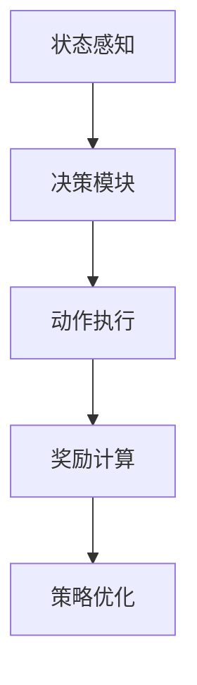
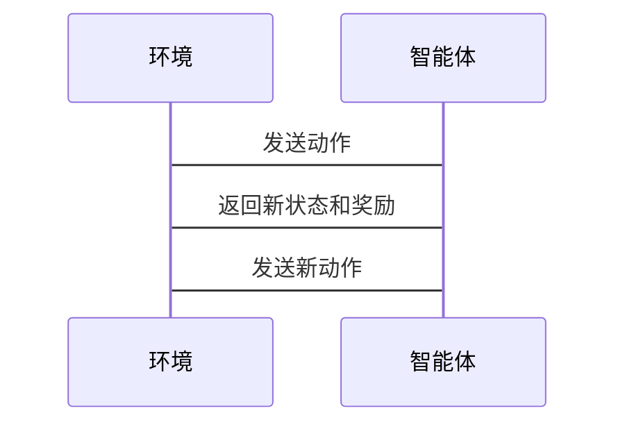

                 


# AI Agent中的强化学习与奖励塑造

## 关键词：AI Agent、强化学习、奖励塑造、Q-learning、DQN、策略梯度

## 摘要：本文深入探讨了AI Agent中强化学习与奖励塑造的关系，分析了常见强化学习算法的原理，详细讲解了奖励函数的设计原则和优化方法，并通过实际案例展示了如何在AI Agent中实现有效的奖励塑造。

---

## 第1章: AI Agent与强化学习概述

### 1.1 强化学习的基本概念

#### 1.1.1 强化学习的定义与特点

强化学习（Reinforcement Learning, RL）是一种机器学习范式，通过智能体与环境的交互，学习如何采取行动以最大化累积奖励。与监督学习和无监督学习不同，强化学习强调实时决策和长期目标的优化。

特点：
- **实时反馈**：智能体通过即时奖励信号调整行为。
- **长期规划**：关注未来累积奖励，而非单一动作的收益。
- **探索与利用**：平衡新策略的探索和当前最佳策略的利用。

#### 1.1.2 强化学习的核心要素

- **状态（State）**：环境的当前情况，如游戏中的分数、位置等。
- **动作（Action）**：智能体可以执行的可能行为。
- **奖励（Reward）**：智能体行为的即时反馈，指导下一步决策。
- **策略（Policy）**：决定智能体在每个状态下采取哪个动作的规则。
- **价值函数（Value Function）**：评估某个状态下采取特定动作后的预期累积奖励。

#### 1.1.3 强化学习与监督学习的区别

| 特性       | 监督学习                         | 强化学习                         |
|------------|----------------------------------|----------------------------------|
| 数据来源    | 标签化数据                       | 奖励信号                         |
| 目标函数    | 最小化预测误差                   | 最大化累积奖励                   |
| 交互方式    | 单向输入-输出                   | 实时反馈，动态调整               |

### 1.2 AI Agent的基本概念

#### 1.2.1 AI Agent的定义与分类

AI Agent是一种能够感知环境、自主决策并采取行动的智能体。分类：
- **反应式Agent**：仅基于当前感知做出反应，无内部状态。
- **认知式Agent**：具备复杂推理和规划能力，有内部状态和目标。

#### 1.2.2 AI Agent的核心功能与特点

- **感知环境**：通过传感器或接口获取环境信息。
- **决策与规划**：基于当前状态和目标，选择最优行动。
- **执行动作**：将决策转化为实际操作。
- **学习与适应**：通过经验改进决策策略。

#### 1.2.3 AI Agent的应用场景

- 游戏AI
- 自动驾驶
- 机器人控制
- 财务投资策略优化

### 1.3 奖励塑造的定义与作用

#### 1.3.1 奖励塑造的定义

奖励塑造（Reward Shaping）是设计和调整奖励函数的过程，用于引导智能体的行为朝着期望的目标发展。

#### 1.3.2 奖励塑造在强化学习中的作用

- **引导行为方向**：通过奖励函数定义智能体的目标。
- **加速学习过程**：合理的奖励函数可以减少探索时间。
- **处理复杂任务**：分解复杂任务为多个子任务，逐步引导。

#### 1.3.3 奖励函数的设计原则

- **明确性**：奖励应清晰传达期望行为。
- **可调整性**：能够根据任务需求动态调整。
- **平衡性**：平衡短期收益与长期目标。

### 1.4 本章小结

本章介绍了AI Agent和强化学习的基本概念，分析了奖励塑造在强化学习中的重要性，并提出了设计奖励函数的基本原则。

---

## 第2章: 强化学习的核心算法原理

### 2.1 Q-learning算法

#### 2.1.1 Q-learning的基本原理

Q-learning是一种经典的值函数方法，通过学习Q值表（Q-table）来记录每个状态下每个动作的预期奖励。

数学模型：

$$ Q(s, a) = r + \gamma \max_{a'} Q(s', a') $$

其中：
- $Q(s, a)$：状态s下采取动作a的Q值。
- $r$：即时奖励。
- $\gamma$：折扣因子，控制未来奖励的重要性。
- $s'$：新状态。

#### 2.1.2 Q-learning的优缺点

优点：
- 简单易实现，适合离线学习。
缺点：
- 适用于有限状态和动作空间，不适用于高维问题。

#### 2.1.3 Q-learning的代码实现

```python
import numpy as np

class QLearning:
    def __init__(self, state_space, action_space, gamma=0.99):
        self.gamma = gamma
        self.q_table = np.zeros((state_space, action_space))
    
    def choose_action(self, state, epsilon=0.1):
        if np.random.random() < epsilon:
            return np.random.randint(0, action_space)
        return np.argmax(self.q_table[state])
    
    def update_q(self, state, action, reward, next_state):
        self.q_table[state, action] = reward + self.gamma * np.max(self.q_table[next_state])
```

### 2.2 策略梯度算法

#### 2.2.1 策略梯度的基本原理

策略梯度（Policy Gradient）直接优化策略，通过梯度上升方法最大化奖励函数。

数学模型：

$$ \nabla \theta J(\theta) = \mathbb{E}_{s,a}[\nabla \log \pi_\theta(a|s) Q(s,a)] $$

其中：
- $\theta$：策略参数。
- $\pi_\theta(a|s)$：在状态s下采取动作a的概率。
- $Q(s,a)$：动作a在状态s下的Q值。

#### 2.2.2 策略梯度的优缺点

优点：
- 直接优化策略，适合高维问题。
缺点：
- 计算复杂，需要计算梯度。

### 2.3 深度强化学习算法

#### 2.3.1 DQN算法的基本原理

深度Q网络（DQN）结合深度学习和Q-learning，适用于高维状态空间。

数学模型：

$$ Q(s, a) = \mathbb{E}[r + \gamma Q(s', a')] $$

#### 2.3.2 DQN的代码实现

```python
import torch
import torch.nn as nn

class DQN(nn.Module):
    def __init__(self, input_dim, output_dim):
        super(DQN, self).__init__()
        self.fc1 = nn.Linear(input_dim, 64)
        self.fc2 = nn.Linear(64, output_dim)
    
    def forward(self, x):
        x = torch.relu(self.fc1(x))
        x = self.fc2(x)
        return x

# 初始化DQN
model = DQN(input_dim=4, output_dim=2)
```

### 2.4 本章小结

本章详细讲解了Q-learning、策略梯度和DQN等强化学习算法的原理和实现，为后续章节的奖励塑造提供了理论基础。

---

## 第3章: 奖励塑造的数学模型与设计方法

### 3.1 奖励函数的数学模型

#### 3.1.1 基础奖励函数

$$ R(s, a) = r $$

#### 3.1.2 复杂奖励函数

$$ R(s, a) = \sum_{i=1}^n w_i r_i $$

其中：
- $w_i$：奖励项权重。
- $r_i$：基础奖励项。

### 3.2 奖励函数的设计原则

#### 3.2.1 明确目标

奖励函数应清晰传达智能体的目标。

#### 3.2.2 平衡短期与长期目标

奖励函数应平衡即时收益和长远目标。

#### 3.2.3 处理多目标冲突

通过加权和引入惩罚项解决多目标冲突。

### 3.3 奖励函数的优化方法

#### 3.3.1 基于梯度的优化

使用梯度下降优化奖励函数。

#### 3.3.2 基于强化学习的优化

在强化学习框架下优化奖励函数。

#### 3.3.3 基于进化算法的优化

使用遗传算法优化奖励函数。

### 3.4 本章小结

本章分析了奖励函数的数学模型和设计原则，介绍了多种奖励函数的优化方法。

---

## 第4章: AI Agent中的强化学习与奖励塑造的

### 4.1 项目实战：设计一个AI Agent进行游戏优化

#### 4.1.1 环境安装

安装必要的库，如OpenAI Gym。

#### 4.1.2 系统功能设计

设计AI Agent的功能模块，如状态感知、决策制定、动作执行。

#### 4.1.3 系统架构设计

使用Mermaid绘制系统架构图。



#### 4.1.4 系统交互设计

使用Mermaid绘制交互序列图。



#### 4.1.5 代码实现与分析

实现奖励函数的优化，分析实验结果。

### 4.2 本章小结

本章通过实际案例展示了如何在AI Agent中实现奖励塑造，并通过实验验证了不同奖励函数的效果。

---

## 第5章: 最佳实践与注意事项

### 5.1 小结

奖励塑造是强化学习的关键，合理设计奖励函数可以显著提升AI Agent的性能。

### 5.2 注意事项

- **避免过于复杂的奖励函数**：简洁的奖励函数更容易优化。
- **持续监控与调整**：根据实验结果动态调整奖励函数。
- **处理不可观测状态**：使用适当的方法处理部分可观察环境。

### 5.3 拓展阅读

推荐相关书籍和论文，如《强化学习（书籍）》和《DeepMind论文》。

---

## 结语

本文系统地探讨了AI Agent中的强化学习与奖励塑造，从基础概念到算法实现，再到实际应用，为读者提供了全面的指导。通过合理设计奖励函数，可以显著提升AI Agent的性能和智能性。

