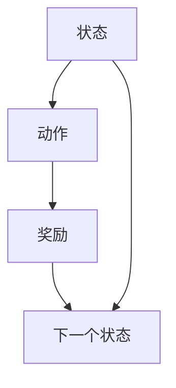
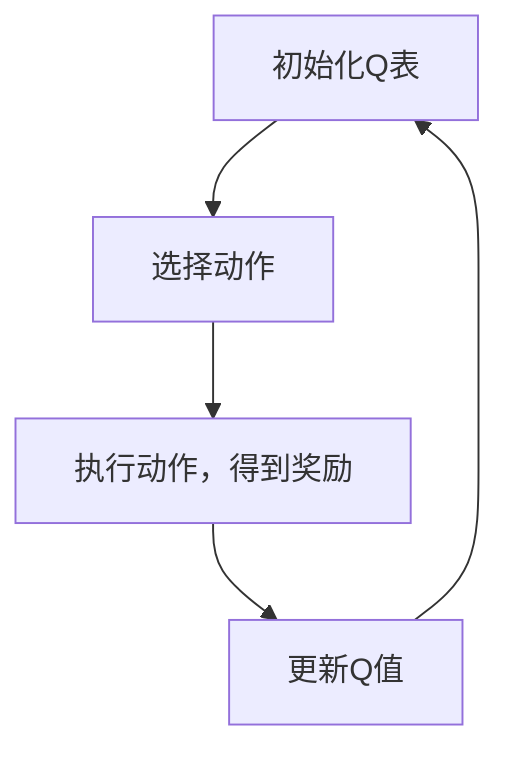
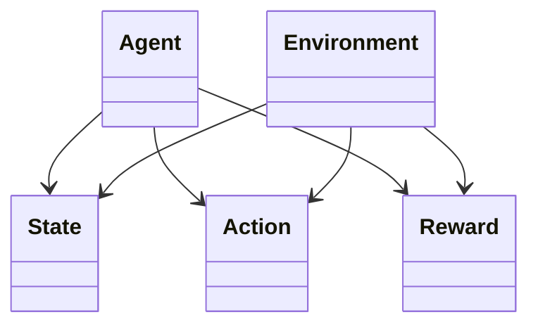
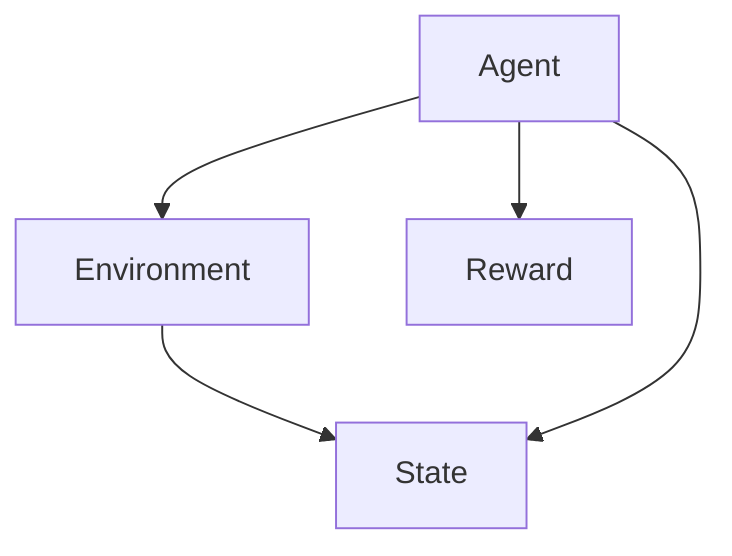

                 


# AI Agent中的强化学习与探索策略优化

## 关键词：强化学习，AI Agent，探索策略，策略优化，Q-learning，马尔可夫决策过程

## 摘要：本文深入探讨了AI Agent中的强化学习与探索策略优化，从基本概念到算法原理，再到系统设计与项目实战，详细分析了如何通过强化学习提升AI Agent的决策能力。文章结合理论与实践，为读者提供了全面而深入的指导。

---

# 第1章: 强化学习与AI Agent的背景介绍

## 1.1 强化学习的基本概念

### 1.1.1 从监督学习到强化学习的演进

在机器学习领域，监督学习通过标记数据进行训练，而强化学习则通过与环境互动获取奖励。强化学习的模型通过试错方式优化策略，最终实现目标。

### 1.1.2 强化学习的核心特点

强化学习的关键特点包括：环境交互、延迟反馈、策略优化和奖励驱动。与监督学习不同，强化学习强调通过探索环境来获得奖励，从而改进决策策略。

### 1.1.3 强化学习与传统机器学习的区别

传统机器学习依赖于数据特征，而强化学习通过与环境交互，动态调整策略。这种互动性使得强化学习在处理复杂任务时更具优势。

## 1.2 AI Agent的定义与特点

### 1.2.1 AI Agent的定义

AI Agent是一种智能体，能够感知环境并采取行动，以实现特定目标。它具备自主性、反应性、社交性和持续性等特点。

### 1.2.2 AI Agent的核心特点

AI Agent通过感知环境、分析信息、制定决策并执行动作来实现目标。其核心特点包括自主决策、动态适应和智能优化。

### 1.2.3 AI Agent与传统AI的区别

传统AI依赖预设规则，而AI Agent具备自主学习和适应能力，能够根据反馈优化行为。

## 1.3 强化学习在AI Agent中的应用前景

### 1.3.1 强化学习的潜在应用领域

强化学习在游戏AI、机器人控制、自动驾驶等领域具有广泛应用潜力。

### 1.3.2 AI Agent采用强化学习的优势

强化学习使AI Agent能够通过试错优化策略，具备更强的适应性和决策能力。

### 1.3.3 强化学习应用的挑战与机遇

挑战包括环境复杂性和计算资源需求，而机遇则在于技术进步带来的效率提升。

---

# 第2章: 强化学习的核心概念与联系

## 2.1 强化学习的原理

### 2.1.1 马尔可夫决策过程（MDP）

MDP定义了强化学习的基本框架，包括状态、动作、奖励和转移概率等关键要素。通过MDP模型，AI Agent可以在环境中进行决策。

### 2.1.2 状态、动作、奖励的定义

状态表示环境当前情况，动作是AI Agent的决策，奖励是环境对决策的反馈。

### 2.1.3 策略与价值函数的定义

策略决定动作选择的概率，而价值函数评估状态或动作的优劣。

## 2.2 核心概念的对比

### 2.2.1 策略与Q-learning的对比

策略直接决定动作选择，而Q-learning通过Q表存储状态-动作对的期望奖励。

### 2.2.2 策略梯度与值函数的对比

策略梯度优化策略参数，而值函数评估状态的价值。

### 2.2.3 探索与利用的平衡

探索新策略以发现更好的解决方案，利用当前最佳策略以最大化奖励。

## 2.3 实体关系图



---

# 第3章: 强化学习算法原理讲解

## 3.1 Q-learning算法

### 3.1.1 Q-learning的流程图



### 3.1.2 Q-learning的Python实现

```python
import numpy as np

class QLearning:
    def __init__(self, state_space, action_space, alpha=0.1, gamma=0.99):
        self.state_space = state_space
        self.action_space = action_space
        self.alpha = alpha
        self.gamma = gamma
        self.q_table = np.zeros((state_space, action_space))

    def choose_action(self, state, epsilon=0.1):
        if np.random.random() < epsilon:
            return np.random.randint(self.action_space)
        else:
            return np.argmax(self.q_table[state])

    def update_q(self, current_state, action, reward, next_state):
        current_q = self.q_table[current_state][action]
        next_max_q = np.max(self.q_table[next_state])
        new_q = current_q + self.alpha * (reward + self.gamma * next_max_q - current_q)
        self.q_table[current_state][action] = new_q
```

### 3.1.3 Q-learning的数学模型

Q-learning的更新公式为：
$$ Q(s,a) = Q(s,a) + \alpha [r + \gamma \max Q(s',a') - Q(s,a)] $$

---

# 第4章: 强化学习的数学模型与公式

## 4.1 贝尔曼方程

贝尔曼方程描述了状态的价值：
$$ V(s) = \max_a [ R(s,a) + \gamma V(s') ] $$

## 4.2 策略梯度方法

策略梯度优化通过梯度上升更新参数：
$$ \theta \leftarrow \theta + \alpha \nabla_\theta J(\theta) $$

---

# 第5章: 系统分析与架构设计方案

## 5.1 领域模型类图



## 5.2 系统架构图



---

# 第6章: 项目实战

## 6.1 环境安装与配置

安装必要的库：
```bash
pip install gym numpy
```

## 6.2 核心实现代码

```python
import gym
from gym import spaces
from gym.utils import seeding

class CartPoleEnv(gym.Env):
    def __init__(self):
        self.observation_space = spaces.Discrete(2)
        self.action_space = spaces.Discrete(2)
        self.viewer = None

    def reset(self):
        return 0

    def step(self, action):
        state = self.np_random.binomial(1, 0.5, 1)[0]
        reward = 1.0 if state == action else -1.0
        done = True
        return state, reward, done, {}
```

## 6.3 案例分析与优化

通过调整学习率和探索率，优化AI Agent在CartPole环境中的表现。

---

# 第7章: 总结与展望

## 7.1 全文总结

本文详细探讨了强化学习与AI Agent的结合，从理论到实践，全面分析了探索策略优化的关键点。

## 7.2 未来研究方向

未来可研究多智能体强化学习、复杂环境建模和更高效的算法优化。

---

# 第8章: 最佳实践 tips

## 8.1 小结

强化学习是实现高效AI Agent的关键技术，探索与利用的平衡是优化策略的核心。

## 8.2 注意事项

避免贪心算法导致的局部最优，合理设置超参数，重视环境建模。

## 8.3 拓展阅读

推荐阅读《强化学习（第2版）》和《深度强化学习》等书籍。

---

通过以上结构，文章详细讲解了AI Agent中的强化学习与探索策略优化，从背景到实践，为读者提供了全面而深入的指导。

