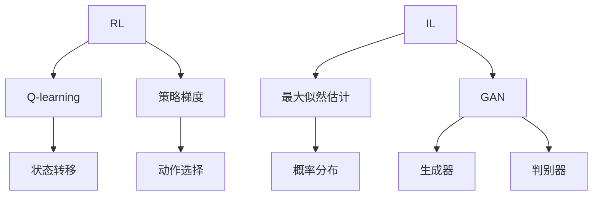
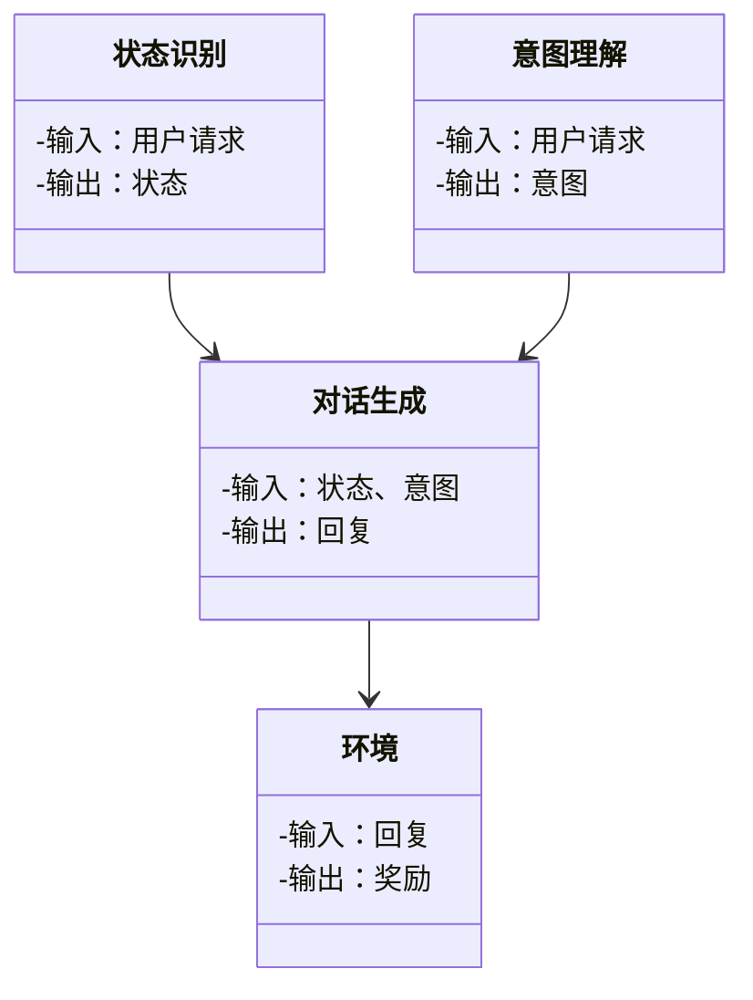

                 


# AI Agent中的强化学习与模仿学习结合

> 关键词：AI Agent，强化学习，模仿学习，结合，系统设计

> 摘要：本文探讨了在AI Agent中结合强化学习（Reinforcement Learning, RL）和模仿学习（Imitation Learning, IL）的方法，分析了两种学习方式的核心原理及其在实际场景中的应用。通过详细的算法解析、系统架构设计和项目实战案例，展示了如何有效结合RL与IL，提升AI Agent的智能性和实用性。本文还提供了丰富的数学公式、mermaid流程图和Python代码示例，帮助读者深入理解并实际应用这些技术。

---

# 第一部分: AI Agent中的强化学习与模仿学习结合概述

## 第1章: AI Agent、强化学习与模仿学习基础

### 1.1 AI Agent的基本概念

AI Agent（人工智能代理）是指在环境中能够感知并自主行动以实现目标的智能实体。AI Agent可以是软件程序、机器人或其他智能系统，其核心目标是通过与环境交互，完成特定任务并优化自身行为。AI Agent的特点包括：

- **自主性**：能够在没有外部干预的情况下独立运作。
- **反应性**：能够根据环境反馈实时调整行为。
- **目标导向**：所有行动均以实现预设目标为导向。

AI Agent广泛应用于自动驾驶、智能客服、游戏AI、智能家居等领域。随着技术进步，AI Agent需要更强的自主决策能力和适应性，这促使我们探索更高效的学习方法。

### 1.2 强化学习与模仿学习的定义

**强化学习（Reinforcement Learning, RL）**是一种机器学习方法，通过智能体与环境交互，逐步优化策略以最大化累积奖励。RL的核心要素包括：

- **状态（State）**：环境当前的状况。
- **动作（Action）**：智能体采取的行为。
- **奖励（Reward）**：智能体行为后获得的反馈，用于指导优化方向。

**模仿学习（Imitation Learning, IL）**是一种通过观察专家行为来学习策略的方法。IL的核心思想是让智能体通过模仿人类或其他智能体的示范行为，掌握特定任务的执行方法。IL的主要特点包括：

- **示范数据**：基于专家行为生成的数据。
- **策略直接性**：智能体可以直接模仿专家行为，无需复杂的环境交互。

### 1.3 强化学习与模仿学习的结合意义

AI Agent的任务往往需要结合探索与模仿能力。RL擅长通过环境交互进行探索，但可能需要大量时间才能收敛到最优策略；而IL能够快速利用专家经验，但可能缺乏对新场景的适应性。两者的结合可以互补优势，提升AI Agent的学习效率和决策能力。具体来说：

- **加速收敛**：利用IL快速获取初始策略，减少RL的探索时间。
- **增强泛化能力**：结合RL的探索能力，使得智能体能够处理未曾见过的新场景。
- **提升稳定性**：通过IL提供的稳定基础策略，增强RL优化过程的稳定性。

---

## 第2章: 强化学习与模仿学习的核心概念与联系

### 2.1 强化学习的核心原理

RL的核心是通过最大化累积奖励来优化策略。常用算法包括Q-learning和策略梯度方法。

#### 2.1.1 Q-learning算法的数学模型

Q-learning是一种值迭代算法，通过更新Q值表来逼近最优策略：

$$ Q(s, a) \leftarrow Q(s, a) + \alpha [r + \max_{a'} Q(s', a') - Q(s, a)] $$

其中：
- \( Q(s, a) \)：状态-动作对的Q值。
- \( \alpha \)：学习率。
- \( r \)：即时奖励。
- \( \max_{a'} Q(s', a') \)：下一状态下的最大Q值。

#### 2.1.2 策略梯度方法的原理

策略梯度法通过优化策略直接参数化策略，使用梯度上升法最大化目标函数：

$$ \theta \leftarrow \theta + \alpha \nabla_\theta J(\theta) $$

其中：
- \( \theta \)：策略参数。
- \( \alpha \)：步长。
- \( J(\theta) \)：目标函数，通常为策略的期望奖励。

### 2.2 模仿学习的核心原理

IL的核心是通过模仿专家行为来学习策略。常用方法包括最大似然估计和对抗学习。

#### 2.2.1 最大似然估计的基本思想

通过最大化观测数据的概率来估计参数：

$$ \arg\max_\theta \prod_{i=1}^n p_\theta(x_i) $$

其中：
- \( x_i \)：观测数据。
- \( p_\theta \)：参数化的概率分布。

#### 2.2.2 GAN在模仿学习中的应用

生成对抗网络（GAN）通过生成器和判别器的博弈来生成逼真数据。在模仿学习中，生成器可以模仿专家行为，判别器则区分生成数据与真实数据。

### 2.3 强化学习与模仿学习的对比分析

通过对比分析，可以更好地理解两者的异同。

#### 2.3.1 核心概念对比表

| 属性                | 强化学习（RL）             | 模仿学习（IL）            |
|---------------------|---------------------------|--------------------------|
| 数据来源            | 环境交互生成              | 专家示范数据             |
| 目标                | 最大化累积奖励            | 模仿专家行为             |
| 策略更新方式        | 基于探索与反馈           | 基于模仿与优化           |
| 适用场景            | 未知环境、探索性任务      | 熟悉任务、快速学习       |

#### 2.3.2 ER实体关系图



---

## 第3章: 强化学习与模仿学习的结合方法

### 3.1 强化学习与模仿学习的联合训练

联合训练是指同时利用RL和IL的信号来优化策略。

#### 3.1.1 联合训练的基本思想

通过结合RL的探索信号和IL的模仿信号，共同优化策略：

$$ J(\theta) = \lambda_1 J_{RL}(\theta) + \lambda_2 J_{IL}(\theta) $$

其中：
- \( \lambda_1, \lambda_2 \)：权重系数。
- \( J_{RL}, J_{IL} \)：分别对应RL和IL的目标函数。

#### 3.1.2 联合训练的数学模型

结合Q-learning和最大似然估计：

$$ Q(s, a) \leftarrow Q(s, a) + \alpha [r + \max_{a'} Q(s', a') - Q(s, a)] $$

$$ \theta \leftarrow \theta + \alpha \nabla_\theta \sum_{i=1}^n \log p_\theta(a_i|s_i) $$

#### 3.1.3 联合训练的算法流程图

```mermaid
graph TD
    Start --> Initialize Q(s, a)和θ
    Initialize Q(s, a)和θ --> While not convergence:
        While not convergence:
            RL_step --> Update Q(s, a)通过Q-learning
            IL_step --> Update θ通过最大似然估计
            Check convergence --> 结束或继续循环
    End
```

---

### 3.2 强化学习与模仿学习的分阶

分阶段训练是一种将训练过程划分为多个阶段的方法。

#### 3.2.1 分阶段训练的基本思想

首先利用IL快速获取初始策略，然后通过RL进一步优化。

#### 3.2.2 分阶段训练的数学模型

第一阶段：利用IL初始化策略

$$ \theta \leftarrow \arg\max_\theta \sum_{i=1}^n \log p_\theta(a_i|s_i) $$

第二阶段：利用RL优化策略

$$ Q(s, a) \leftarrow Q(s, a) + \alpha [r + \max_{a'} Q(s', a') - Q(s, a)] $$

#### 3.2.3 分阶段训练的流程图

```mermaid
graph TD
    Start --> Initialize Q(s, a)和θ
    Start --> 阶段1：IL初始化θ
    阶段1 --> 阶段2：RL优化Q(s, a)
    阶段2 --> 结束或继续循环
    End
```

---

## 第4章: 强化学习与模仿学习的结合方法

### 4.1 基于策略的模仿学习

基于策略的模仿学习通过直接模仿专家策略来优化智能体策略。

#### 4.1.1 基于策略的模仿学习的基本思想

通过最大化策略的似然：

$$ \theta \leftarrow \arg\max_\theta \sum_{i=1}^n \log p_\theta(a_i|s_i) $$

#### 4.1.2 基于策略的模仿学习的数学模型

结合策略梯度和模仿信号：

$$ J(\theta) = \lambda_1 J_{RL}(\theta) + \lambda_2 J_{IL}(\theta) $$

---

## 第5章: 系统架构与设计

### 5.1 项目介绍

我们选择一个智能客服对话系统作为案例，展示如何结合RL和IL提升对话质量。

#### 5.1.1 项目介绍

智能客服需要处理多种用户请求，通过结合RL和IL，可以提升对话的流畅性和准确性。

#### 5.1.2 系统功能设计

系统功能包括：

- 用户请求接收
- 状态识别
- 意图理解
- 对话生成

#### 5.1.3 系统架构图



---

## 第6章: 项目实战

### 6.1 环境配置

安装必要的库：

- Python 3.8+
- TensorFlow 2.0+
- Gym库

#### 6.1.1 环境配置代码

```bash
pip install numpy
pip install gym
pip install matplotlib
pip install tensorflow
```

---

## 第7章: 总结与展望

通过本文的详细分析和案例展示，我们展示了如何在AI Agent中结合强化学习与模仿学习，提升其智能性和实用性。未来，随着技术进步，AI Agent将在更多领域发挥重要作用。

---

以上是文章的完整目录和内容概要，具体内容需要根据实际需求进行详细撰写。

