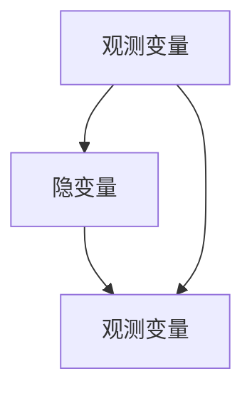
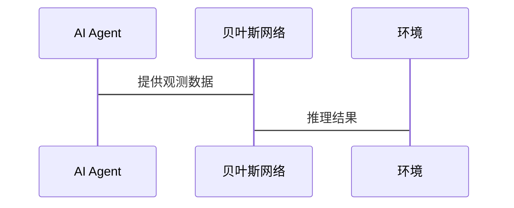

                 


# AI Agent中的概率推理与贝叶斯网络

> **关键词**：AI Agent，概率推理，贝叶斯网络，马尔可夫链，条件概率，数学模型

> **摘要**：本文深入探讨了AI Agent中的概率推理及其与贝叶斯网络的关系。通过系统分析贝叶斯网络的原理、算法、数学模型和系统架构，结合实际项目案例，帮助读者全面理解AI Agent中的概率推理与贝叶斯网络的应用。文章内容包括概率推理的背景、贝叶斯网络的核心概念、算法原理、系统设计与项目实战，以及相关的最佳实践和注意事项。

---

# 第一部分: AI Agent中的概率推理基础

## 第1章: 概率推理的背景与概念

### 1.1 概率推理的背景

在AI Agent中，概率推理是一种通过概率论来处理不确定性问题的方法。AI Agent需要在复杂和不确定的环境中做出决策，概率推理为其提供了一种基于概率的推理机制。概率推理的应用广泛，包括自然语言处理、计算机视觉、机器人导航等领域。贝叶斯网络作为一种强大的概率推理工具，在AI Agent中扮演着重要角色。

### 1.2 贝叶斯网络的基本原理

贝叶斯网络是一种有向无环图（DAG），由节点和边组成。节点代表随机变量，边表示变量之间的依赖关系。贝叶斯网络通过概率分布描述变量之间的关系，能够有效地进行概率推理和决策。

### 1.3 AI Agent中的贝叶斯网络应用

贝叶斯网络在AI Agent中的应用主要体现在不确定性推理、决策优化和知识表示等方面。例如，在自然语言处理中，贝叶斯网络可以用于主题模型的构建；在机器人导航中，贝叶斯网络可以用于路径规划和避障。

---

## 第2章: 贝叶斯网络的核心概念与联系

### 2.1 贝叶斯网络的结构

贝叶斯网络由节点（随机变量）和边（条件依赖关系）组成。节点可以是观测变量或隐变量，边表示变量之间的条件概率关系。贝叶斯网络的结构决定了推理的复杂性和效率。

### 2.2 贝叶斯网络的核心概念对比

| 概念 | 描述 |
|------|------|
| 条件概率 | P(A|B) 表示在B发生的条件下，A发生的概率 |
| 联合概率 | P(A,B) 表示A和B同时发生的概率 |
| 贝叶斯定理 | P(A|B) = P(B|A)P(A) / P(B) |

### 2.3 贝叶斯网络的实体关系图（Mermaid）



---

## 第3章: 贝叶斯网络的算法原理

### 3.1 贝叶斯推理算法

贝叶斯推理是基于贝叶斯定理进行概率更新的过程。以下是贝叶斯推理的步骤：

1. **先验概率**：确定初始概率分布。
2. **似然度**：计算观测数据的概率。
3. **后验概率**：更新概率分布。

### 3.2 贝叶斯网络的构建过程

1. **定义变量**：确定网络中的随机变量。
2. **定义依赖关系**：确定变量之间的条件依赖关系。
3. **学习参数**：估计网络的参数。

### 3.3 贝叶斯网络的数学模型

贝叶斯定理的公式表示为：
$$
P(A|B) = \frac{P(B|A)P(A)}{P(B)}
$$

---

## 第4章: 贝叶斯网络的数学模型与公式

### 4.1 贝叶斯定理的数学推导

贝叶斯定理通过条件概率公式推导而来：
$$
P(A|B) = \frac{P(A)P(B|A)}{P(B)}
$$

### 4.2 贝叶斯网络的联合分布公式

贝叶斯网络的联合概率公式为：
$$
P(X_1, X_2, ..., X_n) = \prod_{i=1}^{n} P(X_i | \text{父母}(X_i))
$$

---

## 第5章: 贝叶斯网络的系统分析与架构设计

### 5.1 问题场景介绍

AI Agent需要处理不确定性问题，如环境感知和决策优化。贝叶斯网络可以帮助AI Agent进行概率推理和决策。

### 5.2 系统功能设计

- **领域模型设计**：定义系统的随机变量及其依赖关系。
- **系统架构设计**：设计贝叶斯网络的结构和功能模块。

### 5.3 系统交互设计

系统交互流程如下：



---

## 第6章: 贝叶斯网络的项目实战

### 6.1 环境安装与配置

安装Python环境并安装必要的库，如`networkx`和`scipy`。

### 6.2 核心代码实现

```python
import networkx as nx

# 创建贝叶斯网络
G = nx.DiGraph()

# 添加节点
G.add_node('A')
G.add_node('B')
G.add_node('C')

# 添加边
G.add_edge('A', 'B')
G.add_edge('B', 'C')

# 输出网络结构
print(G.nodes())
```

### 6.3 项目总结

通过项目实战，读者可以掌握贝叶斯网络的构建和应用方法，进一步理解其在AI Agent中的重要性。

---

## 第7章: 最佳实践与注意事项

### 7.1 小结

贝叶斯网络是一种强大的概率推理工具，在AI Agent中具有广泛的应用。掌握贝叶斯网络的核心概念和算法原理，能够帮助AI Agent更好地处理不确定性问题。

### 7.2 注意事项

- 贝叶斯网络的结构设计需要充分考虑变量之间的依赖关系。
- 在实际应用中，需要处理数据稀疏性和计算复杂性问题。

### 7.3 拓展阅读

建议读者进一步学习马尔可夫链、隐马尔可夫模型等相关知识，以全面理解概率推理的方法和应用。

---

通过本文的系统分析和实践，读者可以深入理解AI Agent中的概率推理与贝叶斯网络，掌握其核心概念和算法原理，并能够在实际项目中应用这些知识。

