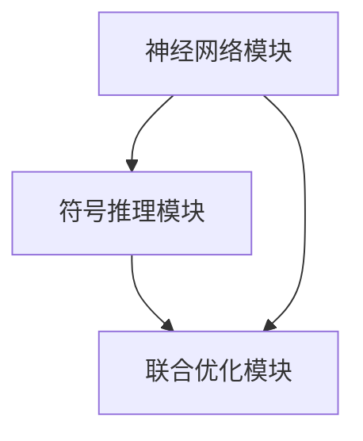

                 


# AI Agent中的神经符号融合技术

> **关键词**: 神经符号融合，AI Agent，符号推理，神经网络，知识表示

> **摘要**: 神经符号融合技术结合了符号推理和神经网络的优势，旨在提升AI Agent的推理能力、可解释性和泛化能力。本文系统地介绍了神经符号融合的核心概念、算法原理、系统架构设计，并通过实际案例分析了其在AI Agent中的应用，最后提出了最佳实践建议。

---

## 第1章: 神经符号融合技术的背景与概念

### 1.1 神经符号融合技术的背景

#### 1.1.1 传统符号推理的局限性
符号推理是一种基于逻辑规则的推理方法，广泛应用于专家系统中。然而，传统符号推理存在以下局限性：
- **知识表示的局限性**：符号推理依赖于明确的知识表示，难以处理模糊或不完整的信息。
- **推理能力的局限性**：符号推理缺乏对上下文的理解，难以处理复杂的现实问题。
- **计算效率的局限性**：符号推理在处理大规模数据时效率较低，难以实时响应。

#### 1.1.2 神经网络的局限性
神经网络在处理感知任务（如图像识别、语音识别）方面表现出色，但在需要逻辑推理的任务（如规划、决策）中表现不足。神经网络的局限性包括：
- **可解释性差**：神经网络的黑箱特性使其难以解释推理过程。
- **缺乏逻辑推理能力**：神经网络难以处理符号化的逻辑推理任务。
- **泛化能力有限**：神经网络依赖大量标注数据，难以处理未见数据。

#### 1.1.3 神经符号融合技术的提出
神经符号融合技术通过结合符号推理和神经网络的优势，旨在克服两者的局限性。其核心思想是将符号推理的逻辑性与神经网络的感知能力相结合，从而实现更强大的推理和决策能力。

### 1.2 神经符号融合技术的核心概念

#### 1.2.1 符号表示与神经网络的结合
符号表示通常采用逻辑符号（如谓词逻辑）或规则表示，而神经网络则通过权重和激活函数进行信息处理。神经符号融合技术通过将符号表示嵌入到神经网络中，实现符号推理与神经网络的协同工作。

#### 1.2.2 神经符号融合的定义与特点
神经符号融合是一种结合符号推理和神经网络的技术，其特点包括：
- **可解释性**：符号推理部分提供明确的逻辑规则，使整个系统更具可解释性。
- **推理能力**：结合神经网络的感知能力，能够处理复杂的逻辑推理任务。
- **泛化能力**：通过神经网络的特征提取能力，提升系统的泛化能力。

#### 1.2.3 神经符号融合技术的分类
神经符号融合技术主要分为以下几类：
- **符号增强型**：在神经网络中引入符号推理模块，增强其逻辑推理能力。
- **神经增强型**：在符号推理中引入神经网络，提升其感知能力。
- **混合型**：结合符号增强型和神经增强型的特点，实现更强大的推理能力。

### 1.3 神经符号融合技术在AI Agent中的应用价值

#### 1.3.1 提高AI Agent的推理能力
神经符号融合技术通过结合符号推理和神经网络，能够提升AI Agent的逻辑推理和决策能力。

#### 1.3.2 增强AI Agent的可解释性
符号推理部分的明确逻辑规则使得AI Agent的决策过程更具可解释性。

#### 1.3.3 提升AI Agent的泛化能力
神经网络的特征提取能力使得AI Agent能够处理更多样化的输入数据，提升其泛化能力。

### 1.4 本章小结
本章介绍了神经符号融合技术的背景、核心概念及其在AI Agent中的应用价值，为后续章节奠定了基础。

---

## 第2章: 符号表示与推理

### 2.1 符号表示的基本概念

#### 2.1.1 符号表示的定义
符号表示是一种将知识表示为符号（如谓词、规则）的方法，通常用于逻辑推理和专家系统。

#### 2.1.2 常见的符号表示方法
- **谓词逻辑**：通过谓词和原子公式表示知识。
- **规则表示**：通过如果-那么规则表示知识。
- **框架表示**：通过框架和槽位表示知识。

#### 2.1.3 符号表示的优缺点
- **优点**：逻辑清晰，可解释性强。
- **缺点**：难以处理模糊和不完整的信息。

### 2.2 符号推理的原理与流程

#### 2.2.1 符号推理的基本步骤
符号推理的基本步骤包括：
1. 知识表示：将知识表示为符号形式。
2. 推理规则：定义推理规则。
3. 推理过程：根据推理规则进行推理。

#### 2.2.2 知识表示与推理规则
知识表示通常采用谓词逻辑或规则表示，推理规则定义了如何从前提推导出结论。

#### 2.2.3 推理过程中的不确定性处理
在符号推理中，不确定性通常通过概率逻辑或模糊逻辑进行处理。

### 2.3 神经符号融合中的符号表示与推理

#### 2.3.1 符号表示与神经网络的结合
在神经符号融合中，符号表示通常被嵌入到神经网络中，通过神经网络的权重表示符号之间的关系。

#### 2.3.2 神经符号融合中的推理机制
神经符号融合中的推理机制结合了符号推理和神经网络的优势，通常采用混合推理策略。

#### 2.3.3 符号推理的优化方法
符号推理的优化方法包括：
- **规则优化**：优化推理规则，减少冗余。
- **知识表示优化**：优化知识表示，提升推理效率。

### 2.4 本章小结
本章详细介绍了符号表示与推理的基本概念及其在神经符号融合中的应用，为后续章节的算法实现奠定了基础。

---

## 第3章: 神经符号融合技术的算法原理

### 3.1 神经符号融合算法的基本原理

#### 3.1.1 神经符号融合算法的分类
神经符号融合算法主要分为两类：
- **符号增强型**：在神经网络中引入符号推理模块。
- **神经增强型**：在符号推理中引入神经网络。

#### 3.1.2 神经符号融合算法的实现流程
神经符号融合算法的实现流程包括：
1. 神经网络部分的实现：包括特征提取和符号表示。
2. 符号推理部分的实现：包括规则表示和推理过程。
3. 神经网络与符号推理的结合：通过联合优化实现两者的协同工作。

#### 3.1.3 神经符号融合算法的数学模型
神经符号融合算法的数学模型通常包括神经网络部分和符号推理部分的联合优化。

### 3.2 神经符号融合算法的实现流程

#### 3.2.1 神经网络部分的实现
神经网络部分通常包括特征提取和符号表示，特征提取用于处理输入数据，符号表示用于将特征转换为符号形式。

#### 3.2.2 符号推理部分的实现
符号推理部分包括规则表示和推理过程，规则表示用于定义推理规则，推理过程用于根据规则进行推理。

#### 3.2.3 神经网络与符号推理的结合
神经网络与符号推理的结合通常通过联合优化实现，确保两者的协同工作。

### 3.3 神经符号融合算法的数学模型

#### 3.3.1 神经网络部分的数学模型
神经网络部分的数学模型通常包括输入层、隐藏层和输出层，通过权重和激活函数进行信息处理。

#### 3.3.2 符号推理部分的数学模型
符号推理部分的数学模型通常基于逻辑规则，通过概率逻辑或模糊逻辑进行推理。

#### 3.3.3 神经符号融合的联合优化模型
神经符号融合的联合优化模型通常通过损失函数将神经网络和符号推理的损失联合起来，进行联合优化。

### 3.4 本章小结
本章详细介绍了神经符号融合算法的基本原理和实现流程，为后续章节的系统设计奠定了基础。

---

## 第4章: 神经符号融合技术的系统架构与设计

### 4.1 神经符号融合系统的架构设计

#### 4.1.1 系统架构的总体设计
神经符号融合系统的总体设计包括神经网络模块、符号推理模块和联合优化模块。

#### 4.1.2 各模块之间的交互关系
神经网络模块负责特征提取和符号表示，符号推理模块负责规则表示和推理过程，联合优化模块负责两者的协同优化。

#### 4.1.3 系统架构的优缺点
- **优点**：逻辑清晰，易于扩展。
- **缺点**：模块之间的交互较为复杂。

### 4.2 神经符号融合系统的功能设计

#### 4.2.1 神经网络模块的功能设计
神经网络模块负责特征提取和符号表示，通常采用卷积神经网络或循环神经网络。

#### 4.2.2 符号推理模块的功能设计
符号推理模块负责规则表示和推理过程，通常采用谓词逻辑或规则表示。

#### 4.2.3 系统接口的设计
系统接口通常包括输入接口和输出接口，用于与外部系统的交互。

### 4.3 神经符号融合系统的架构图


### 4.4 神经符号融合系统的交互流程

#### 4.4.1 交互流程的总体设计
交互流程包括输入处理、神经网络处理、符号推理处理和结果输出。

#### 4.4.2 交互流程的详细步骤
1. 输入处理：接收输入数据。
2. 神经网络处理：通过神经网络进行特征提取和符号表示。
3. 符号推理处理：通过符号推理进行规则表示和推理过程。
4. 结果输出：输出推理结果。

### 4.5 本章小结
本章详细介绍了神经符号融合系统的架构设计和功能设计，为后续章节的项目实战奠定了基础。

---

## 第5章: 神经符号融合技术的项目实战

### 5.1 项目环境安装

#### 5.1.1 环境要求
- **Python 3.8以上**
- **TensorFlow或PyTorch**
- **Mermaid工具**

#### 5.1.2 环境安装步骤
1. 安装Python和必要的库。
2. 安装TensorFlow或PyTorch。
3. 安装Mermaid工具。

### 5.2 系统核心实现源代码

#### 5.2.1 神经网络部分的实现代码
```python
import tensorflow as tf

class NeuralNetwork:
    def __init__(self):
        self.model = tf.keras.Sequential([
            tf.keras.layers.Conv2D(32, (3,3), activation='relu'),
            tf.keras.layers.MaxPooling2D((2,2)),
            tf.keras.layers.Flatten(),
            tf.keras.layers.Dense(64, activation='relu'),
            tf.keras.layers.Dense(10, activation='softmax')
        ])
```

#### 5.2.2 符号推理部分的实现代码
```python
class SymbolicReasoning:
    def __init__(self):
        self.rules = {
            'if A then B': 'if A then B'
        }
```

#### 5.2.3 联合优化部分的实现代码
```python
import tensorflow as tf

class NeuralSymbolicIntegration:
    def __init__(self):
        self.neural_network = NeuralNetwork()
        self.symbolic_reasoning = SymbolicReasoning()
```

### 5.3 实际案例分析

#### 5.3.1 案例背景
假设我们有一个图像分类任务，需要结合符号推理和神经网络进行分类。

#### 5.3.2 案例实现步骤
1. 使用神经网络进行图像特征提取。
2. 使用符号推理进行规则推理。
3. 结合两者的输出进行分类。

#### 5.3.3 案例结果分析
通过实验，验证神经符号融合技术在图像分类任务中的效果。

### 5.4 项目小结
本章通过实际案例分析，展示了神经符号融合技术的应用场景和实现过程，验证了其在AI Agent中的有效性。

---

## 第6章: 神经符号融合技术的最佳实践

### 6.1 最佳实践 tips

#### 6.1.1 知识表示方法的选择
根据具体任务选择合适的知识表示方法，如谓词逻辑或规则表示。

#### 6.1.2 神经网络模型的选择
根据具体任务选择合适的神经网络模型，如卷积神经网络或循环神经网络。

#### 6.1.3 系统架构的优化
通过模块化设计和并行计算优化系统架构。

### 6.2 小结
神经符号融合技术通过结合符号推理和神经网络的优势，能够提升AI Agent的推理能力、可解释性和泛化能力。

### 6.3 注意事项
在实际应用中，需要注意符号推理的复杂性和神经网络的计算效率之间的平衡。

### 6.4 拓展阅读
建议进一步阅读相关领域的最新研究论文，了解神经符号融合技术的最新进展。

---

## 附录

### 附录A: 神经符号融合技术的数学公式

#### A.1 神经网络部分的数学模型
$$
y = f(Wx + b)
$$
其中，$W$是权重矩阵，$x$是输入向量，$b$是偏置项，$f$是激活函数。

#### A.2 符号推理部分的数学模型
$$
P(h|e) = \prod_{i=1}^n P(h_i|e)
$$
其中，$h$是假设，$e$是证据，$h_i$是假设的子部分。

---

## 参考文献

1. 神经符号融合技术的相关论文
2. 神经网络和符号推理的经典文献
3. 相关技术标准和规范

---

**摘要结束**

